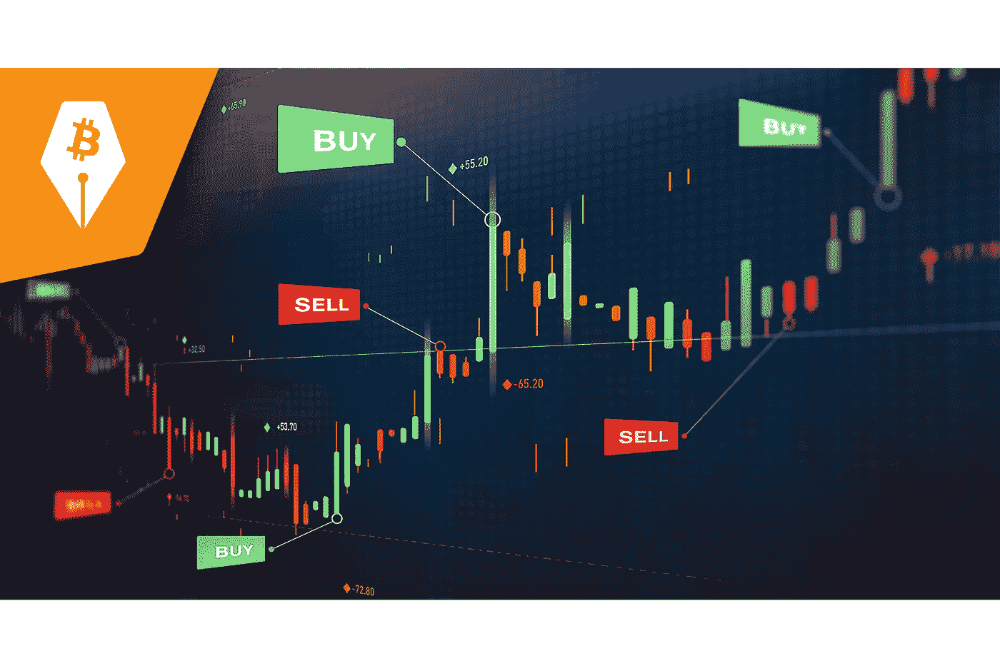
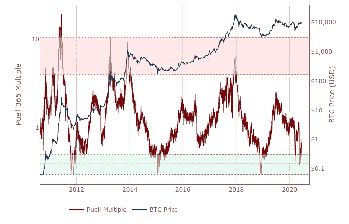
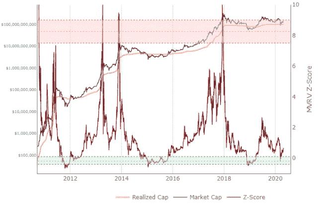
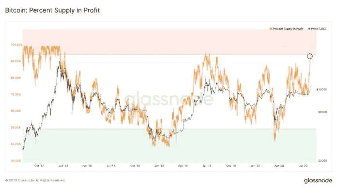
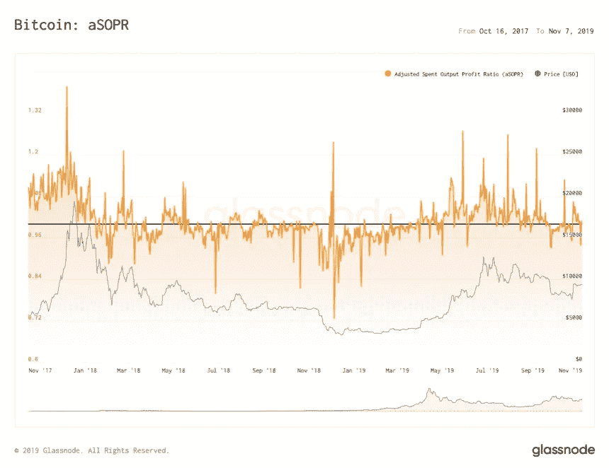
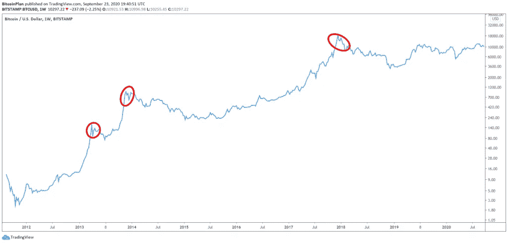

# 担心比特币的价格？让数据引领方向

> 原文：<https://medium.datadriveninvestor.com/worried-about-bitcoins-price-let-data-lead-the-way-e27f66d2400?source=collection_archive---------0----------------------->

Buy and sell signals on a price chart.

作为一名比特币作家，我收到很多人询问“现在”是否是购买比特币的好时机。

(剧透:买比特币总是好时机，只是有些时候比其他时候好。)

查看任何网站、社交媒体平台和聊天群，你会发现大多数人都对比特币的价格着迷。

没人能预测到这一点，不管他们发布了多少 YouTube 视频，也不管他们有多少 Twitter 粉丝。统计模型是伟大的，但有很多，他们都不同意对方。

我发现最好的见解来自于观察人们用比特币做什么，以及这些行为如何在历史上导致比特币价格的变化。毕竟比特币不会让它的价格涨跌，我们会。

要想搞清楚这一点，请遵循数据。

# 比特币揭示了真相

由于比特币区块链的透明性，我们可以看到霍丁行为的变化，货币进出交易所，比特币钱包的收益和损失，以及许多其他与长期价格运动相关的信息。

我们谈论的是在几周和几个月内发生的巨大变化，而不是几天或几小时。

这是非常令人信服的数据。

Glassnode Academy 在这里有一个不同类型数据的详细列表: [Glassnode Academy](https://academy.glassnode.com/) 。

另外， [LookIntoBitcoin](https://www.lookintobitcoin.com/) 有一些很好的图表和简单的解释。虽然它的图表去掉了许多细微差别和细节，但它们很好地简化了数据(而且是免费的，不像我使用的图表)。

简而言之，我将回顾一下我最喜欢的数据，然后提供一个如何充分利用这些数据的建议。

向下滚动以跳过图表并到达底线。

# 发现巨大的市场变化

数据丰富，你可以从很多很多方向来看待比特币。

我更喜欢看五张图表——市盈率、MVRV Z 值、HODL 波、利润百分比和 aSOPR。

这些数据不能告诉你任何关于日常价格变动的信息。他们希望人们用比特币做什么会有大的、长期的变化。这才是最重要的。

**普尔倍数**

Puell 倍数将新开采的比特币的价格与其在给定时间的市场价值进行比较。当市盈率大幅上升时，矿商往往会向市场抛售。极端读数表明，矿商有大量比特币要抛售。结果，市场崩溃了。

下面是一个图表的例子，由 LookIntoBitcoin 提供:

Puell Multiple

**MVRV Z 值**

MVRV Z-score 衡量比特币的现价和人们购买它的价格之间的差异。分数上去了，更多的人有大收获。因此，他们出售。比特币价格暴跌。

下面是一个图表的例子，由 LookIntoBitcoin 提供:

**MVRV Z-Score**

**HODL 挥挥手**

HODL 波显示了在一段时间内*没有*移动的比特币数量，在图表上显示为波。

每当长期霍德勒大幅下跌，就说明真信徒、OGs、鲸鱼已经开始卖了。当抛售变得极端时，就等着崩盘吧。

不同的图表以不同的方式分解波浪。下面是一年期 HODL 波浪图的一个例子，由 LookIntoBitcoin 提供(浅色线是 HODL 波浪):

One-Year HODL Wave

**利润中的供应百分比**

这衡量的是比特币比其所有者购买时更值钱的百分比。当它达到 95%或更高时，崩溃总是随之而来。

 [## 比特币 2025 年路线图|数据驱动的投资者

### 在这篇文章中，我将准确地描绘出我对未来几周、几个月和几个月比特币价格走势的看法

www.datadriveninvestor.com](https://www.datadriveninvestor.com/2020/05/26/bitcoin-roadmap-to-2025/) 

以下是 Glassode 提供的图表示例:

Percent Supply in Profit

**aSOPR**

aSOPR 根据人们相互交换比特币的方式来获取人们赋予比特币的价值。当趋势上升时，比特币的价格也随之上涨。当趋势下降时，比特币的价格往往会下跌。

以下是由 Glassnode 提供的图表示例:

aSOPR

# 嗯。。。什么？有太多要理解的了。。。

是的，当我第一次开始钻研它时，我也不知所措。

考虑到这一点，我为自己和其他长期投资者设计了一个计划，带着相当大的信心简单地发现市场顶部和底部。这是我充分利用比特币牛市的计划，你可以在这里看到:

 [## 加密很容易特刊:我充分利用比特币牛市的计划

### 最后，我可以分享一下我充分利用比特币牛市的计划。为什么花了这么长时间？嗯，咄，这是…

cryptoiseasy.substack.com](https://cryptoiseasy.substack.com/p/crypto-is-easy-special-issue-my-plan) 

为了遵循这个计划，你不需要知道我刚刚谈到的任何数据或图表。我把所有东西简化成价格图表上的三条线，实时更新。

结合清晰的执行策略，我的计划确保我们利用崩盘的机会，同时在接近多年市场周期的高峰时退出市场，这种高峰总是在贪婪、急躁的人进入市场后出现，他们只是想以我们为代价快速赚钱。

根据我的计划，当比特币的价格处于 2011 年以来比特币价格图表中圈出的三个区间时，你就会卖出比特币，如下所示:

Price chart of bitcoin from mid-2011 to October 2020

与此同时，你会错过熊市，并在每次下跌时买入。

# 最周密的计划。。。

虽然有计划很好，但请记住，我的计划是为像我这样的人设计的，他们真正相信比特币，乐意*永不*出售，喜欢任何使用它的机会，只想确保我们充分利用这个神奇的机会，对未来的金融网络提出要求。

我们知道，一旦比特币的价格上涨足够长的时间，贪婪的人可能会淹没市场。价格会暴涨。到那个时候，巨怪、鲸鱼和假最大化者会卖掉他们的股份，使市场崩溃，价格下跌几个月，可能几年。

(我们也有这方面的数据。)

我可能是一个真正的信徒，但我不是一个愚蠢的信徒。我不会让其他人毁了市场，带着我家族的财富跑了。

此外，也不一定会永远这样。有时候模式会结束。相关性失败。历史并不总是重复，甚至不会押韵。

# 建立你自己的计划

出于这些原因，你需要考虑你自己的需求，并制定一个适合你的策略。*买比特币没有不好的时机。*

如果有的话，一旦我们到达下一个市场周期的顶部，你会觉得你买得不够多，不管你有多少比特币。

如果你能花些时间学习如何使用这些数据，不管价格如何，你都可以让自己处于优势。

例如，当价格达到 12，500 美元时，你不会堆积 sat，而是知道等到价格跌至 10，000 美元或更低——这不是因为你在猜测或交易，而是因为你会看到非常明确的数据表明比特币应该尽早崩溃。

因此，你的钱可以走得更远。

(在这种情况下，你会因为等待而多获得 25%的比特币。)

你也可以知道我们什么时候到达牛市的终点。数据很清楚。

# 不要只看钱

当然，任何人都可以制定计划。问题是，它符合你的目标和心态吗？

你是真的关心比特币还是只是想赚更多的“法定”货币？你还有什么其他资产和收入？你能向市场投入多少资金，还能有应急资金？你有足够的存款或强大的现金流吗？你是否负债累累，却没有多少存款或收入？

此外，请记住，虽然你可以很好地预测大的市场运动，但你不能预测价格。

当你看到利润中的供应百分比达到 98%，aSOPR 趋势下降，而相对实力指数超过 90，恐惧/贪婪指数达到 80 时，你知道会出现重大崩盘——但你不知道比特币的价格在崩盘前会上涨多少，也不知道崩盘何时到来。

比特币的价格有可能在暴跌 30%之前翻倍，尽管可能性不大。意思是，如果你等待，你最终还是会以更高的价格购买比特币。

这些数据只是让赔率对你有利。

最重要的是，逢低买入并不意味着你总能得到尽可能低的价格。在两次下跌之间，价格会上涨。稍有下降，价格可能会进一步下跌。低点是你风险最低的入口，不一定是比特币在任何时刻可能的最低价格。

# 没有完美的计划

对于比特币这样一种波动性很大的资产，你不必担心日常波动。

最后，你永远也抓不住每一个顶部和底部，每一个高点和低点。关键是尽你所能做出最好的决定。

你买比特币，是在风险低、上涨空间大的时候买吗？当你卖出时，你是在确信市场不会复苏的时候卖出吗？

剥一只猫的皮有很多方法，但大多数认真的投资者不会关注时机或价格。

相反，想想你的总体目标和价值观。有一个[清晰的投资论题](https://cryptoiseasy.substack.com/p/bitcoin-investment-thesis)。管理比特币的相关风险。跟着数据走。

让交易者去担心时机和价格。

有了好的数据，我们就不必担心减半、看图表、获利或追逐利润。

我们可以随心所欲地使用或使用比特币，继续我们的生活，并且知道从长远来看，我们会因此变得更好。

放松，享受旅程。

马克·赫尔夫曼出版了 [*Crypto is Easy*](https://cryptoiseasy.substack.com/) 时事通讯，对加密市场和比特币价格的变动提供了更深入的见解。他也是比特币的顶级作家。他的书《共识岛》和《比特币或破产:华尔街进入加密货币》探索了加密货币的社会、文化和商业挑战。在他的[简历](https://markhelfman.com/bio)中了解更多关于他的信息。

*先前发表于*[*Voice.com*](https://app.voice.com/post/@markhelfman/worried-about-bitcoins-price-let-data-lead-the-way-1602518300-1)*。*

## 获得专家观点— [订阅 DDI 英特尔](https://datadriveninvestor.com/ddi-intel)