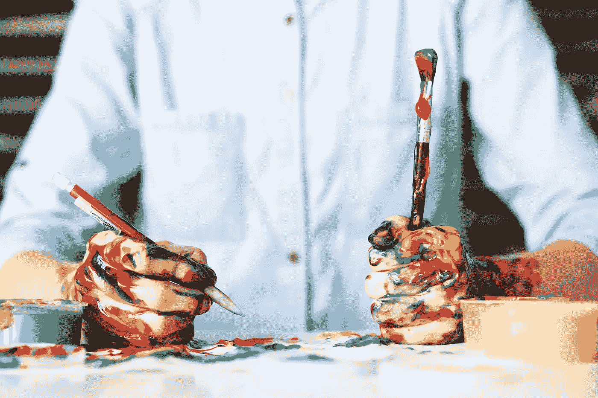

# 担心内容创作？

> 原文：<https://medium.datadriveninvestor.com/worried-about-content-creation-6a00fc8799c8?source=collection_archive---------25----------------------->

## 以下是克服这种恐惧的 5 个技巧

Photo by [Alice Dietrich](https://unsplash.com/@alicegrace?utm_source=unsplash&utm_medium=referral&utm_content=creditCopyText) on [Unsplash](https://unsplash.com/s/photos/create?utm_source=unsplash&utm_medium=referral&utm_content=creditCopyText)

简而言之:不要想多了。

不要让对看起来脏乱的恐惧阻止你做你喜欢和热爱的事情。隐藏在混乱中的是我们真实可信的自我。快乐而诚实地发光的自我。

但是如果这还不足以帮助你，这里有 5 个简单的技巧来克服对内容创作的恐惧。

## 知道你的内容是有价值的

我们中的许多人阻止内容创作的原因是因为我们认为我们的提要不够漂亮，或者我们没有足够的东西可说。接受我的建议和我过去的痛苦经历。别担心。仅仅因为大多数人有一个完美的灯光华丽的饲料并不意味着你的内容没有价值。把它拿出来。你真正的观众会发现的

## 坚持简单

仅仅因为某种内容格式存在，并不意味着你需要带着狂热粉丝的崇拜来采用它。例如，在 Instagram 上，我根本不做 Instagram 卷轴。我既没有时间也没有带宽去理解它们是如何工作的。

这是不是意味着他们没有用？哦，他们是，对于那些很好地使用他们的人，我说坚持下去。我吗？我的目标是尽可能简化和减少工作。所以我会坚持图片、旋转木马、IGTV、故事和 Instagram Live(这本身听起来就很多！)

## 享受这个过程

无法保证一段内容的表现如何。你花几个小时去做的事情可能会让你有点投入。你自发发布的东西会被大量转载。

那为什么要想太多呢？无论如何，享受创造的过程吧

## 不要追求病毒式传播

我们总是从预期的空间创造。我的秘密？我把每一条内容都放了出来，相信没人会看。不，说真的！

事实上，我的大多数[脸书商业页面](http://www.facebook.com/shailajawriter)帖子、我的中型帖子和[推文](http://www.twitter.com/shyvish)都没有被删除或获得任何视图，你猜怎么着，没关系！重要的是你把它放在那里。这很重要。

## 为一个人写作

想一想一位观众，他给你发了一封直接的信息或电子邮件，表达了他们所面临的一个深刻的挑战。写下这个问题的答案，并将其创建为一段内容。放上去。即使对绝大多数人没有帮助，也会对那个问你这件事的人有帮助。这就像和朋友一对一的聊天。你为什么要放弃呢？

我在我的[博客](http://www.shailajav.com)上定期谈论博客、社交媒体和内容创作。如果你更喜欢时事通讯，那么为内容创作者注册[我的免费周五时事通讯](http://www.shailajav.com/newsletter)。