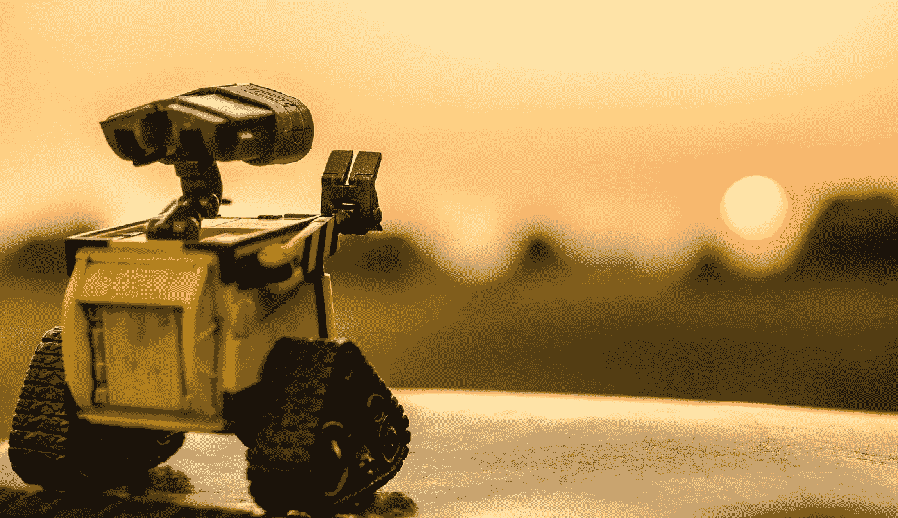

# 担心被机器人抢了饭碗？

> 原文：<https://medium.datadriveninvestor.com/worried-about-losing-your-job-to-a-robot-7946a33e68ce?source=collection_archive---------25----------------------->

当我们进入第四次工业革命的黎明时，担心机器的崛起忽略了一点，即我们已经把自己当成机器人有一段时间了，把自己编程为越来越自动驾驶，对每条推特做出反应，ping，“你有邮件”警报，好像我们的生活取决于它。

我们创造了一种文化，认为只有通过努力工作和努力才能获得成功，所以很自然地，你必须更加努力、更加长久地努力，否则你怎么能跟上并有机会在竞争中领先呢？

问题是，我们不是被设计成这样运作的。

# 机器人的行为让我们生病了。

像这样把自己逼入困境会导致更高水平的压力、焦虑和抑郁。来自英国和其他地方的统计数据显示，忽视这些警告信号意味着我们将自己置于更大的压力、倦怠和疲惫的风险中，影响我们的健康、人际关系和表现。

 [## 模式和机器人:复杂的现实|数据驱动的投资者

### 哈耶克的名著《复杂现象理论》(哈耶克，1964)深入探讨了复杂性的话题，并断言…

www.datadriveninvestor.com](https://www.datadriveninvestor.com/2019/03/04/patterns-and-robotics-a-complex-reality/) 

试图与 AI 竞争是一场赢不了的比赛。机器远比人类更快更准确，并且已经学会了超过我们的[直觉技能](https://techcrunch.com/2017/05/23/googles-alphago-ai-beats-the-worlds-best-human-go-player/)，情商技能也紧随其后。

风险不在于我们会被机器取代。

*如果我们未能保持对人工智能的足够控制，或者未能抓住它带来的机遇，风险就在我们身上。*

这将归结于我们思考得有多好。

作为人类，而不是机器人，需要的是合适的环境，让你的思维能力蓬勃发展，而你的*认知健康*是关键。因为虽然机器人的行为使你能够保存精神能量，并获得一些非常有用的精神捷径，但仍能很好地进入你的意识思维进行更高层次的思考；学习、规划、组织和决策提供了满足 21 世纪工作场所需求所需的精神灵活性、敏捷性和创新性。

# 思考是新的黑色。

这是关于花时间放慢我们的思维，更深入地、创造性地、批判性地思考。

保持人性意味着重要的是花时间在你的认知和大脑健康上，通过充足的睡眠、体育锻炼、选择健康的营养和采用健康的压力。这比周六去邦宁斯买一罐备用的 WD-40 来让你生锈的思维齿轮转动得更顺畅要有效得多。

享受更高性能的思维与享受更好的大脑健康以及通过前额叶皮层获得有意识思维的良好途径有关。

你强大的潜意识也享有更大的创新，创造力和洞察力，再加上更好的大脑健康。

只是当我们太忙、压力太大或太累时，我们会求助于生存模式，这可能会导致我们过于依赖那些导致更大轻率、更大事故和伤害风险的机器人行为。

同样，在意识层面，找到动机、兴趣或能量变得越来越难，所以我们关闭，即脱离。

重新开发丢失的伟大思维艺术需要练习和努力。幸运的是，脑科学现在提供了一个[便利手册](http://journals.plos.org/plosmedicine/article?id=10.1371/journal.pmed.1002259)，揭示了什么是最好的。

测试[认知能力](http://www.cambridgecognition.com/products/digital-healthcare-technology/cantab-insight/)正迅速成为新的规范，同时不断学习和实践那些有助于我们人性的积极品质；关心他人，善良，富有同情心，慷慨，有同理心。

你最好的工作将来自于将你的精神肌肉延伸到新的高度，拥抱变化，并对我们新的 4IR 可能是什么样子保持好奇。

机器人行为阻碍了你的发展吗？

*你采取了哪些措施来摆脱自动驾驶，提高你的认知健康？*

我很想听听你的想法。

*关于社交联系和技术的更多内容，请访问我的* [*博客*](https://snip.ly/8sm4qx) *。*