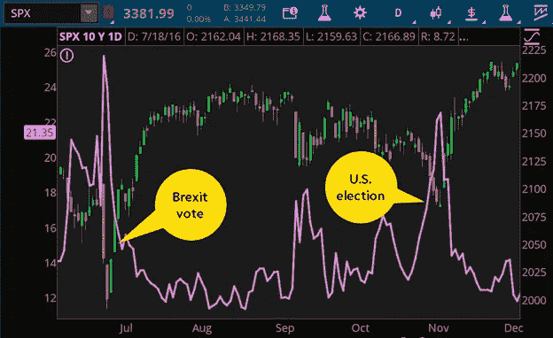

# 推迟选举会影响金融市场吗

> 原文：<https://medium.datadriveninvestor.com/would-a-delayed-election-impact-the-financial-market-2094042fb60a?source=collection_archive---------12----------------------->

## 金融

## 美国推迟的选举结果将如何重塑金融市场

Photo by [Jonathan Simcoe](https://unsplash.com/@jdsimcoe?utm_source=medium&utm_medium=referral) on [Unsplash](https://unsplash.com?utm_source=medium&utm_medium=referral)

## 推迟选举会影响金融市场吗？

美国大选很可能会引发混乱——在多个方面。持续不断的新冠肺炎危机给传统的投票过程带来了冲击，促使两党的支持者预计，举行有争议的选举的可能性越来越大。过去的阴影，特别是 2000 年的选举，可能会重新浮现，造成延迟。与此同时，所有这些不确定性对金融大师们来说只意味着一件事:波动性。

## 2000 年大选发生了什么？

当阿尔·戈尔和乔治·W·布什在 2000 年决一胜负时，所有的目光都集中在佛罗里达州。然而，这种不确定性并没有很好地融入市场，因为《纽约时报》在大选两天后宣称“[华尔街想要一个赢家](https://www.nytimes.com/2000/11/09/business/the-markets-stocks-bonds-wall-street-wants-a-winner.html)”。[纳斯达克指数很快暴跌至 5.4%](https://money.cnn.com/2000/11/08/markets/markets_newyork/) ，但在其他领域没有太多戏剧性事件，这表明对企业将迅速稳定的乐观态度。

然而，阿尔·戈尔的顽强在大选后的一次采访中得到了充分的展示。到那时，每个人都知道阿尔·戈尔要试试他的运气和战斗。因此，股价大幅下跌。一名交易员对这种气氛的描述最为贴切，他表示:“市场不喜欢不知道谁将成为自由世界的领袖。”

当 11 月份接近尾声时，纳斯达克指数暴跌了 19%左右，S&P 下跌了 10%。当谣言说戈尔似乎要让步时，市场反弹随之而来，在戈尔否认谣言后迅速结束，导致股票下跌 5%。

 [## 区块链投票和美国选举|数据驱动的投资者

### 在不到 70 天的时间里，这个世界上最古老的民主国家将以前所未有的方式面临最大的摊牌…

www.datadriveninvestor.com](https://www.datadriveninvestor.com/2020/08/26/blockchain-voting-and-the-american-elections/) 

正如著名经济学家弗兰克·奈特(Frank Knight)在 1921 年所解释的那样，整个 34 天的时间是关于风险和不确定性的深刻一课，特别是他提到的可衡量的风险和可衡量的不确定性。

2000 年末的政治不稳定让交易者意识到他们没有任何可行的方法对结果进行预测。

在最高法院宣布老布什成为 T4 奖得主后，市场很快反弹。但是，一段时间后，这种逐渐下降的趋势再次出现，在 2002 年触底。

## 2016 年大选概述

上一次在 2016 年大选中，波动性出现在主要指数中，包括标准普尔 500 指数。最初，英国退出欧盟事件——英国宣布退出欧盟迫使市场做出反应，然后希拉里和特朗普的摊牌带来了波动。查看下图，注意芝加哥期权交易所的 VIX(用紫色线表示)是如何超过 20 的。

***Chart source:*** *the* [*thinkorswim® platform from TD Ameritrade*](https://www.tdameritrade.com/tools-and-platforms/thinkorswim.page)**Data sources:** S&P Dow Jones Indices, Cboe Global Markets

特朗普获胜的意外结果令市场大跌。美国股市期货最初暴跌约 5%，全球投资者试图理解美国选举史上最大的冷门之一。一段时间后，川普发誓要用一系列新的承诺来“[愈合分裂的伤口”，这导致了市场的复苏。](https://www.telegraph.co.uk/news/2016/11/09/donald-trump-now-its-time-to-bind-the-wounds-of-division-come-to/)

## 现在是投资更安全资产的时候吗？

如果以史为鉴，全球市场往往会在美国大选后做出剧烈反应。历史数据显示，当民主党在选举中获胜 10 天后，S&P 中型股 400 指数和标准普尔 500 的支持率往往会下降。与此同时，在大选后的 100 天里，股票市场对共和党获胜似乎不太乐观。一个例外是巴拉克·奥巴马的第一次胜利，其标志是 2008 年的金融危机。

根据总部位于法国的投资银行和金融服务公司法国兴业银行(Société Générale)的说法，与拜登担任总统相比，特朗普的任期将对美国股市稍微有利。尽管该公司预计 2020 年大选将遭遇坎坷，并警告其他人延迟结果的风险，但它有理由相信这不会影响美国股市的上涨趋势。

瑞银的托马斯·麦克洛林认为，某些因素可能会迫使川普与拜登竞争。如果选举后的某一天没有明确的赢家，市场波动将会加剧，这就是为什么麦克洛林建议转向更稳定的资产。由于市场不喜欢不确定性，美国政府债券和黄金是更安全的选择。

## 对现任者的偏爱

尽管共和党人比民主党人产生更好的平均回报，但现任总统的连任比新当选的总统产生更好的结果。当看到现任者再次当选的前景比新的总统候选人更能给投资者带来确定性时，这种情况就会发生。反对派获胜的风险更大，因为这意味着潜在的激进变革即将发生。这也意味着，与 2016 年两个竞争者都是新的不同，从财政角度来看，2020 年的选举更加稳定。

与此同时，高盛警告其客户，有人可能会推迟 2020 年的选举。它建议对冲 12 月份的市场押注，预计整个 11 月份的波动性将会上升。

高盛的美国股票策略师大卫·科斯汀[解释说](https://www.cnbc.com/2020/07/08/goldman-warns-delayed-election-results-this-november-similar-to-bush-gore-could-rock-the-market.html)多种因素注定会推迟选举结果，例如邮寄选票——这是为了帮助人们在正在进行的疫情期间投票。这种独特的情况导致科斯汀向高盛的客户传达“对冲其市场风险”至 12 月。有了这一策略，他们可以控制因推迟选举而造成的损失。

## 联合政府的稳定性

美国的制度设计使得参议院、国会和白宫都可以自由竞争。这意味着当一个政党选出总统时，另一个政党可以控制参议院和众议院。来自 [InvesTech](https://midwestcap.com/media/files/default/Q2_2020_Letter_Rev._FINAL_web_.pdf) 的研究显示，当一方控制了所有三家机构时，平均回报率达到峰值。相比之下，当一个政党控制白宫，而另一个政党控制参议院和众议院时，他们的支持率略有下降。

另一方面，如果一个政党控制参议院，另一个政党控制众议院，回报会更差。总统对商业和经济有很大的影响力。例如，总统负责任命美联储的首脑。但是，是国会和参议院通过和批准法律。因此，他们对总统的支持对于系统的重大变革至关重要。

## 最后的想法

现在是一些好消息的时候了。在美国选举中，市场波动往往是短暂的。研究表明，最糟糕的影响出现在有争议的选举结果的[四个交易日](https://fortune.com/2020/08/18/trump-biden-stock-market-2020-election-contested-results-what-could-happen-investors/)内。

在大多数情况下，由于实用主义和冷漠的结合，美国大选并没有给以处理政治不确定性著称的市场带来重大变化，特别是在发达和稳定的民主国家。

## 访问专家视图— [订阅 DDI 英特尔](https://datadriveninvestor.com/ddi-intel)