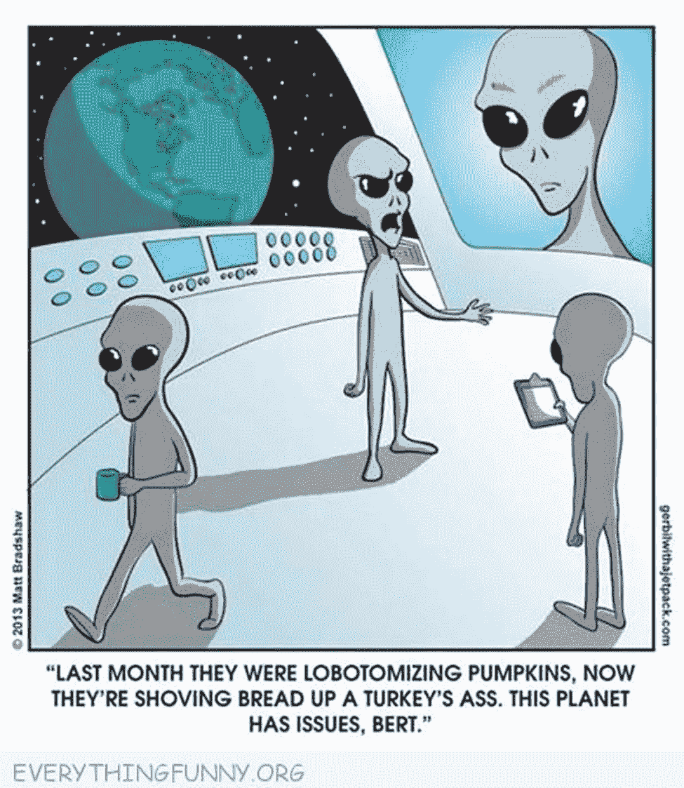

# 外星人会攻击地球吗？

> 原文：<https://medium.datadriveninvestor.com/would-extraterrestrials-attack-earth-9f6b39c922fe?source=collection_archive---------5----------------------->

我不时写一些未来的可能性。有一件事是肯定有可能的，那就是我们最终会遇到外星智慧生命。根据对德雷克方程的重新计算，科学家们确定在我们的银河系中很有可能存在其他智慧文明。[德雷克方程](https://en.wikipedia.org/wiki/Drake_equation)是一种概率计算，它确定了宇宙中出现其他智能生命的可能性，假设没有像文明创造生命并通过智能设计传播生命这样的外部帮助。随着我们发现更多关于宇宙的信息，我们对方程中的一些变量变得更加确定。因此，我们更接近理解这种遭遇的可能性。

知道我们所知道的，我们在我们的星系中可能并不孤单。问题是，如果一个外星文明在那里游荡，他们会像我们在许多科幻电影中看到的那样对我们具有侵略性吗？

事实证明，抛开星际旅行的技术挑战，外星人袭击的可能性非常小。

**这一切都与动力有关**

每个生物都有动机。我说的不是人生目标，而是驱使一个人行动的基本内在程序。所有有智慧的生物都试图避免不适，寻找快乐。一个生物与另一个生物的不同之处在于，什么样的环境会让人觉得不舒服，什么样的环境会引发喜悦的情绪。不适和快乐可能在不同物种间以不同的方式表现出来，但是为了这个讨论的目的，快乐是一个积极的驱动力，是人类想要更多的，而不适是人类想要避免的情况。

 [## 人工智能预测能力的神话|数据驱动的投资者

### AI(人工智能)最有前途的优势之一似乎是它预测未来的能力…

www.datadriveninvestor.com](https://www.datadriveninvestor.com/2019/03/01/the-myth-of-ais-predictive-power/) 

利用这些基本概念，我们可以试图确定为什么一个太空文明会被驱使穿越浩瀚的星际空间去攻击另一个星球上的其他智慧生物。

例如，当生病、饥饿时，当我们打破我们的身体，引起疼痛时，当我们处于恐惧、愤怒、悲伤和厌恶等情绪的生化影响下时，人类会感到不舒服。我们尽最大努力避免这些情况，优先考虑食物和饮料，住在一个好的屋檐下，避免疾病，保护自己免受伤害，避免会导致恐惧，愤怒，悲伤或厌恶的情况。有了这些基础，我们就可以寻找创造外部快乐情绪的情境，比如玩游戏，和我们爱的人亲近等等。然后我们的大脑产生感觉良好的荷尔蒙，如催产素、多巴胺和脑啡肽。假设的外星人可能会感到不适，并在与我们不同的环境下产生感觉良好的荷尔蒙。他们可能会感到呼吸氧气不舒服，寻找味道最好的煤来消费，并喜欢让他们的身体被撕裂和愈合(他们身体中的损伤，尽管会导致必须愈合的身体伤害，但可能会导致他们系统中多巴胺等价物的分泌等。).

我们必须记住的是外星生命，就像海洋中的金枪鱼，在 100 摄氏度的海洋喷口快乐生活的古细菌和整天在非洲大草原上吃草的大象，可能生活在不同的环境中，因此受到人类截然不同的环境的刺激。我们不能指望外星生命会像人类或地球上的任何动物一样不舒服。

我们还必须考虑到，一个外星太空文明将会在社会和技术上进化，以解决他们的大部分不适，并增加他们欢乐时刻的频率和强度，无论那些是什么。开发利用能量类型和数量的方法以允许在恒星之间高效旅行(以光年计量，即以光速计算的年数)是一项艰巨的任务，要求所述文明进行社会检查，防止对自己使用这种能源和技术。这意味着拥有那种科技水平的智慧外星文明应该已经发展出了一种我们尚未达到的社会智慧。这并不排除这样一个先进的社会在与我们的文明联系后会表现出侵略性的可能性。毕竟，我们从自己的历史中知道，当面对未知事物时，智慧生物会以完全不同的方式行动。

最糟糕的外星人是愤怒的外星人

愤怒是一种情绪，迫使活着的创意者去攻击，以消除让它不舒服的东西。一个人无法和愤怒的人讲道理。情绪是一种本能的冲动，让生物不经深思熟虑就做出行动。不是每个生物都会生气。要生气，一个人必须在生理上能够产生这种情绪。植物不会生气，尽管它们有其他有用的生存情绪，如恐惧，促使一些植物产生毒素和保护分子，或者其他植物收回花瓣和叶子。一个没有愤怒的生物不会觉得非理性地被迫去突破一个障碍，如果它阻挡了一条通向理想目标(比如食物)的道路。愤怒对于一些物种来说是有用的，比如人类，为了生存。假设一个外星文明可以感受愤怒，有足够的知识，像我们一样，他们会在大多数时候为了生存而获得避免愤怒的方法。然而，宗教、宣传和教育等社会范式会引发愤怒等情绪。人类已经学会了通过思想人为地诱发不适来操纵一个群体的负面情绪。几个世纪以来，我们以种族主义、民族主义和信息控制的形式，将对未知事物的天然恐惧转化为对人类的恐惧。因此，有可能一个外星文明，在穿越星际空间的重大尝试中联合起来，可能对宇宙中可能存在的其他文明有着重要的社会偏见。

这些外星人可能在哲学或道德上反对存在于另一个星球上的其他智慧文明，在数千亿个其他文明中。没有理由他们会觉得必须把我们从我们的星球上移走，因为这是消除不适的一个真实的感知障碍的来源。人性就是太远了。然而，他们可能会出于哲学、宗教或其他根深蒂固的社会原因而将我们从银河系中移除。这种习得的愤怒是可能的。然而，考虑到以光速到达我们需要几年到几千年的时间，使用大量的能源和资源，这个文明极不可能采取这种行动。更有可能的是，他们对发生在他们家附近而不是数百万光年之外的事情感到非常真实的意识形态和真正的不适。愤怒毕竟是最原始的，当威胁被认为是近在咫尺时，这种感觉最强烈。然而，如果我们不小心的话，一个外星文明可能会在第一次见到我们后发展出对抗的行为。否则，如果他们对其他智慧文明有任何敌意，并专注于通过探索和开发银河系自己的部分来改善他们的生活，他们就更有可能避开银河系的我们这一部分。

**出于正当理由寻找资源**

外星文明攻击我们的最合乎逻辑的原因是通过学习行为，或者是缺乏他们的人民避免不适或寻求快乐所需的资源。富有创造力的科幻作家制作了一些电影情节，证明外星人袭击地球自然资源是合理的，如《湮没》、《洛杉机之战》、《独立日》和《世界之战》。虽然这些情节对我们人类来说是有意义的，因为我们记得自己争夺自然资源的历史，但对于一个能够在星球之间旅行的文明来说，却不是这样。

多亏了哈勃和 TESS 望远镜，我们发现大多数恒星都有类似地球和太阳系其他行星的行星。如果外星人想要水、碳或金属之类的自然资源，他们可以从银河系的任何地方、任何太阳系获得。没必要为了这些和我们争斗。来这里奴役我们做劳工呢？我们在一些科幻电影中也看到过这样的情节。“地球战场”是我唯一想到的，但即便如此，外星人入侵的主要目的是开采这颗星球。将人类作为负重动物是这部电影中商业外星人的次要动机。事实是，我们知道一个事实，人类是先进社会中可怕的劳动者。这就是为什么我们要让人工智能和机器人成为我们社会的生产力。我们甚至还没有接近成为星际文明。我们也知道我们将创造生物和机械机器人，将我们从所有不舒服的情况中解放出来，比如强迫工作。拥有先进星际旅行技术的外星人会了解宇宙的物理学，并在他们访问另一个太阳系之前以同样的方式进行物质和能量的转化。

如果另一个假想的外星种族感受到毁灭生物的情感冲动，他们可以创造自己的目标，就像他们喜欢的那样，这将比针对我们的文明更令人满意。此外，他们不需要穿越那些光年来进行打靶练习。

**外星人是和平的**

最终，星际外星人将拥有技术和社会理解力来缓解他们内部的任何原始驱动力，以减轻他们可能感到的任何不适。即使他们感到社会迫使他们对一个他们从未见过的文明变得咄咄逼人，几代人的旅行时间之后，这种感觉会随着时间的推移而改变，正如所有的社会运动一样，很快我们将只是一个非常遥远和无足轻重的问题。因此，任何拜访我们的外星人都必须是和平的。

他们不会以和平的方式对待我们，因为他们有更高的道德标准，更好的宗教准则，或者更好的治理体系。他们会是和平的，因为他们会在对宇宙的理解，他们自己的生物学和驱动力，以及技术上进化到感觉不到内在的或文化的需要来攻击我们。

甚至前面提到的一个假想的猎人文明也会对我们不感兴趣。他们将有无数更有趣的方式来猎杀他们自己的造物，这些造物在银河系中横冲直撞，被编程为他们的理想猎物。渴望资源的文明不需要与我们打交道的麻烦来拥有数十亿中一个非独特资源星球的资源。

拜访我们的外星人会很好奇，会让我们一个人呆着，以避免任何麻烦(对我们来说，因为如果他们不高兴，他们可以离开)。让我们单独呆着以避免任何麻烦。我们是婴儿文明，仍然剥夺其人民的基本资源，而让其他人拥有大部分的权力和资源。如果星际外星人正在看着我们，他们很可能想让我们单独呆着，直到我们要么把自己炸飞，要么明白一个事实:我们可以通过使用我们今天的科学和技术来解决所有人类的问题。也许这是最有可能解决[费米悖论的方法。也许如果我们这样做了，我们就不会那么容易想象露天开采其他星球和奴役其他智慧生命形式。那时，我们已经变得和我在这篇文章中推测的几个理论上的外星文明一样开明、有教养、和平。](https://en.wikipedia.org/wiki/Fermi_paradox)

多么讽刺！