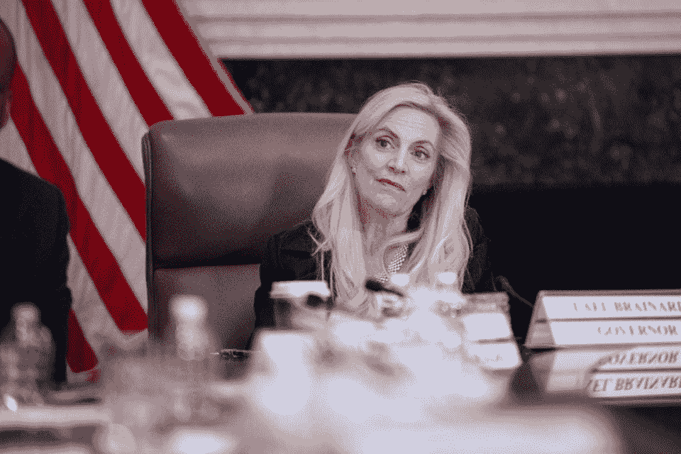

# 天秤座的支付安全吗？美联储成员评论数字货币的未来。

> 原文：<https://medium.datadriveninvestor.com/would-libras-payments-be-safe-fed-member-comments-on-digital-currency-s-future-1edaba9de829?source=collection_archive---------13----------------------->

美国美联储州长莱尔·布雷纳德在美联储参加“美联储倾听”活动… [+]

法新社通过盖蒂图片

周三，美联储系统董事会成员莱尔·布雷纳德在斯坦福大学发表演讲，概述了美国数字支付的未来。但她的评论带来了更多的风险和担忧，而不是前进的道路。

那天下午，布雷纳德女士在支付的未来研讨会上发表了演讲。

她承认，技术公司正在推动货币和支付数字化方面的创新。新的商业模式正在对现有的惯例进行重新审视。其目标是为商业和银行间系统(即批发和零售支付)降低交易成本和加快结算服务的新思路。但演讲的大部分时间都在讨论这些新服务带来的风险，特别是加密货币、稳定币和其他代币，比如脸书的 Libra。

 [## 总部位于瑞士的 ETP 进入加密交易市场|数据驱动的投资者

### 虽然金融市场几乎没有沉闷的时刻，特别是在引入…

www.datadriveninvestor.com](https://www.datadriveninvestor.com/2019/03/10/swiss-based-etp-enters-the-crypto-trading-market/) 

"传统上，支付是由银行等可信中介提供的服务."布雷纳德女士说。虽然银行和信用卡在监管、控制和问责下运营，但它们可能依赖传统技术，这使得流程更加繁琐。“大型科技公司，”她指出，“往往是拥有大规模用户网络的成熟平台，为核心非金融服务提供支付支持——从商业交易到社交互动，再到移动应用和搜索引擎。”

例如，中国在 2018 年处理了 37 万亿美元的移动支付，由支付宝和微信支付等服务处理。考虑到中国可能很快发行某种形式的数字货币，电子钱包和数字脚本的机会可能是巨大的。

还提到了其他统计数据，如 [BIS 的 2019 年数字货币调查](https://www.forbes.com/sites/robertanzalone/2020/01/26/bis-survey-suggests-that-developing-economies-could-issue-digital-currencies/#ad55d902a083)，其中更多的发展中国家表示，他们计划发行央行数字货币(CBDC)。未来还有待观察；尚不清楚 CBDC 是否会成为主流的交易形式。

但对布雷纳德来说，“任何具有全球规模和范围的稳定资本项目都面临一系列核心的法律和监管挑战。加密货币已经带来了与欺诈活动、消费者损失和非法活动相关的风险，而一种被广泛接受的稳定货币可能会放大这些风险。不仅不清楚消费者在他们的全球稳定币交易和余额方面会有什么保护或追索权，而且也不清楚消费者在他们似乎对稳定币的基础资产没有权利主张的情况下会面临多大的价格风险。”

比特币缺乏主流接受度被认为是 crypto 未能代表一种新形式货币的一个例子。如果不考虑加密作为一个行业仍处于起步阶段，这似乎是目光短浅的。没有政府和金融行业的标准，可能永远都是受限的。

没有一个美国联邦机构对另一个机构拥有绝对权力。布雷纳德说，“美联储对被金融稳定监督委员会(Financial Stability Oversight Council)指定为具有系统重要性的支付系统，或者被特许成为美联储作为主要监管者的实体的支付系统，拥有广泛的权力。这些权限涵盖两个大额银行间支付系统，但迄今为止没有零售支付系统。”她接着说，对美国零售支付监管和基础设施的审查是一个很好的起点。

区块链创新是改善零售支付服务并在全球竞争的一种解决方案。FedNow 和清算所的 RTP 项目是与加密式服务竞争的两个例子。

比特币和类似 Libra 和其他 stablecoins 的加密资产确实存在风险。它们会被视为主权货币吗？他们会增加欺诈的难度吗？会不会造成意想不到的后果？也许是，但也许不是。事实是，他们正在改变市场。公共政策可能需要跟上。

*最初发表于*[*【https://www.forbes.com】*](https://www.forbes.com/sites/robertanzalone/2020/02/06/would-libras-payments-be-safe-fed-member-comments-on-digital-currencys-future/)*。*