# Apple Numbers 有数据透视表，所以你能在泰坦尼克号上幸存下来吗？

> 原文：<https://medium.datadriveninvestor.com/would-you-have-survived-the-titanic-use-apple-numbers-to-find-out-53eb73ff8d2e?source=collection_archive---------0----------------------->

## 苹果数字现在可以做数据透视表了，所以我通过计算我在泰坦尼克号上幸存的几率进行了路试

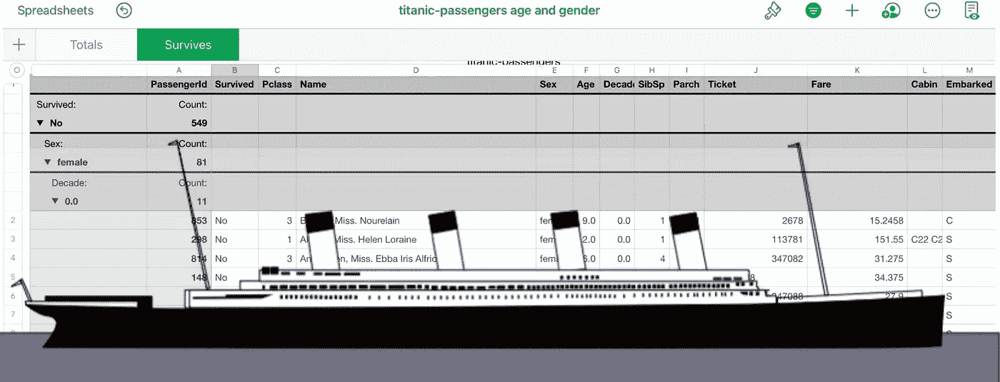

Apple Numbers and the Titanic (illustration by author)

Apple Numbers 在它的任何手机、平板电脑和电脑上都是免费的，经常被嘲笑，但苹果正在不断地给这个友好而强大的电子表格添加功能。

该公司现在增加了数据透视表功能，这有助于理解数据。苹果(出于我不知道的原因)称数据透视表为类别。

通过分析泰坦尼克号的乘客名单，我决定尝试一下这个专题。如果由于某种命运的安排，我被及时送回那艘注定要毁灭的船上，我幸存的机会有多大？

数字能预测我的命运吗？事实证明，的确如此。Categories 工作得很好，它允许我从互联网上下载一个数据集，并用它做一些有意义的事情。

我会告诉你怎么做，你可以找到你的机会是什么。哦，是的，你也可以学到一些方便的新的电子表格技能。如果您不想一步一步地浏览，在结尾处有一个到 Numbers 电子表格的链接。

# 类别/数据透视表？有什么意义？

数据透视表可以让你在电子表格中对数据表进行分组、汇总和过滤。这是电子表格与数据库重叠的领域之一。

给定一个数据表，您可以:

*   根据字段组合(如性别、年龄、姓氏)对记录进行排序
*   分组相关记录(例如，按部门和角色分组列出员工)
*   过滤掉记录(例如，列出上个季度总收入超过 10 万英镑的每个销售人员)
*   总结记录(例如，列出每个部门有多少人)

一旦你知道了这个特性，使用起来就相对容易了。

# 泰坦尼克号乘客名单

我想用真实世界的数据集来测试数字，而不是我刚刚编造的东西。这具有测试 CSV 导入功能的额外优势。

CSV 代表逗号分隔值。记录存储在一个文本文件中，每个记录用回车符分隔。记录中的字段用逗号分隔。

一个列有泰坦尼克号乘客名单的数据集在公共领域，你可以在这里找到它。

[](https://public.opendatasoft.com/explore/dataset/titanic-passengers/) [## 泰坦尼克号的乘客

### 泰坦尼克号乘客名单

public.opendatasoft.com](https://public.opendatasoft.com/explore/dataset/titanic-passengers/) 

顺便说一下，类别可以用于电子表格中的任何数据，而不仅仅是从 CSV 文件导入的数据。

# 有策略是好的

我将在一个电子表格中的两个工作表上创建两个类别表。

*   一张工作表将显示每个性别和年龄组的总人数(总数)。
*   另一份遗嘱将显示每个年龄和性别组中谁幸存(生存)。

我将使用这两个类别表来计算存活率并创建一个图表。

# 下载泰坦尼克号数据集

将上面的链接复制到 Safari 的地址栏中，然后点击 return。点击 CSV 旁边的“整个数据集”。

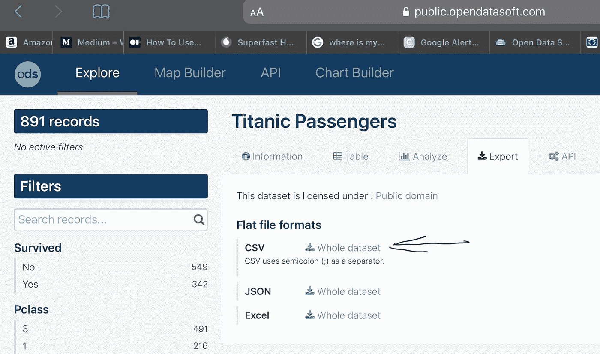

Screenshot by author

即使数据集使用分号而不是逗号来分隔字段，Numbers 仍会正确导入它。

Safari 会将文件下载到“下载”中。

# 将数据集导入 Numbers

横向使用您的设备启动 Numbers，然后点击“下载”。

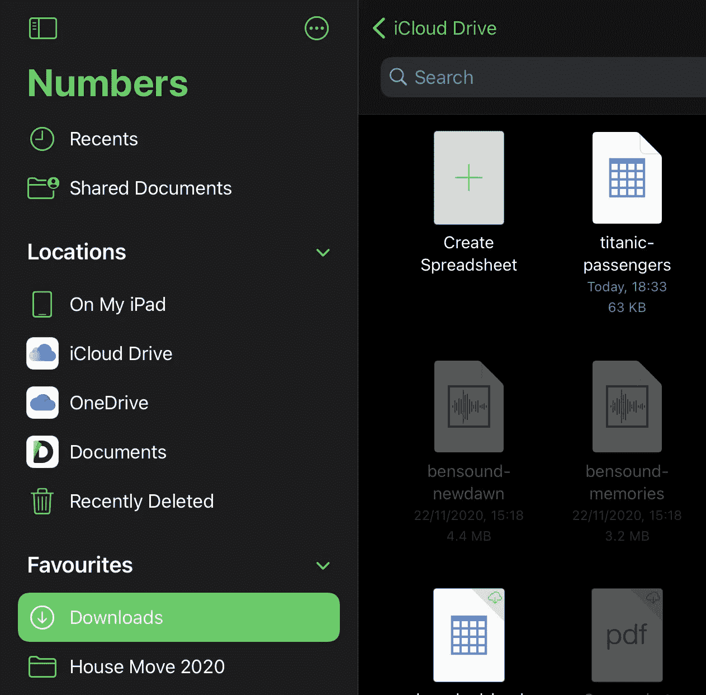

Screenshot by author

如果你按最近修改的文件列表，文件“泰坦尼克号-乘客”会在左上方。点击文件。文件将加载，您有机会更改导入选项。你不需要这样做，但如果你这样做了，你会看到以下情况。

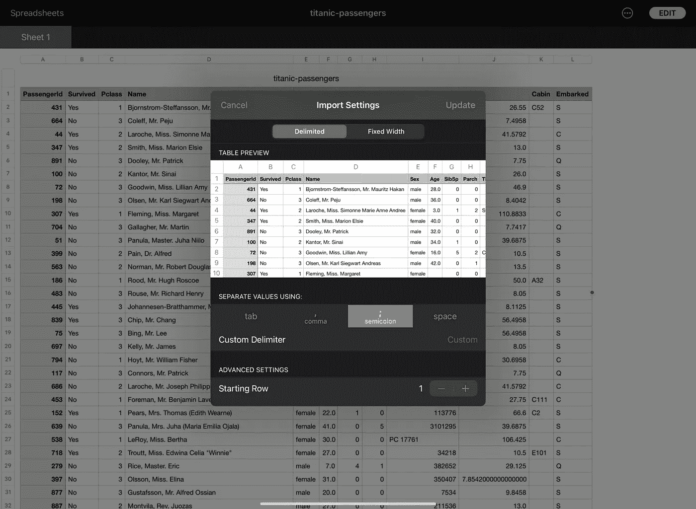

Screenshot by author

以下是数据集中的字段:

*   乘客 ID
*   幸存
*   乘客等级
*   名字
*   性
*   年龄
*   船上兄弟姐妹和配偶人数
*   Parch(父母或子女的数量)
*   票
*   票价
*   小木屋
*   登船地点:(瑟堡，(Q)厄恩斯兰，(S)outhampton)

将电子表格重命名为“泰坦尼克号-乘客年龄和性别”。

# 创建总计工作表

点击“编辑”，然后点击画笔旁边的图标。

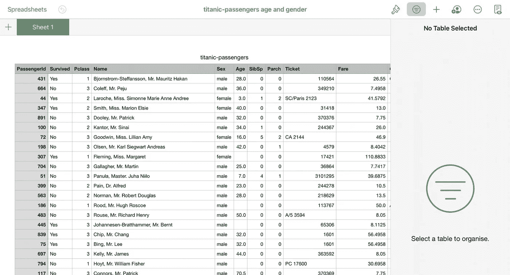

Screenshot by author

将工作表标题从“工作表 1”更改为“总计”。

## 创建年龄组

根据年龄对人们进行分组，可以更容易地发现年龄与某人存活可能性之间的相关性。我将使用这些年龄组:

*   80 岁以上
*   70 到 80
*   60 到 70 岁
*   50 到 60 岁
*   40 到 50 岁
*   30 到 40 岁
*   20 到 30 岁
*   10 到 20 岁
*   10 以下。

我还将有一个“未知”类别，因为我们不知道每个人的年龄。

原始数据集中不存在年龄分组，所以我将在 F 列的“年龄”后添加一列，称为“十年”。

将下列公式添加到单元格 G2。

```
=IF(ISBLANK(F2),"Unknown",ROUNDDOWN(F2÷10,0))
```

应该是这样的。

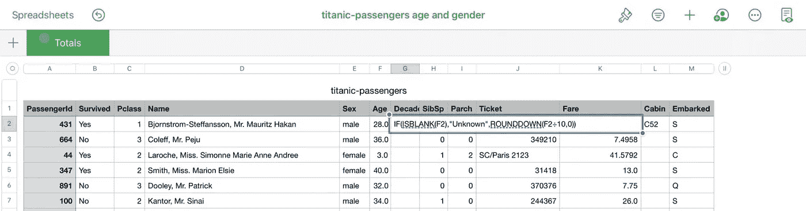

Screenshot by author

按回车键，并填写该列的其余部分。

[](https://www.datadriveninvestor.com/2020/11/30/how-react-native-improves-the-productivity-of-mobile-app-developers/) [## React Native 如何提高移动应用开发者的生产力？数据驱动的投资者

### React Native 是一个有益的框架，可以帮助您使用 JavaScript 设计应用程序。这种结构包括…

www.datadriveninvestor.com](https://www.datadriveninvestor.com/2020/11/30/how-react-native-improves-the-productivity-of-mobile-app-developers/) 

## 整理

点击右边小画笔图标旁边的排列图标。

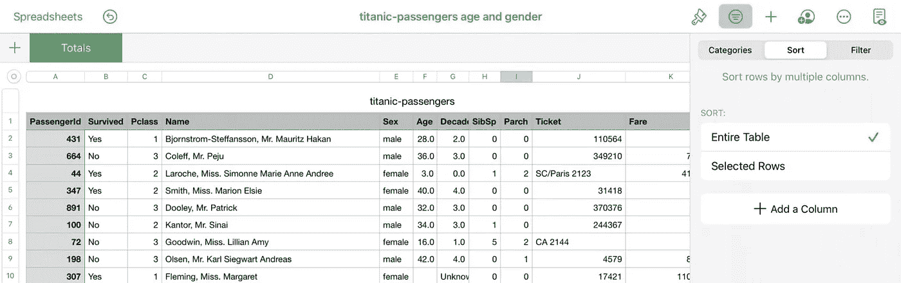

点击“排序”，添加两列，“性别”和“十年”。

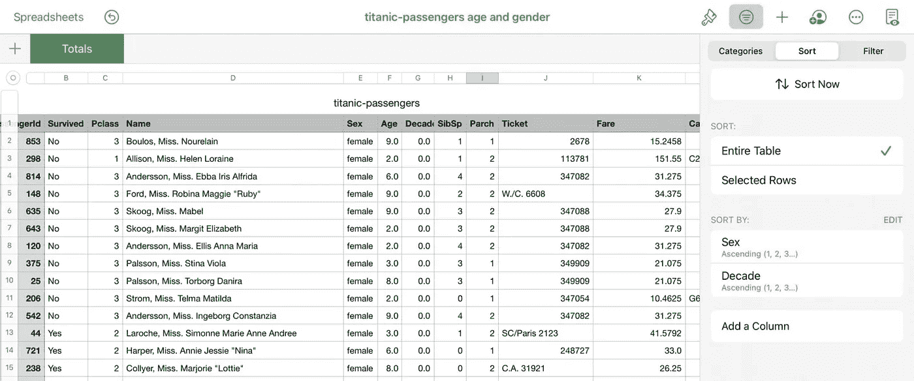

Screenshot by author

## 添加类别(创建数据透视表)

在本节中，数据被分组在一起。点击“类别”，添加“性”和“十年”。用两个手指点击 A 列顶部的单元格，然后选择“计数”。见下文。

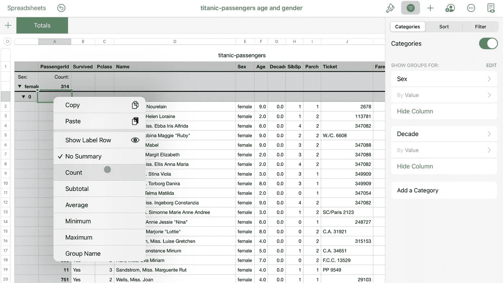

Screenshot by author

折叠不同的年龄组，并加宽第一列，以便您可以阅读标签。你应该知道这个:

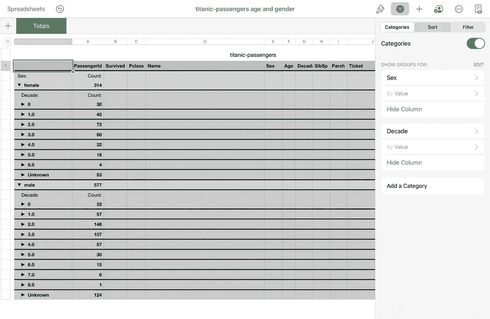

Screenshot by author

年龄组标签翻译为 0 = 10 岁以下，1.0 = 10 至 20 岁，2.0 = 20 至 30 岁，等等。

# 将年龄和性别与某人是否幸存相匹配

在一个电子表格中有两个类别表是可能的，但这是一个骗局。

*   创建第二个工作表，并将其命名为“幸存”。
*   删除工作表中的空表格。
*   返回汇总工作表，复制您创建的表格。
*   将其粘贴到“幸存”工作表中。
*   使用“编辑”功能删除类别。
*   添加一个新的排序列，“幸存”并使其成为第一个排序列。

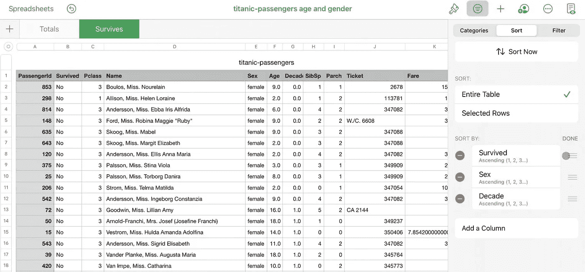

Screenshot by author

*   添加类别“幸存”、“性”和“十年”。
*   添加计数函数。
*   瓦解年龄组。

这就是你得到的。

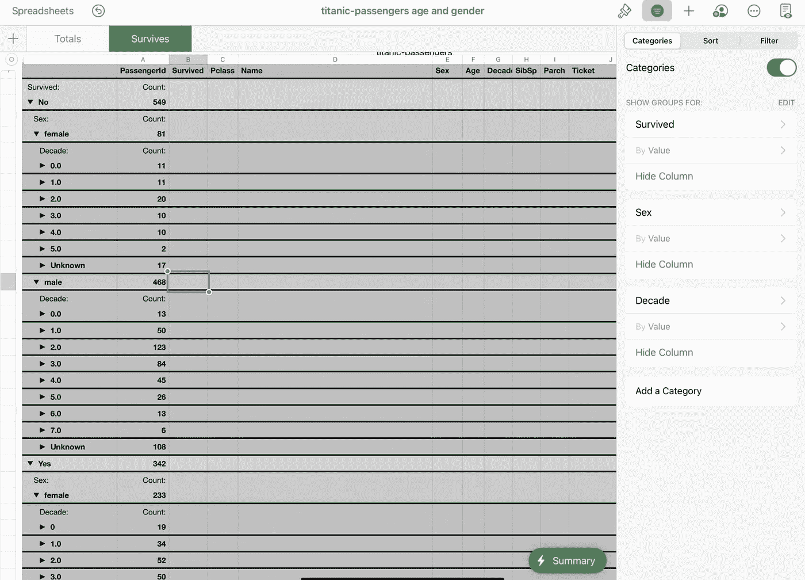

# 合并表格

我将这两个表合并成一个汇总表，并创建了一个图表。

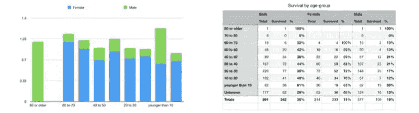

Screenshot by author

我是男性，快 50 岁了，所以让我们祈祷我永远不会被扔回到泰坦尼克号上！我只有 13%的机会活下来。这是 iCloud 上的示例文件的链接。

[](https://www.icloud.com/numbers/0VG3FMVHI-fG3mpaWzuVm2pBg#titanic-passengers_-_age_done) [## 泰坦尼克号-乘客-时代结束

### 泰坦尼克号的乘客名单被输入到数字中，并使用类别进行分析。

www.icloud.com](https://www.icloud.com/numbers/0VG3FMVHI-fG3mpaWzuVm2pBg#titanic-passengers_-_age_done) 

# 没有什么是完美的

Apple Numbers 的分类功能实际上是一个数据透视表，但至少在我写作的时候，它并不完全符合 Excel 的功能。主要的遗漏是直接连接到外部数据源的能力。微软 Excel 可以做到这一点。

苹果肯定知道这很有用，因为他们提供了使用专用公式访问实时股票和货币信息的能力。请看这里:

 [## 在 Numbers 中将当前股票报价和货币汇率添加到您的电子表格中

### 无论你是在追踪退休投资、大学储蓄，还是在做金融研究，用数字来…

support.apple.com](https://support.apple.com/en-us/HT207109) 

苹果可能已经做了研究，分类可以很好地满足 80%用户的需求。然而，在现代世界中，这真的需要推广到任何数据源，因为即使是昨天的数据尝起来也是陈旧的。

# 向前迈进了一大步

使用分类来挑选泰坦尼克号的乘客名单出乎意料的顺利。

*   可以做多键排序。
*   您可以随意对数据进行分组。
*   有多种函数可用于汇总数据。
*   创建图表和汇总表非常简单。
*   您可以将 CSV 文件导入 Numbers，其中包含许多微调选项

他们究竟为什么称之为“类别”？苹果已经不是第一次隐藏强大的功能了。

**进入专家视角—** [**订阅 DDI 英特尔**](https://datadriveninvestor.com/ddi-intel)