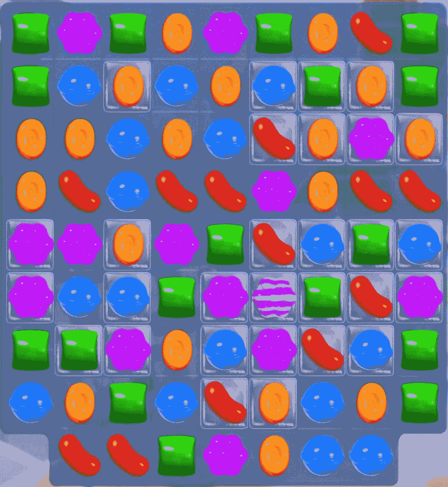

# 结束第三场比赛

> 原文：<https://medium.datadriveninvestor.com/wrapping-up-match-3-games-2e2f9e5f1482?source=collection_archive---------1----------------------->

欢迎来到我的系列文章的最后一篇[用图算法解决第三场比赛](https://medium.com/rideos/solving-match-3-games-with-graph-algorithms-27c3f2c56932)！在前五篇文章中，我们已经[介绍了第三场比赛的游戏](https://medium.com/rideos/solving-match-3-games-with-graph-algorithms-27c3f2c56932)，讨论了[解决没有交换的第三场比赛的算法](https://becominghuman.ai/solving-match-3-without-swaps-f05ea2590bf2)，以及[有重力的第三场比赛的算法](https://becominghuman.ai/match-3-with-gravity-without-swaps-9b7758a8cddd)。然后，我们添加了交换和[介绍了一个解决简化糖果粉碎](https://medium.com/swlh/solving-simplified-candy-crush-i-e-match-3-games-with-swaps-54cb7975486b)的优化算法，然后讨论了最优性和[介绍了另一个解决带有特殊块](https://medium.com/datadriveninvestor/solving-candy-crush-with-special-blocks-i-e-match-3-games-with-swaps-501878c9ef2b)的游戏的优化算法。

在本文中，我们将考虑我们之前提到的第三场比赛的其他功能，即，使我们接近[糖果粉碎传奇](https://en.wikipedia.org/wiki/Candy_Crush_Saga)的功能。特别是，我们将考虑两个特征。首先，我们将考虑不同的目标状态，而不是在固定数量的动作中达到最大点数。例如，目标可能是清除所有*厚的*块(参见[我以前的文章](https://medium.com/datadriveninvestor/solving-candy-crush-with-special-blocks-i-e-match-3-games-with-swaps-501878c9ef2b)中对这些块的描述)，而不考虑获得的点数。第二，我们会考虑由于重力而落下的方块，在玩家的游戏板之外，是未知的。之前，我们假设整个***N***by***m***游戏世界是已知的，我们将解除这个假设，因此玩家只知道***N***by***m***游戏棋盘，他们可以从中选择动作。有了这两个额外的特性，我们定义的 Match-3 游戏将*匹配*(双关语)[糖果粉碎传奇](https://en.wikipedia.org/wiki/Candy_Crush_Saga)！

这篇文章的格式将与我以前的文章略有不同。之前，我们会描述如何将游戏表示为一个图，然后引入一个算法来解决它。在这里，我们将减少规定性，增加描述性。具体来说，我们讨论了图*可以*表示的方式，以及*可以*应用于问题的算法，但没有给出具体的表示或算法。这样，你可以选择你认为更适合的方法，并尝试一下，看看利弊！此外，这个练习可以让你将本系列文章中的经验应用到其他游戏中，而不仅仅是第三场比赛和糖果粉碎游戏。

# 变化的目标状态

在以前的文章中，我们这样定义图形:节点表示游戏状态(即，不同位置的颜色和块的类型，以及其他元数据，如获得的点数和剩余的动作数)；边是有向的，并且连接从一个游戏状态到另一个游戏状态具有有效动作的节点。我们将在本文中保留这种表示。

我们*正在*修改的一个方面是目标状态的定义。之前，我们将状态 ***s*** 定义为目标状态，如果该状态的点数 ***ps*** 大于或等于阈值 ***P*** 。现在，我们将定义一个函数*is goal(****s****)*，它将一个状态 ***s*** 作为参数，当且仅当 ***s*** 是一个目标状态时，返回 true。

就这样吗？嗯，是也不是。正如我的博士导师[曼努埃拉·贝洛索](https://en.wikipedia.org/wiki/Manuela_M._Veloso)所说(她引用了*她的*导师的话):科学在于细节。如果游戏的目标是达到最大点数，那么我们可以定义 *IsGoal* 来比较点数和阈值，和之前一样有等价的表示。如果游戏的目标是清除所有厚块，那么 *IsGoal* 可以检查游戏中块的状态，当且仅当***n***by***m***游戏棋盘中不存在厚块时返回 true。如果还有其他条件，那么 *IsGoal* 可以这样定义来处理。由于游戏状态包含了与游戏相关的一切，根据这个定义 *IsGoal* 只需要一个状态 ***s*** 作为它的参数。

Screenshot of Candy Crush Saga, with a number of thick blocks.

然而，上面描述可能有点绕圈。假设游戏的目标是连续 3 个动作每次获得 100 分。根据我们当前的状态定义， *IsGoal* 将不能使用单个状态，而是需要三个状态(当前状态、其父状态和其祖父状态)。从技术上来说，目前定义的游戏不再遵循[的马尔可夫特性](https://en.wikipedia.org/wiki/Markov_property)，即状态是无记忆的，也就是说，我们如何进入状态并不重要，重要的是当前状态。

我们可以增加状态来包含最后 3 个游戏板，然后 *IsGoal* 就相对容易编写了。另外，那会让博弈再次服从马尔可夫性质，这很好，对吧？嗯，是也不是。是的，它使博弈马尔可夫化，但是这种方法普遍可行吗？如果现在的目标要求最后的 ***i*** 动作每动作获得 100 点呢？那么我们应该增加状态来包含所有的 ***i*** 游戏板吗？我们可以，但是我们添加到原始定义中的每个游戏板都会增加状态空间的复杂性。也许没关系，但也许有关系。它*取决于*。

让我们再深入一点。假设我们已经以令人满意的方式定义了状态和目标。接下来我们如何定义一个*最优*状态？之前，我们将最佳状态定义为在包括来自未使用动作的奖励点之后，具有最大点数的状态。我们是否还可以使用类似的定义，即最佳状态是这样一种状态，其中 *IsGoal* 返回 true，并且在包括奖励点数后具有最大点数？在这种特殊的情况下，我们可以，而且我们仍然可以使用 Dijkstra 的算法来找到一个最优解，[类似于我以前的文章](https://medium.com/datadriveninvestor/solving-candy-crush-with-special-blocks-i-e-match-3-games-with-swaps-501878c9ef2b)中的方法，但是更新了对目标状态的检查。

如果最佳状态是不同的呢？例如，最佳状态可以是这样一种状态，其中 *IsGoal* 返回 true，并且最少(或最多)数量的非厚块被清除。Dijkstra 的算法还能用吗？是的，但是我们需要改变边权重的定义方式(我将把它作为一个练习来考虑)。

因此，改变目标状态和最优状态的定义会很快变得复杂:定义 *IsGoal* 和更新 Dijkstra 的算法(或使用不同的算法)以找到最优解可能是一个相互关联的问题。

# 未知的未来状态

我们要考虑的下一个重要特性是未知的未来状态。在我之前的文章中，我们假设游戏棋盘是由*瓷砖 ***m*** ，由*n*先验*已知更大的 ***M* 。这样，在给定当前游戏状态的情况下，用于求解游戏的算法能够知道在采取行动之后下一个游戏状态将是什么。****

**然而，对于许多第三场比赛来说，这种假设通常并不成立，例如《糖果粉碎传奇》。例如，只有***m***by***n***游戏棋盘可能是可见的，在采取行动之后，新的未知方块落下。或者，也许***m+1***by***n***瓦片是已知的，所以紧接的下一行是已知的但其他的一无所知。**

**如果下一个游戏状态未知，求解算法如何找到一个最优解，甚至是*一个*解？嗯，接下来的游戏状态并不是*完全*未知。在采取该动作之前存在并且没有被该动作移除的块将仍然存在于下一个状态中。**

****

**Game state after considering an action that removes some blocks. Unknown blocks form gaps.**

**一种方法是假设在现有的块被移除之后不会出现新的块，即，保留在游戏状态中的唯一的块是先前存在的那些块。求解算法可能无法用这种方法找到解，因为在某个点之后可能没有进一步的动作。然而，该算法可以用于启发式地寻找下一个“最佳”动作，而不是试图从当前状态完全解决 Match-3 游戏。试探法可以是一个评估函数，它在一个动作之后计算最佳终端状态的分数，例如计算剩余的块的数量。可选地，启发式函数可以基于在到达终端状态之前采取的动作的数量，或者达到的总点数，等等。启发式的选择取决于总体目标的定义，在解决问题时可能有不同的效果。特别是，由于这是一种启发式方法，不再有任何保证算法是完整的或最佳的。**

**另一种方法是假设新的块*确实*出现，但是出现的块是最差的(或最好的，或“随机的”)。在前一种情况下(最差的可能区块)，游戏变成了对抗性的两人游戏(例如，“区块生成器玩家”试图阻止“算法玩家”获胜)；有了尽可能好的积木，“积木生成器玩家”正试图帮助“算法玩家”获胜；带有随机块；“积木发电机玩家”是矛盾的。确定*最差*或*最佳*可能的下一组块，甚至生成“公平的”随机块，都是具有挑战性的。一些相关的建议主题是:[阿尔法贝塔剪枝](https://en.wikipedia.org/wiki/Alpha%E2%80%93beta_pruning)和[蒙特卡洛树搜索](https://en.wikipedia.org/wiki/Monte_Carlo_tree_search)。阿尔法-贝塔剪枝已经被用在像国际象棋这样的游戏中，蒙特卡洛树搜索已经被用在像扑克这样的游戏中。探索如何将这些应用到第三场比赛会很有趣！**

# **讨论**

**本文总结了关于 Match-3 游戏的系列，我们涵盖了一系列主题，从什么是 Match-3 游戏，如何以最佳方式解决它们，如何定义最佳解决方案，以及解决 Match-3 游戏的各种算法。**

**在本文中，我们讨论了如何改变目标状态，以及如何考虑未知的未来状态。虽然我们没有提供解决这些问题的规定算法，但我们希望这些描述和方法的指针将有助于*您*如何解决这些问题！**