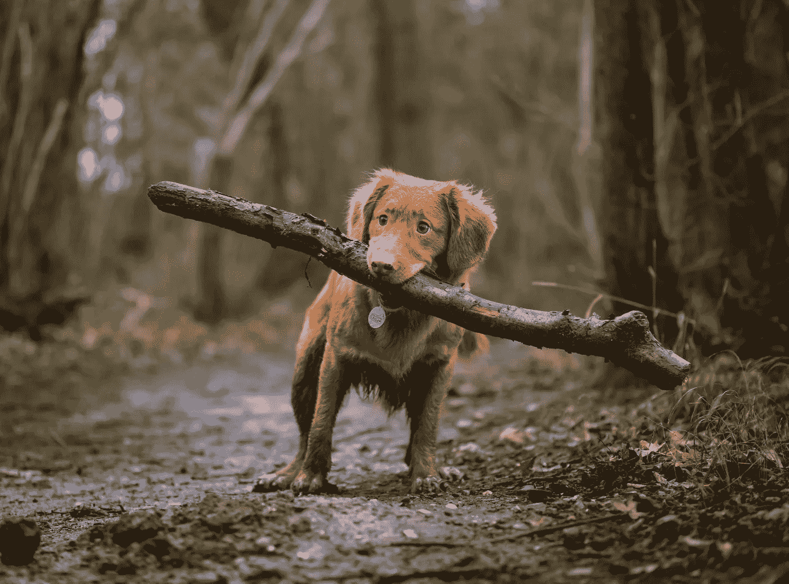
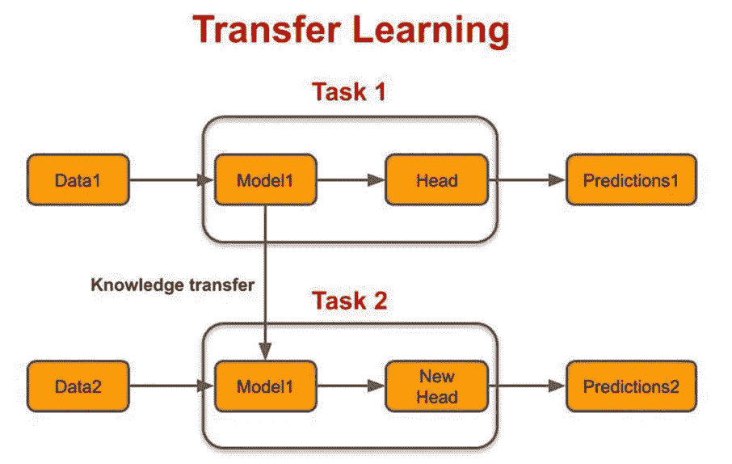
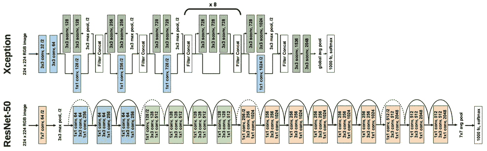
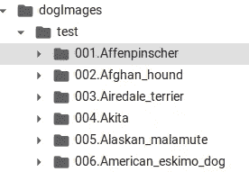
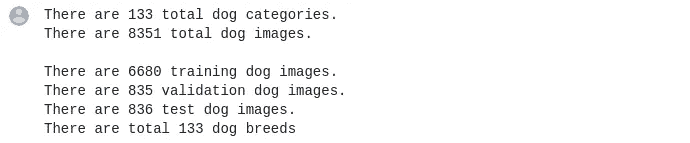
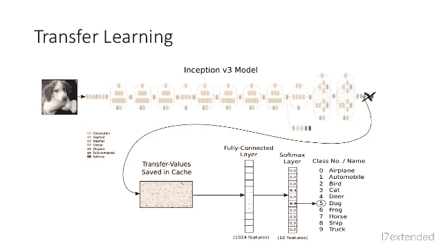
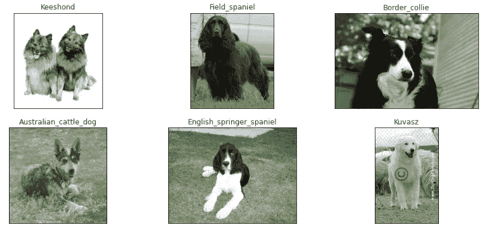

# 在 10 分钟内编写你自己的狗品种分类器！

> 原文：<https://medium.datadriveninvestor.com/write-your-own-dog-breed-classifier-in-just-7-minutes-8d74db2c785?source=collection_archive---------6----------------------->

## 内部人工智能

## 使用深度学习模型预测任何狗的品种。

Photo by [Jamie Street](https://unsplash.com/@jamie452?utm_source=unsplash&utm_medium=referral&utm_content=creditCopyText) on [Unsplash](https://unsplash.com/s/photos/dog?utm_source=unsplash&utm_medium=referral&utm_content=creditCopyText)

又来了。这一次，我们将开发自己的狗品种分类器。我们的模型将能够自动检测照片中的狗，并预测它的品种。听起来棒极了！让我们开始吧…..！

> 注意:如果你似乎不理解文章中讨论的任何观点或想法，试着把整篇文章读一遍，然后回来再读一遍。希望这能有点意义，因为一切都是相互关联的。

*   使用的架构:CNN 的
*   编程语言、库、框架:Python、NumPy、Pandas、Matplotlib、cv2、**Keras【tensor flow back end】**
*   专业水平:中等水平

## 我们的战略:-

预测狗的品种是一项相当具有挑战性的任务，但我会为你分解它。首先，模型应该能够检测出图像中是否有狗。然后它就能预测那只狗的品种。但是现在，让我们把重点放在检测图像中的狗的问题上。有许多方法可以解决这个问题。使得:-

*   训练神经网络来检测图像中是否有狗。然后使用这个训练好的模型和[微调](http://wiki.fast.ai/index.php/Fine_tuning)来预测那只狗的品种。
*   使用端到端的深度学习方法。这样，不用检测狗，然后分别预测它的品种，只需向 CNN 提供狗的品种数据集，让它同时学习这两个特征。
*   使用预先训练好的模型，即 VGG-19、例外、RESNET，然后使用[迁移学习](https://en.wikipedia.org/wiki/Transfer_learning)来预测狗的品种。

首先，考虑第二种方法，这种类型的方法只有在我们有庞大的数据集时才有效，但在这种情况下，我们只有大约 6680 幅训练图像。所以这种做法行不通。
第二种和第三种方法非常相似；唯一的区别是，在第一种方法中，我们在对狗品种数据集进行微调之前，先训练我们自己的狗检测器，而在第三种方法中，我们利用**迁移学习**来预测狗的品种。

显然，第三种方法更好，因为这些模型是在 ImagNet 数据集上训练的，并且在图像分类中达到了人类水平的性能。那么，为什么不利用这一点呢？
这些模型在多个 GPU 上训练了数周，为什么不利用这些模型为我们带来优势呢。此外，在接下来的章节中，你会发现为什么这些模型在解决预测犬种的问题上给了我们相当大的优势。
所以，迁移学习会照顾到第一步。

 [## 认知计算——一套被广泛认为是……

### 作为它的用户，我们已经习惯了科技。这些天几乎没有什么是司空见惯的…

www.datadriveninvestor.com](https://www.datadriveninvestor.com/2020/02/19/cognitive-computing-a-skill-set-widely-considered-to-be-the-most-vital-manifestation-of-artificial-intelligence/) 

现在，进入第二步。在第一步中，我们使用预先训练的模型来检测狗的存在，但我们可以使用迁移学习来实现更重要的东西。这就是特征提取。如果您熟悉 CNN 及其工作原理，那么您可能熟悉特征提取的概念。如果没有，参考[*这个*](https://machinelearningmastery.com/promise-of-deep-learning-for-computer-vision/) 。由于像 Xception 和 ResNet 这样的模型在图像分类方面已经达到了人类水平的性能，它们是非常好的特征提取器，我们可以利用这一点。因此，下面是我们将如何解决这个问题的快速概述

*   导入数据集。
*   预处理数据集。
*   导入预训练模型。
*   实施迁移学习。
*   可视化一些结果。
*   比较性能。

对于这项任务，我们将使用两种不同的预训练模型制作模型，然后使用迁移学习。我们将使用的模型是:-
-例外
- RESNET152V2

credits: Pinterest

这两个模型都非常强大和深入，特别是第二个。

> **注:-**
> **我知道你们大多数人都没有机会接触到强大的机器。别担心。我们将从谷歌获得帮助。一如既往！**。你可能熟悉 google colab，它为你提供了一个运行 jupyter 笔记本的环境。Colab 笔记本在谷歌的云服务器上执行代码，这意味着你可以利用谷歌硬件的力量，包括 GPU 和 TPU。
> 
> 在开始实现模型之前，如果您希望在本地机器上运行这个模型，请确保您的系统/计算机/笔记本电脑满足以下要求。
> - GPU
> -大约 24GB 内存
> -大约 40 GB 可用空间

所以，你不用担心这个。就去[*colab.research.google.com*](https://colab.research.google.com/)*。加载或创建一个新的笔记本，你就可以开始了。你可以通过 [Google](https://www.youtube.com/watch?v=inN8seMm7UI) 观看这个视频来入门。*

> **注意:强烈建议在阅读如何实施之前打开我的笔记本。可以在这里找到** [**原笔记本(Github)。**](https://github.com/Mahyar-Ali/Dog-Breed-Classifier/blob/master/Dog-breed%20Classifier.ipynb) **和** [**Colab 版本**](https://colab.research.google.com/drive/1ZQy3GKKu9cioluUMz69BSo7LjLwC4yyA) **【推荐】。**

 [## mahyar-Ali/犬种分类器

github.com 犬种分类器](https://github.com/Mahyar-Ali/Dog-Breed-Classifier/blob/master/Dog-breed%20Classifier.ipynb)  [## 谷歌联合实验室

colab.research.google.com 犬种分类器](https://colab.research.google.com/drive/1ZQy3GKKu9cioluUMz69BSo7LjLwC4yyA) 

## 导入和加载数据集:-

对于这个问题，我们没有任何预处理数据。所以要自己预处理。点击从*下载数据集。压缩文件包含三个文件夹:培训、测试和验证。所有这些文件夹都包含不同狗品种的图片，按字母顺序排列在不同的文件夹中。*

A Cropped Snapshot

首先，我们必须存储每张狗图片的文件路径及其品种。

接下来:-

`load_dataset()`函数用于读取和存储数据集中每个图像的地址及其标签。因为我们有 133 个狗品种，所以我们的一个热编码器的长度将是 133。我们可以直接读取图像并将它们存储为 NumPy 数组，但是在这种情况下，我们可能会丢失关于每张狗图像的类别的信息。现在，创建图像名称及其目标标签的数据库。

当我们创建与每个图像相关联的目标向量时，该向量处于一个热点表示中。这对计算机来说是合理的，但是我们想知道哪只狗属于人类语言中的哪一个品种。所以我们必须列出数据集中所有可用的狗品种。

我刚刚使用了前面的函数，并将其修改为只返回图像的路径，而不返回目标标签。从图像名称中，我们可以提取不同狗的品种，因为所有的图像都以一种模式存储，

`set`用于消除所有多余的名字。现在我们有了所有狗的品种，让我们按照它们在数据集中的排列顺序排列它们。

现在，让我们把结果可视化。

Category and breed are the same things.

现在我们已经准备好了数据库，让我们从数据库中可视化一些图像。通过运行这个单元，你会看到八幅狗的图像。

## 2.预处理数据集:-

现在，我们必须使用创建的数据库读取图像，然后将它们存储为 3d 数组。与此同时，我们必须将所有的图像调整到相同的形状，因为 Xception 和 ResNet 分别只接受`299x299`和`224x224`。由于我们有两个模型，首先考虑例外网络，并根据该模型处理我们的图像。

This function will return a NumPy array of the images found in the dataset and will also resize them.

除了输入形状约束，这些模型还有一些其他预处理步骤，但我们不必担心这一点。Keras 为我们提供了这样的功能。我一会儿会谈到那件事。

## 3.导入预训练模型:-

首先，我们将使用异常模型。该模型在 ImageNet 数据集上被训练以检测 1000 类图像。所以模型的最后一层有 1000 个单位。但是我们不需要识别 1000 个物体。我们想要预测狗的品种，总共有 133 个类别[狗的品种]。所以，为了预测狗的品种，我们将移除 Xception 模型的最后一层，并用 133 个感知(单位)的层来代替它。为了导入这个模型。

现在，我们有了没有最后 1000 感知层的模型。我们有两个选择，要么在这个模型的末尾添加一个新层，要么使用所谓的瓶颈，以便节省计算。让我解释一下，如果我们在这个模型的末尾添加新的层[133 感知]，并将除了最后一个[133 感知者]之外的所有其他层设置为不可训练，那么在向前传播的每一步中，我们必须将图像从输入层一直传递到输出层 100 次[由于历元或训练周期的数量]。所以这是一个非常多余的计算。因此，我们将把所有的图像传递给 e Xception 模型[last layer removed],只传递一次，并将存储与这些图像相关的该模型的倒数第二层的输出。然后，我们将创建一个新的模型，并将这些输出作为输入提供给新创建的具有输出的模型[133 感知层]。我们没有做任何改变，只是将模型分成两个模型以减少计算量。

下面通过一个图片做个小解释。

credits: Slide Share

把它当作例外模型，而不是先入为主。请注意，我们将第一个模型的输出作为第二个模型的输入(我们将创建第二个模型来预测狗的品种)。第一个模型将创建每个图像的编码，这对确定狗的品种至关重要。

`preprocess_input`函数将根据模型[记住键:1](即归一化)对图像进行预处理，并将其提供给异常模型，异常模型又将输出作为必要的编码返回。请注意，我们已经删除了最后一层，因此输出将是形状`10x10x248`，这是 Xception 模型的倒数第二层。

## 4.实施迁移学习:-

现在让我们创建一个只有一层的模型，它可以预测狗的品种。它将从先前模型的输出中获取输入(`10x10x248)`)。但是在将这个输出连接到我们的层之前，我们将定义一个中间层，它将把`10x10x248`转换成`248`感知层。为此，我们将使用`GlobalAveragePoolingLayer()`。

我们已经准备好了模型。是时候编译和运行我们的模型了。

## 5.可视化结果

在训练该模型 50 个时期之后，该模型在训练集上实现了大约 99%的准确度，在验证集上实现了大约 90%的准确度，在测试集上实现了 87.5%的准确度。哇！

[green] The Model guessed the right breed. Refer to the notebook for the code.

这些都是很好的结果。很明显，训练集有些过拟合。这是因为 Exception 是一个非常强大的模型，我们也没有太多的训练数据，而且测试图像的分布差异很大。但就目前而言，这是一项出色的成就。您可以阅读我的笔记本，了解我如何获得测试集准确性的代码。

该笔记本还包含可视化的一些结果和用你自己的图像测试的功能。

我从网上下载了一张图片，在我的模型上测试了一下。

Yes, you are right.!

## 6.比较型号:-

我使用相同的过程用 InceptionV3 创建了第二个模型。但是在那个模型中，我不得不在`GlobalAveragePoolingLayer()`之后加入一个额外的层，因为盗梦空间模型比异常要深得多。所以我不得不调整不同的参数来解决过度拟合问题，因为如果没有任何适当的调整，模型很快就在**训练集**上达到了 100%的准确性。我不得不花很多时间尝试不同的选择。笔记本的末尾有一个总结。可以从 [**GitHub**](https://github.com/Mahyar-Ali/Dog-Breed-Classifier/blob/master/Dog-breed%20Classifier.ipynb) 或者[**Google Colab**](https://colab.research.google.com/drive/1ZQy3GKKu9cioluUMz69BSo7LjLwC4yyA)**打开笔记本。**

但是由于过度拟合，该模型不能超过由 Xception 模型实现的精度。但是我也设法在这个模型上获得了 81%的准确率。您可以随时根据需要调整超参数。

所以，正如承诺的那样，你有自己的狗品种分类器。

感谢阅读。该系列的下一个将是**“皮肤癌检测”，**，这是最具挑战性和最重要的深度学习模型之一。希望我们能够拯救一些生命。

如果你有任何建议，请写下来回应这篇文章。

向马赫亚尔·阿里先生致意

**进入专家视图—** [**订阅 DDI 英特尔**](https://datadriveninvestor.com/ddi-intel)