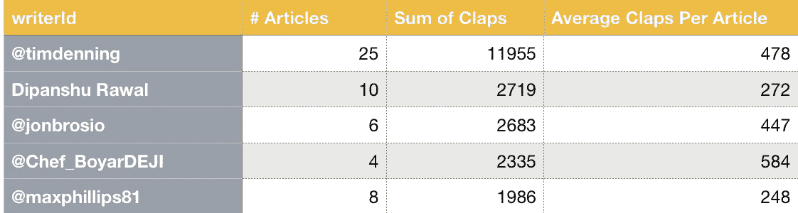
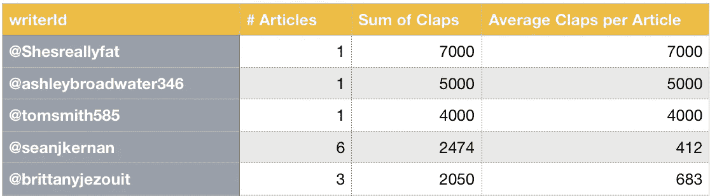
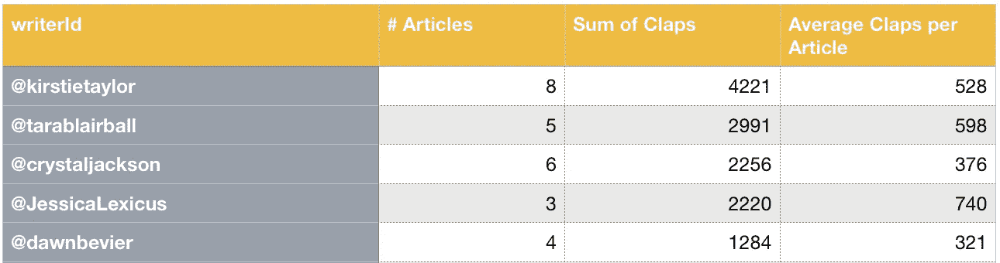

# 作家比出版物更重要

> 原文：<https://medium.datadriveninvestor.com/writers-matter-more-than-publications-78e172f0ed77?source=collection_archive---------5----------------------->

## 作家制作或破坏出版物

Image by author. Original photo by [Joackim Weiler](https://unsplash.com/@joackimweiler?utm_source=unsplash&utm_medium=referral&utm_content=creditCopyText) on [Unsplash](https://unsplash.com/s/photos/champion?utm_source=unsplash&utm_medium=referral&utm_content=creditCopyText)

在我所在的所有不同的小组中，经常有一个共同的问题:“我应该在哪个刊物上发表？”大多数新手都希望进入较大的刊物，以为刊物会给自己带来流量。

从某种程度上来说，的确如此，但远没有你想象的那么好。较大的出版物比其他出版物发表更多的文章。但更重要的是，许多人不知道这些出版物:它们之所以大，不是因为作家的数量，而是因为它们有“大”作家为它们写作。

在这篇文章中，我们将分析一些最大的出版物，我将展示出版物是如何在少数几个作者身上茁壮成长的。重点是让作者明白，为顶级出版物写作并不能保证成功，而且在许多情况下，这不是正确的方法。

开始之前，请注意以下几点:

*   共分析了 544 篇文章。
*   所有数字都是 2020 年 10 月的，10 月 22 日编的。
*   我没有每个出版物 100%的数据，所以对细节要有所保留。
*   掌声不是判断受欢迎程度的最佳指标，但它是唯一公开的指标。
*   分析的三个出版物是根据 2020 年发表的大量“热门”文章选择的。

***见文章底部的完整分析。***

# 观察

如果你从每个出版物的结果中去掉前 5 名作家，你会注意到他们对出版物的成功至少有 21%的贡献。21%最低，40%最高。这证实了作家对出版物的成功有很大的贡献。

绝大多数文章都在平均鼓掌次数的 25%范围内。每个出版物发表的前 5 篇文章要么来自拥有大量追随者的作者，要么就像病毒一样传播开来。对于像病毒一样传播的文章，它们仍然来自拥有大量追随者(1.2K 以上)的作者。当你去掉异常值时，平均值会精确得多。

除了三个例外，每个顶级作家每篇文章的平均鼓掌次数似乎并没有太大的不同。范围从 248–740，但大多数都在 430–530 左右。

一位作家在一份出版物中获得了超过 10，000 次的掌声。这是以写 25 篇文章(21 天)为代价的，平均每篇文章 478 次鼓掌。量可以起作用，但前提是你要保持质量一致。

出版物的追随者数量似乎不会影响一篇文章的成功程度。例如，PS I Love You 的统计数据并不比 Ascent 高，但其粉丝数量却是 Ascent 的两倍。

# 这一切对你这个作家意味着什么

这意味着几件事:

1.  如果你能为自己的一篇文章赢得 430-530 次掌声，你就和顶级出版物中的一些顶级作家一样优秀。
2.  顶级出版物不会让你更容易获得更多掌声。
3.  在顶级出版物中，你是每月出版数以千计的作家之一。

关于数据中未显示的顶级出版物和作家的其他注释:

*   出版物越大，你的文章出版的时间就越长。1-2 周也不是闻所未闻。
*   您无法控制发布日期和时间。
*   由于大量的请求，他们不得不对甚至伟大的文章说“不”。这不是针对你的。
*   这篇文章中提到的所有顶级作家也遭到顶级出版物的拒绝
*   这篇文章中提到的所有顶级作家都有大量 430 以下的文章。

 [## 数据启示录后期|数据驱动的投资者

### 思考一个不可知的未来并在其中运作是很困难的。但是数据驱动确实有助于解决这个问题。数据是…

www.datadriveninvestor.com](https://www.datadriveninvestor.com/2020/09/21/data-apocalypse-later/) 

完整的分析:

# 上坡

12.8 万名追随者

顶级作家:[蒂姆·丹宁](https://medium.com/u/b6d641be1066?source=post_page-----78e172f0ed77--------------------------------)
顶级作家的追随者:13.3 万(超过出版物)

Top 5 writers for The Ascent in October 2020

## 平均水平

每篇文章的平均点击次数:351.33
不包括前 5 名作者的每篇文章的平均点击次数:251.23

差异:28.49%

## 总数

掌声:71662
没有前五名作家的掌声:49994

差异:30.24%

# 更好的营销

10.4 万关注者

顶级作家:[香侬阿什利](https://medium.com/u/be08b013cc2a?source=post_page-----78e172f0ed77--------------------------------)
顶级作家的追随者:32K

Top 5 writers for Better Marking in October 2020

## 平均水平

每篇文章的平均点击量:516.55
不包括前 5 名作者的每篇文章的平均点击量:325.68

差异:36.95%

## 总数

掌声:51138
没有前 5 名作家的掌声:30614

差异:40.13%

# PS 我爱你

24.3 万关注者

顶级作家:[柯斯蒂·泰勒](https://medium.com/u/b46e1feecd33?source=post_page-----78e172f0ed77--------------------------------)
顶级作家的追随者:9.1 万

Top 5 writers in PS I Love You in October 2020

## 平均水平

每篇文章的平均点击次数:500.45
不包括前 5 名作者的每篇文章的平均点击次数:391.39

差异:21.79%

## 总数

掌声:50，545
没有前 5 名作家的掌声:37，573

差异:25.66%

## 访问专家视图— [订阅 DDI 英特尔](https://datadriveninvestor.com/ddi-intel)