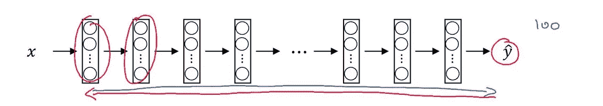

# 写一个神经机器翻译模型:Seq2Seq 模型注意。

> 原文：<https://medium.datadriveninvestor.com/writing-a-neural-machine-translation-model-seq2seq-model-with-attention-d3ec3ac8e9e4?source=collection_archive---------1----------------------->

## 内部人工智能

## 一个可以像谷歌翻译一样将文本从一种语言翻译成另一种语言的模型。

谷歌翻译总是让我惊讶于它从一种语言翻译到另一种语言的能力。不仅仅是短句，它在大句上也表现得很好。在本文中，我将尝试通过创建一个可以将西班牙语的任何句子翻译成英语的模型来模仿 Google Translate。您可以在任何数据集上训练该模型，以便在任何两种语言之间进行翻译。但是对于本文，我将使用西班牙语到英语的数据集。我们还将使用 [Bahdanau 注意力](https://arxiv.org/abs/1409.0473)来解释大句子。

credits: OLYMPUS IMAGING CORP.

> ***注意:如果你似乎没有理解文章中讨论的任何观点或想法，只需试着把整篇文章读一遍，然后回来再读一遍那个观点。希望这能有点意义，因为一切都是相互关联的。***

**目录:-**

1.  **启动前的一些说明**
2.  **数据集**
3.  **库**
4.  **预处理** ——预处理的可选步骤
5.  **创建模型** -编码器
    -巴丹瑙注意
    -解码器
6.  **训练模型**
7.  **评估或测试模型**
8.  **结论**
9.  **作者注**

> **【已编辑:本文还包括模型的代码，分为不同的部分，在每一节的末尾给出。代码由 GitHub 托管。如果您没有看到任何，只需刷新页面。】**

# 开始前的一些说明:-

*   使用的建筑:GRU 的
*   编程语言、库、框架:Python 3.x、NumPy、Matplotlib、sklearn、TensorFlow 2.x、**Keras【tensor flow 后端】、** unicodedata、os、io、time
*   专业水平:中等水平，需要一些序列对序列模型和矢量化序列的知识(例如，以矢量化形式表示句子)。)

***注:-******我知道你们大多数人都没有接触过功能强大的机器。别担心。我们将从谷歌获得帮助。一如既往！*** *你可能熟悉 google colab，它为你提供了一个可以运行你的 jupyter 笔记本的环境。Colab 笔记本在谷歌的云服务器上执行代码，这意味着你可以利用谷歌硬件的力量，包括 GPU 和 TPU。*

*在继续实施该模型之前，如果您希望在本地机器上运行该模型，请确保您的系统/计算机/笔记本电脑满足以下要求。
- GPU
-大约 8GB 内存
-大约 10 GB 空闲空间*

所以，你不用担心这个。就去[*colab.research.google.com*](https://colab.research.google.com/)*。*加载或创建一个新笔记本，您就可以开始了。你可以通过[谷歌](https://www.youtube.com/watch?v=inN8seMm7UI)观看这个视频开始。

> ***注:强烈建议打开我的笔记本再看如何实施。你可以在这里找到笔记本*** [***原文(Github)。***](https://github.com/Mahyar-Ali/Neural-Machine-Translation/blob/master/Neural_Machine_Translation.ipynb) ***和*** [***Colab 版***](https://colab.research.google.com/drive/1ZQy3GKKu9cioluUMz69BSo7LjLwC4yyA) ***【推荐】。***

 [## 谷歌联合实验室

### 编辑描述

colab.research.google.com](https://colab.research.google.com/github/Mahyar-Ali/Neural-Machine-Translation/blob/master/Neural_Machine_Translation.ipynb)  [## mah yar-Ali/神经机器翻译

### permalink dissolve GitHub 是超过 5000 万开发人员的家园，他们一起工作来托管和审查代码，管理…

github.com](https://github.com/Mahyar-Ali/Neural-Machine-Translation/blob/master/Neural_Machine_Translation.ipynb) 

# 数据集:-

****是目前最好的拥有最多制表符分隔的双语句子对的网站。它有超过 30 种不同语言的制表符分隔的双语句子对。数据集包含格式为:-
“英语+ TAB +其他语言+TAB+attribute”
的语言翻译对，本网站仅提供“英语和其他语言”之间的翻译数据集。****manythings.org 不是唯一的网站，还有很多其他网站可以下载你选择的数据集。********

# ******图书馆:-******

******为了创建这种类型的模型，我们必须使用不同的库进行预处理、创建模型和评估其性能。******

# ******预处理:-******

******本文的目的是向您介绍开发 nmt 模型的过程。因此，在本文中，我不会解释准备数据集的所有步骤。你可以从我的 [GitHub 库获得所有预处理的代码。](https://github.com/Mahyar-Ali/Neural-Machine-Translation)******

## ******可选:-******

******下面是预处理步骤的一点解释。
[preprocess.py](https://github.com/Mahyar-Ali/Neural-Machine-Translation/blob/master/preprocess.py) 包含了 load_dataset，tokenize，create_tensorflow_dataset 对象，预处理句子的所有必要函数。预处理句子涉及:-
1。增加一个`<start>`和`<end> toke.`
2。删除特殊字符。
3。从 word → id 和 id →word
4 创建字典映射。以矢量化的形式表示每个句子。
5。将每个句子填充到最大长度。******

> ******注意:如果您不理解预处理步骤，也不用担心。你可以随时使用我的代码进行预处理，直接开始关注机器学习部分。******

************

******Initial Output******

******现在我们将创建一个 [TensorFlow dataset 对象](https://www.tensorflow.org/api_docs/python/tf/data/Dataset?version=nightly)，这样我们就可以在训练时方便地访问它，然后将它分成几批。******

# ******创建模型:-******

******因为这是一项涉及自然语言处理的任务。因此，我们将使用 RNN 架构，因为 RNNs 在这类任务中提供了最佳结果。此外，由于这是一个翻译任务，我们将输入一个句子，模型将输出另一个句子(在这种情况下是一个翻译的句子)。这种类型的 RNN 被称为序列到序列模型。它的输入是一个序列，输出也是一个序列。******

****** [## 认知计算——一套被广泛认为是……

### 作为它的用户，我们已经习惯了科技。这些天几乎没有什么是司空见惯的…

www.datadriveninvestor.com](https://www.datadriveninvestor.com/2020/02/19/cognitive-computing-a-skill-set-widely-considered-to-be-the-most-vital-manifestation-of-artificial-intelligence/) 

门控循环单元是 RNN 的扩展，它提供了比简单 RNN 更好的结果。如果您是门控循环
单元(GRUs)的新用户，请参考 [**和**](https://towardsdatascience.com/understanding-gru-networks-2ef37df6c9be) 。简而言之，gru 类似于简单的 rnn，只是增加了内存。

credits: [https://commons.wikimedia.org/](https://commons.wikimedia.org/)

我们将建立的模型是一个具有扩展注意力的编码器-解码器模型。我们先来了解编码器和解码器部分。

> 为了简单起见，我将整个模型分成了三个子模型。
> 1。编码器
> 2。巴丹瑙注意
> 3。解码器

## 1.编码器:-

模型的这一部分使用了最简单的架构类型。我们将使用一个嵌入层，然后是 GRUs。我们将使用自定义 Keras 层。如果您没有使用过定制层，请参考[这个](https://www.tensorflow.org/tutorials/customization/custom_layers)。只需 15 分钟即可开始。

credits:[https://6chaoran.wordpress.com/](https://6chaoran.wordpress.com/)

这将为我们创建编码器层:-

这个模型的工作方式是，我们在编码器部分输入一个西班牙语句子。编码器 RNN 对句子进行编码，并将其传递给解码器 RNN，后者输出其英语翻译。为了得到更好的结果，我们在编码器部分使用了一个[嵌入层](https://machinelearningmastery.com/use-word-embedding-layers-deep-learning-keras/)来嵌入输入的句子。我们不需要担心嵌入层，因为 Tensorflow 会处理它。最重要的是模型架构。上图是一个简单的编码器和解码器模型。我们可以使用简单的编码器和解码器模型来完成我们的任务，但是这些类型的架构对于长句来说不太好用。我们也许可以用短句得到很好的结果，但是随着句子长度的增加，模型的准确性会降低。所以为了解决这个问题，我们将使用 Bahdanau 注意力。

## 2.巴丹瑙注意:-

注意力模型的工作方式非常有趣。我们知道，当我们想考虑以前的信息时，也使用 rnn。使得 RNN 考虑先前的信息来做出决定。但是随着序列长度的增加，由于消失梯度效应，句子起始单词的影响开始减小。必须阅读消失渐变[这里](https://en.wikipedia.org/wiki/Vanishing_gradient_problem)。从技术上讲，这是有一定道理的。随着序列长度的增加，序列开头的单词的影响开始减小。

credits: Andrew Ng

这是格鲁前来救援的地方。他们可以在一定程度上减少这种影响。随着消失梯度问题，还有一个非常重要的事情要考虑。在做出决定时，RNNs 通常认为前一个单词是决定下一个单词的最重要的单词。这并不总是有帮助的。考虑下面的句子。“在花园里玩耍的两只猫在我的花园里。”那么，应该用什么来代替空白呢？我们可以很容易地说“are”代替了空格。但是现在考虑一下 RNN 会如何做决定。它将考虑最近的单词来做出决定。在这种情况下,“在花园里玩耍”,它没有给出任何应该发生的事情的意义，即“是，是，是，是，是”？
做决定最重要的词是“两只猫”。所以我们必须教会模型在做决定时注意某些词。这就是 Bahdanau 注意力的概念派上用场的地方。它要做的是学习如何在做决定时注意句子的不同部分。
这些想法在制作翻译模型时很有用，因为模型可以很容易地决定在翻译时关注句子的哪一部分。

答:所有 gru 的输出都在这一点上收集。输出将是**(批量大小，序列长度，字典大小)**的形状。
在这种情况下，序列的长度是 3。字典的大小是在预处理期间选择的。
B:隐藏状态的输出就收集在这一点上。其形状为 **(batch_size，hidden_units)。**这是一个二维矢量，但我们必须将其转换成三维矢量，以处理“A”部分。所以我们将只扩展维度，即 **(batch_size，1，hidden_units)。
STEP-1:** 之后，A 和 B 都被传递到一个密集层中，这个密集层带有隐藏单元" **h_u"** ，它会将 A 转换成 **(batch_size，length_of_sequence，h_u)** 并将 B 转换成 **(batch_size，1，h_u)。**之后，A 和 B 相加，得到形状 **(batch_size，length_of_sequence，h_u)。然后，这个向量再次被传递到一个只有一个感知器的密集层，所以我们得到了形状为 **(batch_size，length_of_sequence，1)的最终输出。
第二步:**在这之后，还有一个 softmax 层，给我们注意力权重。这些注意力权重存储了每个单词应该获得多少注意力的信息。
**步骤-3:** 然后将这些注意力权重乘以解码器的原始输出“所有 gru 的输出”，然后沿着“序列长度”轴相加，以获得可在解码器处用于生成翻译的上下文向量。**

这将创建巴达瑙注意层:-

h_u Is 10

## 3.解码器:-

现在，我们必须创建解码器模型，将编码文本翻译成英语。解码器与编码器相同，但有一些变化。解码器模型的行为将根据它是处于“训练过程”还是“测试过程”而改变。首先，让我们关注培训部分。正如在预处理步骤中提到的，每个句子都以一个`<start>`标记开始。所以不管我们是训练还是测试，解码器模型的第一个输入将是一个`start`令牌。考虑下图:-

这是我们模型的架构。你可能想知道为什么我们给解码器模型一个输入。请记住，我们正在考虑“训练阶段”,在训练期间，我们不使用采样，而是向解码器提供输入，以便它可以根据真实输入和注意力向量预测下一个单词。然后根据模型生成的单词计算误差。像这样:-

This is the decoder part only.credits:tensorflow.org

记住解码器的第一个字是`<start>`令牌。让我把这个分成几部分。

1.  给编码器一个西班牙语句子。
2.  编码后的句子被传递给注意机制。
3.  注意力机制会生成一个向量，对句子进行完整编码。
4.  `<start>`令牌传递到解码器的嵌入层。
5.  来自嵌入层的输出与来自步骤 3 的编码矢量连接。
6.  然后，连接的向量被传递给 GRU，以预测下一个单词。
7.  将预测单词与真实单词进行比较以计算误差。
8.  如果“Estoy Bien”被输入，并且它的基本事实是“我很好”，那么 step-7 应该预测单词“我”。如果有任何其他字，那么将计算误差。
9.  之后，“I”被传递到解码器，该解码器通过嵌入层，然后在与来自步骤 3 的向量连接之后，被传递到试图预测下一个单词的 GRU。这就是训练的方式。这也叫***老师逼死***
10.  **记住:我们在训练时向解码器提供真实输入，但在测试期间，我们不提供任何输入。我们使用抽样的方法。我稍后会谈到这一点。**

这将创建解码器层:-

# 训练模型:-

我们将使用 Adam Optimizer 和`[SparseCategoricalCrossEntropy](https://www.tensorflow.org/api_docs/python/tf/keras/losses/SparseCategoricalCrossentropy?version=nightly)`损失。我们提供的输入是用整数表示的单词，但是解码器的输出不是单个整数，而是一个大小等于字典大小的向量。我们从输出的字典中选择单词的索引，使得它具有最高的概率。计算损失时，我们必须处理整部词典。

在大型数据集上训练大型模型时，重要的是我们应该在训练时存储模型进度。Tensorflow 为 sus 提供了一个功能，可以存储训练时不同层的状态。

一切都准备好了。让我们继续训练。为了训练，我们将使用 Tensorflow 提供的[梯度带](https://www.tensorflow.org/api_docs/python/tf/GradientTape)来更新权重。这里是培训的一个快速概述。

1.  定义历元数并初始化编码器模型的隐藏状态。
2.  初始化总损失(初始为零)。
3.  从数据集中获取大量数据。
4.  将该数据传递给编码器。编码器将返回编码后的句子及其隐藏状态。
5.  将隐藏状态和编码输出与真实输出一起传递给解码器。即原文翻译。
6.  将隐藏状态和编码输出传递给注意机制，以生成新的编码向量。
7.  将`<start>`令牌传递给解码器。注意:由于我们使用批量数据进行训练，所以我们必须将`<start>`令牌传递给每一批数据。这可以通过复制等于批次 sie 的`<start>`来完成。
8.  步骤 6 和 7 在解码器层同时完成。然后，解码器层生成预测及其隐藏状态。
9.  计算预测的误差。当我们计算整批的损失时，我们必须通过将损失除以序列的长度来说明。这只是一个惯例。
10.  现在，得到所有可训练的变量。加权并计算这些变量相对于损失的梯度(导数)。最后，通过应用渐变来更新变量。

就是这样。这就是你如何训练一个神经机器翻译模型。为了方便起见，我把它分成了两个功能。一个用于步骤 1-3，另一个用于步骤 4-10。
步骤 4-10 的功能:-

为了训练模型:-

# 评估/测试模型:-

如果你已经完成了这篇文章的这一部分，相信我，你已经准备好收获你的努力和耐心的果实了。在大约 2 分钟内，你将有一个可以从西班牙语翻译成英语的模型。您可以在任何双语句子对数据集上训练该模型，并在不同语言之间进行翻译。
在进入模型测试之前，有一些事情需要了解。唯一的区别在于解码器模型的工作方式。记得我提到过解码器模型的行为。它根据阶段的不同而不同。现在我们正处于测试阶段。在训练期间，我们向解码器提供了实际输出，以便它能够学习。但是现在我们想把西班牙语文本转换成英语。我们没有英文翻译。我们希望模型为我们提供英语翻译。但是解码器模型需要前一个字来预测下一个字。这就是取样的由来。如果你不知道取样。看看[这首](https://medium.com/machine-learning-at-petiteprogrammer/sampling-strategies-for-recurrent-neural-networks-9aea02a6616f#:~:text=In%20the%20example%2C%20first%20the%20word%20The%20is%20the%20most%20likely.&text=However%2C%20when%20learning%2C%20the%20output,This%20is%20called%20sampling%20.)。

这是我做的一个小图表

我们所做的是，首先，我们将`<start>`令牌传递给解码器。然后它预测下一个单词。这个词不再用于计算误差。事实上，这个单词将被用作下一个 GRU(或时间步长)的输入。在下一个时间步，模型生成了另一个单词。我们通过将单词追加到一个空字符串来跟踪所有的单词。那么我们什么时候停止创造新词呢？
当达到输出序列的最大长度或一旦模型预测下一个字为`<end>`时，我们将停止向 RNN 输入。这就是 ML 的妙处。它会自动学习句子应该在哪里结束。太神奇了。

这里有一个简单的概述

1.  用西班牙语输入句子。
2.  对句子进行预处理。
3.  将句子拆分成单词，并在句子长度小于 RNN 可接受的长度的末尾填充零。
4.  把它转换成张量。
5.  初始化编码器的隐藏状态，将句子输入编码器，得到编码输出。
6.  在解码器中输入`<start>`令牌。
7.  开始一个循环，逐字预测给定句子的翻译。
8.  在每一步，GRU 将输出一个大小等于字典大小的向量。我们从向量(指最可能的值)中选取最高值的索引，使用字典将其转换为相应的单词，将该单词附加到输出字符串，将该单词的索引再次传递给解码器模型以预测下一个单词。采样！

u stands for Unicode

和输出:-

Perfect Translation.

# 结论:-

仅此而已。你可以在任何西班牙语句子上测试它，希望你会看到一些惊人的结果。该模型可以通过调整一些参数和对大量时期的整个数据集进行训练来实现最先进的性能。十个纪元算不了什么，但还是取得了不错的成绩。这就是注意力机制的力量。甚至 google Translator 也有相同的架构，只是增加了堆叠的 LSTMs，而不是单个 GRU。您可以通过更改该模型中的一些内容来开发与 Google Translate 相同的架构，但这需要大量的计算来训练。无论如何，你现在可以说，你可以开发一个语言翻译模型与国家的艺术表演。

非常感谢大家有耐心等了这么久看到一些好的结果。有注意力的神经机器翻译一开始真的是一个很难抓住的概念。如果你不太理解这篇文章。考虑再读一遍。相信我，手里有一个神经机器翻译模型，真的是一大进步。考虑再读一遍这篇文章，看看我在文章中提供的所有链接。

再次感谢！

米（meter 的缩写））马赫亚尔·阿里

**进入专家视角—** [**订阅 DDI 英特尔**](https://datadriveninvestor.com/ddi-intel)******