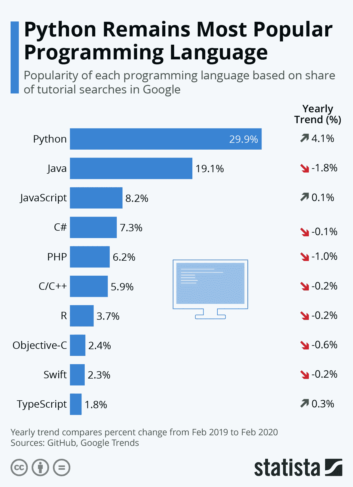

# 编写高效的 Python 代码—第 1 部分

> 原文：<https://medium.datadriveninvestor.com/writing-efficient-python-code-part-1-e02763632080?source=collection_archive---------7----------------------->


Pic credits : Pinterest

Python 是科技界最流行、使用最广泛的编程语言之一。

# 其他一些最好的系列—

> [**三十天的机器学习 Ops**](https://medium.com/coders-mojo/day-1-of-30-days-of-machine-learning-ops-7c299e4b09be?sk=4ab48350a5c359fc157109e48b1d738f)
> 
> [**30 天自然语言处理(NLP)系列**](https://medium.com/coders-mojo/quick-recap-30-days-of-natural-language-processing-nlp-with-projects-series-ceb674e3c09b?sk=ca09b27b3d5867f23ab4dc367b6c0c32)
> 
> [**30 天数据工程与项目系列**](https://medium.com/coders-mojo/day-1-of-30-days-of-data-engineering-894822fcb128?sk=76ba558bfe2d9f85cbe741e505295531)
> 
> [**数据科学与机器学习研究(论文)简体**](https://medium.com/coders-mojo/day-1-data-science-and-ml-research-papers-simplified-a68b00a3b1c4?sk=56136229ff738bd734f19d2b6953f78c) ******
> 
> [**60 天数据科学与 ML 系列带项目**](https://medium.com/coders-mojo/day-1-day-60-quick-recap-of-60-days-of-data-science-and-ml-6fc021643d1?sk=4e75e043b7630a9f963562ebac94e129)
> 
> [**100 天:你的数据科学与机器学习学位系列与项目**](https://medium.com/coders-mojo/100-days-your-data-science-and-ml-degree-part-3-c621ecfdf711?sk=1a8c7b0c204d73432d56b7d1a3a26474)
> 
> [**你应该知道的 23 个数据科学技巧**](https://ai.plainenglish.io/23-data-science-techniques-you-should-know-61bc2c9d1b3a?sk=1680c36193eb22198974c9008d62a33c)
> 
> [**技术面试系列—编码问题精选清单**](https://medium.com/coders-mojo/mega-post-tech-interview-the-only-list-of-questions-you-need-to-practice-ee349ea197bb?sk=fac3614684daff4b50a70c0a71e4d528)
> 
> [**用最热门的问题系列**](https://medium.com/coders-mojo/system-design-made-easy-quick-recap-of-complete-system-design-34af7e3aedfb?sk=bdd6a19edc1f3ce4a5064923f5b68721) 完成系统设计
> 
> [**用项目**](https://medium.com/coders-mojo/complete-data-preprocessing-and-data-visualization-with-projects-mega-compilation-part-2-41584ef0920e?sk=842390da51689b8d43148c3980570db0) 完成数据可视化和预处理系列
> 
> [**完成 Python 系列与项目**](https://medium.com/coders-mojo/complete-python-and-projects-mega-compilation-7ec8f7adfe71?sk=ee0ecf43f23c6dd44dd35d984b3e5df4)
> 
> [**完成高级 Python 系列与项目**](https://medium.com/coders-mojo/complete-advanced-python-with-projects-mega-compilation-part-6-729c1826032b?sk=7faffe20f8039fa57099f7a372b6d665)
> 
> [**Kaggle 最会教你的笔记本**](https://medium.com/coders-mojo/my-list-of-kaggle-best-notebooks-topic-wise-data-science-and-machine-learning-part-2-84772863e9ae?sk=5ed02e419854a6c11add3ddc1e52947f)
> 
> [**Git 完整开发者指南**](/the-complete-developers-guide-to-git-6a23125996e1?sk=e30479bbe713930ea93018e1a46d9185)
> 
> [**打赏 Github Repos**](https://medium.com/coders-mojo/6-exceptional-github-repos-for-all-developers-part-1-21e8fa04e150?sk=9140b249af6fe73d45717185fad48962) **—第一部**
> 
> [**打赏 Github Repos**](https://medium.com/coders-mojo/6-exceptional-github-repos-for-all-developers-part-2-3eec9a68c31c?sk=8e31d0eb7eb1d2d0bbbcecaa66bd4e7e) **—第二部**
> 
> [**所有数据科学和机器学习资源**](/best-resources-for-data-science-and-machine-learning-full-list-5ceb9a2791bf?sk=cf85b2cef95560c58509877a794577ff)
> 
> [**210 机器学习项目**](/210-machine-learning-projects-with-source-code-that-you-can-build-today-721b035649e0?sk=da5f593572a0261a6314afad99a0356c)

## 科技时事通讯—

> 如果你感兴趣，你可以加入我的时事通讯，通过它我向超过 30，000 名读者发送技术面试技巧，技术，模式，黑客——软件开发，ML，数据科学，创业公司和技术项目。可以订阅 **Tech Brew :**

[](https://naina0405.substack.com/) [## 点火器

### 数据科学，人工智能，人工智能和更多…点击阅读由 Naina Chaturvedi 撰写的 Ignito，子堆栈出版物。推出 7 个月…

naina0405.substack.com](https://naina0405.substack.com/) 

## Github —

[](https://github.com/Coder-World04) [## 编码器-world 04-概述

### 此时您不能执行该操作。您已使用另一个标签页或窗口登录。您已在另一个选项卡中注销，或者…

github.com](https://github.com/Coder-World04) [](https://naina0412.medium.com/writing-efficient-python-code-part-2-4bf876712677) [## 编写高效的 Python 代码—第 2 部分

### 使用这些技巧和技术…

naina0412.medium.com](https://naina0412.medium.com/writing-efficient-python-code-part-2-4bf876712677) 

Image credits: Statista

[](https://medium.com/datadriveninvestor/stack-overflow-analyzed-data-from-60-000-software-developers-hours-they-work-languages-they-476ac6ca0197) [## Stack Overflow 分析了来自 60，000 多名软件开发人员的数据，包括他们的工作时间、语言…

### 以下是他们的发现…

medium.com](https://medium.com/datadriveninvestor/stack-overflow-analyzed-data-from-60-000-software-developers-hours-they-work-languages-they-476ac6ca0197) 

尽管了解 Python 的不同结构很重要，但用 Python 编写高效的代码是最受欢迎的技能之一。

[](https://medium.com/python-in-plain-english/python-iterators-generators-and-decorators-made-easy-659cae26054f) [## Python 迭代器、生成器和装饰器变得简单

### 快速实施指南

medium.com](https://medium.com/python-in-plain-english/python-iterators-generators-and-decorators-made-easy-659cae26054f) 

这是编写高效 Python 代码系列的第 1 部分，我将介绍如何编写高效的代码(以及实现代码片段)

[](https://naina0412.medium.com/analyzing-video-using-python-opencv-and-numpy-5471cab200c4) [## 使用 Python、OpenCV 和 NumPy 分析视频

### 通过代码实现…

naina0412.medium.com](https://naina0412.medium.com/analyzing-video-using-python-opencv-and-numpy-5471cab200c4) 

**让我们开始吧—**

# 1.列举

很多时候，我们需要对迭代进行计数。Python 的 enumerate 接受一个集合，即 iterable，向其添加计数器，并将其作为 enumerate 对象返回。

语法—

```
enumerate(iterable, start=0)
```

它给出的结果是—

1.**伯爵**

2.当前索引处项目的**值**

**实施—**

```
countries = ['usa', 'aus', 'singapore']
enumerate_countries = enumerate(countries)#default counter starts with value 
enumerate_countries = enumerate(countries, 5)print(list(enumerate_countries))
print(type(enumerate_countries))
```

**输出—**

```
[(5, 'usa'), (6, 'aus'), (7, 'singapore')]
<class 'enumerate'>
```

[](/introduction-to-statistics-in-python-part-1-14e69ef05abe) [## Python 中的统计简介—第 1 部分

### 统计很容易…真的吗？

medium.datadriveninvestor.com](/introduction-to-statistics-in-python-part-1-14e69ef05abe) 

**实施 2 —**

```
countries = ['usa', 'aus', 'singapore']
for i, item in enumerate(countries):
  print(i, item)
```

[](https://naina0412.medium.com/6-exceptional-github-repos-for-all-developers-part-2-3eec9a68c31c) [## 6 面向所有开发者的特殊 GitHub 回购—第二部分

### 把它加入书签…它会给你很大的帮助

naina0412.medium.com](https://naina0412.medium.com/6-exceptional-github-repos-for-all-developers-part-2-3eec9a68c31c) 

**输出—**

```
0 usa
1 aus
2 singapore
```

[](https://medium.com/datadriveninvestor/underscores-in-python-5b3a1bb6c75e) [## Python 中的下划线(_)

### 如何在您的代码中使用它们…

medium.com](https://medium.com/datadriveninvestor/underscores-in-python-5b3a1bb6c75e) 

# 2.地图

Map 允许您处理和转换 iterables 或 collections 的项目，而无需使用 *for 循环*。在 Python 中，map()函数将给定的函数应用于给定的可迭代结构(即列表、元组等)的每一项，并返回一个 map 对象。

# 语法—

*映射(函数，可迭代)*

## 实施 1 —

```
numbers = (100, 200, 300)
result = map(lambda x: x+x, numbers)
total = list(result)
print(total)
```

## 输出—

```
[200, 400, 600]
```

[](https://medium.com/coders-mojo/6-exceptional-github-repos-for-all-developers-part-1-21e8fa04e150) [## 6 面向所有开发者的特殊 GitHub 回购—第 1 部分

### 把它加入书签…它会给你很大的帮助

medium.com](https://medium.com/coders-mojo/6-exceptional-github-repos-for-all-developers-part-1-21e8fa04e150) 

## 实施 2 —

```
list_one = ['Tuesday', 'Friday', 'Saturday','Sunday','Monday']

t = list(map(list, list_one)) 
print(t)
```

## 输出—

```
[['T', 'u', 'e', 's', 'd', 'a', 'y'], ['F', 'r', 'i', 'd', 'a', 'y'], ['S', 'a', 't', 'u', 'r', 'd', 'a', 'y'], ['S', 'u', 'n', 'd', 'a', 'y'], ['M', 'o', 'n', 'd', 'a', 'y']]
```

# 3.NumPy 数组

NumPy 数组是同构的，为 Python 列表提供了一种快速且高效的内存替代方式。NumPy 数组向量化技术，对操作进行向量化，以便同时对对象的所有元素执行操作，这使得程序员可以高效地对整个数组执行计算。不仅仅是广播有帮助，NumPy 数组有一种非常有效的技术叫做布尔索引。

## 实施—

```
import numpy as npdef reciprocals(values):
    output = np.empty(len(values))
    for i in range(len(values)):
        output[i] = 1.0 / values[i]
    return output

values = np.random.randint(1, 15, size=6)
reciprocals(values)
```

[](https://medium.com/datadriveninvestor/advanced-python-made-easy-part-1-ce1e2f17431e) [## 高级 Python 变得简单—第 1 部分

### 使用这些技巧和技术…

medium.com](https://medium.com/datadriveninvestor/advanced-python-made-easy-part-1-ce1e2f17431e) 

# 4.（听力或阅读）理解测试

理解在 Python 中非常流行。你一定听说过列表理解(Python 2.0)。Python 中的理解是允许从其他序列构建序列的构造，虽然列表理解非常流行/常用，但 Python 3.0 引入了字典和集合理解。

## 实施—

```
#Examplelist_one=[15,20,25, 30,40,50,60]
new_list=[]
for x in list_one:
    new_list.append(x**3)
print(new_list)
```

## 输出—

```
[3375, 8000, 15625, 27000, 64000, 125000, 216000]
```

## 用列表理解—

```
list_two=[5,10,15,20,20,40,50,60]
new_list=[x**3 for x in list_two]
print(new_list)
```

## 输出—

```
[125, 1000, 3375, 8000, 8000, 64000, 125000, 216000]
```

## 有条件的—

```
#With condition
list_three=[13,20,25,45,55,65,75,85,95]
new_list=[x**3 for x in list_three if x%2==0]
print(new_list)
```

## 输出—

```
[8000]
```

## 词典理解

```
dict_one=[1,2,3,4]
new_dict={x: x**2 for x in dict_one if x%2==0}
print(new_dict)
```

输出—

```
{1: 1, 2: 4, 3: 9, 4: 16}
```

[](https://medium.com/datadriveninvestor/3-books-for-learning-python-for-data-science-and-machine-learning-4a996ac3bdcb) [## 3 本学习 Python 的书籍，用于数据科学和机器学习

### 免费获取它们…

medium.com](https://medium.com/datadriveninvestor/3-books-for-learning-python-for-data-science-and-machine-learning-4a996ac3bdcb) 

# 5.检查运行时

当你面前有不同的代码，基本上都实现了相同的东西，那么运行时比较就变得很重要，因为它允许我们选择具有最佳性能的代码。

在 python 中，你可以使用神奇的命令，例如 *%timeit* ，它提供了时间统计的平均值，即 *%timeit* 的输出/结果提供了时间的平均值和标准差(std)。

**实施—**

```
%timeit range(100)
```

**输出—**

```
191 ns ± 8.5 ns per loop (mean ± std. dev. of 7 runs, 10000000 loops each)
```

**实施 2 —**

```
%timeit ('x = 3; L = [x ** n for n in range(20)]')
```

**输出—**

```
8.06 ns ± 0.16 ns per loop (mean ± std. dev. of 7 runs, 100000000 loops each)
```

**这里有一些写高效 Python 代码的技巧:**

1.  ***使用内置函数:*** *Python 有很多内置函数和数据结构，可以用来执行常见的任务。尽可能使用这些函数，因为它们通常比等效的自定义代码要快得多。*
2.  ***避免使用全局变量:*** *全局变量会降低你的代码速度，因为它们需要更多的内存，并且会引入潜在的命名冲突。相反，尽可能使用局部变量。*
3.  ***使用列表理解:*** *列表理解是一种从现有列表创建新列表的简洁而有效的方法。它们比使用循环更快，而且可读性更好。*
4.  ***使用生成器:*** *生成器可以让你迭代一个大型数据集，而不必一次将所有数据加载到内存中。这可以大大提高代码的效率。*
5.  ***避免不必要的函数调用:*** *函数调用在时间上是很昂贵的，所以尽量减少调用次数。使用内存化或缓存技术来存储昂贵的函数调用的结果，以便以后可以重用它们。*
6.  ***避免不必要的循环:*** *循环会很慢，所以尽量想办法避免使用。例如，您可以使用矢量化运算而不是循环来对数组执行计算。*
7.  ***使用正确的数据结构:*** *为您的任务选择合适的数据结构，因为不同的数据结构具有不同的性能特征。例如，对于查找来说，字典比列表快，但是对于遍历所有元素来说，字典慢。*
8.  ***剖析你的代码:*** *使用* `*cProfile*` *或* `*profile*` *模块来识别你的代码中哪些部分运行缓慢。这将帮助您识别瓶颈并做出改进。*

# 所有完整的系统设计系列零件—

> [***1。系统设计基础知识***](https://medium.com/coders-mojo/complete-system-design-series-part-1-45bf9c8654bc)
> 
> [***2。水平和垂直缩放***](https://medium.com/coders-mojo/complete-system-design-series-part-2-922f45f2faaf)
> 
> [***3。负载平衡和消息队列***](https://medium.com/coders-mojo/part-3-complete-system-design-series-e1362baa8a4c)
> 
> [***4。高层设计和低层设计、一致散列、单片和微服务架构***](https://medium.com/coders-mojo/part-4-complete-system-design-series-138bc9fbcfc0)
> 
> [***5。缓存、索引、代理***](https://medium.com/coders-mojo/part-5-complete-system-design-series-4b9b04f23608)
> 
> [***⑥。联网、浏览器如何工作、内容网络交付(CDN)***](https://medium.com/coders-mojo/part-6-complete-system-design-series-59a2d8bbf1ed)
> 
> [***7。数据库分片、CAP 定理、数据库模式设计***](https://medium.com/coders-mojo/part-7-complete-system-design-series-1bef528923d6)
> 
> [***8。并发、API、组件+ OOP +抽象***](https://medium.com/coders-mojo/part-8-complete-system-design-series-57bc88433c8e)
> 
> [***9。***](https://medium.com/coders-mojo/part-9-complete-system-design-series-df975c85ec51) 估算与计划、绩效
> 
> ***10。*** [***地图减少，模式和微服务***](https://medium.com/coders-mojo/part-10-complete-system-design-series-523b4dd978bf?sk=741f92929c8639a2e4cf218521e8cc4a)
> 
> ***11。***[***SQL vs NoSQL***](https://naina0412.medium.com/part-11-complete-system-design-series-9c8efbc0237a?sk=5bddf2adc78ea4947ae88ab21c94af1c)
> 
> [***12。最受欢迎的系统设计问题***](https://medium.com/coders-mojo/most-popular-system-design-questions-mega-compilation-45218129fe26)

# Github —

 [## Complete-System-Design/readme . MD at main Coder-world 04/Complete-System-Design

### 这个存储库包含了精通系统设计主题所需的一切，您应该了解系统…

github.com](https://github.com/Coder-World04/Complete-System-Design/blob/main/README.md) 

*感谢阅读。继续编码*

***第二部即将上映***

**访问专家视图—** [**订阅 DDI 英特尔**](https://datadriveninvestor.com/ddi-intel)

# 想看程序员幽默？

[](https://medium.com/datadriveninvestor/programming-humor-part-2-f92cf5a26f2b) [## 编程幽默第 2 部分

### 继续笑，因为太搞笑了…

medium.com](https://medium.com/datadriveninvestor/programming-humor-part-2-f92cf5a26f2b) [](https://medium.com/datadriveninvestor/the-most-hilarious-code-comments-ever-bae3cb1030b5) [## 史上最搞笑的代码注释

### 程序员幽默:是的，实际上是程序员写的！

medium.com](https://medium.com/datadriveninvestor/the-most-hilarious-code-comments-ever-bae3cb1030b5) [](https://medium.com/datadriveninvestor/coding-sins-hilarious-developer-confessions-f55eb342454e) [## 编码原罪:令人捧腹的开发者自白

### “白板”是如何被嘲笑的

medium.com](https://medium.com/datadriveninvestor/coding-sins-hilarious-developer-confessions-f55eb342454e) [](https://medium.com/datadriveninvestor/10-witty-programming-jokes-that-will-make-you-go-rofl-a53fbfb91943) [## 10 个让你着迷的诙谐编程笑话

### 这些太搞笑了…

medium.com](https://medium.com/datadriveninvestor/10-witty-programming-jokes-that-will-make-you-go-rofl-a53fbfb91943) [](https://medium.com/datadriveninvestor/programming-horror-and-humor-part-3-a0bdea3f56f4) [## 编程恐怖和幽默第 3 部分

### 继续笑，因为太搞笑了…

medium.com](https://medium.com/datadriveninvestor/programming-horror-and-humor-part-3-a0bdea3f56f4) 

# 推荐文章-

[](https://medium.com/datadriveninvestor/hacker-earth-surveyed-16000-developers-from-76-countries-heres-what-i-found-dbd5d7c422b0) [## 黑客地球调查了来自 76 个国家的 16000 名开发者——以下是我的发现

### 惊人的洞察力…

medium.com](https://medium.com/datadriveninvestor/hacker-earth-surveyed-16000-developers-from-76-countries-heres-what-i-found-dbd5d7c422b0) [](https://medium.com/python-in-plain-english/python-iterators-generators-and-decorators-made-easy-659cae26054f) [## Python 迭代器、生成器和装饰器变得简单

### 快速实施指南

medium.com](https://medium.com/python-in-plain-english/python-iterators-generators-and-decorators-made-easy-659cae26054f) [](https://medium.com/ai-in-plain-english/23-data-science-techniques-you-should-know-61bc2c9d1b3a) [## 你应该知道的 23 种数据科学技术！

### 使用这些技巧来节省你的宝贵时间

medium.com](https://medium.com/ai-in-plain-english/23-data-science-techniques-you-should-know-61bc2c9d1b3a) [](https://medium.com/datadriveninvestor/coding-sins-hilarious-developer-confessions-f55eb342454e) [## 编码原罪:令人捧腹的开发者自白

### “白板”是如何被嘲笑的

medium.com](https://medium.com/datadriveninvestor/coding-sins-hilarious-developer-confessions-f55eb342454e) [](https://medium.com/datadriveninvestor/5-cool-advanced-pandas-techniques-for-data-scientists-c5a59ae0625d) [## 面向数据科学家的 5 项酷炫先进熊猫技术

### 使用这些技巧…

medium.com](https://medium.com/datadriveninvestor/5-cool-advanced-pandas-techniques-for-data-scientists-c5a59ae0625d) [](https://medium.com/datadriveninvestor/stack-overflow-analyzed-data-from-60-000-software-developers-hours-they-work-languages-they-476ac6ca0197) [## Stack Overflow 分析了来自 60，000 多名软件开发人员的数据，包括他们的工作时间、语言…

### 以下是他们的发现…

medium.com](https://medium.com/datadriveninvestor/stack-overflow-analyzed-data-from-60-000-software-developers-hours-they-work-languages-they-476ac6ca0197) [](https://medium.com/datadriveninvestor/advanced-python-made-easy-part-4-a4996ba9fe19) [## 高级 Python 变得简单—第 4 部分

### 使用这些技巧和技术…

medium.com](https://medium.com/datadriveninvestor/advanced-python-made-easy-part-4-a4996ba9fe19) [](https://medium.com/datadriveninvestor/advanced-python-made-easy-part-1-ce1e2f17431e) [## 高级 Python 变得简单—第 1 部分

### 使用这些技巧和技术…

medium.com](https://medium.com/datadriveninvestor/advanced-python-made-easy-part-1-ce1e2f17431e)