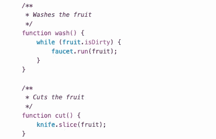

# 编写简单的代码很复杂——下面是如何做的

> 原文：<https://medium.datadriveninvestor.com/writing-simple-code-is-complicated-heres-how-to-do-it-b08ed884a67?source=collection_archive---------3----------------------->

我要坦白一件事。当我刚开始我的职业生涯时，我的印象是代码越复杂越长，开发人员就必须越熟练。十几行代码怎么能和做同样事情的几百行代码竞争呢？后者显然做得更多，意味着它必须做得更好。

在我职业生涯的几年里，我遇到了一个程序员同事，他无疑在编码方面非常出色。他已经记住了整个框架的文档，他使用的技术比我们在我们的平台上使用的技术要先进得多，而且他总是通过在任何地方应用正则表达式来展示他对正则表达式的热爱。他被录用了，并接受了一个简单的项目——通过添加一个微小的新特性来更新现有的代码。这最多是两天的工作量。大约三个星期后，他终于交付了他的代码，与它所取代的简单版本相比，它更像是一个专利申请。结果是代码过于复杂，错误百出，更难维护，更难更新，性能更慢，最终被清除。

 [## 2019 年最值得学习的编码语言|数据驱动的投资者

### 在我读大学的那几年，我跳过了很多次夜游去学习 Java，希望有一天它能帮助我在…

www.datadriveninvestor.com](https://www.datadriveninvestor.com/2019/02/21/best-coding-languages-to-learn-in-2019/) 

就在那时，我的信念开始转变，我开始考虑也许更简单的代码可能是更好的方法。随着 iPod 和 iPhone 的推出，我们已经经历了类似的硬件转变，取代了它们的前辈:多按钮 mp3 播放器和每个人都熟悉的手机。起初，将这种简单的概念应用于软件似乎是一个可怕的想法，尤其是在那个时候，大多数在网上和书中找到的代码都过于复杂。

在接下来的十年里，我专注于编写干净、简单的代码，几乎任何人都可以阅读和理解。突然，编码又开始点燃快乐的火花。我显然不是一个人在努力。我开始遇到许多志同道合的开发人员，他们编写了精彩的代码，不包含任何功能，读起来和理解起来都很愉快。我最喜欢的例子是在 PHP 社区中，框架 Laravel 利用了 Symfony 的一些令人惊叹的工作，创建了一个漂亮的新框架，它既优雅又强大。机器友好的方法名不见了，取而代之的是更像人类的语言。

这里有一些技巧，你可以马上使用，帮助你避免编写复杂的代码，使维护成为一种乐趣。

## **分解问题**

实际上，编写简单的代码比编写复杂的代码要困难得多。很容易在一个问题上停滞不前，修改它直到它正常工作，然后继续下一个问题。然而，花额外的时间来简化它并不总是显而易见的。你到底是如何把一个从根本上复杂的问题简单化的呢？第一步是把问题分解成容易处理的部分。

有一个流行的编程原则叫做单一责任原则(SRP)。这个想法是，一个方法或类应该只负责一件事情。例如，一个方法不应该检索一个水果，清洗它，削它，切它，装盘，吃它。相反，应该有一个 main 方法来分别调用这些操作中的每一个。这些方法应该有容易理解的名字——例如 get、wash、peel、cut、plate、eat。当有人看到 fruit->wash()时，不用深入研究代码就很容易理解发生了什么。

现在你知道 SRP 规则了，我告诉你一个小秘密，违反规则没关系。偶尔多做一点的方法是完全可以接受的——有时这只是更干净、更好的方法。只要你不滥用，编码大神不会惩罚你。

## **开始清洁，并保持清洁**

人们很容易被诱惑以一种草率的方式编码，只是为了“让它工作”，然后试图在以后清理它。以我的经验，那更费时间。令人惊讶的是，从清洁开始并保持清洁会更容易、更快。在上面的水果场景中，我的方法是创建一个主处理程序方法，比如说 consume，并计算出为了吃水果“consume”需要采取的所有步骤。然后，我会用简单的英语将每个步骤写成注释(以记录我需要做的事情)，并通过编写相应的方法一个接一个地划掉它们。

顺便说一下，这是一个做一些测试驱动开发(TDD)的好机会。由于每个方法都将做一件事情，并且我们已经准确地定义了那一件事情是什么，我们可以对每个方法进行编码，并在进行过程中为它们编写测试。突然间，我们的代码已经干净地开始了，并且已经过充分的测试。没有必要回去，重构我们的代码，并在这个过程中，打破东西了。

## **给事物命名很难，但却至关重要**

给事物命名是困难的。在上面的例子中，我提到从干净开始是明智的。这也包括正确命名变量、类和方法。避免缩写名称。写完整的变量名，你的编辑器会自动补全它们，这会让你的代码更容易理解。我知道在迭代器中使用一个名为" I "的变量很诱人，但是最终会发生的是，如果你在一个循环中有一个循环，你最终会使用名为" I "，" j "，" n "等等的变量，突然之间，你的代码变得难以阅读。

我的另一个经验法则是方法名不要超过三个单词。为什么？因为如果你需要三个以上的单词，那么你的方法可能做得太多了。当然，也可以有例外，但这正是它们应该有的，例外。

我的最后一个建议是保持一致性。假设在整个应用程序中，您都有创建、更新和删除记录的方法，并尝试使用相同的命名约定。如果您使用不同的词来表示相同的操作，例如，“创建”、“添加”、“插入”来添加新记录，那么就很难记住哪一个是哪一个，并且您会因为必须查找它们而在编码时失去思路。在你决定一个名字之前，检查你的框架，看看它是否已经遵循了一个命名约定，如果可能的话，遵守那些标准。

This is easy to understand without knowing the details

## **RTFM —阅读……神奇的手册**

这里有一个剧透，你在职业生涯中将要写的大部分代码之前已经写好了。编程语言和框架附带了一系列助手，让您的生活更加轻松。例如，下一次你需要操作一个字符串或数组时，看一下文档，很可能有一段代码可以让你非常接近最终目标。您不仅不必自己编写代码，而且助手已经过测试，可以处理您可能想不到的边缘情况。这可以消除代码中的混乱，保持整洁。

这里有一个专业提示，如果你正在阅读文档，但你仍然不完全确定如何使用助手，看看测试套件。测试套件应该向您展示使用特定方法的所有方式。如果需要，深入源代码，自己找出答案。

此外，许多语言和框架允许您包含其他人编写的包。请随意使用其他人的包，而不是编写自己的包，特别是如果这个包得到了很好的维护、记录和测试。这不仅会加快你的开发时间，而且会保持你的代码整洁，你现在有一些组件不用担心了。

## **编码标准**

保持整洁的另一种方法是采用编码标准。没有必要重新发明轮子，自己写。看看框架(或社区)在使用什么，并遵循那个标准。通过使语句和括号完美对齐，通过从一个文件到下一个文件遵循相同的约定，以及通过正确命名所有内容，可以在快速浏览时消除不必要的摩擦。

事实:干净的代码导致更简单的代码。如果你不喜欢严格遵循编码标准，那么下载一个工具来帮你，通常这些工具会在保存时为你格式化代码。即使你已经遵循了标准，你也应该安装一个格式化程序，以防万一。

## **了解解决方案的原因**

有时，你会被一个问题困住，在 StackOverflow 上快速搜索，复制/粘贴解决方案，你的代码突然工作了，于是你继续前进。这是一种可怕的做法。相反，多花几分钟去弄清楚为什么这个解决方案有效。幸运的是，StackOverflow 上的大多数答案已经解释了其中的原因，所以请花时间阅读它。让你的代码工作是一回事，但是如果你知道代码工作的原因和方式，你将处于一个不同的编码水平。当需要重构或修改代码时，你会感谢我的。

## **创建流程图**

不，我不希望你去谷歌最好的流程图应用程序。拿起笔和纸，因为这是你所需要的。不要把每件事都做成流程图，那是浪费时间(除非这是一个要求，那就尽一切办法)。相反，对于过于复杂的问题，创建一个流程图，将问题分解成小块，并绘制出所有可能的路径。有时候，花一点时间进行头脑风暴，从长远来看，会让你节省更多的时间和头痛。这将有助于防止任何不必要的“陷阱”。如果你不确定什么是流程图或者如何写流程图，你可以[阅读我关于它们的文章](https://medium.com/datadriveninvestor/if-you-can-read-parking-signs-then-i-can-teach-you-to-code-a14dd41d8003)。

## **散步**

我的最后一个建议是散步，不，这不是一个专业术语，我的意思是进行一次真正的、身体上的散步。如果你在“区域”中试图调试一个问题或编写一个特别困难的问题，时间比预期的要长，那么是时候起来独自散散步了。这有很多好处，我可以写一整本书。简而言之，站起来走走，你的血液会流动起来，这会让你不那么昏昏欲睡。当你走路时，你会开始思考，即使你不在你的办公桌前看代码，你的大脑会继续在一个新鲜的状态下工作，你可能会想出解决方案。我保证，离开屏幕会创造奇迹的。

目前就这些。如果你有任何其他建议，请在评论中发表，我很想听听你的想法。如果你是干净简单代码的爱好者，或者想阅读更多类似的文章，请鼓掌。

你也可以在 Twitter 上找到我，我的名字是 [@tkaravou](https://twitter.com/tkaravou)