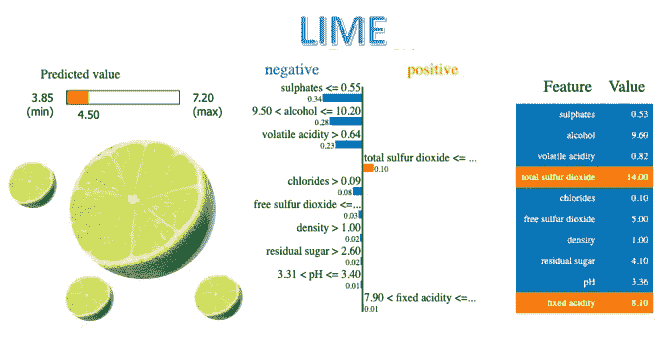
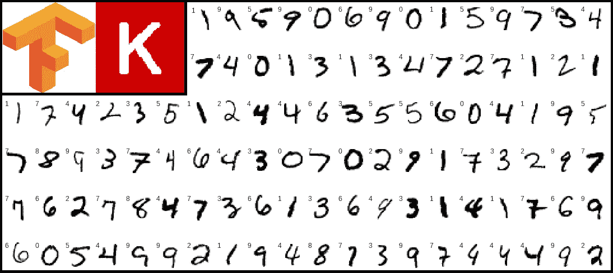
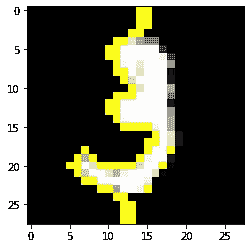

# CNN 模型的基本 XAI 加石灰

> 原文：<https://medium.datadriveninvestor.com/xai-with-lime-for-cnn-models-5560a486578?source=collection_archive---------1----------------------->

在这篇博客中，我们将使用 LIME 来解释为什么使用 keras 训练的基本 MNIST 手写数字分类模型会做出特定的预测。

## 什么是石灰？

LIME，或局部可解释的模型不可知解释，是一种算法，它可以通过用可解释的模型局部地近似它，以忠实的方式解释任何分类器或回归器的预测。它通过调整特征值来修改单个数据样本，并观察对输出产生的影响。它扮演“解释者”的角色，解释来自每个数据样本的预测。LIME 的输出是一组解释，表示每个特征对单个样本预测的贡献，这是局部可解释性的一种形式。下图演示了石灰在回归模型中的应用。



LIME explanation as to why the predicted value is 4.50 for this regression problem

## 构建数字分类器

在 cmd 上使用以下命令安装 tensorflow。首先，确保你已经安装了 *python* 和 *pip* 并设置为环境变量。

```
pip install tensorflow
```

Tensorflow 是深度学习中使用最广泛的框架之一。Keras 现在已经包含在 tensorflow 发行版中，因此您无需单独安装它。Keras 前端有助于降低低级培训的复杂性，是快速建立模型的好地方。

```
import tensorflow as tf
from tensorflow import keras
from tensorflow.keras import layers
from tensorflow.keras.datasets import mnist
```

Keras 将 *mnist* 数据集作为其发行版的一部分，可以使用 *mnist* 模块的 *load_data()* 方法加载该数据集。该方法返回表示为监督学习安排的训练和测试数据的两个元组，因此我们在代码片段中使用了分别表示图像和目标标签的 *x* 和 *y* 。



MNIST handwritten digits dataset of Keras

现在，该方法返回的图像是一维 numpy 向量，每个向量的大小为 784。图像从 u *int8* 到 *float32* 进行排版，并转换为大小为 28x28 的二维矩阵。由于图像是灰度级的，它们的像素值范围从 0 到 255，因此，我们通过除以 255.0 将其标准化。这一步很重要，因为大的数字会增加训练的复杂性，因此建议将它们标准化到 0 到 1 之间。

```
(x_train, y_train), (x_test, y_test) = mnist.load_data()
x_train = x_train.reshape((-1,28,28,1)).astype('float32') / 255.0
x_test = x_test.reshape((-1,28,28,1)).astype('float32') / 255.0
```

由于我们将使用的 lime 模块仅适用于 3-D 图像，即具有 3 个通道的图像，因此我们在此复制灰度平面。下面的代码片段通过复制可用平面将灰度图像转换为 RGB。

```
import numpy as npdef to_rgb(x):
    x_rgb = np.zeros((x.shape[0], 28, 28, 3))
    for i in range(3):
        x_rgb[..., i] = x[..., 0]
    return x_rgbx_train = to_rgb(x_train)
x_test = to_rgb(x_test)
```

这里使用的 keras 的顺序 API 帮助我们快速创建模型，但唯一的缺点是它不是很灵活，即我们可以有一个输入和一个输出，不像 keras 的功能 API，我们可以有多个输入和多个输出。对于我们的例子，顺序 API 是合适的。

让我们创建模型！！！我们正在创建的模型是一个普通的 CNN 模型，它获取一个 3-D 图像并将其传递给一个 *Conv2D* 层，该层有 16 个大小为 3x3 的过滤器，每个过滤器的激活函数为 ReLU。这一层学习卷积滤波器的权重和偏差，直观地充当模型的“眼睛”,并返回特征图，然后将特征图传递给 *MaxPooling2D* ,默认情况下，它具有大小为 2x2 的最大滤波器，它仅减少特征图的维度，并在一定程度上保留感兴趣的区域。

最后，我们展平特征地图，并添加一个完全连接的密集层，这将为我们提供一个大小为 10 的矢量，因为对于 *mnist* 数据集，我们有 10 个从 0 到 9 的目标标签。

```
model = keras.Sequential(
    [
     keras.Input(shape=(28,28,3)),
     layers.Conv2D(16, 3, activation='relu'),
     layers.MaxPooling2D(),
     layers.Flatten(),
     layers.Dense(10)
    ]
)
```

我们使用*SparseCategoricalCrossentropy(from _ logits = True)*因为我们得到了代表 10 个类别的大小为 10 的向量，并且我们希望对其应用 softmax 以得到一个独热编码向量。在这里，Adam optimizer 用于根据实际和预测的一次性向量中的误差来训练模型。该向量应该仅在图像所属的索引=标签处具有 1。

```
model.compile(
  loss=keras.losses.SparseCategoricalCrossentropy(from_logits=True),
  optimizer=keras.optimizers.Adam(),
  metrics=['accuracy']
)
```

使用 *model.fit()* 对 2 个*时期*的基本 CNN 模型进行训练，其中 *batch_size* 为 32，并且在加载 *mnist* 数据时馈入之前分离的验证集。 *Epochs* 是为了训练模型而需要查看整个训练数据的次数，而 *batch_size* 是为了计算一次向前和向后训练的损失而必须考虑的记录数。

```
model.fit(
        x_train, 
        y_train, 
        epochs=2, 
        batch_size=32, 
        validation_data = (x_test, y_test)) Epoch 1/2
1875/1875 [==============================] - 22s 12ms/step - loss: 0.4055 - accuracy: 0.8816 - val_loss: 0.0895 - val_accuracy: 0.9731
Epoch 2/2
1875/1875 [==============================] - 21s 11ms/step - loss: 0.0912 - accuracy: 0.9726 - val_loss: 0.0768 - val_accuracy: 0.9748
```

## 用石灰解释人工智能

我们的模型现在被训练成 97%的训练准确率和 97%的验证准确率，这对于这个演示来说已经足够好了。现在，我们使用 *pip* 安装 python 的 *lime* 模块。

```
pip install lime
```

注意:你也可以在 jupyter 笔记本或 google colab 笔记本上使用！(感叹号)如图所示。

```
!pip install lime

import lime
from lime import lime_image
from skimage.segmentation import mark_boundaries
import matplotlib.pyplot as plt
import random
```

我们的模型已经做好了，是时候用石灰做 XAI 了。使用 *lime* 包的 *lime_image* 模块，我们创建了一个 *LimeImageExplainer* 类的解释器对象。这个对象有一个方法 *explain_instance()* ，它接受三维图像数据和一个预测函数，这里是 *model.predict* ，并根据函数的预测返回一个解释。

解释对象有一个 *get_image_and_mask()* 方法，该方法获取对应于之前解析的 3d 图像数据的预测标签，并返回 *(image，mask)* 元组，其中 *image* 是 3d numpy 数组， *mask* 是 2d numpy 数组，可与*skimage . segmentation . mark _ boundaries*一起使用。带有相应遮罩的返回图像表示图像中负责预测的特征。

```
explainer = lime_image.LimeImageExplainer(random_state=42)
explanation = explainer.explain_instance(
         x_train[10], 
         model.predict
)
plt.imshow(x_train[10])
image, mask = explanation.get_image_and_mask(
         model.predict(
              x_train[10].reshape((1,28,28,3))
         ).argmax(axis=1)[0],
         positive_only=True, 
         hide_rest=False)
plt.imshow(mark_boundaries(image, mask))
```



Image with mask explaining the prediction

我的博客到此结束，我希望它足够全面。有关 python 的 lime 模块的更多信息，请参考[文档](https://lime-ml.readthedocs.io/en/latest/lime.html#module-lime.lime_image)。你可以在这里找到本教程[的代码。](https://github.com/SAH-UJA/Basic-XAI-with-LIME)

如果你觉得这篇文章有用，请继续欣赏，不要忘记喜欢这篇文章，并关注我未来文章的更新。