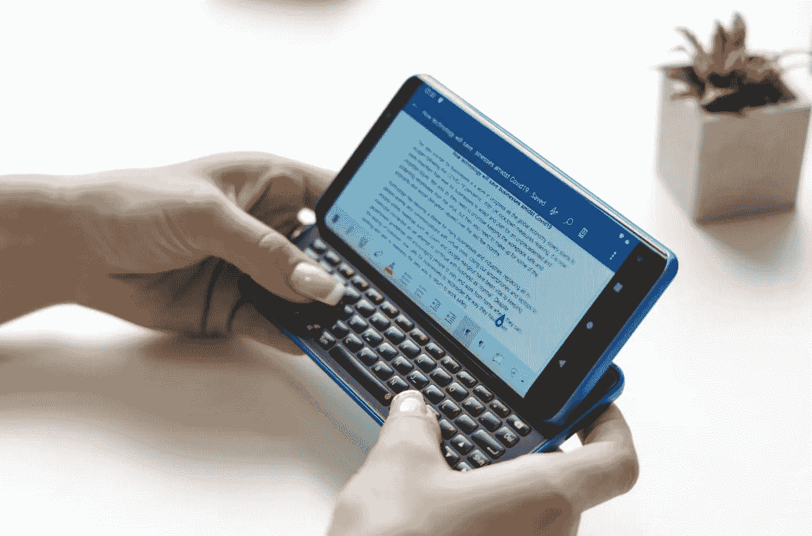
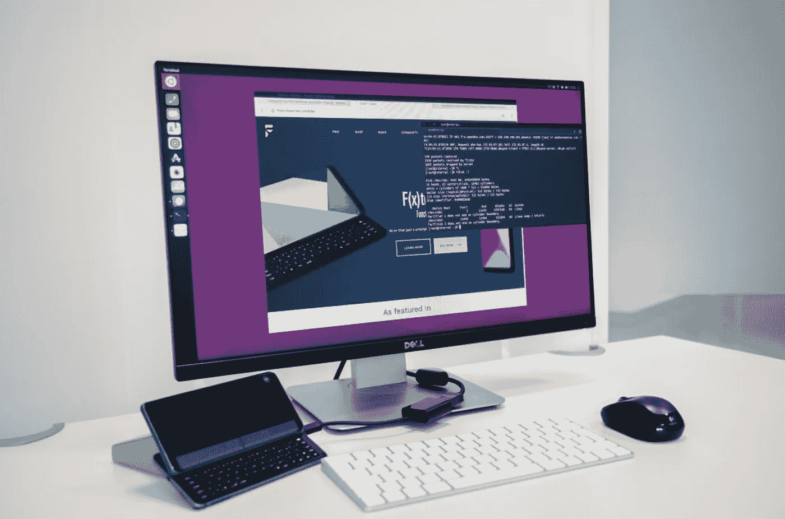
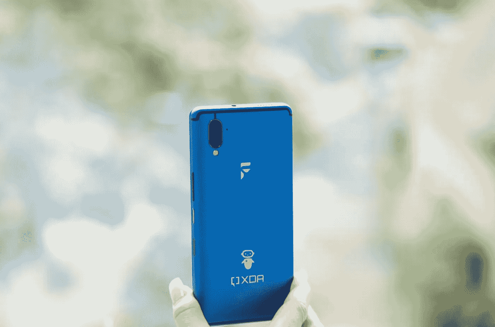

# XDA 帮助 LineageOS 和 Ubuntu 纯粹主义者开发了一款手机

> 原文：<https://medium.datadriveninvestor.com/xda-helped-develop-a-phone-for-lineageos-and-ubuntu-purists-de8e7f9a72b8?source=collection_archive---------18----------------------->

## 它甚至有一个物理键盘！

“Ctrl + C” makes a comeback in 2020\. Source: F(x)tec.

现在，XDA 是安卓扎根和改造的沃土，也是擅长充分利用各种硬件的开发者的家园。他们的过去围绕着 CyanogenMod 和 LineageOS 等 Mod，这些选项为智能手机用户打开了潘多拉的可能性之盒。他们决定与一家拥有同样目标:自由的公司合作，让他们已有的传统经受考验，这是再合适不过的了。这一开端将始于一件遗物的复兴:物理键盘。

手机有一段有趣的物理键盘历史。虽然随着触摸屏的出现，智能手机开始从笨重的同伴中分离出来，但键盘的铁杆支持者仍然坚持不懈，尽管他们处于劣势。尽管是一只被剪掉翅膀的鸟，黑莓拼命地试图用它的 [Priv](https://www.gsmarena.com/blackberry_priv-7587.php) 和 [Key2](https://en.wikipedia.org/wiki/BlackBerry_Key2) 智能手机来重振这个日益减少的群体。称其尝试失败是一种轻描淡写。

即使是新来者也试水，但收效甚微。在 MWC 2019 上，一家总部位于伦敦的名为 F(x)tec 的初创公司展示了其首款带滑盖的手机 [Pro1](https://www.fxtec.com/pro1) 。虽然它引起了共鸣，但它不是管弦乐队。批评家们称赞了这一大胆的举措，但顾客们并没有趋之若鹜。但是，Pro1 为与 XDA 的合作奠定了基础，这个社区也同样关注多功能性和生产力。

Work with your mobile workstation on the go. Source: F(x)tec.

# 成功的关键

在这个前所未有的时代，智能手机使用的迅速增长引发了各种各样的隐私问题，这是 XDA 和 F(x)tec 非常愿意解决的一个痛点。F(x)tec 的 Pro1-X 是第一款开箱即用的智能手机。该操作系统以其流畅的性能和令人眼花缭乱的定制选项而闻名，非常适合那些想要一个不受窥探和隐私问题束缚的 Android 体验的人。LineageOS 17 的权限中心允许用户选择他们想要共享的数据以及他们想要存储在保险库中的数据。

Ubuntu 爱好者也有理由欢呼:Ubuntu Touch OS 的变体也已经上市。尽管即使是最人性化的手机也需要植根于过去，但 XDA 打算打破智能手机新手和无拘无束的定制回报之间的障碍。但是灵活的软件只是拼图的一部分。

F(x)tec 已经有了一个专注于生产力的智能手机设计。Pro1 凭借其触感背光键盘赢得了铁杆键盘粉丝，所以保留它是显而易见的。“Ctrl + C”和“Ctrl + V”卷土重来，你也可以创建自定义快捷键。虽然键盘将手机的重量推至 243 克，厚度为 14 毫米，但这是一个值得其重量的妥协。总的来说，对于过去几年一直处于不相关状态的键盘来说，这是一种相当舒适的回归。

The new Sapphire Blue color option. Source: F(x)tec.

# 功能是关键

在引擎盖下，Pro1-X 没有交换关键位，但它分别将存储容量增加到 256 GB 和 8 GB。如果这还不够，一个 microSD 卡插槽可以让你加入更多。Snapdragon 835 在这一点上是一个三年前的芯片组，因此虽然它不会通过基准测试，但它会通过非密集型的基本任务加速。如果你对 Ubuntu Touch OS 有很大的梦想，我建议你在坐上公共马车之前先看看马力。

6 英寸的双曲面有机发光二极管显示器(18:9，1080p+)处理视觉效果，并用小巧的键盘进行多任务处理。至于端口选择，F(x)tec 的 Pro1-X 用一个支持 HDMI-out 的 USB-C(wow)和一个 3.5 mm 耳机插孔(它是活的！).12MP + 5MP 摄像头设置不是像素的对手，但它会做到这一点。他们甚至在那里添加了一个专用的相机按钮。至于自拍摄像头，你只能用 800 万像素的来凑合了。立体声扬声器，双 SIM 卡支持，3200 毫安时电池，支持高通的快速充电 3.0 和 USB 供电，使规格表更加完整。

尽管采用了现有的设计，但 Pro1-X 的制造成本并不低廉。此外，随着 Sailfish 操作系统和 Windows 支持的出现，它也无意看起来像一部廉价的智能手机。F(x)tec 的 Pro1-X 已经达到了其 IndieGoGo 的目标，但你仍然可以以 599 美元的价格获得提前预订，低于其 899 美元的要价。如果你准备投资一部将灵活性置于原始规格之上的智能手机，请点击链接。与 XDA 合作确保 Pro1-X 不会昙花一现。它将过着不可预见的生活，这种生活是由一个了解它的群体设计的。