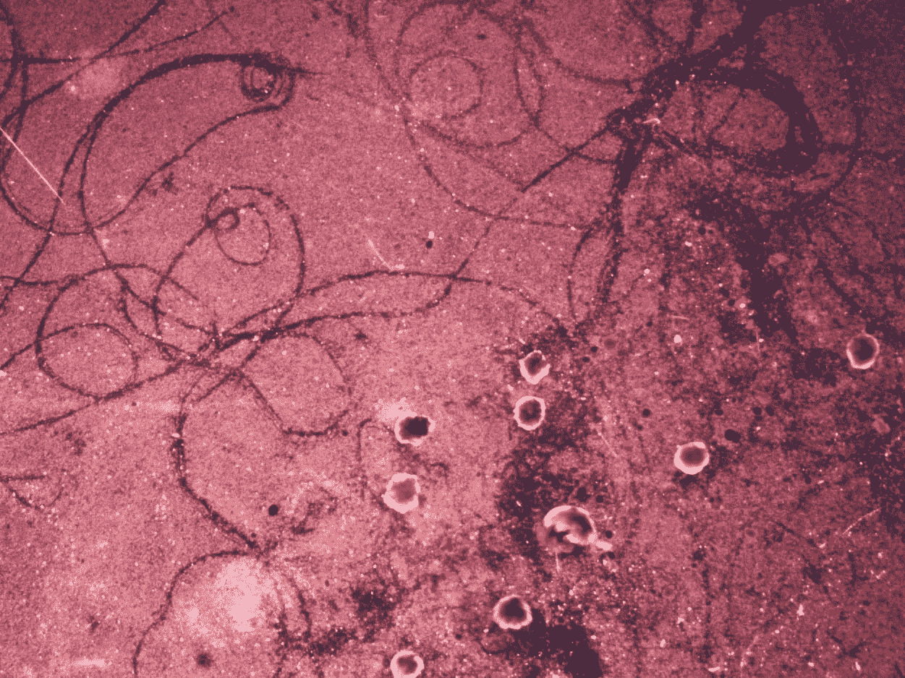
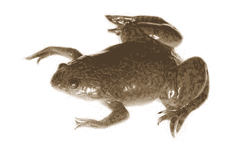
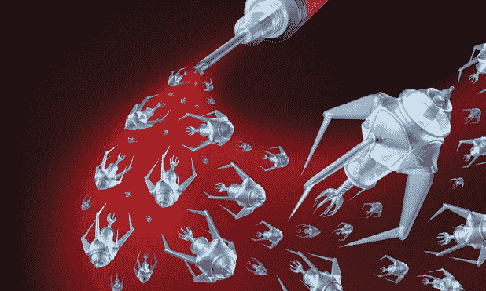
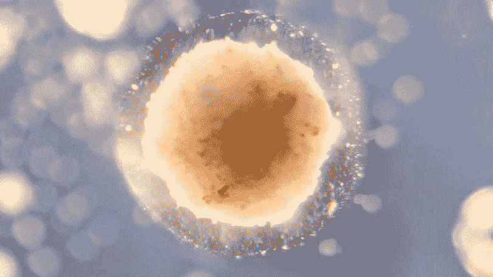
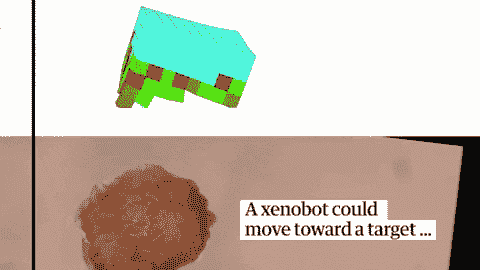
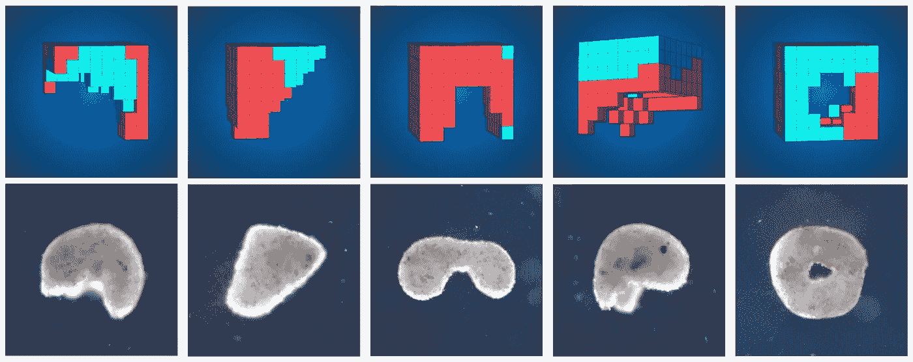
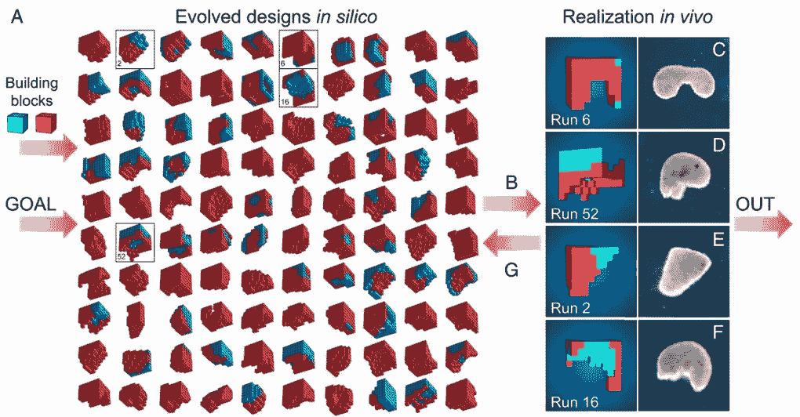
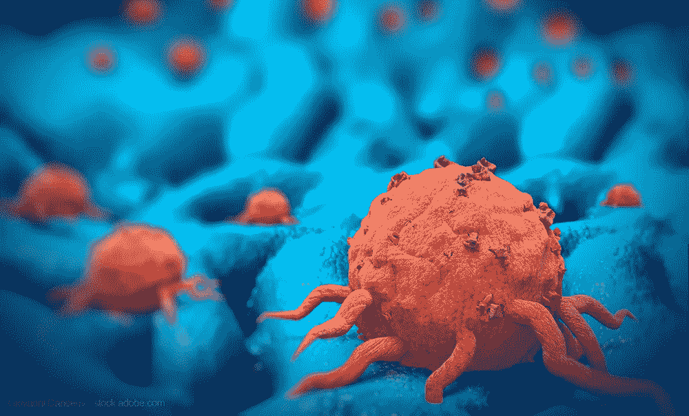
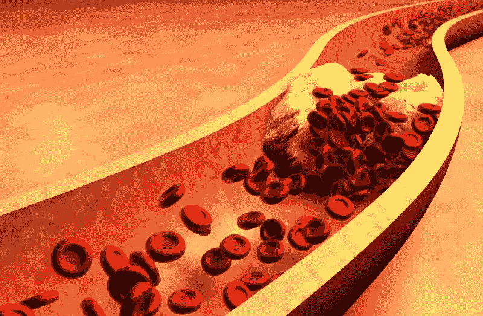
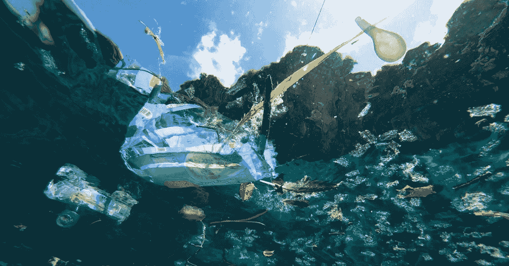

# 异种机器人——活体可编程纳米机器人

> 原文：<https://medium.datadriveninvestor.com/xenobots-living-programmable-nanorobots-5896313f78f5?source=collection_archive---------1----------------------->

## 纳米技术的未来？

Xenobots

纳米机器人是由什么制成的？

金属？软件？微单相机？电容？

不——异种机器人的情况并非如此，世界上第一个活体可编程纳米机器人是由活青蛙( [**异种**非洲爪蟾](https://en.wikipedia.org/wiki/African_clawed_frog))干细胞制成的(因此得名**异种**机器人)。*又名:世界上唯一既是生命又是机器的机器人。*

 [## 模式和机器人:复杂的现实|数据驱动的投资者

### 哈耶克的名著《复杂现象理论》(哈耶克，1964)深入探讨了复杂性的话题，并断言…

www.datadriveninvestor.com](https://www.datadriveninvestor.com/2019/03/04/patterns-and-robotics-a-complex-reality/) 

来自佛蒙特大学的一组计算机科学家和研究人员开创了异种机器人，“第一台活机器”，有可能彻底改变纳米技术。

所以这些研究人员基本上把它变成了:

[**Xeno**pus Laevis](https://en.wikipedia.org/wiki/African_clawed_frog) (Frogs)

变成这样:

Nanorobots

> 生命+机器=异种机器人

嗯，外星机器人可能看起来不完全像上图中的那些纳米机器人——但它们有可能比传统的纳米机器人好得多。

Zoomed in image of a xenobot (size = 650–750 microns, that’s smaller than the head of a pin)

让我们先退后一步，看看活着的外星机器人的构成，以及是什么让它们“可编程”。

# 人生如何才能「可编程」？

异种机器人的两个秘密成分是**青蛙细胞和人工智能。**

用于制造异种机器人的两种特定类型的青蛙细胞是**青蛙的皮肤细胞和青蛙的心脏细胞。**

使用心脏细胞和皮肤细胞是因为它们独特的特性:

*   心脏细胞自然收缩，由心肌细胞组成，自我收缩的细胞使你的心脏无意识地泵血。
*   另一方面，皮肤细胞自然是不动的。

当心脏细胞和皮肤细胞结合在一起时，它们在运动方面获得了功能。“神奇的”部分是，如果心脏细胞和皮肤细胞以一种**特定的配置**组装在一起，那么**它们将能够执行一种特定的功能**。

通过以特定的配置组装心脏细胞和皮肤细胞，研究人员能够构建具有他们想要的功能的异种机器人。

例如，心脏和皮肤细胞的这种特殊配置会给你带来你在下面这张 GIF 中看到的这种运动(向前“行走”的运动)。

蓝绿色块是静止的皮肤细胞，而红色和绿色块是自我收缩的心脏细胞。在上面的配置中组合在一起，xenobot 被编程为向前移动。

伟大的想法是，如果你想以一种特定的方式移动异种机器人，比方说跳上跳下——然后你设计一种心脏细胞和皮肤细胞的特定配置，并以这种特定配置组装它们。这种特定的配置将导致异种机器人按照你希望的方式移动。

研究人员使用超级计算机和人工智能算法制作了数百万个这样的配置，以便找出哪些配置做出了特定的运动。

这些是人工智能算法为“编程”外星机器人以特定方式移动而做出的一些配置:

制作“可编程”异种机器人的过程概述:

1.  定义一个人希望异种机器人展示的特定功能。
2.  使用人工智能算法来设计心脏细胞和皮肤细胞的配置，这些配置将最好地模拟定义的功能/运动。
3.  根据算法设计的配置组合心脏细胞和皮肤细胞。

比方说，研究人员想给异种机器人编程，让它们以之字形移动。为此，他们将对超级计算机进行编程，以设计一种心脏细胞和皮肤细胞的配置，这种配置将给予它们想要的之字形运动。剩下要做的就是按照超级计算机设计的特定配置来组装心脏细胞和皮肤细胞。

这就是为什么这些外星机器人是“可编程的”,并以一种可预测的方式行动。当前一代的异种机器人在死亡前持续了 7-10 天，这对于完成任何实际任务来说时间太短了，但是未来一代的异种机器人是有希望的。

# **异种机器人的应用**

你能想象有一天外星机器人躺在你的身体里寻找疾病吗？*嗯，那离未来不远了。*

异种机器人有很大的潜力来解决从疾病到气候变化等有影响的问题。

**肿瘤切除:**

*   异种机器人的一个有前途的应用包括部署它们从你的大脑、胰腺、肠道以及你能想到的地方移除肿瘤。
*   由金属或塑料制成的传统纳米机器人一旦进入你的身体，就会被检测为“异物”，并受到你的免疫系统的攻击。
*   相比之下，使用异种机器人比传统纳米机器人的优势在于，异种机器人可以由患者自己的细胞制成。由于这些异种机器人是由病人的细胞制成的，这意味着病人的身体不会排斥它们。

Tumor cells

**去除斑块:**

*   异种机器人也有可能被用来疏通你的动脉和去除斑块。

Plaques

**海洋中的塑料污染:**

*   用异种机器人分解海洋中的微塑料怎么样？
*   由于异种机器人由有机细胞材料组成，它们可以自然分解和生物降解，这使它们对环境友好。

Plastics in oceans

未来的异种机器人不仅限于青蛙的心脏和皮肤细胞。如果研究人员用感光细胞制造异种机器人会怎样？这将赋予异种机器人像人类一样的视觉能力，这太疯狂了！

尽管异种机器人充满希望，但使用“活细胞”制造可编程机器人也引发了伦理问题。

# 如果异种机器人获得了意识呢？

研究人员目前了解单细胞如何工作，就像单个心脏细胞如何收缩一样，但当一群细胞聚集在一起时，有时会出现称为“紧急行为”的意想不到的行为。

Consciousness?

单个细胞可能不会表现出任何形式的意识，但是当一群细胞聚集在一起时——意识就出现了。

这些异种机器人并不完美——当研究人员测试它们时，它们有时会表现出紧急行为。研究人员发现的一些紧急行为的例子包括:

*   外星机器人朝着非预期的方向移动。
*   异种机器人被切成两半后自愈。
*   异种机器人成为另一个异种机器人的“朋友”,并和他们一起旅行。

但是，“意识”究竟是什么？我们如何定义“意识”？

这些是社会必须讨论、面对和审视的重要问题，以确保这些技术被善加利用。

然而，异种机器人是一个巨大的突破，也是纳米技术的潜在未来！

# 关键要点:

*   异种机器人是由心脏细胞和皮肤细胞制成的活体纳米机器人。
*   异种机器人的应用前景包括:去除肿瘤或斑块，分解海洋中的微塑料。
*   如果异种机器人因为是由活细胞制成而获得意识呢？解决这些伦理问题很重要。

*如果你喜欢这篇文章，请随意与他人分享，并在*[***LinkedIn***](https://www.linkedin.com/in/joey-mach-6293b1175/?originalSubdomain=ca)***上与我联系！***

✌️·乔伊

Ps: *如果你想跟随一个雄心勃勃的 16 y/o 踏上解决世界上最困难的问题的旅程，请随时订阅我的每月简讯* [*这里*](https://landing.mailerlite.com/webforms/landing/j8c7g3) *(答应我不会给你发垃圾邮件*😁*)。*