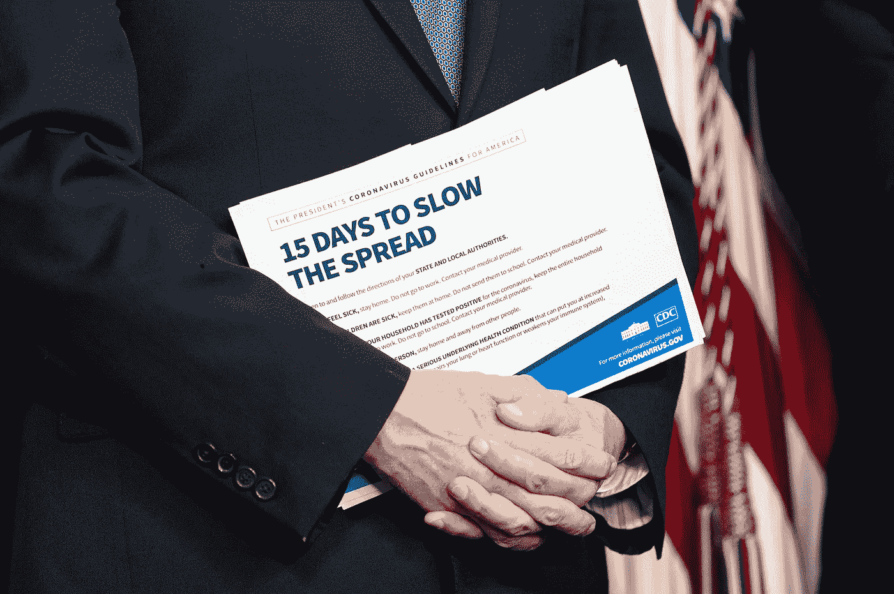

# 是的，经济数据的确很重要:即使是现在

> 原文：<https://medium.datadriveninvestor.com/yes-economic-numbers-do-matter-even-right-now-fb2ff6513b0b?source=collection_archive---------16----------------------->

因为经济数字不仅仅是数字。

Vice President Mike Pence holds a copy of the President’s coronavirus guidelines brochure at a coronavirus (COVID-19) update briefing Monday, March 23, 2020, in the James S. Brady Press Briefing Room of the White House. (Official White House Photo by Joyce N. Boghosian)

[*现在经济数字并不重要。政府必须帮助美国人度过*，](https://www.theguardian.com/commentisfree/2020/mar/28/us-unemployment-coronavirus-gdp)”来自《卫报》的一位作家如是说，毫无疑问，这位作家是在家办公；也许有一个最喜欢的食物或饮料站在手边，宠物在旁边打瞌睡。

如果你的生活状况也同样适应了强制性社交距离的新现实，那么这种情绪很容易引起共鸣。也就是说，不能离开你的房子去工作，去上学，去锻炼，或者与你的直系亲属或室友之外的任何人交往。

你在家工作；给你的杂货送货。你的孩子可能会把你逼入绝境，但你正在努力。

如果你的内阁正在迅速清空，你就很难保持乐观。如果你每天都依赖陌生人的善意来生活。如果你一个人在家。如果你正与酒精或药物成瘾作斗争，患有精神疾病，或者是家庭暴力的众多受害者之一，就更是如此。

 [## 保护主义、政治和经济动荡|数据驱动的投资者

### 美国股市昨日出现 400 多点的大幅反转，为未来的事情发出了警告信号。市场…

www.datadriveninvestor.com](https://www.datadriveninvestor.com/2018/06/28/protectionism-politics-economic-turmoil/) 

作为一个小企业主也是艰难的，因为许多美国人都是如此，而且不得不眼睁睁地看着你努力了几十年建立起来的企业在短短几周内被摧毁。如果你不得不解雇你的员工，他们也是你的朋友，你的邻居，你的家人。

人们总是在帮助别人。但是帮助最终会耗尽，这是不可避免的。没有人的资源是无限的。

甚至联邦政府的资源也不是无限的。

政府行动缓慢，甚至根本没有行动。认为政府有能力让每个人的财务状况恢复健康的想法是可笑和天真的，因为如果疫情没有发生，他们就会这样做。

刺激法案可以通过——而且已经通过了，并承诺会有更多的法案出台；救济措施是可以采取的，也确实如此。

但是没有足够的钱让美国无限期地享用后工业时代的成果，如室内管道和电力，更不用说垃圾收集和其他重要的卫生和公共服务了。

美国政府不能靠花钱来摆脱这场金融危机。

只有重新启动美国的经济引擎，才能拯救我们当中最脆弱的人。这当然不只是华尔街。

在这段艰难的日子里，富人让自己蒙羞。他们让[的五音不全](https://gen.medium.com/celebrities-need-to-read-the-room-right-now-cafa9aab1461)的音乐蒙太奇出现在名人度假区。他们戴着珠宝在一个巨大的浴缸里发表关于阶级特权的严肃演讲。他们[有意压低他们押注的市场，以赚取数十亿美元](https://nypost.com/2020/03/26/the-rich-are-shaming-themselves-in-a-time-of-coronavirus-crisis/)。带一个*“B”。*

重启经济不会让富人更富:**无论如何，富人已经变得更富了。**

在这场疾病爆发以及随之而来的公共生活各个方面的经济瘫痪中，受影响最大的是穷人和被剥夺了权利的人。

道德问题不是生命价值和金钱价值的问题。钱不仅买了餐桌上的食物，还付给了许多把食物放在餐桌上的工人。钱付给那些做没人想做，但我们都想做的工作的人；比如收集垃圾或者在垃圾处理厂工作。

这不仅仅是经济关闭伤害人民和财政不可持续的问题。

任何思考这种强制隔离可能会持续多久的人，社会就是这样，包括仍然酒后驾驶、服用危险药物的人，以及其他许多潜在致命、非法和对社会不负责任的行为，都不是无情、冷漠的资本家试图让你的母亲哭泣。

事实上，社会中有些人比其他人更愿意为他们的邻居和社区做出牺牲，这并不奇怪。

社会中有些人比其他人更有条件做出这样的牺牲，这一事实似乎没有被许多本应更了解的人所察觉。

不是每个人都有为他人牺牲的奢侈:有些人每天都在勉强维持生计。随着世界无限期地停顿，他们也不会过得更好。

那些生活在财务刀刃上，不能在家工作，只能靠三周的零食勉强度日的人正在看着日子一天天过去。不是无聊，也不是在感叹网络上缺少拼图和卫生纸；但伴随着恐惧和越来越大的恐慌。

政府会让一切都好起来的含糊承诺并不能缓解恐慌。

新冠肺炎及其引发的前所未有的全球反应对美国和世界的全面影响可能在一段时间内还不得而知。

毫无疑问，学者们将在未来几年甚至几十年研究这种疾病的爆发以及应对措施。学生们会把它作为一篇又一篇论文的主题。

他们会发现什么？

某个[世界末日场景研究](https://www.realclearpolitics.com/video/2020/03/26/dr_birx_coronavirus_data_doesnt_match_the_doomsday_media_predictions_or_analysis.html) -据报道，该研究导致州和联邦政府机构陷入恐慌，并由作者撤回[-会被发现发挥了作用吗？](https://dailycaller.com/2020/03/26/neil-ferguson-coronavirus-imperial-college-doomsday/)

本周美国有 330 万人申请失业。

是的，如果我们回去工作，人们的生命危在旦夕。

但是如果我们不这样做，他们也会有危险。

(特约撰稿人布鲁克·贝尔)