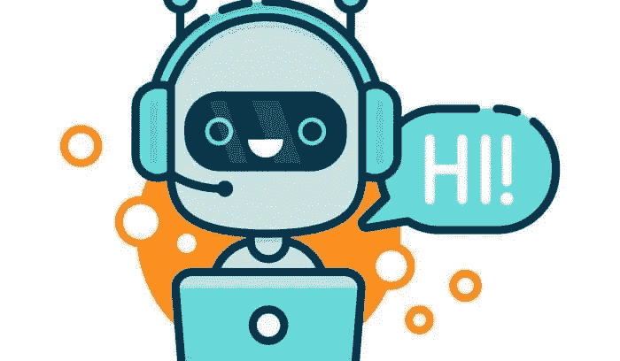

# 是啊！您可以创建自己的语音聊天机器人！

> 原文：<https://medium.datadriveninvestor.com/yes-you-can-create-your-own-chatbot-with-voice-60acf85ed25?source=collection_archive---------6----------------------->



[This image is from here!](https://technologyadvice.com/blog/marketing/chatbots-consumers-want-expect/)

如今，聊天机器人在销售、电子商务、健康公司、餐馆、零售行业等不同领域都非常受欢迎。因为聊天机器人大大缩短了等待时间，它可以同时即时帮助和回答不同消费者的常见问题。此外，它可以帮助公司降低成本，为人民服务。

我们的团队叫做 [Chacha](https://github.com/melanieshi0120/AI_Chatbot_Project) ，这也是我们聊天机器人的名字。我们的目标是为数据科学学生创建一个人工智能聊天机器人。聊天机器人可以回答数据科学学生的常见问题，还可以帮助教师避免多次重复相同的答案。该项目基本包含三个部分——硬编码算法、深度学习部分和接口部分。

在这篇博客中，我将展示一个简单的硬编码聊天机器人，它可以和你说话。

[](https://www.datadriveninvestor.com/2020/02/03/how-an-ai-based-chatbot-can-help-you-form-better-long-term-habits/) [## 基于人工智能的聊天机器人如何帮助你形成更好的长期习惯

### 当我们思考我们的日常行为时，我们经常没有意识到，我们所做的行为占了多大的比例…

www.datadriveninvestor.com](https://www.datadriveninvestor.com/2020/02/03/how-an-ai-based-chatbot-can-help-you-form-better-long-term-habits/) 

# Python 中的代码

首先，你需要先安装一些包。您需要通过终端安装最后一个。

```
*# install packages/libraries first* 
*!pip install pyttsx3*
*!pip install wikipedia*
*!pip install SpeechRecognition*
*!pip install pygame*
*!pip install pyown*
*# conda install pyaudio # please install this via ternimal*
```

然后我们可以导入一些库。

```
import pandas as pd 
import numpy as np 
import time 
from nltk.corpus import stopwords 
import re, string 
import nltk 
import random
import datetime
import webbrowser
import pyttsx3
import wikipedia
from pygame import mixer
import speech_recognition as sr
>>> 
pygame 1.9.6
Hello from the pygame community. [https://www.pygame.org/contribute.html](https://www.pygame.org/contribute.html)
```

然后我们需要设置语速，选择不同的口音和性别。如果你想让聊天机器人用美国口音跟你说话，那就设置*语音[0]，*如果你喜欢英国口音，那就设置*语音[1]。*

```
*# Set up the voice rate, engine*
engine = pyttsx3.init()
voices = engine.getProperty('voices')
engine.setProperty('voice', voices[10].id) 
volume = engine.getProperty('volume')
engine.setProperty('volume', 10.0) 
rate = engine.getProperty('rate')
engine.setProperty('rate', rate - 25) *# you can change the speed*
```

现在，我们已经完成了基础部分，让我们进入下一部分。这一部分主要是关于 NLP 分析，在我以前的博客中，我谈到了如何处理文本数据。我将在这里简单地展示代码，如果你对 NLP 感兴趣，你可以访问我的关于 NLP 的博客。

```
# create the data questions=["what is data science?","why chatbots are important?"]answers=["Data science is an inter-disciplinary field that uses scientific methods, processes, algorithms and systems to extract knowledge and insights from many structural and unstructured data.",
         "Chatbot applications streamline interactions between people and services, enhancing customer experience."]# make sure all the words in following lists are lower case without punctuations.goodbye=["bye","goodbye","see you"]greeting=["how are you","nice to meet you"]thanks=["thanks","thank you"]yourwelcome=["no problem","you are welcome"]
```

是时候用 NLTK 库创建一些函数了。以下代码的步骤是删除标点、标记化、词干化、词汇化和组合函数，这些函数将所有这些函数结合在一起处理文本数据——问题和答案！那些功能是我自己创建的，如果你需要，请随意复制粘贴，但请引用我的名字或这个博客！

```
*# list contains punctuation*
sw_list = list(string.punctuation)
sw_list += ["''", '""', '...', '``', '’', '“', '’', '”', '‘', '‘',"'", '©',
'said',"'s", "also",'one',"n't",'com', '-', '–','--' ,
'—', '_']
sw_set = set(sw_list)

*# tokenization*
**def** process_data(string):
    tokens = nltk.word_tokenize(string) *# tokenization*
    punctuation_removed = [token.lower() **for** token **in** tokens **if** token.lower() **not** **in** sw_set]
    **return** punctuation_removed

*# Stemming*
**from** **nltk.stem** **import** PorterStemmer
ps = PorterStemmer()
*# create a function stemming() and loop through each word in a review*
**def** stemming(string):
    stemmed_string=[]
    **for** w **in** string:
        stemmed_string.append(ps.stem(w))
    **return** stemmed_string

*# import libraries*
**from** **nltk.stem.wordnet** **import** WordNetLemmatizer
lemmatizer = WordNetLemmatizer()

*# create a function  and loop through each word in  a review*
**def** lemmatization(string):
    lemma_list=[]
    **for** word **in** string:
        lemma_word=lemmatizer.lemmatize(word,pos='v') 
        lemma_list.append(lemma_word)
    **return** lemma_list

*# Conbime all functions above and obtian cleaned text data* 
**def** data_preprocessing(text_data):
    *#tokenization, stop words removal, punctuation marks removel*
    processed_string=list(map(process_data,text_data))
    *# stemming*
    stemming_string=list(map(stemming,processed_string))
    *# lemmatization*
    lemma_string=list(map(lemmatization,stemming_string))

    **return** lemma_string
# create a function of NLP for single line
def NLP(text):
    processed_question=process_data(question)
    stemming_question=stemming(processed_question)
    lemma_question=lemmatization(stemming_question)
    return lemma_question
```

在创建了一些有用的函数之后，我们可以简单地使用最后一个函数。我们可以看到，在 NLP 处理之后，每个问题的单词都回到了单词的词根——例如，“is”变成了“be”。

```
*# using the function above to process the data* 
cleaned_questions=data_preprocessing(questions)
cleaned_questions
>>>
[['what', 'be', 'data', 'scienc'], ['whi', 'chatbot', 'be', 'import']]
```

现在是时候创建一个聊天机器人功能了！

```
def chatbot(question):
    if  question.strip().lower() in greeting:
        answer=random.choice(greeting).capitalize()
        return  answer
    elif  question.strip().lower() in goodbye:
        answer=random.choice(goodbye)
        return answer

    elif question.strip().lower() in thankyou:
        answer= random.choice(yourwelcome).capitalize()
        return  answer
    else:
        pro_text=NLP(questions)
        # to find which row has intersection with the words from question you asked
        # which means to find the who have common elements between your question and the data
        inter_list=[]
        for i in cleaned_questions:
            if (set(pro_text) & set(i)):
                inter_list.append((list(set(pro_text) & set(i)),cleaned_questions.index(i)))
        # find the max length of common elements
        lengths=[len(inter_list[i][0]) for i in range(len(inter_list)) ]

        indexes=[]
        if len(lengths)>0:
            max_length=max(lengths)
            # find all the index whose correspondiong question data have the most common elements
            for i in range(len(inter_list)):
                if len(inter_list[i][0])==max_length:
                    indexes.append(inter_list[i][1])
                    answer_index=random.choice(indexes)
                    return answers[answer_index]
                else:
                        return "Sorry I need to learn more!"
        else:
            return "Sorry I need to learn more!"
```

现在我们可以运行聊天机器人了！

```
while(True): 
    question = input("You: ")

    if question.strip().lower() in goodbye:
        answer=random.choice(goodbye)
        print("Chacha: "+answer+"\n")
        engine.say(answer)
        engine.runAndWait()
        break
    else:
        answer=chatbot(question)
        print("Chacha: "+answer+"\n")
        engine.say(answer)
        engine.runAndWait()
>>>
You: hi
Chacha: Hi

You: how are you
Chacha: Hi

You: what is data science?
Chacha: Data science is an inter-disciplinary field that uses scientific methods, processes, algorithms and systems to extract knowledge and insights from many structural and unstructured data.

You: chatbot
Chacha: Chatbot applications streamline interactions between people and services, enhancing customer experience.

You: thanks
Chacha: No problem

You: bye
Chacha: see you
```

恭喜你！您可以创建自己的聊天机器人！当然，如果你有更多的数据，算法还需要改进。详情请访问我的 [Github](https://github.com/melanieshi0120/AI_Chatbot_Project) ！

[](https://medium.com/swlh/natural-language-processing-nlp-analysis-with-amazon-review-data-part-i-data-engineering-6573b782e4dc) [## 亚马逊评论数据的自然语言处理(NLP)分析(第一部分:数据工程)

### 在人工智能领域，有很多科学家仍然在研究和专注于创造和改进机器…

medium.com](https://medium.com/swlh/natural-language-processing-nlp-analysis-with-amazon-review-data-part-i-data-engineering-6573b782e4dc) [](https://medium.com/@melaniesoek0120/natural-language-processing-nlp-amazon-review-data-part-ii-eda-data-preprocessing-and-model-3866dcbdbb77) [## 自然语言处理(NLP) -亚马逊评论数据(第二部分:EDA，数据预处理和模型…

### 我以前的博客谈到了文本数据工程的所有必要步骤，这个博客将提出 EDA 和数据…

medium.com](https://medium.com/@melaniesoek0120/natural-language-processing-nlp-amazon-review-data-part-ii-eda-data-preprocessing-and-model-3866dcbdbb77) [](https://github.com/melanieshi0120/AI_Chatbot_Project) [## melanieshi 0120/AI _ Chatbot _ Project

### NLP 分析/ RNN-Seq2Seq 模型/。通过在…上创建帐户，为 melanieshi 0120/AI _ Chatbot _ Project 开发做出贡献

github.com](https://github.com/melanieshi0120/AI_Chatbot_Project) 

**访问专家视图—** [**订阅 DDI 英特尔**](https://datadriveninvestor.com/ddi-intel)