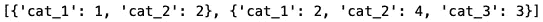
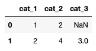
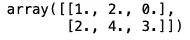
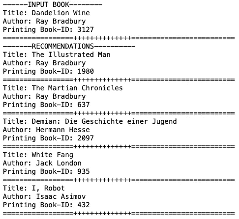

# 又一个推荐者…

> 原文：<https://medium.datadriveninvestor.com/yet-another-recommender-ad473a5894f9?source=collection_archive---------14----------------------->

## 创建合作图书推荐系统的经验


*大家好！*今天，我更关注本周学到的东西，而不是数学。其实这周的帖子我不会复习任何数学。尽管如此，她解决了发表在[数据驱动投资者](https://medium.com/datadriveninvestor)上的一些数学内容的数学问题。

今天，我想谈谈我这周学到的一些东西。我按照这里发布的代码[学习并创建了一个协作图书推荐器。如果你想看看我的代码(以及所有带叙述的评论)，](https://www.kaggle.com/sriharshavogeti/collaborative-recommender-system-on-goodreads)[这里是 GitHub 链接](https://github.com/karenkathryn/book_data/blob/master/notebooks/books_sample_nb.ipynb)。

# 说说你用的数据。

我使用了 kaggle.com 上的 Goodreads 数据。诚然，这个版本的数据集已经过时(因为它包含重复的评级)。但是，它满足了我学习的目的。它对 10，000 本书有 981，756 条评论(评分 1-5)。

[](https://www.datadriveninvestor.com/2020/02/19/five-data-science-and-machine-learning-trends-that-will-define-job-prospects-in-2020/) [## 将定义 2020 年就业前景的五大数据科学和机器学习趋势|数据驱动…

### 数据科学和 ML 是 2019 年最受关注的趋势之一，毫无疑问，它们将继续发展…

www.datadriveninvestor.com](https://www.datadriveninvestor.com/2020/02/19/five-data-science-and-machine-learning-trends-that-will-define-job-prospects-in-2020/) 

# 过程是怎样的？

我使用 [Pandas](https://pandas.pydata.org/) 、 [NumPy](https://numpy.org/) 和 [Scikit-learn](https://scikit-learn.org/stable/) 创建了一个协作推荐系统。再次，代码见[这个 GitHub 链接](https://github.com/karenkathryn/book_data/blob/master/notebooks/books_sample_nb.ipynb)。

*   我没有做 EDA 的*整 lot* 。但是在将图书数据和收视率数据加载到 Pandas 的数据帧中之后，我用。info()和。示例()方法。
*   接下来，我使用了。groupby()方法按图书对用户评级进行分组。
*   这是棘手的部分——我从(非常大的)评级数据框架中列出了一个字典列表。每本词典都代表一本带有评级和评级信息的书。
*   最后，我用 1 创建了协同推荐器。实例化字典矢量器并对数据进行拟合变换，2 .使用余弦相似矩阵的思想来寻找基于评级的相似书籍向量。
*   然后——砰！最后，创建几个函数来打印结果。

# 什么是 DictVectorizer？

字典矢量器的概念和使用是我本周的一个主要学习点。从[文档](https://scikit-learn.org/stable/modules/generated/sklearn.feature_extraction.DictVectorizer.html)开始，它

*   将特征值映射列表转换为向量。

所以，基本上，这需要一个字典列表并创建向量。让我们看一个例子。

```
# a dictionary to record the number of scoops of food 5 cats get each daycats_food_dict = [{'cat_1': 1, 'cat_2': 2}, 
                   {'cat_1': 2, 'cat_2': 4,'cat_3': 3}]
cats_food_dict
```



```
# create a dataframe to display dictionary
cats_names_df = pd.DataFrame(cats_names_dict)
cats_names_df
```



```
dv = DictVectorizer(sparse=False) 
X = dv.fit_transform(cats_food_dict)
X
```



# 我能看一个例子吗？

当然可以！刚看完 [*蒲公英酒*](https://www.goodreads.com/book/show/50033.Dandelion_Wine?from_search=true&from_srp=true&qid=eztFjvLIaS&rank=6) ，接下来想看类似的书。这是推荐器的输出。



推荐人做的怎么样？嗯，我对《插图的人》感兴趣，但对其他书不太感兴趣。

# 下一步是什么？

三件事:

1.  我想写一篇关于不同矢量器和余弦相似性分数背后的数学的博文。
2.  我将这段代码作为一种教程。我想重新审视这个问题，用我自己的解决方案来解决它。
3.  我想探索将所有这些打包成 Docker 容器。

*就是这样，乡亲们！一如既往，在评论里聊！*