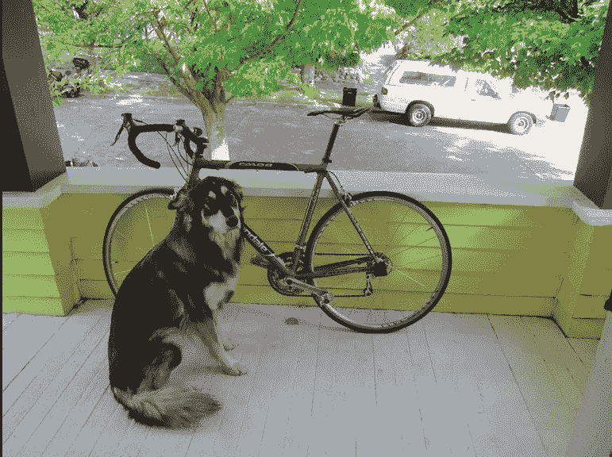
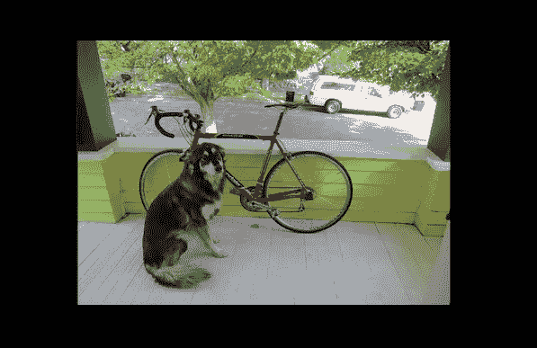
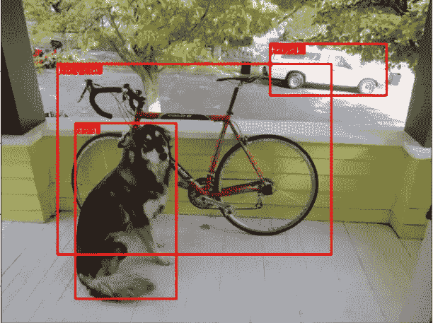

# 使用 PyTorch 从头开始使用 YOLOv3(第 2 部分)

> 原文：<https://medium.datadriveninvestor.com/yolov3-from-scratch-using-pytorch-part-2-2a481c62aa86?source=collection_archive---------3----------------------->

这是使用 PyTorch(Part1) 从零开始的 post [**YOLOv3 的延续。请先浏览一下那篇文章。**](https://medium.com/datadriveninvestor/yolov3-from-scratch-using-pytorch-part1-474b49f7c8ef)

在前一篇文章中，我们已经构建了模型，并加载了权重。现在我们将开始检测物体。我们已经测试了我们的模型，我们得到了大小为[B，10647，85]的输出，其中 B 是批量图像的数量，10647 是边界框的数量，85 是边界框属性。

我们必须做一个客观分数阈值和非最大值抑制，以获得真正的检测器。让我们看看我们将如何做到这一点。

我们将把文章分成两部分

1.  **客观分数阈值和非最大值抑制**
2.  **对不可见图像的检测**

# 1.客观分数阈值和非最大值抑制

对于每个边界框，如果客观性分数低于阈值，我们将把每个属性(整行)的值设置为零。

现在将盒子的(中心 x，中心 y，高度，宽度)属性转换为(左上角 x，左上角 y，右下角 x，右下角 y)。

我们希望在单个图像中进行非最大值抑制。所以我们要做的是批量迭代图像，并对非最大值抑制进行一些操作。首先，我们将选择每行上具有最大类概率的值。现在，我们连接类别号、我们获得的最大概率和相应的边界框坐标。

我们已经将那些客观性分数小于阈值的框的边界框属性设置为零。现在我们将移除它们。

对于一个图像，可以有多个滞留。我们将筛选出唯一的类，因为我们必须在每个类中执行 NMS。

现在我们有课了。现在我们将对每个类的 bbox 属性执行 NMS。

 [## 修复摄影|数据驱动的投资者

### 汤姆·津伯洛夫在转向摄影之前曾在南加州大学学习音乐。作为一个…

www.datadriveninvestor.com](https://www.datadriveninvestor.com/2019/03/22/fixing-photography/) 

## 非最大抑制

如果你不知道非最大压制，我会推荐你去看看我对 YOLOv1 的评论。现在让我们进入代码

对于每个班级，

*   首先，我们将获得属于某个类的检测。

*   现在根据包围盒的置信概率对它们进行排序

现在我们有了排序边界框属性的索引。我们将使用***bounding _ box _ iou***函数将可信度高的包围盒与其他包围盒进行比较。一旦我们找到它，我们将用这个边界框消除 iou 大于阈值的所有框。(我们首先将所有具有置信度的属性>阈值设置为零，然后从中获取非零值)

我们查找借据的函数是:

现在我们进入检测代码的最后一部分。这里我们将批次 id 与检测连接起来。这有助于识别检测属于哪幅图像。

现在我们的整个代码看起来像这样:

现在我们已经建造了我们的 YOLO 天体探测器。让我们来看看它是如何从看不见的图像中发现物体的。

# 2.对不可见图像的检测

现在让我们看看我们将如何预测一个单一的图像。我们将采取以下图像。

首先，我们将编写一个函数来加载 Yolo 类(80 个类)。

现在我们将加载我们的图像并通过网络传递它

***conf_inp_dim*** 在 yolo 提供的配置中抓取输入图像尺寸。

***预处理 _ 图像*** 函数将抓取输入图像并进行预处理。这需要一点解释。

***preprocess _ image***函数将配置文件中的图像和尺寸作为输入，并在此基础上构建一个画布。这里调整了图像的大小，保持了纵横比不变，并填充了遗漏的部分。例如，如果我们要将一个 1900 x 1280 的图像调整为 416 x 415，416 x 415 尺寸的区域将被图像占据，区域的其余部分将被填充，如下图所示。通过该函数后，图像将被调整到[1，3，608，608]而不改变纵横比。对于这个预处理 _ 图像函数，将调用 ***canvas_image*** 函数。

现在我们进入代码的下一部分。这里我们将保留原始图像形状的张量，我们将在后面使用。如果 GPU(CUDA)可用，我们将把我们的模型和 ***im_dim*** 传递给它。现在，通过将模型设置为评估模式，我们可以进行预测。

我们在填充图像上做了预测。但是我们必须在原始图像上绘制边界框。因此，我们将调整边界框的坐标值。

最后，我们在检测到的类上画出包围盒。

现在我们将检查我们保存的输出:

这一部分的全部代码如下所示

因此，我们从零开始开发了 YOLO 检测系统。我想通过阅读这段代码，你会对 YOLO 的工作方式有一个很好的直觉。

# 参考

*   [https://blog . paper space . com/how-to-implementation-a-yolo-v3-object-detector-from-scratch-in-py torch-part-5/](https://blog.paperspace.com/how-to-implement-a-yolo-v3-object-detector-from-scratch-in-pytorch-part-5/)
*   [https://www . ka ggle . com/arunmohan 003/yolo-v3-py torch-tutorial](https://www.kaggle.com/arunmohan003/yolo-v3-pytorch-tutorial)
*   [https://pjreddie.com/media/files/papers/YOLOv3.pdf](https://pjreddie.com/media/files/papers/YOLOv3.pdf)
*   [https://github.com/eriklindernoren/PyTorch-YOLOv3](https://github.com/eriklindernoren/PyTorch-YOLOv3)

**访问专家视图—** [**订阅 DDI 英特尔**](https://datadriveninvestor.com/ddi-intel)