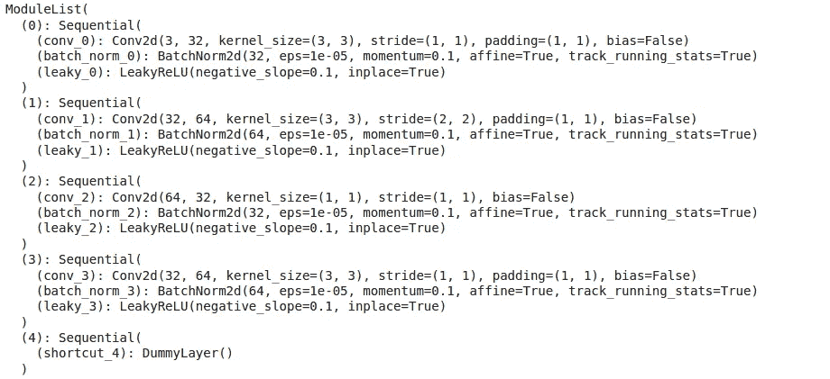

# YOLOv3 使用 PyTorch 从头开始(第 1 部分)

> 原文：<https://medium.datadriveninvestor.com/yolov3-from-scratch-using-pytorch-part1-474b49f7c8ef?source=collection_archive---------0----------------------->

在本文中，我们将使用 Pytorch 从头开始实现 YOLOv3 算法，这样我们将有一个直观的理解。在开始写这篇文章之前，我建议你看一下我对[](https://medium.com/datadriveninvestor/review-on-yolov1-3c85304b617d)**[**【约洛夫 2**](https://medium.com/datadriveninvestor/review-on-yolov2-11e93c5ea3f1) 和【约洛夫 3】的评论。我将分两部分解释这个实现。这将是文章的第一部分。**

1.  ****YOLOv3 使用 PyTorch 从头开始(第 1 部分)****
2.  ****YOLOv3 使用 PyTorch 从头开始(第 2 部分)****

**我们将把文章分成几个部分，这样你会更容易理解。**

1.  ****配置文件(已解释)****
2.  ****初始化模块****
3.  ****模型的正向传递****

# **1.配置文件(已解释)**

**我们有一个“yolo.cfg ”,你可以从他们的官方网站下载。看起来是这样的。**

****

**part of configuration file**

**它由几个模块组成，如**【net】、【协选】、【快捷方式】、【路线】、【上样】、【yolo】**。我们将逐一解释。**

****【网】****

**只有一个[net]块存在。它给出了基本信息，如批次大小、动量、衰减等。我们不需要担心它。**

****【卷积】****

****

**这给出了关于暗网 53 中存在的卷积网络的信息。**

****【快捷键】****

****

**快捷方式层与 ResNet 中使用的跳过连接层相同。from = -3 表示快捷层后面有一个来自 3 层的快捷连接。**

****【路线】****

********

**路径图层可以是 1 或 2 个值。当层参数的值为 1 时，表示采用该索引的特征图。例如，如果 layers = -4 表示图层将从第 4 层向后输出当前路径图层的要素地图。当层参数有 2 个值时，我们在那些索引处取特征图的连接值。例如，如果 layer = -1，36，我们采用路线层的前一层和第 36 层的连接特征地图。**

****【上例】****

****

**这将按给定步幅对先前的图层要素地图进行上采样。**

****【yolo】****

****

**这是检测层，我们将从这里进行预测。整个文件中有 3 个[yolo],表示我们以 3 种不同的比例输出。这里我们可以看到 9 对锚框，我们将根据给定的掩码值从中选择 3 对。这里 mask=0，1，2 意味着我们取锚的第一、第二和第三个值。因此，形成 3 个检测层，我们使用所有 9 个锚。**

## **解析配置文件**

**首先，我们将加载所需的库**

**现在我们将把这个配置文件解析成所需的格式。**

****

**sample output**

**解释上面的代码没有多大意义，因为它很容易理解。它只是将文件转换为一系列层的字典。**

# **2.初始化黑暗网络 53 的块**

**在这一步中，我们将从我们创建的解析器输出中初始化 DarkNet-53 的所有块。**

****darknet_details = block[0]** 表示我们前面解释的[net]块的细节。我们将它设置为单独的变量。**

****nn。ModuleList() :** 这个类就像一个包含 nn 的普通列表。模块对象。当我们向 nn 添加对象时。ModuleList()，它们是作为 nn 的参数添加的。模块对象。**

****output_filters:** 这里我们跟踪每一层中使用的过滤器。**

****channels = 3** 表示网络的输入通道**

**现在，我们将从模块 1 开始，遍历网络的不同层。**

****nn。【Sequential())类用于顺序执行若干个 nn。模块对象。例如，我们可以看到在卷积块中有批量归一化和激活。我们需要依次执行这个。所以我们用 nn.Sequential。****

**在下面的代码中，我们对协变和上采样块进行了处理。**

**接下来，我们将检查如何迭代路由和快捷方式块。**

**上面的代码有点复杂。别担心，我们会挺过去的。如前所述，路由将有 1 或 2 个值。如果路径参数的值为 1，例如，第 20 层的 route = [-4]，则表示第 20 层从第 16 层(20–4)输出要素地图。在这一步中，我们还用实际层数而不是负值来更新层值，因为这将进一步有用。**

**[](https://www.datadriveninvestor.com/2019/03/22/fixing-photography/) [## 修复摄影|数据驱动的投资者

### 汤姆·津伯洛夫在转向摄影之前曾在南加州大学学习音乐。作为一个…

www.datadriveninvestor.com](https://www.datadriveninvestor.com/2019/03/22/fixing-photography/) 

同样，如果路径图层有两个值。例如，[-1，15]在第 20 层，我们将采用的过滤器是第 19 层和第 15 层过滤器的总和。在这个阶段，我们也用实际层数更新层参数。由于路由层除了转发和连接之外没有任何操作，我们使用了一个 ***虚拟层*** 。

类似地，在快捷图层的情况下，它也只是从某个先前图层传递特征地图。这里我们也将使用一个 ***虚拟层。***

## 什么是虚拟层？

顾名思义，它只是一个虚拟或空层。通常在 PyTorch 我们子类 ***nn。模块*** 并编写一个 ***forward*** 函数来执行该层正在执行的操作。通常在路由层中，我们传递来自前一层的特征地图，或者我们连接两层并传递特征地图(仅用 torch.cat()即可完成)。所以我们引入虚拟层来简化它。

接下来是 ***约罗*格挡。这里，我们将基于掩码更新每个 yolo 块的相应锚值。**

我们也有一个检测层，我们将用于检测。

最后，我们在每次迭代中添加过滤器和序列列表。我们还更新了通道，因为卷积层是在此基础上创建的。

因此，我们块初始化函数如下所示:

现在我们将测试我们的代码



part of output** 

# **3.模型向前传递**

**在这一部分中，我们将看到如何通过我们之前定义的层来转发图像。我们将组装我们已经创建的构建块，以从图像中产生输出。**

**我们将定义一个类暗网，并将初始化我们计算的参数。**

**现在我们将编写转发函数**

**在这里，我们将在字典输出中捕获每个图层的输出，因为路径图层和快捷方式图层需要它来进行操作。我们将在后面解释 write=0。**

**在这里，我们迭代 ***self.blocks[1:]*** 而不是 self.blocks，因为 self.blocks 的第一个元素是 ***net*** block，它不是向前传递的一部分。**

**现在我们要做的是枚举各层，并通过卷积和上采样层传递输入。在快捷方式和路由层的情况下，我们根据需要来做。在 yolo 层的情况下，我们进行预测并将其连接起来。**

**这里，路由和快捷方式模块类型需要来自前一层的输出。因为我们将它缓存在输出字典中，所以我们可以使用它。在路径层中，如果层的长度大于 1，我们将沿通道轴连接。例如，我们将大小为[1，256，26，26]和[1，512，26，26]的张量连接起来，得到大小为[1，768，26，26]的张量。**

**下一部分是 yolo，在那里进行检测。**

**我们的 ***检测 _ 预处理*** 功能如下:**

**顾名思义，这是一个预处理或转换我们的检测输出到适当的形式。该函数将检测输出、图像的输入尺寸、锚点和类别数作为输入。**

**如果你觉得张量运算的函数很复杂，不要担心，我们会逐一讲解。**

**这里 x 是 4D 特征地图输入。我们将从中提取 batch_size 和 grid _ size。stride 是指图像缩小到特征图的因子。有些也被称为子采样率。**

**假设我们的输入图像大小为 128×128，我们的特征图大小为 16×16。那么这里的步幅就是 128//16 = 8。**

**框属性指示每个锚框的输出值的数量。这里 5 表示 x，y，w，h 和置信度，我们有 80 个类。所以总共是 85 英镑。接下来是锚的数量。在这里，因为我们在 3 个比例下使用 3 个锚盒，所以将是 3。接下来是有趣的部分。**

**对 4D 张量做运算是复杂的。所以我们将把它转换成更简单的形式。发生的转换如下。假设我们的特征映射维数是[1，255，13，13]。这意味着我们有一个 255 深度的 13x13 特征图。这里我们有 169 个网格单元。对于每个网格单元，我们有 255 个值。即，3 个锚框的 85 个值(80 个类+ 5 个边界框属性),总共 225 个值。我们将对此进行调整，这样我们将得到这样的行中的值，**

*****第一个网格单元上第一个锚定框的框属性*****

*****第一个网格单元*** 上第二个锚定框的框属性**

*****第一个网格单元*** 上第三个定位框的框属性**

*****第二个网格单元上第一个定位框的框属性*****

*****。*****

*****。*****

*****第 169 格*** 第 3 锚框的框属性**

****

**这里有一个形状为 507 x 85 的张量。在上面的代码中，我们将[1，255，13，13]张量转换为[1，225，169]，然后将其转置为[1，507，85]。**

**我们有 3 个 ***yolo*** 积木。这意味着我们在 3 个不同的尺度上获取检测输出。所以我们会用三个音阶来做这个。**

**接下来，我们将进行转换。假设 ***tx，ty，tw，th，到*** 为网络输出的维度。为了进行边界框预测，我们必须进行如下一些变换:**

****

**bbox transformations**

**这里 ***pw，ph*** 代表锚的高度和宽度。这里 **cx，cy** 是网格单元相对于图像的偏移量。**

**在这里，我们将锚定框的尺寸除以步幅，以便根据特征图对其进行调整。现在我们将 sigmoid 应用到 ***tx，ty*** 和 ***到*** 如等式。**

**接下来，我们将中心 x 和 y 坐标(tx，ty)添加到偏移值中。为了使这一步更容易，我们创建一个网格网格，并调整其尺寸为我们之前创建的矢量。**

**最后，我们将进行高度和宽度的对数空间转换。**

## **装载重量**

**我们已经准备好了暗网 53 网络。现在我们必须用预训练的权重来初始化它。首先，我们将下载预训练的重量。**

```
!wget https://pjreddie.com/media/files/yolov3.weights
```

**官方重量文件是一个二进制文件，重量按顺序存储。权重以浮点形式存储。加载砝码文件时必须格外小心。一些需要注意的要点:**

*   **权重只属于两种类型的层，或者是批范数层，或者是卷积层。**
*   **权重的存储顺序与配置文件中的顺序完全相同。**
*   **如果卷积层包含批量归一化，我们将没有卷积的偏差值。对于这种卷积层，只有权重值。**
*   **如果卷积图层不包含批量归一化，将同时存在偏差和权重值。**

**权重文件的前 160 个字节存储 5 个 int32 值，这些值构成了文件头。其余位代表权重。重量以 float32 格式保存。在上面的代码中，我们将加载两者。**

**现在，我们将遍历层并加载权重。**

**如果我们有一个批量归一化的卷积块，我们加载权重如下:**

**否则我们将加载偏差 as，**

**最后我们加载卷积层的权重**

**我们的整个模型看起来如下**

**现在我们将通过一个测试输入来检查输出**

**输出:**

```
torch.Size([1, 10647, 85])
```

**在文章的下一部分，我们将检查如何预测正确的边界框。**

# **参考**

*   **[https://pjreddie.com/media/files/papers/YOLOv3.pdf](https://pjreddie.com/media/files/papers/YOLOv3.pdf)**
*   **[https://blog . paperspace . com/how-to-implementation-a-yolo-v3-object-detector-from-scratch-in-py torch-part-2/](https://blog.paperspace.com/how-to-implement-a-yolo-v3-object-detector-from-scratch-in-pytorch-part-2/)**
*   **【https://github.com/eriklindernoren/PyTorch-YOLOv3 **