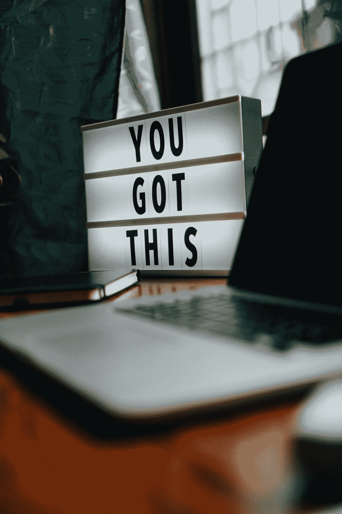
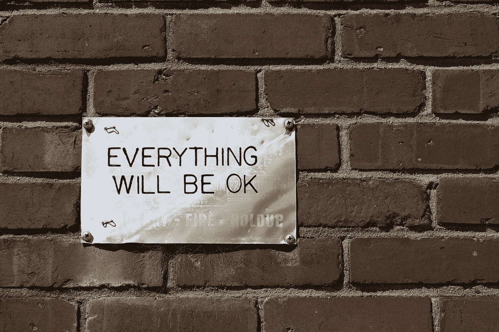

# 你太棒了

> 原文：<https://medium.datadriveninvestor.com/you-are-amazing-274651127432?source=collection_archive---------10----------------------->

永远不要忘记它。(二手灵感项目)

Photo by [Prateek Katyal](https://unsplash.com/@prateekkatyal?utm_source=unsplash&utm_medium=referral&utm_content=creditCopyText) on [Unsplash](https://unsplash.com/s/photos/motivation?utm_source=unsplash&utm_medium=referral&utm_content=creditCopyText)

二手灵感项目从一句激励性的引语开始，在创造性道路蜿蜒的任何地方冒险。

"当我们不再能够改变现状时，我们面临着改变自己的挑战."维克多·弗兰克尔

你太棒了。

是的，我正在和*你*说话。

你，面对过这种疯狂的隔离，直视它的眼睛，平静地宣布:“你不会阻止我实现我的目标。”

你，尽管面临着虚拟人际网络和有限资源和机会的挑战，但你仍在努力工作，胜过办公室里所有挡在你和难以实现的晋升之间的人。

你，拒绝让这个不幸的场景成为一个方便的借口。即使这场灾难把几乎所有事情都搞砸了，你也不能用它来为退学、逃避家庭责任、未能写完小说或未能达到你的健身里程碑找借口。

你太棒了。

在我们目前居住的这个上下颠倒、饱受疫情折磨的世界里，很多人觉得他们现在被困住了。

谁能责怪他们呢？这种冠状末日和它的居家命令让许多人唱起了孤独的布鲁斯。其他人直接与疾病作斗争，或者看着他们关心的人与这种可怜的疾病作斗争。与此同时，经济继续用它的金融弹簧刀抵住我们的喉咙。

在乐观情绪短缺的时候寻找动力似乎完全是徒劳的。然而你拒绝让低迷打败你。

[你认识到进步永远不会直线发展。复苏永远不会带我们直接回到繁荣。一路上总是有坑坑洼洼、错误的转弯和怀疑的鸿沟。](https://medium.com/@adrianpotter/fail-forward-towards-success-e9ffd381277e?source=friends_link&sk=6807ab26331ab09fd9aec59aa33e5a5d)

Image by [Free-Photos](https://pixabay.com/photos/?utm_source=link-attribution&utm_medium=referral&utm_campaign=image&utm_content=1246633) from [Pixabay](https://pixabay.com/?utm_source=link-attribution&utm_medium=referral&utm_campaign=image&utm_content=1246633)

我了解你。你将坐在混乱之中，研究你是如何到达那里的，分析如何不再到达那里，并推断出下一个决定不仅会把你从废墟中带出来，还会把你推进一个更好的处境。

你看到了这些挫折的本质——暂时的和教育意义。斗争不会永远持续下去，它们总会告诉你如何克服你未来将面临的障碍。他们可能不会教令人愉快的课程，但如果你记笔记并通过测试，你最终会以全新的视角从这个混乱中毕业。

 [## 良好的生活是习惯的形成|数据驱动的投资者

### 过度思考是过度紧张。仅仅几个简单的习惯就会在一天中产生巨大的影响。那是…

www.datadriveninvestor.com](https://www.datadriveninvestor.com/2020/01/17/a-good-life-is-habit-forming/) 

因为你太棒了。

如果你想要证据，只要看看你在新冠肺炎危机期间短时间内已经发现的一切:

*   即使被隔离，你也能保持外向。你只需要更有创意一点。
*   **或者你可以保持内向，即使躲在原地也能成功。**你一生都在为此训练。其他人必须赶上来，学习你已经记住的剧本。
*   **即使身体上困在原地，你也可以保持雄心壮志。**承诺做一些简单的事情，比如检查同事和客户，联系两个可以互相帮助的人，并付出额外的努力，这些事情总是会引起他人的共鸣——即使这些行为是虚拟的。这些行动将有助于你在游戏开始前走出困境。
*   你可以继续关注未来，但仍然关心他人。利他主义与意义感和目标感高度相关。对他人产生有意义的影响提醒你，我们都是人类经历的一部分——我们注定要一起度过难关。
*   即使感到焦虑，你也可以保持大胆。你知道你不能仅仅停留在静止状态。你不能坐在过去的成就或证书上，成功地走出这场磨难。这意味着愿意承担有分寸的、明智的风险，而不是固步自封或畏首畏尾——即使事情看起来不确定。

历史上没有一个成功的人没有跌倒后爬起来变得更强——包括你。

Image by [Murray Rudd](https://pixabay.com/users/16124683-16124683/?utm_source=link-attribution&utm_medium=referral&utm_campaign=image&utm_content=5065797) from [Pixabay](https://pixabay.com/?utm_source=link-attribution&utm_medium=referral&utm_campaign=image&utm_content=5065797)

你现在明白了吗？你太棒了。

你适应了。你进化了。你知道不能改变这种情况，所以你会改变自己。你将学会如何将废话转化为黄金，将困难转化为机遇，将苦难转化为胜利。

你知道，当社会最终真正开放，灯光重新亮起，金钱开始易手，世界从创伤中痊愈，然后重新焕发生机，你将是最闪亮的一个。

因为这是你应得的，朋友。

其他人可能还不知道。但是很快，没人能阻止你了。

你太棒了。

阿德里安·s·波特是一名作家、工程师、顾问和演说家。他写诗歌、短篇小说和各种主题的文章，包括创造力和个人成长。他是诗集[和散文集](https://www.amazon.com/Everything-Wrong-Feels-Adrian-Potter/dp/109519061X/ref=sr_1_4?qid=1560264651&refinements=p_27%3AAdrian+S.+Potter&s=books&sr=1-4&text=Adrian+S.+Potter)[的作者。在](https://e2857002-6118-41be-9746-64261e36cacb.filesusr.com/ugd/21d2c2_03522f10c7c84340a05a8d03a97e1642.pdf)[http://adrianspotter.com/](http://adrianspotter.com/)在线拜访他。

# 附加文字

[你不必惊慌](https://medium.com/datadriveninvestor/you-dont-have-to-panic-f9d3706d4c29?source=friends_link&sk=006cdcc74517a8818ac7d168906f12da)

[停止进给混乱](https://medium.com/datadriveninvestor/stop-feeding-the-chaos-a0c0ea207593?source=friends_link&sk=54793e2036f072daa1754da3de08f1a1)

[失败向成功迈进](https://medium.com/@adrianpotter/fail-forward-towards-success-e9ffd381277e?source=friends_link&sk=6807ab26331ab09fd9aec59aa33e5a5d)