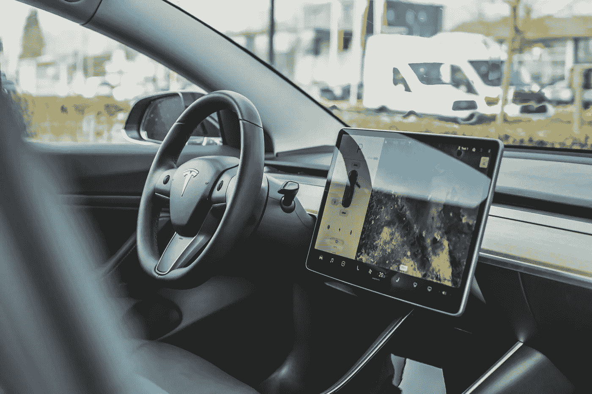

# 你会丢掉工作的！

> 原文：<https://medium.datadriveninvestor.com/you-are-going-to-loose-your-job-6037ea345332?source=collection_archive---------6----------------------->

Image from pexels.com

这有点像超级马拉松，但不可避免的是，你会丢掉工作！

很快？我们不知道。

我们知道的是，47%的工作岗位在 10 到 20 年后将不复存在。

技术正在做我们需要的所有事情，比人类更快更有效率。这是事实。开始很慢，但是越来越快。

你我每天都感受到它，拥抱它。脸书、instagram、谷歌、YouTube、优步、苹果、特斯拉、亚马逊以及成千上万为便利我们的生活而开发的应用和程序等工具带来的好处，我们不能不接受。

 [## 银行和金融科技初创公司的未来|数据驱动的投资者

### 银行的概念没有太大变化，但随着技术的发展，旧的概念也在更新。不相信我？拿一个…

www.datadriveninvestor.com](https://www.datadriveninvestor.com/2019/10/22/the-future-of-banks-and-fintech-startups/) 

但是事情总有另一面，不是吗？

目前，有一个网站聚集了数字医疗网站，在那里患者可以与一系列问题进行互动，并由医生代替。去年，该网站的访问量超过了所有私人诊所的访问量总和。

Image from unsplash.com

埃隆·马斯克(Elon Musk)去年开始生产自动驾驶卡车。仅在美国，目前就有 320 万人受雇为送货和重型卡车司机。

如果我不需要银行系统的员工支付、转账或投资，他们会怎么样？

我知道这很复杂，会吓到每个人，也会影响到每个人，但是像比尔·盖茨或者 T2 杰夫·布斯这样的人已经研究这个问题很长时间了。

会有怎样的转变？我们什么时候才能听到政客们开始谈论这件事？他们在谈论这些事情吗？

人工智能系统将能够在短时间内像人类一样聪明。劳动力更替的过程首先会影响到那些不太合格的工人。

问题是:“如果一个 50 岁的卡车司机的工作将被机器取代，他会做什么？”

UBI(普遍基本收入)是经济学家正在研究的劳动力大规模变化的替代方案。从理论上讲，它将为每个公民提供基本月收入。但是对一个美国人和一个委内瑞拉公民来说金额是一样的吗？对一个欧洲公民、一个越南公民、一个埃及公民来说，“基本收入”或基本需求是什么？

这种技术上的突破正在改变你学习新事物的方式。这个月我一直在和最著名的作家之一丹·布朗(《达芬奇密码》)一起上课。这是一次奇妙的旅程。我喜欢它！我刚刚使用了一个社交媒体向我展示(出售)的 Masterclass.com 电子学习项目。

这是卖给我产品的算法。这是人工智能的工作，让我们钦佩的大公司盈利。

我能控制它吗？你能控制它吗？

一些研究描绘了未来工作者的十大能力。让我列出它们:

Image from pexel.com

1-复杂问题解决技能；

2-批判性思维:

3-创造力:

4-领导力和人员管理；

5-团队合作；

6-情商；

7-判断和决策；

8-服务导向；

9-谈判技巧；

10-认知灵活性。

关于技术断裂的一个大问题是关于经济范式。一部智能手机可以有大量的免费应用程序，它们可以为你提供免费服务，而无需你去思考它们，因为你本能地这么做(并且把你所有的数据都给它们)。

但事实是，这种技术正在创造一个通货紧缩的经济，而美联储和其他国际中央银行的长期战略管理是通过不断印刷货币，这被称为量化宽松(QE)。

这种印钞策略的真正真相是，全球经济增长率是假的。在过去的 20 年里，有 185 万亿美元是假的。每年 46 万亿美元来对抗由技术断裂引起的通货紧缩。

这是一种庞氏骗局，给我们制造了财富的假象。并不是说富人没有变富。问题在于，虚假的财富创造正一次又一次地流入同一批人的口袋。

这就产生了我们的历史比我们更了解的政治问题。我们只是看到民族主义在意大利和奥地利抬头。我们看到，全球各地的政府都需要让私人公司参与进来，以维持这一体系。对美国人来说，这是一种社会主义，对吗？

Image from unsplash.com

这种反思是我们所有人，全球社会，必须走的路，以创造可持续的替代这一巨大的转变。所以问题是…

# 什么会先出现？通货紧缩还是革命？