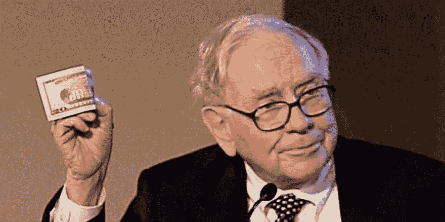
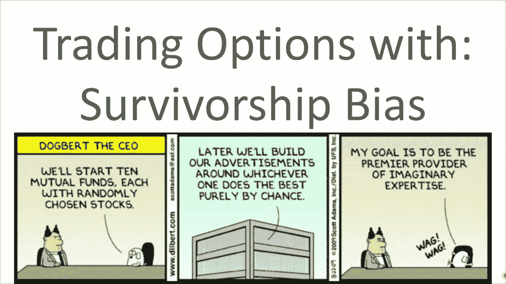

# 你不是沃伦·巴菲特

> 原文：<https://medium.datadriveninvestor.com/you-are-no-warren-buffett-1c1d24b196de?source=collection_archive---------9----------------------->

**我也不是，没关系**

*Photo by The Indian Express*

在开始投资之前，我们很多人都在谷歌上搜索过“如何像沃伦·巴菲特一样投资”。这位成功的亿万富翁让投资股票变得如此容易。原因很简单，他的成功秘诀是:*购买具有长期内在价值的优质企业。不要追求一时的满足，要有耐心。如果我们想赚大钱，我们相信模仿聪明的投资者是至关重要的，购买他们做的股票，从而也变得富有。*

你没有获得惊人回报的原因是，你不是沃伦·巴菲特，我也不是。

我们有模仿最成功的专业人士的病态倾向。我们渴望他们的成功和成就，却没有意识到这是一个危险的陷阱。他们是罕见的异类，从投资中获得异常高的回报。他们是独一无二的，熟练的，因为他们几十年的经验和专业知识。这同样适用于其他领域的专家。不管是雷伊·达里奥还是迈克尔·乔丹。

 [## 投资区块链前要问的三个简单问题(也是一个困难的问题)|数据…

### 现在是了解区块链的最佳时机。不同货币之间的增长率，比如…

www.datadriveninvestor.com](https://www.datadriveninvestor.com/2020/03/12/three-simple-questions-and-one-difficult-one-to-ask-before-investing-in-a-blockchain/) 

恭喜你，你已经不知不觉地陷入了*生存偏差*的陷阱。

生存偏差是普遍的。然而，在这种情况下，当人们过分强调市场上更容易看到的现有赢家或幸存者股票，而忽视了表现不佳的股票时，就会发生这种情况。这对业绩有显著的负面影响，因为资本家可能以不合适的价格交易。因此，促使他们根据高估一些基金回报的新闻稿做出不合理的投资决定。

*Photo by Option-Advantage, AIG Selling Puts*

为了克服生存偏差，关键是投资者不要模仿一些以前被证明对其他投资者成功的策略。这将导致失败和糟糕的决策。为了降低失败的风险，不要忽略任何观察和分析表现不佳的人。它们提供了更有价值的信息。此外，不要追逐热门股票，要意识到这些策略是税务低效的，需要大量的交易成本。

如果你真的想像沃伦巴菲特那样投资，那么你需要爱上你投资的公司。除了作为一个价值投资者，巴菲特还评估选定的业务，知道哪些业务在他的能力范围之内或之外。他是一台学习机器，也是一个贪婪的读者，以自己的方式获得成功。同样，你需要理解你的投资风格、兴趣和独特的能力，这将帮助你成为一个更好的投资者。

> 更大的风险来自于投资你不了解的业务。如果你准备好了，那就不是风险。正如亚当·斯密在《金钱游戏》中所说，“你首先要了解的是你自己。如果你不知道自己是谁，市场是一个寻找答案的昂贵地方”。

**进入专家视角—** [**订阅 DDI 英特尔**](https://datadriveninvestor.com/ddi-intel)