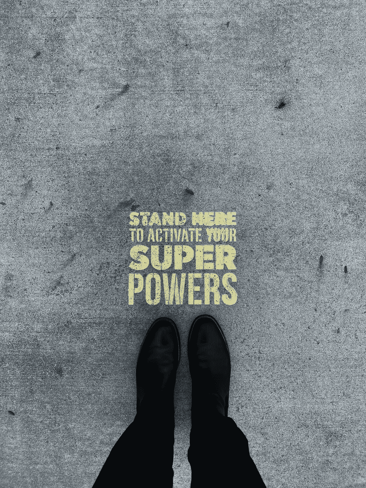

# 你不是不认真，你只是害怕。

> 原文：<https://medium.datadriveninvestor.com/you-are-not-unserious-you-are-just-afraid-b7cbe36cb916?source=collection_archive---------34----------------------->

Photo by [Jon Tyson](https://unsplash.com/@jontyson?utm_source=unsplash&utm_medium=referral&utm_content=creditCopyText) on [Unsplash](https://unsplash.com/collections/3315430/sign-(i-saw-the...)?utm_source=unsplash&utm_medium=referral&utm_content=creditCopyText)

你是否找到了自己擅长的地方(可能是与生俱来的天赋或技能)，每个人都告诉你，但你似乎无法找到“成为职业选手”的感觉也许它对你来说是轻而易举的事情，你不费吹灰之力就能做到的事情，以至于你甚至不加思索。你有诀窍。它可以是烹饪、演讲、写作、教学、跳舞、绘画、组织、解决问题，无论是什么，它都不是你强调要做的事情。

你周围的人会给你的自然建议是将这种技能货币化，或者让其他人从中受益。你可能已经在你的脑海中提到了一个特定的对话，所以你有一个想法。他们走了，*“哦不！这太好了。发布了吗？熄灭它？打广告了？”*你听说过这些事，但你不相信。可能是你太确信没有人会想雇佣你的服务，因为你不是专业人士。**假**。你会被雇佣并得到报酬。虽然我很遗憾地说，这并不总是瞬间的。可能需要一段时间。但是我跑题了。

你拖延了这么久，把自己放了出来，拒绝信和"*我们很抱歉……*"邮件装饰着街道，梦想被粉碎，心碎。事实是，我就是你。我写了很多东西，藏在早已被遗忘的笔记和日记里。许多写得好的和写得不好的作品被埋没了。

不懂的人可能会觉得 *omo 这个不正经。但是你我都知道事实并非如此。是恐惧让我们陷入不确定、自我怀疑和麻痹的循环中。害怕终究不够好，害怕承受不了那个小众的压力，害怕开始很好但后来失败，害怕做得太好，害怕那么多的话无法表达。*

这种恐惧是为什么每个人都认为你不认真，浪费人才，这是一个你无法迅速纠正的误解。因为如果人们认为你是如此的自信和有控制力，你会做你想做的(或不想做的)事情，而不是脆弱和充满不安全感和恐惧。你害怕被发现是一个冒名顶替者，这是非常严重的，你根本不想成为公众的焦点。伟大不是为了隐藏或囤积，而是为了分享。你所拥有的，真的很棒。

亲爱的，我知道你害怕，害怕是正常的。不好的是生活在恐惧中。你能出去吗？让我们一起赢。

爱你的，贝莉💖

*[***领导力、辅导和个人成长***](https://app.ddichat.com/category/leadership-coaching-and-personal-growth)***:****

* [## 专家-领导力、教练和个人成长- DDIChat

### DDIChat 允许个人和企业直接与主题专家交流。它使咨询变得快速…

app.ddichat.com](https://app.ddichat.com/category/leadership-coaching-and-personal-growth) 

***申请成为 DDIChat 专家*** [***此处***](https://app.ddichat.com/expertsignup) ***。****