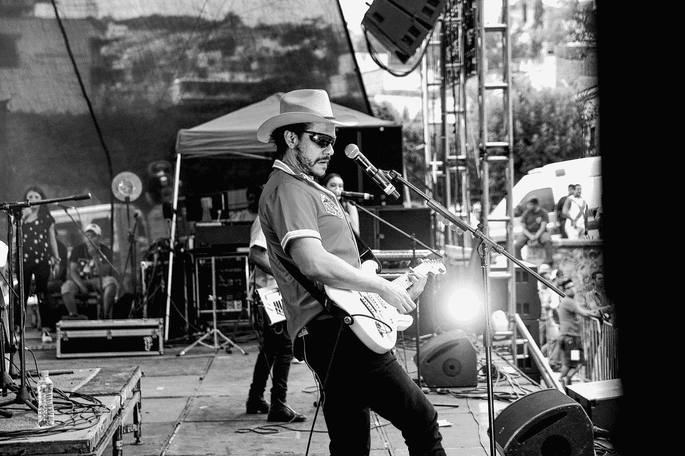

# 这种关于创造生活愿景的隐藏见解会让你大吃一惊

> 原文：<https://medium.datadriveninvestor.com/you-can-learn-about-vision-from-country-music-d1288cf1ed9f?source=collection_archive---------15----------------------->

## 到达你想去的地方的关键是逆向工作

Photo by [Ed Zavala](https://unsplash.com/@edlooading?utm_source=medium&utm_medium=referral) on [Unsplash](https://unsplash.com?utm_source=medium&utm_medium=referral)

老笑话说，如果你能倒着听乡村音乐，生活是美好的。你要回你的妻子，你的拖车，你的狗，还有你的工作。

很明显，这是对乡村音乐悲伤故事传统的一次抨击。

破碎的心，破碎的梦在一滩啤酒里。

如果你喜欢乡村音乐，不要生我的气。

我也是。

这是一种喜欢讲故事的艺术。但是让我们面对现实吧，很多故事都很悲伤。如果我们考虑这些故事的前景，在很多情况下，它们并不那么美好。

不过，这个关于设定人生愿景的笑话中隐藏着一些智慧。

哪怕是无意的。

它适用于任何长期目标或计划，这就是:

> *如果你对自己想去的地方有一个清晰的、令人信服的愿景，那么就往回努力，找出如何到达那里。*

想想为什么会这样。

# 长期目标应该是远大的

如果这个目标以今天的标准来看不算大，为什么要花很长时间呢？

> 如果你的目标是减肥，你不会说“我的长期目标是减掉 3 磅”
> 
> 如果你的目标是赚更多的钱，你不会说“我的长期目标是比现在多赚 1%。”
> 
> 如果你的目标是和你爱的人共度更多美好时光，你不会说“我的长期目标是和我的朋友和家人出去吃饭。”

这些可能是伟大的短期目标。为什么？因为只要一点点训练和努力，它们是可以很快实现的。他们不会威胁你。

长期目标应该是可怕的。[大毛大胆的目标(BHAG)](https://www.jimcollins.com/concepts/bhag.html) 。

大到我们需要逆向工作才能实现。这是怎么回事？

Photo by [Denys Nevozhai](https://unsplash.com/@dnevozhai?utm_source=medium&utm_medium=referral) on [Unsplash](https://unsplash.com?utm_source=medium&utm_medium=referral)

你不断地把行动分解成一点一点的小块，以便朝着那个巨大的、令人生畏的、令人生畏的愿景前进。

## BHAG 的例子

假设你想在 5 年内拥有自己的营销公司，盈利 100 万美元。而今天你是一个写文案的自由撰稿人。足够养活自己，但不能再多了。如果 1，000，000 美元的收入让你害怕，那就从这里开始吧。

你不能通过思考从现在到那时你需要做的每一件事来实现这个愿景。你从最终目标开始，然后反向工作。那看起来像什么？

Photo by [Drew Saurus](https://unsplash.com/@drew_saurus?utm_source=medium&utm_medium=referral) on [Unsplash](https://unsplash.com?utm_source=medium&utm_medium=referral)

## **远景**

我们已经确定你的愿景是 5 年后。实际上，我将长期愿景定义为未来 3-10 年的任何事情。我们生活在一个有时将下周视为长期的世界里。它需要离现在足够远，以至于需要认真规划。

要做认真的计划，你需要认真思考。在这个过程中，没有什么比构思一个真实的愿景更重要的了。需要具体一点。

模糊的幻象不是幻象。

我们的营销公司例子确实有一个具体的收益目标。太好了。但没别的了。愿景需要具体化。这家公司为谁服务？有多少员工？办公室在哪里？尽可能详细地研究这个问题。

直到在你的脑海里和书面上有了一个清晰明确的画面，你才算完成了愿景。

之所以称之为视觉，是因为你需要实际看到它。

一旦你这样做了，后退一步回到主题。

## **主题**

主题是发生在几个月到一年之间的目标和目的。它们比一系列单独的任务要大，但还不足以成为一个长期愿景。我们可以认为这些是中期目标。

*你应该有一个分解成多个主题的愿景。*

在您为愿景定义的未来 5 年的任何时候，您都将在 3-5 个主题下工作。

 [## 为什么投资技术以促进业务增长和发展|数据驱动型投资者

### 高达 85%的企业决策者认为他们只有不到两年的时间来整合数字计划…

www.datadriveninvestor.com](https://www.datadriveninvestor.com/2019/09/03/why-invest-in-technology-for-business-growth-and-development/) 

让我们说，营销公司的愿景工作导致了服务于中型和大型兽医实践的品牌战略的专业化。你会从什么主题开始？您将使用哪些关键绩效指标(KPI)来判断这些目标的进展情况？

一个主题可能是将你的服务包装成一种产品，而不是自由职业者。这可以让你提前支付服务费用，而不是拖欠。另一个主题可能是文档。为了扩展您的业务，您将需要可重复的、记录在案的流程。

现在你已经建立了一些明年要做的主题。您可以将这些目标进一步分解为主题下的项目。

## **项目**

项目是可能持续 90 天左右的目标和目的。您的主题将有助于指导您并优先考虑您可能关注的项目，以改善您指定的[KPI](https://kpi.org/KPI-Basics)的记分卡。

*你现在正处在一个目标和目的的尺度上，当你参与其中时，你实际上可以构想出这些目标和目的。*

这一切都与你最初的工作愿景直接相关。在项目层面，我们开始明白为什么要在构思愿景时投入这么多的工作。

我们中的许多人在生活和创业项目中似乎都很重要且富有成效。但是，如果这些项目脱离了总体愿景(和中期主题)，它们会导致我们随波逐流。

我们努力工作。我们感到富有成效。但是我们没有取得真正的进展，因为我们没有前进的方向。

像超过一年的主题一样，我们可能不希望同时处理太多的项目。一次 3-5 个应该是最大范围。记住这些是你计划在接下来的 90 天内完成的事情。

文档项目我们的兽医品牌咨询公司可能会工作 90 多天，包括公司手册、设计流程细节和销售新记录流程的营销材料。建立了这些项目之后，我们现在可以将它们分解成它们的组成任务。

## **任务**

任务是组成每个项目的单个活动。他们应该明确要求交付什么。他们还应该清楚地描述谁负责完成这些任务。

你现在是一名自由职业者，所以早期的许多个人任务将会分配给你。了解你的带宽。对于完成每一项任务需要多少时间，要合理但谨慎。其中一些并不容易。

*这些任务容易消化，因为你不用担心你需要做的成千上万的其他事情。*

这一点怎么强调都不为过。你不能同时做 5 件以上的事情，甚至可能没有那么多。

绝对不是一千。

# 通过后退，你就前进了

你现在正在以一种系统的方式承担这个巨大的、可怕的梦。

当你知道你正在做的事情对这一刻来说已经足够时，你会有更多的安全感。

您正在处理您确定的特定任务，以推进您的项目。

这推进了你的主题。

让你更接近你的梦想。

是你设计的。

所以你的故事情节不会有一个悲伤的，乡村音乐的结局。

你是如何构思你的愿景的？你开始的时候心里想的是结果吗？分享你的想法。

Photo by [Monty Allen](https://unsplash.com/@monty_a?utm_source=medium&utm_medium=referral) on [Unsplash](https://unsplash.com?utm_source=medium&utm_medium=referral)

布伦特·拉普诺是南加州的国际金融理财师和注册退出规划顾问。[这里是他其他文章的链接。](https://www.brentrupnow.com/blog)

**访问专家视图—** [**订阅 DDI 英特尔**](https://datadriveninvestor.com/ddi-intel)