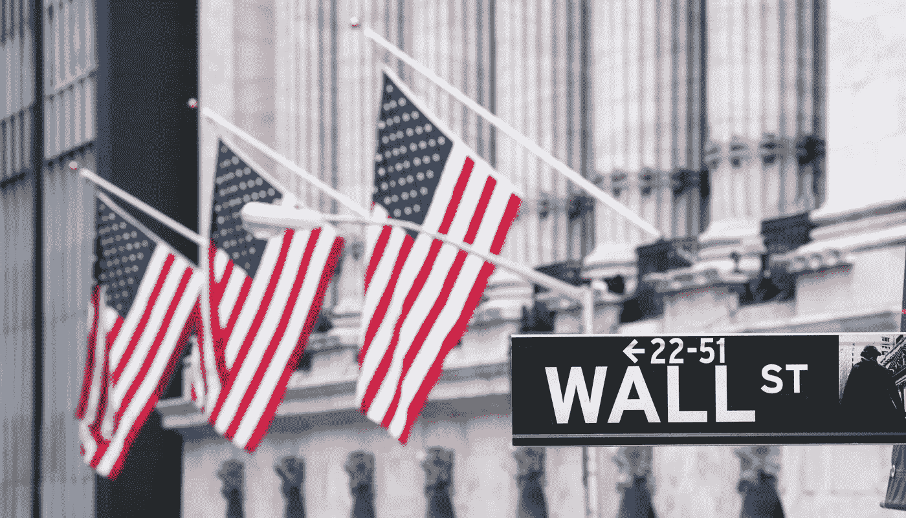
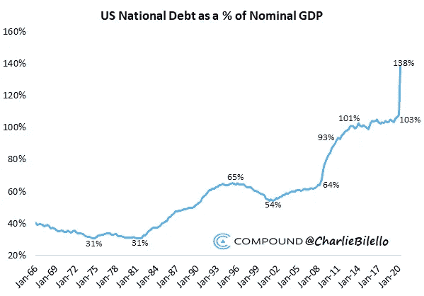
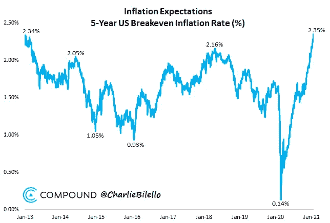

# 闭着眼睛也能炒股赚钱

> 原文：<https://medium.datadriveninvestor.com/you-can-make-money-in-stocks-with-your-eyes-closed-4e153b1c91fd?source=collection_archive---------12----------------------->

为了保持股市稳定，央行行长们将“大动作”，在 2023 年前将利率保持在接近零的水平。

显而易见，股票市场完全脱离了实体经济。

以去年为例。当美国失业率处于历史最高水平，整个地球处于封锁状态，数百万小企业永远关闭的时候，标准普尔 500 却在享受一场世纪派对。

毫无疑问，这场疯狂的主要原因是央行行长们的行动。他们总是冲进市场，就像过度保护的父母在第一次出现麻烦的迹象时冲向啼哭的婴儿。他们没有让股票经历一个健康的经济周期，而是将利率降至零，并印更多的钱。

因此，股票市场已经十多年没有经历过持续的熊市了。

换句话说，市场不再自由。在自由市场中，有自然的繁荣和萧条周期。价格根据供求关系上下波动。最重要的是，当资产被高估或低估时，它们最终会回归现实。然而，在当前的市场中，情况并非如此。

*那么这一切对你来说意味着什么？*

你必须明白一件事。**当中央银行印钞票时，钞票流向大公司，这些公司回购自己的股票，大部分印出来的钞票最终进入股票市场。**

为了保持股市稳定，中央银行将“大动作”，正如美国立法者几次所说的那样。在印钞方面，它们在全球范围内协调得非常好。

# 直升机撒钱

仅去年一年，美联储就在几个月内印刷了超过 3.3 万亿美元。下一个 1.9 万亿美元的刺激计划正在进行中。

想一想。**在过去的 12 个月里，美元供应量增加了 40%** 。换句话说，美国在过去的 12 个月里几乎比前两个世纪印了更多的钱。

除了印钞，美联储承诺在 2023 年前保持零利率。

2008 年金融危机后，他们印了数千亿美元。现在他们正在印刷数万亿美元。而且毫无疑问，未来会是几十万亿美元。

所有这一切在我看来都是疯狂的。我不会花时间争论股票是被高估了还是被低估了，但我知道只要中央银行印钱，股票就会上涨。这是货币供应量增加的自然结果。

这是一个混乱且不可持续的世界，富人越来越富，穷人越来越穷。不管我喜不喜欢，这就是游戏的运行方式。

# 对即将到来的通货膨胀的担忧

此外，人们有理由担心通胀。看到美国通胀预期飙升至 2012 年 9 月以来的最高水平，我并不感到意外。

正如彼得·希夫所说，

> "美国即将经历世界历史上最严重的通货膨胀时期之一。"

因此，如果你想对冲通胀并获得可观的回报，股票是最安全的选择。你所要做的就是维持短期波动和小的市场调整，你就会大赚一笔。

为了客观地看待这个问题，让我们来看看过去十年的资产表现。**美国大盘股和纳斯达克的年复合增长率分别为 14.1%和 21.3%，而债券、黄金和房地产甚至没有覆盖实际通胀。**

简而言之，如果你买了标准普尔 500 指数，并一直持有到 2023 年，你会看起来像个天才。