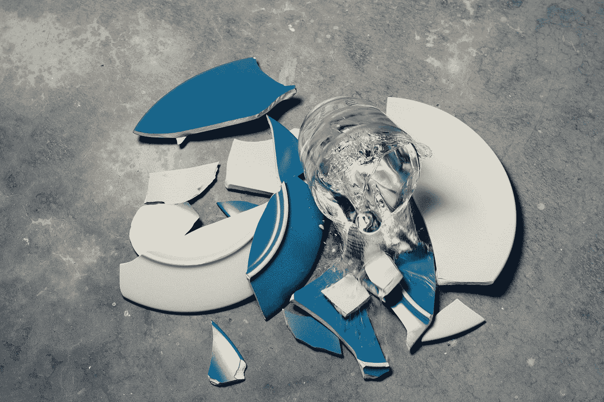

# 你不需要修理！

> 原文：<https://medium.datadriveninvestor.com/you-do-not-need-fixing-517d4607977b?source=collection_archive---------30----------------------->

## 首先，你不是一块需要修补的瓷器。

Photo by [CHUTTERSNAP](https://unsplash.com/@chuttersnap?utm_source=medium&utm_medium=referral) on [Unsplash](https://unsplash.com?utm_source=medium&utm_medium=referral)

最近，我一直听到这样描述人们，说他们内心破碎扭曲。似乎太多的《实习医生格蕾》粉丝正在传播该系列的行话，人们开始这样描述自己。可悲的是，他们真的相信自己是。

我不相信人会崩溃，我相信人需要支持和理解。地球上的我们比以往任何时候都多，正因为如此，我们越来越感觉不到被倾听和理解。

 [## 在家工作如何提高我的工作效率|数据驱动型投资者

### 在家工作确实激发了我最大的潜能，让我更有效率。因为在家工作给了我…

www.datadriveninvestor.com](https://www.datadriveninvestor.com/2020/07/29/how-working-from-home-increased-my-productivity/) 

人们因独特和打破常规而茁壮成长。但是寻求帮助并没有错，和其他人或多或少是一样的。每个人都希望快乐，被倾听，健康，以及所有能让自己完整的事情。

过去，歌手们是以邻家女孩或邻家男孩的形象来宣传的。现在穿着肉衣服，甚至脸上都有纹身，或者任何让你脱颖而出的东西，除了你的才华，或者个性，让你与众不同。

现在不要错过理解我，我不反对人们表达自己，但这与让人们以被理解为目标相去甚远。我们不应该排斥与我们不同的人，但我们也不应该忽视与我们不同的人。我想那就是我想去的地方。

你不会因为社会向你灌输这一点而崩溃。如果你有精神疾病，你是好的，只是需要一点支持和理解。寻求帮助是可以的。我们都有抑郁和焦虑的倾向，因此，我们都应该明白生活是一场过山车，获得帮助是一种人权，而不是一种弱点。

要坚强，要爱自己。没有人是完美的，这就是我们美丽和独特的原因。只要努力成为你自己，确保你学会了解自己，爱自己本来的样子。

在自己是谁的问题上与自己斗争，试图塑造自己只是为了取悦你周围的人，只会伤害你，最终你会不知道自己是谁，甚至可能不喜欢自己。

## 访问专家视图— [订阅 DDI 英特尔](https://datadriveninvestor.com/ddi-intel)