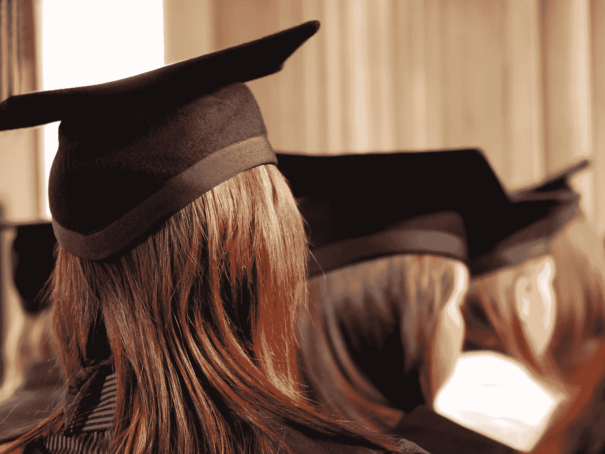

# 你上学不是为了变得富有

> 原文：<https://medium.datadriveninvestor.com/you-dont-go-to-school-to-become-rich-c4ad82cf4def?source=collection_archive---------2----------------------->

## 大学学位是一笔宝贵的财富，但前提是你不认为教育仅限于三年或四年的学位。

Photo by [Brett Jordan](https://unsplash.com/@brett_jordan?utm_source=medium&utm_medium=referral) on [Unsplash](https://unsplash.com?utm_source=medium&utm_medium=referral)

我最近给[写了一篇文章](https://medium.com/the-capital/is-it-okay-to-talk-about-money-with-your-children-b6601054ff94)，在文章中我谈到了罗伯特·清崎的书《富爸爸，穷爸爸》，以及该书对儿童理财教育的观点。

在他的书中还有一个反复出现的主题:罗伯特主张学校和高等教育对于经济成功来说是多余的。他经常把他的“富爸爸”和他的“穷爸爸”相比较，富爸爸高中辍学，但设法成为一名成功的商人，穷爸爸受过高等教育，但总是与钱作斗争。对于作者来说，“学校教你如何为钱工作，却不教你如何让钱为你工作”。所以如果你想变得富有，就不要去上学？

这对我来说似乎有悖常理，因为来自一个移民家庭，我一直认为高等教育是获得高薪工作和与本国人处于同一水平的手段。当我小的时候，我经常听说如果我在学校表现好，我会有更多的工作机会和高薪工作的保障。

> 教育，超越了人类所有的其他手段，是人类状况的最大平衡器，是社会机器的平衡轮。
> 
> —霍瑞斯·曼

进一步研究教育和财务成功之间的关系，我发现了一些有趣的数字:[在进入福布斯 400 强的人中，6%的人没有大学毕业](https://www.forbes.com/sites/angelauyeung/2017/10/19/high-school-billionaires-2017-forbes-400/#7b3f39a43262)。美国最富有的 400 人中有 6%的人只有高中学历，或者没有上大学就辍学了。这个比例很低，所以如果大学毕业，人们更容易进入福布斯 400 强，但这不是必要条件。

收入和财富也是两回事:虽然高收入通常与你的教育水平有关，但财富来自你管理金钱的方式。大多数进入福布斯 400 强的人都是投资的企业家:你自己创业时赚的钱不能和你为别人工作时赚的钱相比。

为了在生活中拥有某种安全网，拥有大学学位是很重要的，但你挣多少钱不仅仅取决于你的学位，还取决于许多其他因素:你选择专攻的领域很重要，但我认为最重要的是，这取决于你的表现和你对学习的心态。

我认为，年轻学者必须避免陷入的一个陷阱是，认为他们拿工资是因为他们拿到了好学位。“去上学，好好工作，以后你会有一份好工作和一份好薪水”这句老话已经不再正确了。

如今，在职场上，你不能因为毕业于一所好学校就认为自己有收入。不，你得到报酬是因为你的技能和你学习对工作有用的技能的能力。你会因为你带来的价值而得到报酬。一个好的学位可能会帮助你打开职业生涯的大门，但这并不足以也不需要你找到一份高薪的工作。虽然大学学位确实经常被用作求职的筛选工具，但它与你在职业生涯中的表现没有直接联系。

上周，我和我的一位同事进行了一次讨论，她向我吐露说，她害怕有一天自己会失业。起初，我真的很惊讶，我在想:“嗯，你三十岁了，你很年轻，而且你有一个很好的学位。你怕什么？”。但后来她告诉我，她听说过一些人在同一家公司呆了很多年，在职业生涯快结束时，他们在 50 岁时就失业了，因为他们一直在做同样的工作。然后我意识到，如果我不清醒过来并采取行动，我可能会成为这种情况下的一员:在不知不觉中，我屈服于一种权利心态，认为我的学位足以保证我一生都有一份好工作。

> “不管原因是什么，它感染了我们所有人，我们必须将这种权利感视为一种诅咒。
> 
> 这让我们忽略了现实——人们没有内在的理由仅仅因为我们是谁就信任或尊重我们。
> 它让我们变得懒惰，满足于最微小的想法或工作的初稿。
> 
> 当我们觉得自己已经很棒的时候，为什么还要提高我们的水平或者努力提高自己呢？"
> 
> ——罗伯特·格林《人性的法则》

教育或我们今天在学校学习的方式的问题是，它经常过于关注你获得的分数。在工作场所，分数不再重要。我见过我的一些同事，他们获得的学位比我低，但升职却比我快。有的时候，你拥有的少了，你争取的多了，付出的努力也多了。当事情变得太容易时，你可能会变得懒惰。

我认为，在学校里，我们不能学会变得富有(这也不是学校的职责)，这是正确的，但我不认为学校是无用的:我认为这完全取决于你对学习的心态。如果你在学校，只是为了获得好成绩和学位，那么是的，我同意这不是真的有用。但是如果你认为你在学校是为了学习技能和有机会使用你的批判性分析，那么这些工具将对你一生有用。也许这些技能可以帮助你变得富有(如果这是你的目标)，因为你总是努力学习和提高自己。

> “在学术之外的现实世界里，
> 需要的不仅仅是成绩。我听说它被称为“勇气”、“放肆”、“胆量”、“胆量”、“胆量”、“胆大妄为”、“狡猾”、“胆大妄为”、“坚韧不拔”、“T4”、“才华横溢”。"这个因素，不管它被称为什么，最终决定一个人的未来比学校成绩更重要."
> 
> ——罗伯特·t·清崎《富爸爸，穷爸爸》

**感谢你阅读我的故事。欢迎在下面评论！**