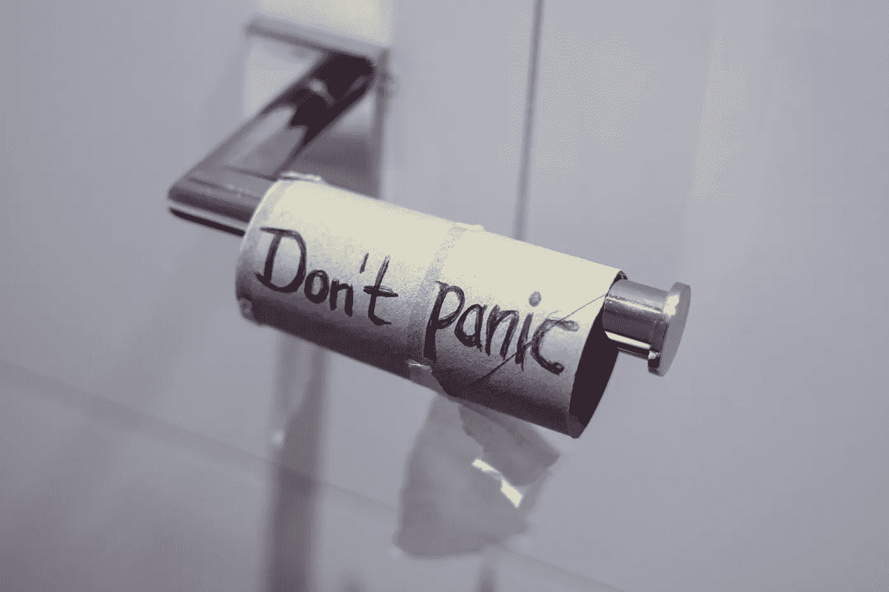
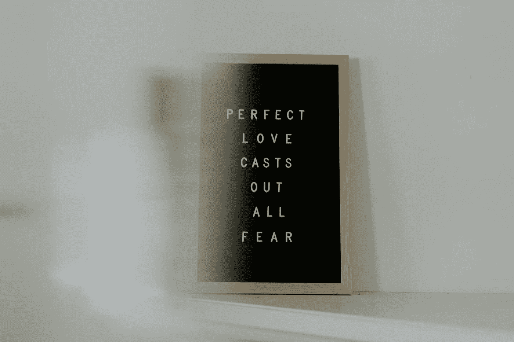

# 你不必惊慌

> 原文：<https://medium.datadriveninvestor.com/you-dont-have-to-panic-f9d3706d4c29?source=collection_archive---------23----------------------->

抓狂是一个你不必选择的选项(二手灵感项目)

Photo by [Jasmin Sessler](https://unsplash.com/@open_photo_js?utm_source=unsplash&utm_medium=referral&utm_content=creditCopyText) on [Unsplash](https://unsplash.com/s/photos/panic?utm_source=unsplash&utm_medium=referral&utm_content=creditCopyText)

二手灵感项目从一句激励性的引语开始，在创造性道路蜿蜒的任何地方冒险。

> “亲爱的，在仇恨中，我发现我心中有一种不可战胜的爱。在泪水中，我发现我内心有一个不可战胜的微笑。在混乱中，我发现我内心有一种不可战胜的平静。通过这一切，我意识到…在隆冬，我发现在我心中有一个不可战胜的夏天。这让我很开心。因为它告诉我们，无论这个世界对我施加多大的压力，在我的内心深处，总有某种更强大的东西——某种更好的东西，在推着我。”—阿尔贝·加缪

还记得你在全球疫情和经济衰退前的“正常”生活吗？它可能没有像目前新冠肺炎引发的混乱那样受到那么多不确定性、焦虑和不稳定性的破坏，但你紧张的工作日和疯狂的日程安排肯定没有压力。

但你应付了。

你挣扎但忍耐。你失败了，但后来成功了。你求助于任何能让你理解这一切的东西——你的家庭、创造性的努力、健康、信仰、事业、音乐、冥想等等。

如果那时候激动不是一个选项，为什么现在是一个？

当整个世界都在下沉时，很难踩水。累死人了。它需要一种全新的能量，你甚至不知道它的存在。虽然有些事情你每天都必须做，但也有很多事情你可以原谅自己没有做。

 [## 良好的生活是习惯的形成|数据驱动的投资者

### 过度思考是过度紧张。仅仅几个简单的习惯就会在一天中产生巨大的影响。那是…

www.datadriveninvestor.com](https://www.datadriveninvestor.com/2020/01/17/a-good-life-is-habit-forming/) 

让焦虑压倒你的情感勇气就是其中之一。

不管你信不信，感到无助和不知所措是一种选择。在危机时刻可能看起来不是这样。但是，如果你允许恐慌发生，它会偷走你的常识并带走它。

但我明白了。我也是一个偶尔变得不知所措的人，因为要照顾需要我关注的女儿和妻子，要求工作截止日期，写抱负，锻炼目标，公民责任，家庭装修项目，宠物饲养，监控财务等。

然而，我还没有以自我为中心到声称我是唯一一个感到困惑的人。我们都是。即使完美组合的人也会经历失望和绝望的日子。

Photo by [Priscilla Du Preez](https://unsplash.com/@priscilladupreez?utm_source=unsplash&utm_medium=referral&utm_content=creditCopyText) on [Unsplash](https://unsplash.com/s/photos/fear?utm_source=unsplash&utm_medium=referral&utm_content=creditCopyText)

欢迎来到现代生活。但是，如果你是一个成功者，迟早会有职业建议、指导文章和令人沮丧的消息充斥你的电子邮箱和社交媒体，你可能会被你无法胜任的想法击垮。

没有人能免于这种感觉。重要的是我们如何处理它。

我不得不承认，有时我在管理这方面很糟糕。我经常因沮丧而愤怒，翻阅脸书寻找更快乐的人，或者独自逃离烦恼。最近的冠状病毒和财务问题的内在紧迫性只会放大这种习惯。

就像蓝草一样，压力是一种杂草，它遮挡了所有的阳光，阻止你成长。感觉你必须逃离所有的压力，但你找不到一个地方带你远离它。这种感觉经常束缚着我。

但是事后来看，如果你失去控制和恐慌，那么你就是屈服于外力。你让他们把你拖垮了。如果你这样做的次数足够多，你可能就再也起不来了。

当我开始失去勇气时，我的做法(或我打算的做法)是专注于我的激情。我找到我喜欢做的事情，兴奋地做着白日梦，或者给我平静。在一片混乱中重新引导负面能量并不容易，但这种努力是值得的。

我努力释放一些焦虑。我潜心写作——创作新的诗歌、短篇小说和个人提升文章，释放我的紧张情绪，暂时让我置身于一个不同的世界。我读书是为了享受。天气允许的话，我甚至坐在户外，让大自然下意识地治愈我的情感创伤。有时候我甚至会向一个信任的朋友发泄，让他们给我提供一个另类的视角。

不管是什么，你必须找到适合你的方法。但是你必须赢。你不能完全屈服于不知所措的感觉。我是说，还有什么选择？你输了就放弃了？还是放弃，失去？

这些都不是可行的选择。你的家人、朋友、客户和同事都依靠你来保持这一切。

你并不孤单。但是除了你自己，没有人能真正解决你的焦虑。花一点时间想一想可以将紧张的精力转移到有益的事情上的心理技巧、疗伤的地方、积极的活动和身体上的努力。

你不必惊慌。屈服于混乱并不能让它变得更好。这只会让事情变得更糟。

阿德里安·s·波特是一名作家、工程师、顾问和演说家。他写诗歌、短篇小说和各种主题的文章，包括创造力和个人成长。他是诗集[和散文集](https://www.amazon.com/Everything-Wrong-Feels-Adrian-Potter/dp/109519061X/ref=sr_1_4?qid=1560264651&refinements=p_27%3AAdrian+S.+Potter&s=books&sr=1-4&text=Adrian+S.+Potter)[的作者。在](https://e2857002-6118-41be-9746-64261e36cacb.filesusr.com/ugd/21d2c2_03522f10c7c84340a05a8d03a97e1642.pdf)[http://adrianspotter.com/](http://adrianspotter.com/)在线拜访他。

# 附加文字

有太多的理由让你生气

[停止进给混乱](https://medium.com/datadriveninvestor/stop-feeding-the-chaos-a0c0ea207593?source=friends_link&sk=54793e2036f072daa1754da3de08f1a1)

[悲观的乐观者](https://medium.com/@adrianpotter/the-pessimistic-optimist-28df61c85169?source=friends_link&sk=96aaa2da3329f0ff9a3f912df3c94b6d)