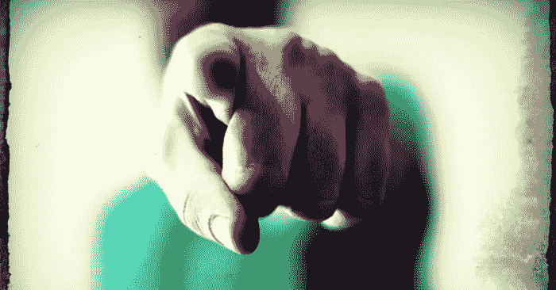
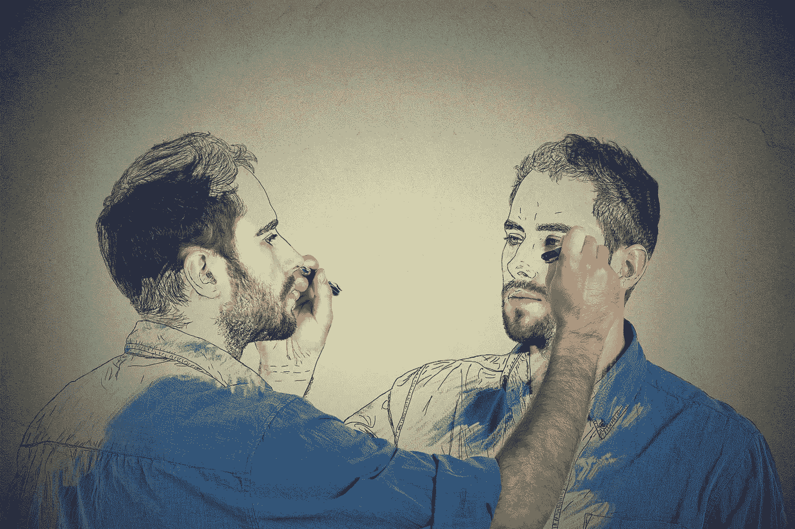

# 你不知道该怎么办。是真的吗？

> 原文：<https://medium.datadriveninvestor.com/you-dont-know-what-to-do-is-it-true-d70fb49976c?source=collection_archive---------3----------------------->

## 如何重新回到当下&知道该做什么？

## 形势

我已经决定开始我作为企业家的日常工作。一天的工作开始了，我坐在我新创建的家庭办公室的椅子上。我决定今天写一篇文章。我能感觉到肚子里的紧张兴奋，就像二十年前我开始第一份工作时的感觉一样。

我今天有很多选择要做。应该在 Medium 还是 LinkedIn 上发布？还是两者都有？我应该写些什么？我去年的媒体文章怎么样？我应该修改后再发布吗？我该不该删旧帖？这将如何影响它的观众？等等，我不应该专注于我的书吗？不，我已经考虑过了。我应该坚持我的决定，先写一篇文章，以后再来写我的书。

就在那时，不知从哪里冒出了一个产生压力的想法。

> **“不知如何是好”。**

Photo by [JESHOOTS.COM](https://unsplash.com/@jeshoots?utm_source=unsplash&utm_medium=referral&utm_content=creditCopyText) on [Unsplash](https://unsplash.com/s/photos/stress?utm_source=unsplash&utm_medium=referral&utm_content=creditCopyText)

**在相信那个想法是真的那一刻，我失去了与当下的联系——这是我唯一可以用来写文章的时刻**。在我不知道的情况下，我的注意力从手头的工作上移开了。在我能利用我的时间做任何有意义的事情之前，我开始投入精力去证明或否定我的想法。

## 询问(或者我如何与当下重新连接？)

## 问题 1:是真的吗？

我深吸一口气，问自己第一个问题。

> **我不知道该怎么办，这是真的吗？**

我不去想答案，答案可能是“是”也可能是“否”。相反，我允许“是”或“否”从我内心浮现。

在这一刻，它是肯定的。我吸进答案，让它填满我。

## 问题 2:真的能知道是真的吗？

是时候问自己第二个问题了。

> **不知道怎么办，真的能知道是真的吗？**

当我对着我的内在意识呼吸时，答案又出现了。“是的”。

## 问题 3:当你相信那个想法时，你会有什么反应，会发生什么？

我喜欢第三个问题。它是对我体验内心世界的公开邀请，没有任何滤镜。这是一个见证自我行动的机会——做着吃力不讨好的工作，帮助我在一个“危险的世界”中“生存”。

> **坐在我新创建的家庭办公室的椅子上，当我相信我不知道该做什么的想法时，我会有什么反应，会发生什么？**

当我相信这个想法时，我就失去了与当下的联系。在我的脑海里，我开始收集我过去的影像。我看到了一部我在之前工作中失败的心理电影，因为我不知道该做什么。我开始想象未来我会再次失败，因为我不知道该做什么。我注意到我在椅子上变得不舒服。我再也坐不住了。我的手开始伸向我的手机，我开始漫无目的地点击应用程序，检查我的电子邮件，摆弄我的笔，强迫性地在我桌子上的文件周围移动。

 [## 摔倒不是失败。数据驱动的投资者

### 你只有在放弃的时候才会失败。每个英雄都会倒下，我们活着就是为了失败者出现的时刻；上升到…

www.datadriveninvestor.com](https://www.datadriveninvestor.com/2019/01/17/falling-isnt-failing/) 

我的心也不能再平静了。它开始被一连串的想法分散注意力，一个压力导致另一个压力。人们对我的工作会有什么反应？我会给人留下相当愚蠢的印象吗？心理比较开始模糊我的思维。更聪明的人会用其他方式来做这件事。我开始觉得自己缺少了别人拥有的东西。不像他们，我永远不会有成功的条件。

我发现我从椅子上站起来，去厨房抓东西吃。我并不真的饿，但我还是吃了点东西。回来的路上，我打开 YouTube app，随机看了一些关于选举和冠状病毒的视频。暴饮暴食和狂看都开始让我对自己感到不安。然而，我并不一定要停止这些行为。我一直告诉自己——这只是最后一口，也只是最后一个视频。我喜欢这种分心让我远离不知道该做什么的不愉快想法。

当注意力分散结束时，沮丧和愤怒再次浮现。我的想法和感觉是如此可怕，以至于我想躲在远离这个世界的某个地方。一个电话打断了我的思绪。我发现我不想接那个电话。当我有这种感觉时，我不想和任何人联系。任何进入我的空间和时间的人都开始觉得自己是一种威胁，我需要保护自己免受其害。他们现在想从我这里得到什么？他们就不能让我在和现实世界中的任何人或任何事打交道之前把这些乱七八糟的事情弄清楚吗？我在接还是不接这个电话之间犹豫不决，一直等到电话铃声停止。现在，我对自己的判断变得更加苛刻。我开始对自己做任何事情的能力失去信心。我开始判断我的生活，看它是否值得。

在我意识到这一点之前，我已经浪费了几个小时的宝贵时间在无意义的聊天上。我也失去了与现实世界的联系——我甚至真的不在这里。我本可以用我的时间、精力和注意力做一些有意义的事情。我对自己和生活感到彻底失望。

没有人可以责怪我的沮丧，我开始把矛头指向这个我称之为“我自己”的人。

***1。在那一刻，我对自己有什么感觉？***

我对自己感到沮丧，因为它不知道该做什么。

**2*。在那一刻，我想从自己身上得到什么？***

我希望我的自我保证我的下一步是正确的。

***3。在那一刻，我对自己有什么建议？***

我应该给我一个机会来证明我的能力。

我的自我不应该在我的道路上设置障碍。

***4。为了让自己快乐(而不是沮丧)，我需要自己做什么？***

我需要我自己给我成功的公式。

***5。那一刻我对自己有什么看法？***

我的自我是困惑的，复杂的，无助的，可怕的，刻薄的，不友好的。

***⑥。关于我自己，有什么是我再也不想经历的？***

我再也不想不确定该做什么了。

我再也不想怀疑自己了。

## 问题 4:如果没有这个想法，你会是世卫组织，你会怎么做？

第四个问题一开始可能有点吓人。毕竟，**没有那个念头，我怎么知道** **是什么？然而，这个问题有能力改变我的生活，因为它提供了一个机会，让我开阔视野，以一种有意识的方式重新创造我的生活。**

Photo by [pathdoc](https://stock.adobe.com/contributor/201541381/pathdoc?load_type=author&prev_url=detail) on [Adobe](https://stock.adobe.com/images/create-yourself-concept-good-looking-young-man-drawing-a-picture-sketch-of-himself/97981824)

为了有助于这个过程，我将把上面问题 3 中编号为 1 到 6 的陈述反过来。字面意思就像“这句话的反义词是什么？”这是一种练习，我试图找出在我的情况下“转句”可能是正确的。开始时可能会觉得奇怪，但当我超越我通常的思维方式探索我的现实时，我总是发现自己受到这些转变的支持。这个过程可以改变我，只要我敞开心扉去探索它带给我的一切。

> 坐在我新创建的家庭办公室的椅子上，我会是谁呢&如果我不知道该做什么，我会做什么呢？

**转向陈述 1**

*   在那一刻，我知道该做什么。

我注意到在那一刻

我知道我想写一篇文章。

我知道我想在媒体上写作。

我知道我想在 LinkedIn 上写作。

我知道我想谈谈我们的思想是如何把我们的注意力从当下转移开的。

我意识到我现在知道我需要知道的。不多不少。我现在所知道的足以在此刻采取行动。

**陈述 1 的另一个转变**

*   在那一刻，我不知道自己是谁。

我注意到，在我的想象中，有一个人非常聪明，当他们决定创业时，他们会幸福地生活在一起，没有困惑，没有恐惧，没有来回！我想成为那个人。我不想做我自己。我缺少别人有的东西。在我采取明智的行动之前，我不知道所有需要知道的事情。在我能在现实世界中行动之前，我需要调整自己，做更多的研究。

**我意识到**我知道自己是谁。做我自己看起来是这样的——我对什么可行，什么不可行有疑问。我对答案没有把握。因此，我尝试一些东西，看看什么有用，什么没用。犯错误是我学习的方式。通过反复，我想出了自己的做事方式。

**转向陈述 2**

*   在那一刻，我不希望我的自我保证我的下一步是正确的。

我注意到我对自己的不可能抱有期望。毕竟，知道我的下一步是否正确的唯一方法是采取行动，看看会发生什么。我怎么能预先给任何结果百分之百的保证呢？

我也注意到我的成功或失败不在于我实验的结果。我想起了托马斯·爱迪生的名言，他为制造一个商业上可行的灯泡做了 10，000 多次尝试。

> *“我没有失败过一万次。我从未失败过。我已经成功地证明了那一万种方法是行不通的。当我排除了那些行不通的方法，我会找到行之有效的方法。”*

我意识到只有一件事能让我对结果放心，那就是马上采取行动。

**转向陈述 3**

*   在那一刻，我的自我给了我一个证明自己能力的机会。

我注意到我在等待一个证明自己的机会。但是，我看不到它就在我面前。

我意识到这是一个证明自己的机会。我要么错过这个机会(就像之前我在自我怀疑中错过的所有机会一样)，要么抓住它！我在等什么？

**陈述 3 的另一个转变**

*   在那一刻，我的想法在我的道路上设置了路障。

我注意到我的想法已经把我的注意力从现在转移开了。当我相信这些想法时，它们让我远离写作。它们在我的头脑中引入了怀疑和恐惧，并阻止我从一开始就想做的事情。

**我意识到**没有那些想法，就没有什么好害怕的。而且，这些想法甚至都不是真的。我的世界的现实并不是我想象的那样(生活在我的道路上设置了路障)。事实上，现实真的更仁慈(生活在我的道路上放置路标|下一个里程碑:写这篇文章！)

**转向陈述 4**

*   在那一刻，我的自我不应该给我一个成功的公式。

我注意到没有成功的公式，因此，我永远不会从任何人或任何事那里得到成功。大呼气！感觉像是卸下了我肩上的重担。

我意识到我可以创造自己的成功公式——只对我有效的公式，直到它失效。然后我找到一个新的适合我的，以此类推。

**陈述 4 的另一个转变**

*   在那一刻，我的自我应该给我一个失败的公式。

我注意到我的想法是失败的真正公式，因为它们让我远离真正的行动。没有行动，就没有结果，也就没有学习。结果，毫无进展。然而，如果没有这些想法，我将一无所获。没有什么能帮助我重新发现现实并回到当下。

我意识到我的自我的工作是给我思想，我的工作是从“1”开始提问。是真的吗？”

**转向声明 5**

*   在那一瞬间，我的自我是/我思路清晰，方向简单，乐于助人，友好。

没有这个想法，我可以看到我对自己有一个简单的指示——写文章。我正在学习跟随我内心的指引。就像拜伦·凯蒂经常说的:“没有决定。无所畏惧。”

**转向陈述 6**

*   我愿意再次不确定该做什么。
*   **我愿意再次怀疑自己。**

是的，我是。每当我经历那个想法和相关的感觉时，我会记得我的注意力已经被一个甚至不真实的想法从真正的行动上移开了。我会委婉地提醒自己采取行动。

**声明 6 的另一个转变**

*   我期待着再次不确定该做什么。
*   **我期待再次怀疑自己。**

是的，我知道。困惑和怀疑的另一端是自由。我期待从思想的牢笼中解放出来。

*四个问题&转身是“拜伦·凯蒂的作品”教授的基于询问的减压技巧。*