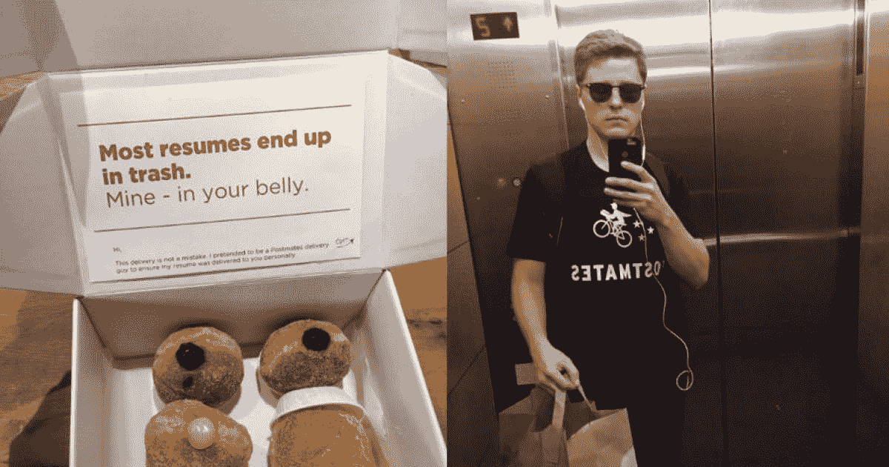
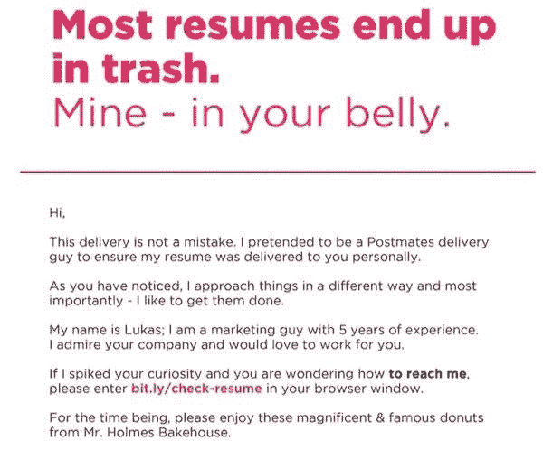
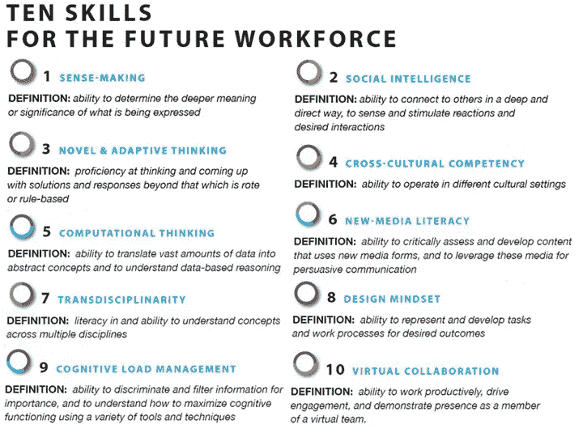

# 应对经济萧条的 15 个聪明策略

> 原文：<https://medium.datadriveninvestor.com/you-face-a-very-tough-job-market-now-but-you-can-still-thrive-2277bbc99660?source=collection_archive---------4----------------------->

## 你现在面临着一个非常艰难的就业市场——但你仍然可以茁壮成长

Photo by [Nitish Meena](https://unsplash.com/@nitishm?utm_source=medium&utm_medium=referral) on [Unsplash](https://unsplash.com?utm_source=medium&utm_medium=referral)

现在的毕业生面临着一个非常具有挑战性的劳动力市场。不幸的是，2020 年的电晕阶级，正如他们现在所说的，正面临着有限的就业前景，降低的工资，以及更高的失业风险。

外面是一场完美的风暴。

尽管有政府的大力支持，许多经济体还是陷入了长期的经济衰退。预计到 2020 年底，英国的青年失业率将突破 100 万大关。整个欧洲约有 6000 万份工作面临风险。由于冠状病毒疫情，美国的失业率预计将上升至 25%。自 3 月中旬以来，约有 5000 万美国人申请失业。

随着全球冠状病毒病例增加到 2500 万，世界经济现在面临着健康危机和金融危机。由于各国实施隔离和社会距离的做法来遏制疫情(大封锁)，经济崩溃的规模和速度是我们有生以来所未见的。这是自 20 世纪 30 年代大萧条以来最严重的全球衰退。

早在 2019 年 9 月，我就写过[如何为经济危机做准备。我们正处于一场严重的经济危机之中。市场崩溃，工作岗位消失。整个行业正在被颠覆和重塑。我们认为安全的一切(学位、工作、政府、机构、全球贸易体系、世界经济、医疗体系)都在崩溃。许多员工面临着更大的工作不安全感——包括减薪、减少工作时间、休假或裁员。](https://medium.com/@fahrikarakas/we-will-face-a-full-blown-international-economic-crisis-soon-here-is-how-you-prepare-for-it-c5d93ef2fac6)

如果你在这个充满挑战的时期加入就业市场，会发生什么？你将如何度过这场危机？在这个时代，你将如何生存和发展？在这篇文章中，我将为你提供 15 个基于证据的聪明策略来成功度过这场危机。

# 1.深呼吸，培养内心的力量。你的士气、健康和幸福现在是最重要的。

没有什么比你的健康和幸福更重要了。首先，你需要照顾好自己。你的健康和幸福现在是最重要的，你需要好好照顾自己，尽你所能做到最好。

在危机中，恐慌对你没有任何帮助。恐惧、惊慌和压力不是解决办法——你需要变得更聪明。着眼长远，培养你内心的成长和力量。就业市场和这个世界需要你成为一个理智、健康、积极的人。在这些时候，尽管看起来很混乱，但你内心的力量比以往任何时候都重要。所以，请努力在智力上、精神上和情感上增强自己。现在是时候成为一个强有力的求职者和伟大的榜样了。现在不是恐慌和关注问题的时候。

我的建议是:尽可能保持积极和创造性。慢慢来。深呼吸。尽量不要关注太多的新闻——在一个小时的新闻和社交媒体后会变得令人沮丧。我们都经历过。你需要放下它，继续在新闻和社交媒体上间歇性禁食。确保你和你爱的人度过高质量的时间。健康饮食。锻炼——坚持运动和散步。

# 2.保持最佳状态。发展你在就业市场的竞争力。

就像生活中其他有意义的事情一样，要想擅长找工作需要付出很多努力和尝试。当你毕业的时候，你不仅仅是找到了一份好工作。你要和一群非常有竞争力的候选人竞争——可能有 100 个或更多——他们和你一样想得到那份工作。所以，把这想象成一项像职业奥运会一样的竞技运动。你需要很大的热情、勇气和胆量才能被录用。

你必须尽可能保持最佳状态，润色和更新你的简历，发出 100 多份求职申请，还要想出有创意的方法来引起别人的注意。你是否在不断完善和提高你的就业技能？你在哪些方面可以继续变得更好？为了保持最佳职业状态，你每天都在竭尽全力吗？你是否不断地在简历中加入技能、经历和学习内容？

# 3.发挥创造力:甜甜圈简历

考虑求职申请的另一种方式是发挥创造力。你可以避开“红海”(充满血腥的竞争水域)，在自己的蓝海(你去探索、发现和尝试的未知领域)中航行，而不是去竞争。这里有一个很吸引人的例子，一个优秀的候选人写了一份“甜甜圈简历”。

Doughnut CV (Picture: Lukas Yla)

25 岁的立陶宛营销专业人士 Lukas Yla 用一盒油炸圈饼投递了他的简历。他向旧金山的营销机构和科技公司投递了 40 份甜甜圈简历。他参加了 10 次工作面试。

创意的另一个很好的例子是拿出你的视频简历。以下是给我印象最深的一个视频简历，我经常在课堂上使用它作为终极视频简历的一个例子:

在这两个例子中，求职者在他们的求职申请中变得狂野而富有创造性。他们拒绝参加比赛中占主导地位的比赛。他们创造了自己的游戏，他们可以在最高水平的比赛中脱颖而出。他们把自己的创造力作为天赋，为自己和世界创造了一个新的可能性空间。是时候让你的思维超越任何限制，承担风险，在工作申请中发挥创造力了。你如何将你的创造力作为礼物？你如何能创造你自己的游戏，在那里你能成为最好的？

# 4.写日记来反思、学习、发展和进步。

当我 2009 年完成博士学位时，我们正处于全球经济危机之中。那时的就业市场非常糟糕，我不得不在那一年申请了 110 多份工作。在那些日子里，帮助我保持理智的是记日记，写下我的情感、挫折和目标。我会给自己写信和写晨报，反思我的优先事项、错误和学习目标。为了每天取得一点进步，我会制定尽可能小的行动。在最困难和不确定的时期，这本杂志是我的良师益友。

每当你不知所措的时候，就在日记里写下 20 分钟。捕捉你的意识流，不要审查任何东西。把你所有的焦虑写在纸上。确保你倾听你的恐惧，并让他们被听到。最好的方法就是反思和写作。每当你把事情写下来的时候，你会感到更加强大和解放。

 [## 对有商业头脑的投资者有用的行为经济学概念|数据驱动的投资者

### 在美国企业界，高斯统计，对我们周围世界的确定性解释，以及理性…

www.datadriveninvestor.com](https://www.datadriveninvestor.com/2020/07/09/helpful-behavioral-economics-concepts-for-the-business-minded/) 

对自己非常诚实，知道生活中什么是顺利的，什么是不顺利的。你会从一个感恩的点出发，去欣赏生活中所有美好的事物。然后，你会思考你的差距和所有你需要改进和变得更好的地方。清楚你面前的所有障碍、挫折和困难。为这些问题创造解决方案。记日记会在以下方面给你极大的帮助:

*   确立你的关注点、优先事项和目标，
*   打造你的知识和洞察力，
*   培养你的自信，向自己确认你的目标是具体的、可实现的，
*   阐明你最新的想法和观点，
*   精心制定实现梦想的战略计划，以及
*   对生活中所有美好的事情心怀感激。

# 5.要灵活，适应性强。根据需要旋转。不要放弃希望，像凤凰一样从自己的灰烬中重生。

认识到这一点:市场不欠你一份工作。一场深刻的经济危机正在进行，你需要在求职时非常灵活。准备好发出 100 多份工作申请——在经济危机期间申请很多工作是很常见的。2008 年金融危机后，我申请了 110 多份工作，都遭到了绝大多数人的拒绝。虽然我认为我是一个优秀的候选人，但当时我只得到 6 次面试机会。为最坏的情况做好准备，这样你就可以制定应变能力和替代计划。你会失败很多次，这没关系。不要对自己太苛刻。当你失败时，试着吸取教训，爬起来。你需要做些什么来继续前进？

对你未曾计划过的突发机遇保持开放。如果你所在的地区、城市或国家没有工作，准备好离开那个地方。开始新的冒险。申请世界各地的工作。无论你在哪里遇到一个机会或提议，去那里抓住它。

在这场危机中，你是独一无二的变化和增长的准备。把这次危机作为一个机会，后退一步，重新思考你的优先事项，并投资于自己。例如，比尔·盖茨采取“思考周”的方式，让自己远离所有类型的工作和交流。他利用这几周时间思考、思考、学习和休息。盖茨说，他最好的想法往往是在这些“思考周”中产生的。

# 6.确保你对自己的生活和职业有长远的眼光。

> "你打算用你狂野而宝贵的生命做什么？"玛丽·奥利弗

如果你着眼长远，你可以从这场危机中获得巨大的增长。挖掘一些自我反省。什么对你来说是自然而然的？你天生的优势是什么？什么样的职业会让你感到精力充沛而不是筋疲力尽？确定你喜欢做什么，集思广益，打造一份符合你内心、思想和灵魂的职业。发展一个富足的视角，而不是匮乏的视角。如果可以通过创造突破性的价值来创造自己的就业呢？

写下为实现梦想你需要做出的主要改变。写下你的远大梦想和你的人生愿景(想想 10 到 15 年)。你的终极目标(大愿景)是什么，为什么它很重要？你如何将这个愿景分解成 3 个月的进度计划？

利用新的远程工作方式，包括在线团队平台、视频会议和协作工具。如今的工作需要与不同的分布式团队合作，在云上共同工作并解决问题。不要低估你的数字知识的力量。例如，如果你真的擅长 Instagram 或抖音，你可以利用这些平台为公司提供有效的营销和品牌价值。

# 7.磨砺你的工具包、知识、技能和视角。

投资自己，成为最好的自己。投资数字选择来提升技能、重新获得技能或为你的职业生涯充电。寻找免费的在线课程来发展和提高你的技能，这是就业市场所需要的。加入网上研讨会、研讨会和专业团体。Udemy、Coursera 或 Teachable 的在线课程让你探索未来工作场所所需的技能(见下表)。

Image [Source](https://marciaconner.com/ten-skills/)

这是扩展你的技能和提高你的知识的好时机。你可以养成更节俭的习惯，学习和尝试新的生活和工作技能，完成你感兴趣领域的 MOOCs。寻找对你来说令人兴奋和有趣的事情。当经济危机结束(希望很快)，你的生活恢复正常时，你会回顾过去，对你学到的东西心怀感激。在你周围所有的危机和疯狂中，你会因为学习和保持坚强而有成就感。

做一个自学者:一个自学成才的人，他/她主动管理自己的学习，如饥似渴地阅读。为自己的学习承担责任。走出你的舒适区，在你的学科之外学习。照常教育已经死了。终生学习万岁。

成为一个博学的人:一个人的知识跨越了大量的学科，以利用复杂的知识体系来解决特定的问题而闻名。要成为一个博学的人，就要扩大你的视野，阅读不同学科的书籍。对自己的学习要贪婪。超越学科范围广泛而多样地阅读。每年至少读 100 本书(也就是说每周 2 本)。

# 8.发展需求中稀有且有价值的技能。

投资 100 个小时在市场上稀有而有价值的技能上。试着选择一套你可以利用的互补技能。把 100 个小时的技能串在一起，这些技能是稀有而有价值的。如果你开发了一个独特的组合来帮助你建立一个 500 小时的资产呢？这将帮助你建立一个职业护城河。职业护城河就像一座中世纪的城堡——它会保护你免受任何压力或竞争。如果你能提供一种罕见的技能组合，你就不必担心就业能力。

秘密是这样的:你需要被工作邀请超额认购。想象一下，你让公司知道你收到了令人兴奋的邀请。摆好桌子，这样你就可以选择你想合作的公司(而不是相反)。

直到你有了那种杠杆，开发你稀有的技能和知识。你的技能的稀有性和价值是让你有工作的原因。例如，你可能知道如何使用复杂的软件或为 Kickstarter 类型的项目筹集资金。

# 9.为自己建立一个有创造力和生产力的系统。

试着创造积极有效的工作习惯。生产力的最大杀手之一是分心，家里有很多分心的事情。你可以使用计时器或番茄工作法来安排你的写作或创作实践。你何时何地工作最好？创造一个让你感到舒适的工作台或工作环境。你可以在自己舒适的家里培养创造性和生产性的习惯。

记住，创造力是情境性的，是可以培养的。我建议你每天创造 20 个关于金钱、职业、工作或未来的新鲜想法。写下来。让这种锻炼成为一种积极的习惯。你的大脑喜欢拼图。从新的角度着手你的工作是你现在的困惑。努力吧。一种方法是站在另一个人的角度。问问你自己:还有谁在研究这个问题？借鉴不相关的领域、实践和领域。给自己惊喜。

改变你思维的线路和条件:在你生活中的这个经济危机时期，你会发现或发展或写作或创造什么？你能给这个世界带来哪些新鲜有创意的想法？在你自己的工作中，你可以把标准定得足够高，这样你就可以把自己推向创造力和生产力的新高度。

# 10.为未来创造你的资产。

这是你重塑自我、为未来创造财富的机会。你可以利用这次危机作为重塑自我的机会。你可以专注于重新设计和重新想象你的生活和事业。阅读新书，听播客，创造许多想法，追寻你的好奇心。为自己提供更多的机会

*   想象力和创造力，
*   解决问题和创意，以及
*   资产创造活动。

忘记职业阶梯，开始创造你自己的资产。记住:想象力和资产创造是紧密相连的。想象并创造你自己的游戏。追随你的兴趣、好奇心和激情永远不会太晚。参加创造性的工作，使用随机提示或锚来开始。从小处着手——小即是美。你也许可以开始一个你一直想做，但你害怕的小创意项目。你的内心渴望什么？去吧。不要害怕犯错误——错误是你的朋友。在完成你的创造性任务或项目后，你应该与世界分享，这样每个人都会看到你的工作并享受它。分享你的激情和艺术作品，把它们放在那里让他人享受和受益，这是非常令人满意的。

改变总是令人沮丧和不舒服的，但这是前进的唯一道路。你需要拥抱失败。J. K .罗琳在出版《哈利·波特》之前被至少十几家出版商拒绝。星球大战被许多主要研究拒绝，直到它成为一个家喻户晓的品牌和价值 700 亿美元的特许经营。不要期待任何短期回报。不要因为失败和拒绝而气馁。庆祝你的失败，并把它们作为学习的机会。你需要培养更多的勇气和韧性，以便在失败后重新站起来。

记住:这是一场马拉松，你在进行一场持久战。如果你真的想长期走运，你需要给自己提供更多失败的机会。公式如下:

> **一贯的小动作+聪明的举动+努力+玩你的游戏**

一些最成功的领导者或投资者——以及创新型初创企业——都出现在经济危机时期。这是一个改变习惯，打造更好的自己的好时机。

向伟大的榜样学习。Flynn Blackie 是一个鼓舞人心的成功例子，他在 17 岁时就建立了自己的商业帝国:

 [## Flynn Blackie -董事- MOD Digital | LinkedIn

### 直到 2019 年夏天，设计网站和运行广告是 17 岁的弗林·布莱基的副业。花了 4…

www.linkedin.com](https://www.linkedin.com/in/flynn-blackie-866453185/) 

# 11.像企业家一样思考和行动。

经济正从知识工作转向企业家精神。能够在复杂和混乱的领域中运作正成为当今环境中最重要的能力之一。许多创造的就业机会来自小企业和初创公司——他们是颠覆者。我们看到有证据表明，创业已经成为新的主流职业——它实际上比稳定的办公室工作风险更小，回报更多。

在我们父辈的世界里，在大公司从事传统工作是有意义的——这是为生活提供保障的最安全的途径。然而，那个世界现在已经不存在了。在当今世界，成为企业家更安全，你需要像企业家一样思考和行动。稳定的工作会带来潜在的风险，让你容易受到经济冲击和灾难的影响。因此，有史以来第一次，走传统就业路线变得有风险。你需要学会如何抗脆弱，这要从结束对固定工资的依赖开始。现在，你需要掌控你的职业、金钱和未来。

现在，每个拥有笔记本电脑、手机和互联网连接的人都可以立即开始自己的事业。你不需要资本——我们已经进入了 100 美元创业的时代。你可以在几分钟内开始你的博客、YouYube 频道或播客。你可以利用众筹将你的新鲜想法、发明和创新带入生活。在这个新时代，你可以很快实现你的想法。你不需要机构的批准。你可以跟随你的激情和好奇心，与世界分享你的新想法，在这个勇敢的新世界中航行。新的工具和经济力量出现了，让你创造艺术，赚几百万美元成为可能；产生真正的内在成功(个人幸福和健康)和外在成功(完成工作和财富)。

# 12.找到你的蓝海，建立你自己的游戏。

为了发展你的利基，你需要去寻找自己的蓝海。走少有人走的路。避开人群和竞争。浏览未知的领域，找到你自己的空间，你可以建立自己的游戏。要么努力在你的特定话题或领域做到最好；或者创造/发明你将成为世界第一的类别。

我们的教育系统仍然停留在工业时代，尽管它现在已经结束了。这就是为什么你需要中断你的教育和你自己。超越课程，为自己的学习承担责任。你需要足智多谋，有韧性，有创造力。权利是你的敌人——你需要采取主动，对学习和发展技能持开放态度。

传统教育已死。职业阶梯断了。我们生活在泰勒·皮尔森称之为“极限之地”的 T2。在极端情况下，最糟糕的事情就是平庸。彻底改造和颠覆自己是唯一的出路。一场数字革命已经发生，每个人现在都是企业家和艺术家。我们不需要组织结构图、等级制度、工厂、标准化考试或大型生产车间。我们也不需要有线电视、大众市场和广播广告。我们现在正在经历一个无国界的、民主化的数字生态系统，每个人都可以产生巨大的影响。

我们生活在一个思想可以改变人们生活的世界。这意味着我们所有人都可以创建自己的游戏。事实上，创造自己的游戏从未如此重要。你现在可以设计游戏，创建自己的播客或 YouTube 频道，或者在 Kickstarter 上筹集资金。你可以写本书，和全世界分享你的声音。你可以在健康、保健或生产力方面创建自己的生活方式品牌。你可以创造新鲜和令人兴奋的数字产品(培训，课程等)。).你可以利用众筹来启动你的想法和项目。

In this video, Tom Peters offers 44 strategies to cope with economic recession.

# 13.培养一些爱好和兴趣。

这可能是你一生中最重要的时间和机会来重拾你的爱好。是的，这是一个令人沮丧的时期，很难保持头脑清醒。你经历焦虑和恐惧是很自然的。你需要坚持让你保持理智的活动和爱好。你喜欢做什么？你最想从事的活动和爱好是什么？列一个清单，尝试其中的一些。从事你的爱好将是你在这个时期做出的最好的决定之一。哪些活动和爱好能增加你的快乐和创造力？写作、阅读、博客、园艺、编织、解谜？不然呢？

比如我更喜欢涂鸦来增加快乐。它安抚我，帮助我慢下来。涂鸦不需要太多的时间和资源。你只需要一支铅笔、一个笔记本和 15 分钟。我每天都在涂鸦。一年下来，我已经意识到自己已经完成了上百张涂鸦。不知不觉中，一本书从我的涂鸦中脱颖而出。

My book: Self-Making Studio

这本书现在在全球 14 个国家销售。所以，永远不要低估爱好的价值。如果你坚持不懈地做一些小事情，并持续一段时间，你的爱好会非常强大。什么活动和爱好增加了你的快乐和创造力？为他们安排时间。帮自己一个忙，把爱好变成项目。

# **14。用你的想象力来逃避无聊，每天给自己惊喜**

我们正在经历艰难时期。要在如此困难的时期表现出色，你需要投资于你的想象力。每天花时间学习让你兴奋和惊喜的新事物。做一个最有趣事物的猎手和学习者。给自己提供更多纯粹玩耍、探索和冒险的机会。类似于比尔·盖茨的思考周，在你的日历中安排学习和探索新事物的时间。

我们生活在历史上最有趣的时代之一。如果你有一台笔记本电脑，一部手机和一个互联网连接，你可以立即成为一个企业家，建立自己的公司。你不需要资本。你可以接触到世界上所有的知识。你可以自学任何你想学的东西。你可以掌握和教授任何领域。你可以成为艺术家、企业家、教练、教师或顾问。当你学习新事物时，你可以与世界分享你的激情、好奇和创造。运用你的想象力创造你自己的创意资产，并与世界分享。跟随对你来说最有趣和最新鲜的事情。花在学习、实验、玩耍和探索上的时间不会被浪费。

我们生活在一个注意力最重要的数字经济时代。注意力是新的黄金——它是最重要、最珍贵、最受追捧的东西。谁获得关注，谁就震撼这个新世界。因此，制造好奇心、惊喜和病毒式传播成为个人最具战略意义的成功因素。成为一个讲故事的大师，茁壮成长，大放异彩。讲述自己的故事，打造自己的个人品牌，联系自己的粉丝和部落。

# 15.记住，这个世界需要你的创造力、贡献和好奇心。

创造你自己的冒险和你想玩的游戏。这需要激烈无畏的想象力，这是你必须培养的。这是你人生中建立自己的创意游戏的最好时机。为了创造你想要的未来，你需要建立你自己的游戏，而不是玩别人的游戏(例如，你的组织等)。).玩自己的游戏意味着你需要创造自己的长期资产。有些迷人的东西只有你能带给这个世界。新鲜的，令人兴奋的，原创的东西。它们是什么？你现在如何采取一个小小的行动来实现这些呢？你如何继续每天小步前进？你怎样才能每天继续你的冒险，而不放弃，不打破(创造的)链条？你会给外面的世界带来什么？你需要的一切都在你的内心。寻找你内心的力量，而不是向外界寻求答案。

想想 10 年后你会在哪里，然后按照那个愿景行动。你的梦想和抱负有多大，你就能有多大。所以，要有远大的梦想，要有明确的愿景，并在日记中记录下你的愿望和渴望。当你在设定目标的时候，一定要为 X 目标(未知目标)留有余地。x 目标是你现在看不到的目标，但是当你在未知的领域航行时，它就会出现。从长远来看，你如何将你的技能和资产结合起来？

# 外卖:

我知道在这段时间，事情是相当可怕和不确定的。你有时会感到被拒绝、失望和孤独。你可能会对未来的发展感到焦虑和压力。然而，你仍然有很多选择和行动。其中一些如下:

1.  深呼吸，培养内心的力量。你的士气、健康和幸福现在是最重要的。
2.  保持最佳状态。发展你在就业市场的竞争力。
3.  在求职申请中发挥创造力。
4.  写日记来反思、学习、发展和进步。
5.  要灵活，适应性强。根据需要旋转。不要放弃希望，像凤凰一样从自己的灰烬中重生。
6.  确保你对自己的生活和职业有长远的眼光。
7.  磨砺你的工具包、知识、技能和视角。投资于你的个人发展、学习和成长。这是你能做的最大的投资。
8.  发展需求中稀有且有价值的技能。
9.  为自己建立一个有创造力和生产力的系统。
10.  为未来创造你的资产。
11.  像企业家一样思考和行动。
12.  找到你的蓝海，建立你自己的游戏。
13.  培养一些爱好和兴趣。
14.  用你的想象力来逃避无聊，每天给自己惊喜。
15.  记住，这个世界需要你的创造力、贡献和好奇心。

确保你对每个外卖都采取一个小行动。确保你给自己很多尝试、失败、学习和发展的机会。如果你着眼长远，你将有机会发挥你的全部潜力，做对你来说重要的工作。

坚持住。最终，你会从这些困难中变得更加坚强。

## 法赫里·卡拉卡斯是自制工作室的作者。你可以在这里探索更多[。](https://selfmakingstudio.com/)

**访问专家视图—** [**订阅 DDI 英特尔**](https://datadriveninvestor.com/ddi-intel)