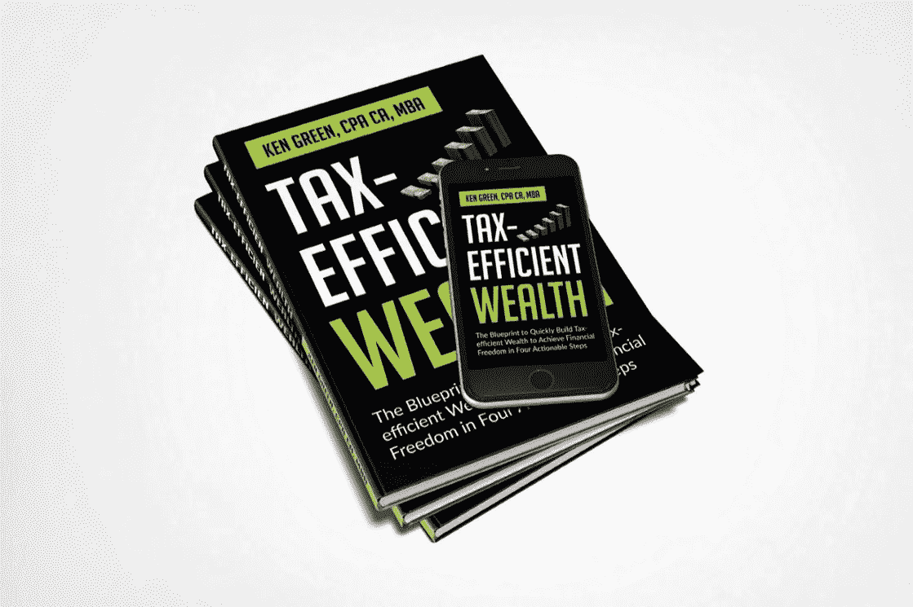

# 你有视力，但你没有远见…这是可悲的。原因如下

> 原文：<https://medium.datadriveninvestor.com/you-have-sight-but-you-have-no-vision-and-it-is-pathetic-here-is-why-c9554dae595b?source=collection_archive---------13----------------------->

## 为什么对你的生活有一个愿景是绝对必要的

Photo by [Sharon McCutcheon](https://unsplash.com/@sharonmccutcheon?utm_source=unsplash&utm_medium=referral&utm_content=creditCopyText) on [Unsplash](https://unsplash.com/s/photos/vision?utm_source=unsplash&utm_medium=referral&utm_content=creditCopyText)

> "唯一比失明更糟糕的事情是有视力却没有视力."——海伦·凯勒

首先，让我们定义一下什么是愿景。

约翰·葛拉罕在他的《蔻驰的角落》系列的第五部[中非常清楚地定义了这一点。](https://www.johngraham.org/coach/5-the-importance-of-vision)

“愿景是你想要达到的结果在脑海中的描绘。这是一张如此清晰和强烈的照片，它将有助于实现这一结果。愿景不是模糊的愿望、梦想或希望。这是真实努力的真实结果。它来自未来，通知并激励着现在。愿景是我二十多年来见过的帮助组织和个人获得他们想要的结果的最强大的工具。”

请注意约翰是如何得出结论的，他认为愿景是他职业生涯中见过的最强大的工具。他继续陈述为什么想象如此强大。根据约翰的说法…

愿景激励行动。一个强有力的愿景可以吸引思想、人员和其他资源。它创造了改变发生的能量和意愿。它激励个人和组织去承诺，去坚持，去尽力。

愿景是创建计划、设定目标和目的、做出决策、协调和评估任何项目(无论大小)工作的实用指南。

 [## 如何保护个人数据免受不法分子侵害|数据驱动型投资者

### Dentin Waweru 可能不同意这种夸张的说法，但网络安全是一个问题。软件工程师和…

www.datadriveninvestor.com](https://www.datadriveninvestor.com/2020/07/28/how-to-shield-personal-data-from-evil-doers/) 

愿景有助于组织和团队保持专注和团结，尤其是在复杂的项目和压力大的时候。

如果你在美国公司或加拿大公司工作过，你会同意大多数组织都有愿景声明。这是企业界的主流做法。

然而，当你看到这些公司的计划、目标和决策时，你会发现它们的愿景是脱节的。所以，我们有时会想…

**拥有愿景是必要的还是老生常谈？**

基于经验和研究，我同意约翰的观点，远见是强大的。它是企业和个人最强大的工具。

我们知道专业运动队使用视觉练习来提高成绩。

有研究表明，只通过“想象”球穿过篮筐来练习罚球的篮球运动员，其投篮命中率的提高几乎与实际投球的人一样多。

所以，你应该对你的生活有一个愿景，因为愿景是强大的。

你如何为自己的生活创造愿景？

铸造一个清晰的愿景，从你对未来的梦想开始。

梦想有力量。它们让你看到生活中超越现状的可能性，从而有助于增加你的想象力。阿尔伯特·爱因斯坦曾经说过:

> “想象力比知识更重要。因为知识仅限于我们现在知道和理解的一切，而想象力包含了整个世界，以及所有将要知道和理解的一切。”

当你做梦时，你创造性地思考你想要过的生活。要开始做梦，拿起笔，开始写下你的梦。不要过滤。不要退缩。就写吧。当你做梦时，问自己这些问题可能会有帮助:

*   你对自己的未来有什么看法？
*   你会住在哪里？
*   你会在哪里工作？
*   你将做什么类型的工作？
*   你会做什么？
*   如果你做生意，你会和什么样的客户合作？
*   什么带给你快乐和满足？
*   你会对社会做出什么贡献？
*   你会留下什么遗产？

> “不是所有的梦想家都是成功者，但所有的成功者都是梦想家。你的梦想是你未来的关键。《圣经》上说，“没有愿景(梦想)，一个民族就会灭亡。"如果你想在任何事情上取得成功，你需要一个梦想。"—马克·戈尔曼

接下来，你把这个放在一个愿景板上，把你的梦想变成一个生动的愿景。通过这样做，你把你头脑中的想法和梦想变成了你看得见的真实和有形的东西。

最好用图片来表现自己的梦想。如果你有一个住在海滨别墅的愿景，那就把你想要的海滨别墅的照片放在愿景板上。

如果可以的话，去体验一下自己的一些梦想吧。例如，如果你想住在海边的房子里，那就去海边的房子里转转，亲身体验一下住在海边的房子里是什么感觉。

如果你的梦想是驾驶法拉利，那就去法拉利经销店试驾吧。

像这样经历你的梦想会让你的愿景充满活力，并驱动更强的动力去实现你的梦想。

一旦你有了我们的愿景，你就会制定目标来帮助你实现梦想。

Photo by [David Travis](https://unsplash.com/@dtravisphd?utm_source=medium&utm_medium=referral) on [Unsplash](https://unsplash.com/?utm_source=medium&utm_medium=referral)

在制定你的目标时，最好让你的目标*更聪明*并且用关键动机来支持它们。关键动机让你在情感上与你的目标联系在一起。它们回答了为什么目标是重要的，什么是危险的，以及为什么你对实现你的目标充满热情。

**更聪明的的*目标是什么？***

以下是*更聪明的*目标的属性:

1.  *S —具体*:更聪明的目标是具体的。它们不是模糊的或笼统的。它们非常非常具体。例如，如果我有一个写一本书的目标，我可以说我的目标是写一本名为“我在税务巷的生活”的书，这样可以使这个目标更具体。这是非常具体的，因为它集中在一个特定的书。
2.  *M —可衡量*:更聪明的目标必须量化。减肥的目标是不可衡量的。然而，减肥 35 磅的目标是可以衡量的，因为你可以衡量这个目标。
3.  *答——可行的*:更明智的目标是可行的。这意味着你要用一个好的动作动词开始，比如，*写*，*结束*，*消除*。例如，一周写两篇博文的目标*比持续写博客的目标*更可行。**
4.  **现实的:更聪明的目标是现实的。换句话说，它们并非不切实际。虽然目标应该在你的舒适区之外，但也不应该离你的舒适区太远以至于不现实。这些目标应该挑战你，让你感到一点点恐惧、不确定和怀疑。**
5.  ***T —有时限*:更聪明的目标必须有一个期限。这会产生一种紧迫感，让你集中注意力，确保你会实现你的目标。例如，在 2021 年 4 月 1 日之前减掉 20 磅的目标比减掉 20 磅的目标强得多。**
6.  **令人兴奋的目标:更聪明的目标必须具有个人吸引力。你必须对你的目标感到兴奋。如果你的目标没有说服力，当你在前进的道路上遇到障碍时，你可能会放弃。**
7.  **相关:更明智的目标必须是相关的。这意味着它们必须适合你所在的季节。例如，如果你从事新的职业，休假 30 天的目标可能不适合你。**

**你应该写下你的目标——短期和长期目标。**

**每天早上花几分钟时间看看你的愿景，看看你的长期目标，你会正确看待你的一天。**

**你每天都会想起他们。如果你每天都想着它们，并花时间朝它们努力，它们就会显现。**

**我发现写下我的目标这一步非常有用。我把我的长期目标分解成年度目标。然后将这些分解成季度目标。当我每天写下我的目标时，我会保持它们的焦点，这样做可以帮助我将每天的任务与 30 天和 90 天的目标联系起来。**

# **结论**

> **“有梦想的小女孩变成有眼光的女人。”—未知**

**对你的生活有一个愿景是强大的。这很关键。**

**从做梦开始。把你的梦想变成生动的愿景。**

**把你的愿景变成长期目标。**

**将你的长期目标分解为年度目标、季度目标、月度目标、周目标和日常任务。**

**每天写下你的目标，并在计划一天的时候把它们放在适当的位置。**

**记住这一点，实现目标是科学。没有混淆或含糊不清。如果你遵循一个简单的模式，你就能完成你所有的生活目标，不管它们有多大。**

**它始于对你的长期目标有一个清晰的描述，把它们写下来，并每天回顾它们。**

> **"我们需要能够梦想从未有过的事情的人。"——约翰·肯尼迪**

**附注:我的任务是用金融教育来武装你。这是我开始在媒体上写作的一个原因，也是我写节税型财富的原因。这本书将帮助你以节税的方式加速你的财富。 [***拿一本我的新书《节税型财富***](https://www.5dayspersonalfinancechallenge.com/book) ***》的免费电子书版本，来学习如何利用能帮你省下一吨税的策略快速积累财富。*****

****

**Image Credit: Author**

****访问专家视图—** [**订阅 DDI 英特尔**](https://datadriveninvestor.com/ddi-intel)**