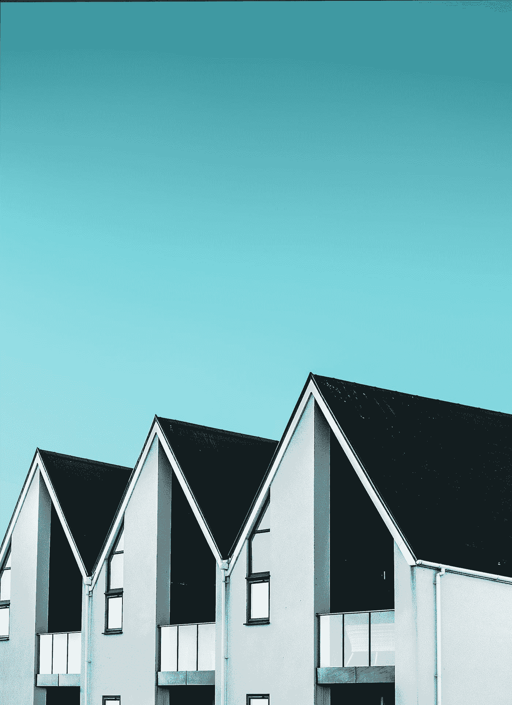

# 你需要得到一栋房子

> 原文：<https://medium.datadriveninvestor.com/you-need-to-get-your-hands-on-a-house-b9ce6c58ac17?source=collection_archive---------22----------------------->

Photo by [Alexander Andrews](https://unsplash.com/@alex_andrews?utm_source=medium&utm_medium=referral) on [Unsplash](https://unsplash.com?utm_source=medium&utm_medium=referral)

很多和我同龄的年轻人(我猜你会称他们为千禧一代)对理财有错误的想法。你可能开始了你的第一份大男孩工作，伴随着第一份工作而来的是各种各样的财务问题，需要你去解决。401k 的，爱尔兰共和军的，和足够的缩写，你可以说 IDGAF。

不管怎样，我跑题了。

本着让事情变得简单的精神，这是开始在房地产上赚大钱的最佳方法。真的很简单；得到一栋房子。

但是杰夫，房子很贵，需要大量的维护，房地产有风险，等等，等等…让我解释一下为什么买房子应该是你的首要任务之一。

**#1:利率真的很低。**

利率低至 2.8%，你几乎可以免费借钱。趁现在还可以，好好利用。还有好债(商债和房产)之类的东西！

**#2:你不需要拿出 20%来购买你的第一套房产。**

许多首次购房者可以用 3-5%的首付、一点点信贷和可靠的工作记录来购买房子。确保你有 1-2 张全额还款的信用卡。用这张信用卡支付必要的费用，如汽油费、食品杂货费和水电费。通过全额付清，你告诉贷款人，你对自己的财务负责，有能力按时支付抵押贷款。

只需节省 5000 美元(你可以做到！)，你就能以 3%的利率买房子了。对于 15 万美元，你要支付 3.3%的首付。我推荐这个范围内的房子，你需要注意的是你要交房贷保险。对于那些不知道什么是抵押贷款保险的人来说，它是你的抵押贷款中增加的一笔钱，当你在你的房子上获得 20%的股权时，这笔钱就会被拿走(例如，我的是每月额外 80 美元)。

**#3:欣赏，欣赏，欣赏。**

我前面说过，有好债和坏账之类的东西。我认为任何坏账都是对价值下降的东西(汽车、船、摩托车等)的贷款。世界上的房地产是有限的。我在 2020 年初以 13.3 万美元购买了我的第一套房子，快速搜索评估员的页面显示，我的房产售价为(2009 年 10.5 万美元，2001 年 8.8 万美元)。这代表着自 2009 年以来的 21%和自 2001 年以来的 34%的价值峰值。房地产总是在升值！

**#4:你可以把你的房子变成现金流正资产。**

如果你有可以信任的室友，或者甚至有一个可以出租的地下室，你可以从房产中获得收入。我已经能够把我房子里四个卧室中的三个出租给我大学时的一些好朋友，让他们替我付抵押贷款！这让我每个月几乎可以双倍偿还我的房子，大大减少了我在贷款期间要支付的利息！

你可以用你房子的净值购买另一项现金流为正的资产。

请注意，我说的是“现金流为正的资产”。通过在你现在的房子里创造资产净值，许多年轻人可以获得房屋净值信用额度(或 heloc)，这反过来可以用来购买你的第一套出租房产。这样做的时候要小心，因为你在房产上使用的抵押品赎回权会导致你的主要住所出现问题。

谈到财务自由，被动收入是游戏的名字。通过创造被动收入，你可以取代你的工作收入(你的朝九晚五)，并用这些钱去买你想要的东西。

**当被动收入=挣得收入时，你将获得财务自由。购买你的第一套房子可能是一项艰巨的任务，但它最终会成为你在 20 岁出头时做出的最佳财务举措之一。**

我的朋友们，在外面注意安全，祝你们寻家成功！

-JP