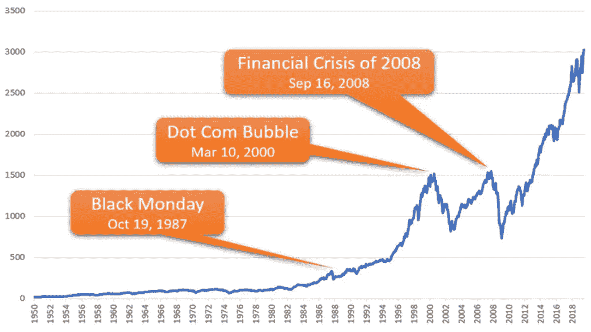
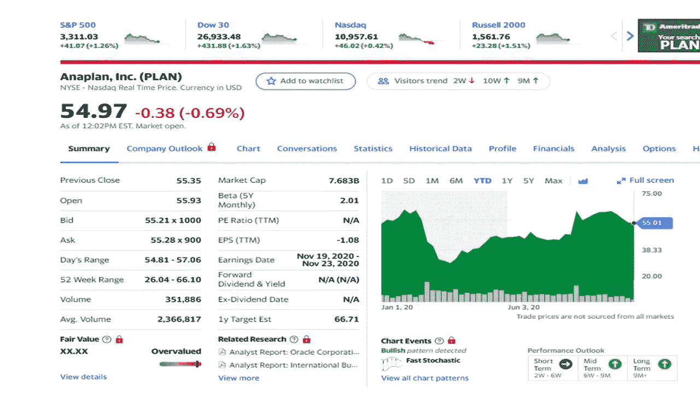
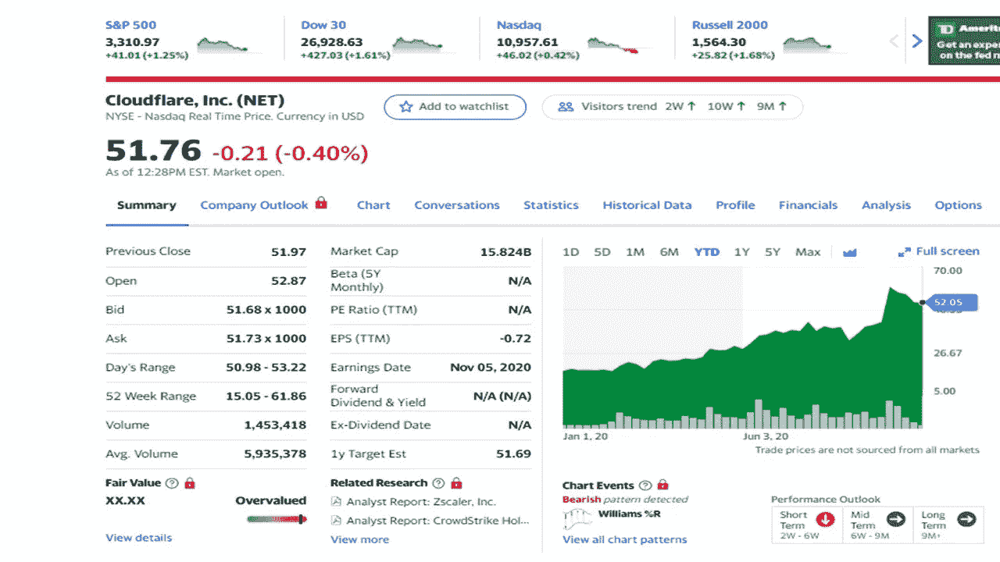
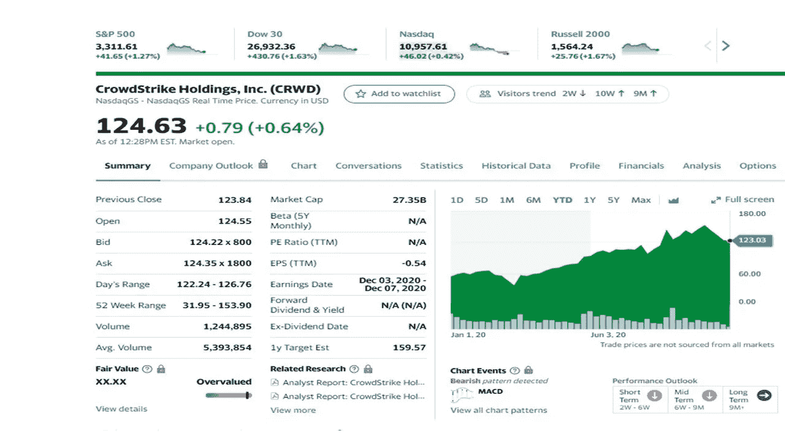
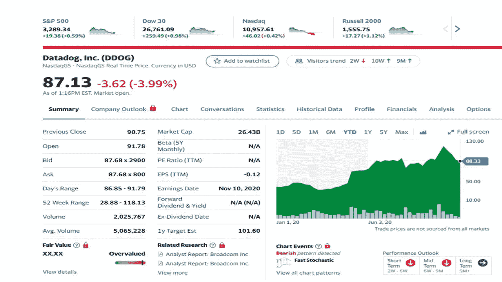
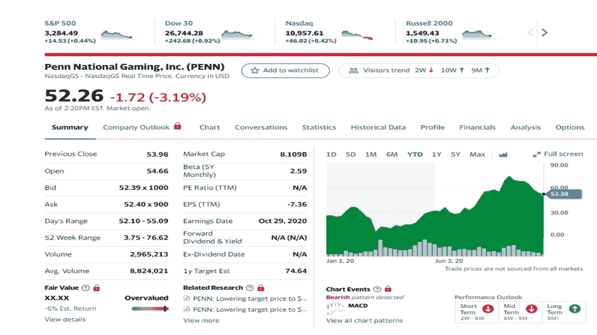

# 你要知道 11 月份的股票比肉桂卷更诱人

> 原文：<https://medium.datadriveninvestor.com/you-need-to-know-november-stocks-are-more-tempting-than-a-cinnabon-a6e8bb9fc6da?source=collection_archive---------9----------------------->

## 今天你应该考虑的五只股票

Photo by [Jared Arango](https://unsplash.com/@jaredrossarango?utm_source=unsplash&utm_medium=referral&utm_content=creditCopyText) on [Unsplash](https://unsplash.com/s/photos/cinnamon-rolls?utm_source=unsplash&utm_medium=referral&utm_content=creditCopyText)

如果你喜欢吃肉桂卷，你也需要同样喜欢投资股票。你对投资的热爱应该不仅仅是吃一块肉桂卷或一般的食物。如果你认为投资太难，你真的需要花些时间学习更多关于投资的知识。你可能没有被教导要投资学校——我也没有。

研究表明有钱人比没钱的人投资更多。是的，这是有道理的。如今，任何人都可以在 Robinhood、查尔斯·施瓦布等应用程序中投资零股和购买部分股票。不是每个经纪公司都提供零股，所以请确保你做了调查。

例如，如果苹果股票(股票代码 APPL)是 100 美元，而你只有 10 美元可以投资。你可以投资 10 美元，拥有 1/10 的股票。这意味着你拥有苹果股票的一小部分。写这篇文章的时候，苹果实际上是 108 美元。

> 投资就是现在就把钱拿出来，以便将来能赚更多的钱。
> 
> 沃伦•巴菲特

随着我们进入 11 月，市场保持稳定，一些人预计市场将会调整或股价下跌。自从受到冠状病毒的影响以来，一些股票一直没有下跌。表现不佳的股票是航空公司、游轮和酒店股票，如美国航空公司、嘉年华游轮和希尔顿酒店。

如果你从历史的角度来看股票，股票的价格会持续上涨。你必须忽略一些分析师甚至你的一些朋友说的话。市场会下跌，但价格最终会回升，就像坐过山车一样。

Image from Moolanomy

以下股票推荐给你考虑，有两只股票是我以前提到过的，现在又出现了。自病毒开始并导致市场在 3 月份崩溃以来，科技股在这个市场上继续表现良好。确保在投资前做好自己的研究和尽职调查。

股票价格是在 2020 年 11 月 2 日收盘时收集的。

# **安普兰(计划)**

Yahoo Finance

这支股票提供基于云的服务，连接人和组织。Anaplan 平台将金融、销售、供应链和营销运营中使用的数据存储等互不关联的数据库结构联合在一起。Anaplan 是一项基于订阅的服务，成立于 2008 年，总部位于加利福尼亚州旧金山。该公司在美国、澳大利亚、比利时、法国、德国、印度、以色列、日本、印度、马来西亚、荷兰、菲律宾、新加坡和英国开展全球业务。

最近的表现。Anaplan 在过去几年中表现出色。自从 3 月份冠状病毒的消息传出后股价下跌以来，该股一直在持续上涨。该股上涨了 36%，分析师预计这种涨势将持续下去。

 [## 10 月份投资的最佳股票|数据驱动型投资者

### 根据最近的回报，这些股票在 10 月份及以后会有不错的表现。随着市场看到一点…

www.datadriveninvestor.com](https://www.datadriveninvestor.com/2020/10/19/the-best-stocks-to-invest-in-october/) 

# **云闪(网)**

Yahoo Finance

这家公司为全球的公司提供基于云的服务。他们的目标简单而强大，随着越来越多的公司转向网络，他们的目标是处理业务流量。该公司扩展并覆盖全球 200 多个城市。超过 16%的财富 1000 强公司与 Cloudflare 合作。该公司成立于 2009 年，总部位于加州。

**近期表现**。Cloudflare 的客户名单帮助该公司继续发展壮大。收入增长超过 50%，大公司每年支付至少 10 万美元(全年增长 65%)。分析师预计近期和长期增长将持续。

# **众筹(CRWD)**

Yahoo Finance

该公司在全球范围内提供基于云的安全服务，覆盖美国、澳大利亚、德国、印度、罗马尼亚和英国。该公司每天阻止超过 720 亿次网络安全威胁。随着越来越多的人在家工作，网络安全比以往任何时候都更有必要。该公司成立于 2011 年，总部位于加利福尼亚州森尼维尔。

**近期表现。**该病毒帮助该公司阻止了超过 41，000 起潜在违规事件。该公司正在扩张，以在故事中提供更多的云覆盖，并执行越来越受欢迎的工作负载。收入和利润增长了 80 %, 100 家财富 100 强公司中有 49 家是其客户。自 3 月份崩盘以来，该股表现非常好，尤其是在科技股降温的过去两个月里。

# **数据狗(DDOG)**

Yahoo Finance

Datadog 是一个面向北美和全球的开发人员、IT 团队和业务用户的监控和分析平台。该公司还提供网络监控。DDOG 正从三月的下跌中看到一个不错的复苏。这家公司的需求非常高，因为大企业都依赖于新的基于云的应用程序。监控它们的性能以及维护它们的使用是一项巨大的任务。Datadog 能够为 IT 技术人员解决这个问题。此外，该公司增加了软件工具开发人员统一实验室，这增加了公司的开发环境。该公司最近与微软合作。该公司正在努力添加一个 Datadogg 移动应用程序。该公司于 2010 年在美国纽约州纽约市成立。

**近期表现。**Q2 的客户增长是积极的，有 12，100 名客户(增长 37%)，其中 1，015 名客户的消费超过 10 万美元或更多(比 2019 年增长 71%)。预计即将到来的收入将增长 50%，在 1.43 亿至 1.45 亿美元之间。预计这一表现将在未来几年持续下去。

# **宾州国家博彩公司(PENN)**

Yahoo Finance

Penn National Gaming 及其子公司在美国经营和管理博彩和赛车产业。该公司在爱荷华州、密西西比州、内华达州、宾夕法尼亚州和西弗吉尼亚州经营现场体育博彩。在接下来的几个月里，该公司将扩展到其他六个州，包括科罗拉多州、伊利诺伊州、印第安纳州、密歇根州、新泽西州和弗吉尼亚州。Penn 经营或拥有 41 家博彩和赛车公司的所有权。该公司于 1972 年在宾夕法尼亚州的怀奥米辛成立。

**近期表现**。该公司拥有 40 多家实体赌场和 2000 万忠诚会员。将其中一些会员转化为在线平台可以获得更多的市场份额，并使宾大的现金流翻倍。佩恩在 8 月份取得了突破，并在 9 月份大获全胜。分析师预计未来会有积极的结果。

注:作者不拥有这些投资中的任何一项。

 [## 10 月份投资的最佳股票

### 十月的阵雨带来五月的鲜花。这些股票也是如此吗？

medium.com](https://medium.com/datadriveninvestor/the-best-stocks-to-invest-in-october-227f26bbabed)  [## 警告:你不投资是在赔钱

### 关于投资的 20 个想法会让你思考

medium.com](https://medium.com/illumination/warning-youre-losing-money-by-not-investing-5a8fc141f00e) 

# 参考资料:

[卡博特财富网](https://cabotwealth.com/)

[雅虎财经](https://finance.yahoo.com/)

[**汤姆·汉迪**](https://medium.com/@tomhandy1) 是一名投资人，前 Quora 作家，也是两个孩子的父亲。他从军队退役，并在几个非营利委员会任职。你可以在推特 [@tomhandy1](https://www.twitter.com/tomhandy1) 上找到他。

本文仅供参考。不应将其视为财务或法律建议。并非所有信息都是准确的。在做出任何重大财务决定之前，请咨询财务专家。

## 访问专家视图— [订阅 DDI 英特尔](https://datadriveninvestor.com/ddi-intel)