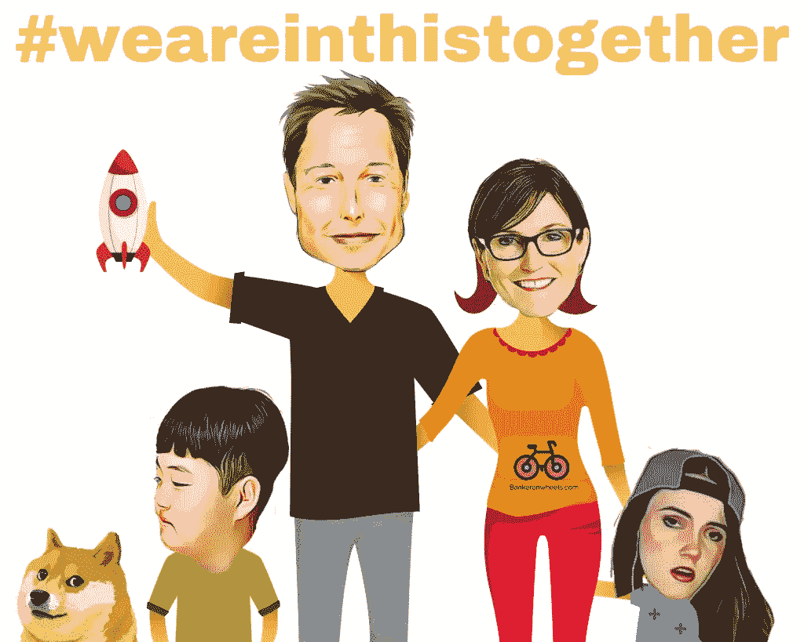
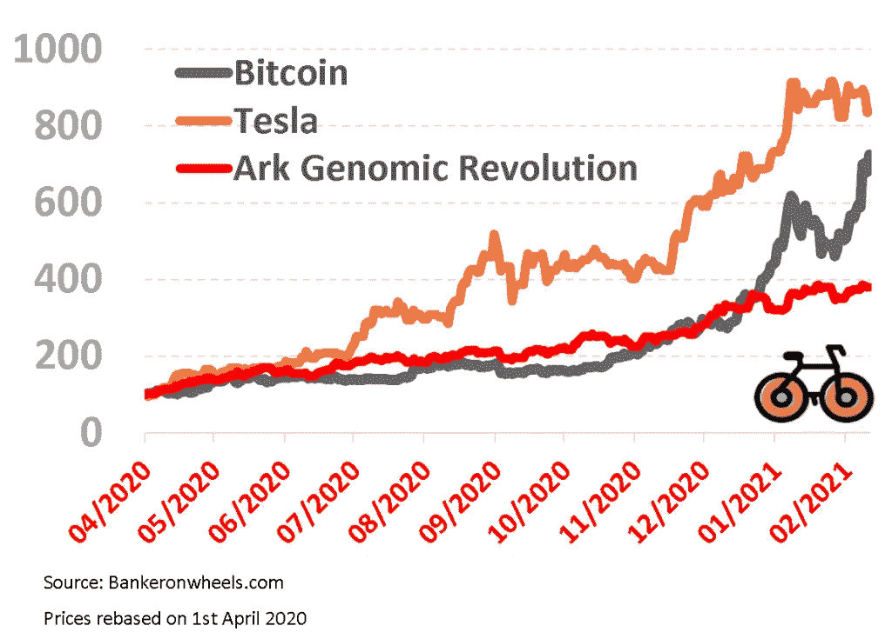
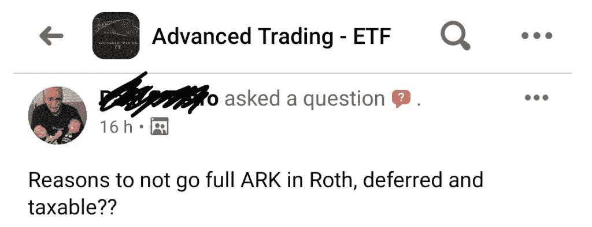
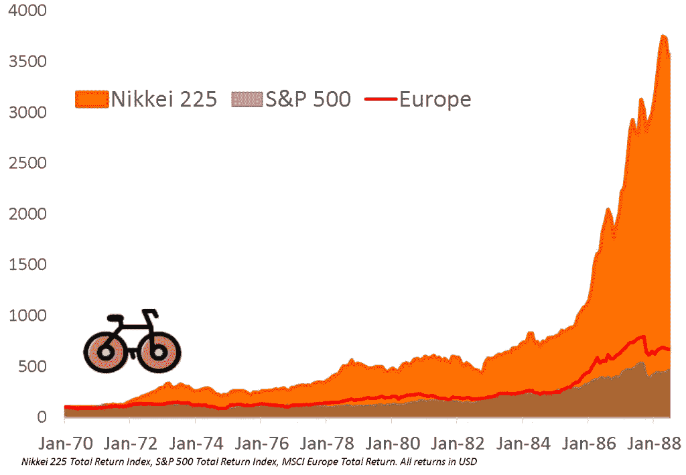
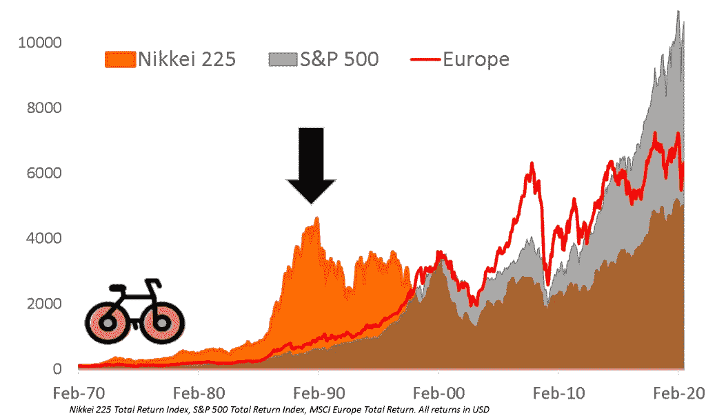

# 你只能活两次

> 原文：<https://medium.datadriveninvestor.com/you-only-live-twice-3de465498165?source=collection_archive---------16----------------------->

# 如何用八步骑公牛

# 你只能活两次

几周前，我的一个最好的朋友开始在市场上赚改变人生的钱。在积极投资中，你更早或更聪明(有些人也会作弊)。我的朋友来早了。

复利产生了神奇的效果**一夜暴富**。如果你没有这样亲密的朋友，幸运的是你能坚持到底。

对我们大多数人来说，FOMO 是难以抗拒的，它迫使我们承担适当的风险。不仅因为**上一次史诗般的牛市是在 20 年前，而且牛市的加速(后期)阶段是罕见的**。这个市场存在不对称的机会。

通过积极参与**，你会了解到兴奋的市场是如何运作的**(假设这种情况会持续下去)。你可能会感受到当一个 12 岁的韩国沃伦·巴菲特是什么感觉。

但是需要提醒人们保持明智，尤其是现在。潜在的**损害你的人生目标**是这篇文章的真正触发点(见**规则#7** )。尽管这个市场可能令人兴奋，但风险正在上升。

通过过去 10 个月的努力，我建立这个网站的目标是帮助你让你的生活变得更轻松。希望通过创造长期财富。

以下是我用来活两次的 8 条常识性投资规则。刺激人生的 4 条法则和(长期)梦想的 4 条法则。

# 一个是为了刺激

# 1.把猎犬和道奇分开

**将游戏币和基于目标的投资组合分开。**

这只[金毛猎犬](https://bankeronwheels.com/world-etfs/)真的不喜欢日本的柴犬伊努斯，仅仅是因为它让他想起了 20 世纪 80 年代的日本。不能怪他，道奇，尽管他可能很讽刺，但这可能是最糟糕的选择。

你不想危及你的长期梦想。从你开始积极下注的那一刻起，胜算就对你不利。

想一个[银行家投资组合](https://bankeronwheels.com/long-term-investing-strategies-for-financial-independence/)，保持小规模的主动下注(我不超过我资产的 10%)。如果你幸运的话，小赌注会复合，就像我朋友那样。你甚至可以通过一个[寻回犬投资组合](https://bankeronwheels.com/long-term-investing-strategies-for-financial-independence/)将你的所有资产组合起来，并从活跃的赌注中分离出来，来制作你的投资组合杠铃。

# 2.从桌子上拿走一些钱

把握乐观市场的时机是不可能的。逐渐兑现赢家。

我的朋友**之所以成功，是因为当 GME 登上月球**时，围绕从桌子上取钱的纪律。进行模拟—例如，在每个预先定义的阶段销售 15–20%的产品会产生很大的不同。**打开 Excel——有规则**，仅仅依靠“直觉”和头脑中的东西是不够的。对自己负责。

在牛市中，利润是预定的。其他的都只是潜在的收益。

# 3.不要对多样化过于天真

大多数风险资产都是高度相关的。

**市场有两种模式——风险开启和风险关闭。**

虽然最新的比特币故事是数字黄金，但我的直觉告诉我，要成为数字黄金还有很长的路要走。下一次崩盘可能会验证我的假设，即就目前而言，金价对黄金的反应有多么不同(我怀疑涌入的机构投资者更容易受到林迪效应的影响)

埃隆·马斯克、凯西·伍德、Tik Tok·基德和道格德的财富可能会同时暴跌。

同样有趣的是，某些比特币拥护者(其中一些人喜欢价值股)在证明加密水平合理的同时，也看到了特斯拉的泡沫。

另一方面，黄金投资者并不介意黄金因低利率而上涨，但当股票机械地遵循同样的模式时，它就变成了一个危险的泡沫。

事实是，这些资产中的大部分经常因为同一个单一因素而变动。

# 4.这与你的技能无关

许多价格同时飙升——IPO/spac 或部门 ETF，仅举几例。

让我的朋友成功的是很少买卖股票，这是因为费用、税收的影响，而且因为大多数跳跃都是在一夜之间发生的，你无论如何也无法采取行动。

我承认，虽然我们没有相同的投资理念，但他的坚忍给我留下了深刻的印象，他不会整天盯着自己的经纪账户，看着市值以几万美元、然后几十万美元的速度波动。**日内交易技巧不会帮助你**——如果你真的相信你的交易，坚持下去。

# 一个为了梦想

# 5.坚持计划

坚持你的长期投资计划。

**不要让游戏币和投资之间的区别变得模糊。**

参与游戏很重要，但更重要的是控制你的风险。想想自己的风险承受能力。

如果市场上有一条长期有效的规则，那就是**要么现在价格高，要么未来回报高，而不是两者兼而有之**。随着市场的每一次加速(世界交易所交易基金在过去 6 个月里增长了 17%)，我个人对过去十年的超常回报的可持续性感到不太有信心

**关注资产配置。**再平衡是关键。如果你的资产配置失调，你可以采用基于阈值的再平衡方法。我写了一篇关于再平衡的指南，如果这能有所帮助的话。

但如果你想完全避免再平衡，先锋最近在欧洲推出了[life strategy ETF](https://www.bankeronwheels.com/vanguard-lifestrategy-ucits-etfs-europe/)。或者，你可以通过目标风险基金进行投资，比如贝莱德的 ESG ETFs。

# 6.保持简单

如果有的话，进一步简化你的长期投资组合。你能关注的事情只有这么多。

资产配置是关键，但由于“有太多的事情要做”，**你可能会错过牛市中可能发生的市场结构性变化**(例如，转向价值市场或新兴市场)，甚至可能是随后的崩盘。记住，市场的某些部分仍然很便宜。

你也可以浏览一下[投资者清单](https://www.bankeronwheels.com/investment-checklist/)，确保你的投资组合中没有遗漏任何东西。

# 7.不要落入 ETF 陷阱

**上述情况真的让我很担心，也激发了我写这篇文章的灵感。**

**今天的日本投资者和 20 世纪 80 年代的日本投资者有一个共同点——愿意放弃拖累资产，比如标准普尔 500 指数。**

作为 20 世纪 80 年代的日本投资者，你一定会想“多年来，日本股市一直是更好的投资。从我的投资组合中剔除标准普尔 500 是合理的，因为它拖累了业绩。”

今天的另一个问题是，行业 ETF 与多样化联系在一起，给人一种虚假的安全感。

来自不同行业的 225 家公司的日经指数也是如此。

**退休投资组合多样化意味着同时投资于不同的国家、货币和行业。**

有一天你可能会在这里

# 8.保持警惕，祝你好运

记住，价格是由故事支撑的。而且有强有力的叙事支持当前的市场，这可能会改变留给一个更基本的分析。

跟踪你的主动和被动投资组合。从长期来看，我敢打赌，你的长期投资组合的回报会跑赢大盘。特别是，当调整费用、税收，但最重要的是，你的宝贵时间。

我请你喝咖啡，如果你表现得比我好，下次我骑车去你家。

**骑牛的同时，** [准备](https://bankeronwheels.com/how-to-take-advantage-of-a-recession/) **迎接熊的攻击，现在正是时候。**

祝你好运！