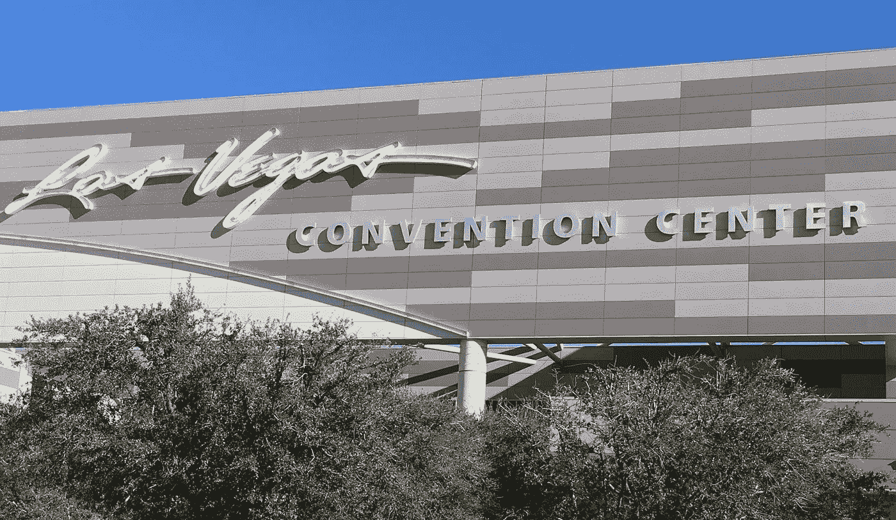

# 你说话了，把一切都泄露出去了

> 原文：<https://medium.datadriveninvestor.com/you-talked-and-gave-it-all-away-b7158d273ee2?source=collection_archive---------15----------------------->

我喜欢讲述我几年前在拉斯维加斯参加的一个大型会议的故事。它需要被告知。我学到了很多。

这是一个关于我如何想旁听一家科技公司演讲的故事。他们的会议摘要似乎很有趣，他们的技术描述引起了我的注意，所以我决定安排时间，努力成为人群中的一员。

如果你曾在营销或会议行业工作过一天，你可能会去拉斯维加斯会议中心。它是巨大的，并且还在增长。经验丰富的制作人、发言人、赞助商和与会者知道复杂的规模，并可能在每次维加斯活动之前深呼吸，知道在该设施上的任何贸易展览将造成的身体磨损。

这就是我最近一次去拉斯维加斯的情况。讨论中的会议是在一个会议大厅的后面，几栋楼之外，在楼上。标志很差，位置不容易识别，人群拥挤。但是我做到了。

一天结束时，我的手机告诉我，我已经在拉斯维加斯走了 10 多英里。外面大约华氏 80 度，我穿着商务休闲装——很快就变成了运动装。

当我到达会场时，我得知预定的演讲者不会做供应商演示。这不是第一次发生了，所以…好吧。有一个执行替代品，并继续表演。如果你能这么说的话。

如果有一个奖项颁给在阅读别人的幻灯片的同时尽可能多地使用填充语言的演讲者，这位公众演讲者是主要的竞争者。

但我坚持到了最后。

那次演示结束后，我冒险回到了大楼的另一边，旁听另一场技术演示。另一个供应商和它的技术——这个在一个更大的舞台上。

这次 10 分钟后我起身走开了。这是另一个品牌，但更多的是相同的业余展示方式——我受够了。

我自己掏钱去了拉斯维加斯。我支付了机票、酒店和地面交通费用。我用一张公司展览大厅的通行证旅行。

我可以压缩旅行预算，但即便如此，我还是多付了钱。

—

不要抱怨太多，我确实学到了宝贵的一课。关于这两家科技公司，我学到了五件事。

或者我应该说，关于你。

因为这些演讲者不是例外，他们就是你。规则。当你说话的时候，你把一切都泄露出去了。你告诉我你和你的公司…

**1。不要和营销领导一起工作**

你可以说你知道。你可能认为你知道。但没有一个自尊的营销领导者会允许公司发言人在任何舞台上以我所看到的方式损害公司声誉。

**2。没在意观众**

我准时参加会议。我付钱去那里。其他人也是。但我是自己掏腰包的。我利用私人时间去旅行。然而，我知道绝大多数与会者都是用公司的钱在拉斯维加斯，住在有度假费用的昂贵酒店，不断增加赞助、展览、航班、地面交通、餐饮、娱乐和离开办公室的时间等成本。

向观众(或任何人)做一个糟糕的演示是完全不尊重人的。

**3。雇佣演讲者、市场营销人员和高管并侥幸成功**

赌城事件的 20 万美元？你做了什么？你完成了什么？你从中得到了什么？这是你公司某个地方的某个人必须要问的。但是他们没有。发票付了，展位被扔进仓库，展览结束了，每个人都冲回家，没有人能回忆起上周在那个环节发生了什么……因为没有人在乎。

因为如果你这样做了，方法和结果就会不同。

请告诉你的投资者。

**4。是关闭的**

如果我在任何活动平台上再看到你或你的公司，别把我算进去。(稍后将详细介绍这一点。)

 [## 给数字营销工作者的 5 本书推荐|数据驱动的投资者

### 随着就业率的上升，由于疫情和人们花更多的时间在网上，数字营销的技巧…

www.datadriveninvestor.com](https://www.datadriveninvestor.com/2020/10/28/5-book-recommendations-for-those-who-work-with-digital-marketing/) 

**5。落后于时代**

一方面，我看到当前营销渠道的泛滥，它立即要求销售、营销和执行人员到场。语音驱动的技术和服务。虚拟、远程和混合交互。播客。网络研讨会。传统音频和视频。流媒体。更不用说大大小小的内部和外部演示了。

但是当你用“你知道”来开始和结束每一句话的时候，当你嗯嗯嗯地说话的时候，告诉我为什么我应该开始在乎。

(注意:如果你不能发言并展示你的内容，我不关心你的内容。也不是你漂亮的活动平台和软件包。)

我把它送人了。我的时间，我的钱，你说吧。但是在看到和听到你放弃后，那些日子就结束了。

—

我从观察你和听你开始演讲中学到了这些。

我打赌你不知道。

关于你和你的公司我有什么不记得的？

你。你的名字。你的公司名称。如果你尝试过，你不能放弃任何一点。你尽力了。但是即使我想，我也不能和你做生意。我不知道。我不打算再看节目指南来唤起我的记忆。没有意义。

事实上，当涉及到你和你的公司时，我会用你上次演讲前对我用过的方法。

我根本不在乎。或者更确切地说，我一点也不在乎。它是双向的。

这是一个两难的问题。如果我不记得你，我怎么知道以后不要支付或参加你的任何公司会议或公司活动？

简单。

我将不再参加任何一种采用过时运作模式的活动，在这种活动中，糟糕的演讲者不知何故会躲在麦克风后、摄像机前或舞台上。或者我会简单地参加一些我已经做了功课的课程，并期望有更好的表现。

在当前和大流行后的世界中，我会要求更多，并要求更好的与会者和赞助商体验。你也应该这样。

因为当那发生的时候，你就不能晋级了。

托尼·康普顿拥有芝加哥洛约拉大学的两个学位:1987 年获得传播学学士学位，1995 年获得工商管理硕士学位。在过去的三十年里，他担任过许多营销和商业领导职位。

**访问专家视图—** [**订阅 DDI 英特尔**](https://datadriveninvestor.com/ddi-intel)