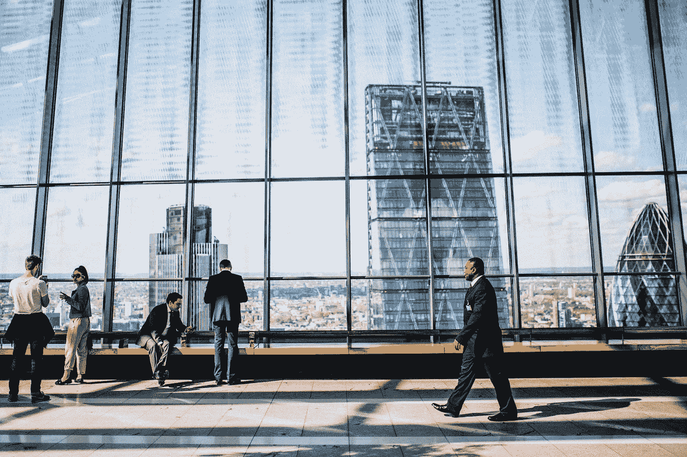
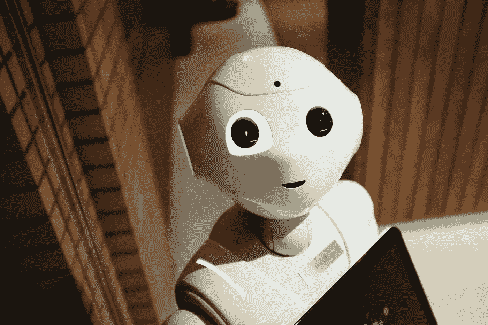

# 你觉得你能保住工作吗？

> 原文：<https://medium.datadriveninvestor.com/you-think-you-can-keep-your-job-ea6e93bdb3fa?source=collection_archive---------12----------------------->

一月是很久以前的事了，一个不同的时间，那时生活是正常的，可预测的。当冠状病毒对我们来说太遥远而不真实时。我们没有太关注它，因为我们的新年目标仍然很热门。

三个月后，世界变成了一个完全不同的地方。我们生活在有趣的时代。

新冠肺炎需要大量前所未有的社会和技术快速跟踪。新冠肺炎给我们带来了未来。治理、社会互动、公民责任、医疗保健、商业和工作场所理想的未来。

今年年初，热门工作和软技能清单将区块链、系统软件开发、创造力和分析思维列为 2020 年最需要的技能。虽然每个人都同意人工智能(AI)和远程工作是不可避免的未来，但大多数组织都不愿意转向人工智能主导的业务和公司互动。你猜怎么着？新冠肺炎瓦解了岁月，把未来送到了我们今天的家门口。在疫情之前，54%的全球员工每周远程工作 2.5 天或更多。现在，根据 Gartner，Inc .对 800 名全球人力资源(HR)高管的调查，88%的员工现在远程工作，越来越多的组织越来越依赖人工智能技术进行管理。因此，经济中正在发生急需的变革，最初被认为不可替代的工作已被证明不再相关，可以通过人工智能更有效地管理。

在新冠肺炎会议之后，我们可能无法回到以前的做事方式。通往过去的大门可能永远关闭，我们将不得不拥抱未来。

 [## 人工智能和监督资本主义|数据驱动的投资者

### 大科技，总是现在:人工智能推动的大科技，已经使购物，搜索，在你的…

www.datadriveninvestor.com](https://www.datadriveninvestor.com/2020/03/04/on-artificial-intelligence-and-surveillance-capitalism/) 

一月份，在新冠肺炎成为全球疫情之前，我和一个朋友在 whatsapp 上聊起了工作的未来，我说，

> “当你不得不每天花大约 9 个小时在一份特定的工作上(一年大约 2800 个小时)，再加上额外的 2 到 3 个小时来回通勤，用不了多久这份工作就会真正成为你的‘生计’。你所知道的你的生活将如此依赖于这份工作，以至于即使在你的梦里，你通常也只能通过你的职业来识别。
> 
> 你无法想象工作之外的生活，你总是根据你的工作向人们介绍你自己。这意味着你的工作已经成为你唯一的身份。这是非常危险的！
> 
> 当你对工作不再满意时，或者当你被解雇或退休时，会发生什么？危机出现了；身份危机。一个无法回答的“我是谁”的问题就像盒子里的杰克一样爆炸了。有趣的事实:你有没有注意到大多数退休人员在退休后的 1 到 4 年内死亡？
> 
> 我的想法:很多工作现在已经没用了，这些工作很容易侵蚀你的身份，占据你的生活。
> 
> 现代工作场所需要跨行业的技能，而这些技能本身永远不会成为一个头衔。IT/软件编程、人力资源管理等技能。拥有这些技能，你可以在任何工作岗位和行业工作，而不会“成为”那份工作。他们给你就业灵活性的优势。这样你就不用 35 年来一直做同一份工作(无聊)，最后感觉自己在生活中被欺骗了。
> 
> 应该鼓励年轻人获得这些技能。当然，尼日利亚的大部分大学课程都需要重新评估或取消，因为它们逐渐变得过时了。像会计、银行和金融以及大众传播这样的职业。他们现在应该在历史下研究，因为他们已经死了。艾杀了他们。未来的职业是需要人类接触和批判性思维水平的工作，这是机器人无法模拟的。"

欢迎来到未来。以下工作即将过时:呼叫中心接线员、出租车司机、销售人员、保安人员、厨师、建筑工人、银行家、会计师、广播员和行政人员。这些工作的 70%—90%现在将几乎完全由具有更高准确性和生产率的人工智能来处理。

未来的顶级工作有:教学、系统软件开发人员、数据分析师、公关经理、医生、护士、其他医疗保健提供者、律师、人力资源、监督角色、作家、演员等。

实际上，更多的是技能而不是工作。因此，员工可以选择在分布式团队中远程工作(即，您没有工作角色，而是技能角色，这意味着工作将被分解为目标和所需技能，您可以根据自己的技能选择想要实现的目标)。

新的世界系统是技能、人性和人工智能的顺利合作。人类将永远统治技术，事实上，技术进步将为更深刻的创造力、创新和可能性创造途径。在 E=mc 中还有很多有待发现的东西。这是一个美丽的新世界。

