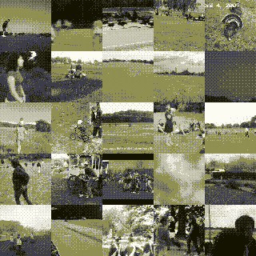

# 你永远不会想到学习这 5 个 GANs 项目会如此有益！但事实如此。

> 原文：<https://medium.datadriveninvestor.com/you-will-never-think-that-learning-these-5-gan-projects-could-be-so-beneficial-but-it-is-f4362a6aa3d7?source=collection_archive---------7----------------------->

> [*生成对抗网络(GAN)是一类机器学习框架，当给定一个训练集时，该技术学习生成与训练集具有相同统计数据的新数据。例如，经过照片训练的 GAN 可以生成新的照片，这些照片在人类观察者看来至少在表面上是真实的，具有许多逼真的特征。虽然最初是作为无监督学习的生成模型的一种形式提出的，但是 GANs 也被证明对于半监督学习、完全监督学习和强化学习是有用的。*](https://en.wikipedia.org/wiki/Generative_adversarial_network)

> ***在今天的文章中，我们将讨论五个开源的 GAN 项目，您可以将它们包含在您的下一个项目中。***
> 
> 注意:在这篇文章中，我们将讨论一些不太出名但是非常好的开源 API，你可以在你的项目中使用它们。要阅读更多关于它们的内容，我推荐你点击项目中给出的链接。

**Source: Unsplash.com**

> *学习不仅仅是为了更好地胜任工作，而且远不止于此。*[***【data camp】***](https://datacamp.pxf.io/x9nmvv)*让我学无止境。*
> 
> [***data camp***](https://datacamp.pxf.io/x9nmvv)*为您提供所需的灵活性，让您可以利用自己的时间参加课程，学习向成功职业过渡所需的基本技能。*
> 
> [***【data camp】***](https://datacamp.pxf.io/x9nmvv)*教会了我快速获取新想法，并将其应用于现实世界的问题。当我在学习阶段时，*[***data camp***](https://datacamp.pxf.io/x9nmvv)*让我对课程中的一切都着了迷，从课程内容和 TA 反馈到 meetups 活动和教授的 Twitter feeds。*
> 
> 这里有一些我最喜欢的课程，我强烈推荐你学习，只要它符合你的时间表和心情。你可以将从这些课程中学到的概念和技能直接应用到工作或大学中令人兴奋的新项目中。

1.  [数据科学家与 python](https://datacamp.pxf.io/LPDqQZ)
2.  [数据-科学家-与-r](https://datacamp.pxf.io/MXQxrJ)
3.  [机器学习科学家与机器人](https://datacamp.pxf.io/DVLg4j)
4.  [用 python 研究机器学习的科学家](https://datacamp.pxf.io/9WePXW)
5.  面向所有人的机器学习
6.  [面向所有人的数据科学](https://datacamp.pxf.io/15bLmd)
7.  [使用 python 的数据工程师](https://datacamp.pxf.io/jW13ve)
8.  [使用 python 的数据分析师](https://datacamp.pxf.io/kjR3mz)
9.  [基于 pyspark 的大数据基础](https://datacamp.pxf.io/e4RM6r)

***回到正题-***

# 1.Pix2Vox

P***ix2Vox***是使用 ***Python、Tensorflow 和 OpenCV 实现的一个 ***基于草图的三维探索与堆叠生成对抗网络*** 项目。***

 [## 用 Python |数据驱动投资者进行股票价格时间序列预测简介

### 在这个简单的教程中，我们将研究如何将时间序列模型应用于股票价格。更具体地说，一个…

www.datadriveninvestor.com](https://www.datadriveninvestor.com/2020/07/07/introduction-to-time-series-forecasting-of-stock-prices-with-python/) 

能够生成 ***三维单类生成和多类生成*** 。使用***qdark style sheet***构建 GUI 来显示结果。

> *如果想让源代码和步骤克隆运行这个项目，可以点击* [***这里*** *。*](http://If you want the source code and steps to clone and run this project, you can click here.)

**Single-category generations(left) and Multi-category generations(right), Source:** [**https://github.com/maxorange/pix2vox**](https://github.com/maxorange/pix2vox)

**Source:** [**https://github.com/maxorange/pix2vox**](https://github.com/maxorange/pix2vox)

# 2.使用 GAN 的视频预测

V ***视频预测*** 项目是由 **Python** 和 **Tensorflow** 实现的，为 ***随机对抗性视频预测给出一个序列的初始帧。***

模型为预处理后的数据集进行 ***预训练，模型可以预测各种可能未来的未来帧；预测*** 保存为**gif**和**图像**。

> *点击**[***链接***](https://arxiv.org/abs/1804.01523) *可以阅读关于* ***使用 GAN*** *进行视频预测的参考文件，如果想要克隆并运行这个项目的源代码和步骤，可以点击*[*这里* *。*](https://github.com/alexlee-gk/video_prediction)*

> *例如，在接下来的两个序列中，基本事实序列在左边，模型的随机预测在右边。预测帧由底部的黄色条表示。*

***

**Source:** [**https://alexlee-gk.github.io/video_prediction/**](https://alexlee-gk.github.io/video_prediction/)* 

# *3.改进的视频 GAN*

*I***improved Video GAN***是一个为 ***使用 Python 和 Tensorflow 为多功能应用程序增强视频生成的项目。****

*用于训练的数据集是稳定的视频帧。即 ***JPEG 文件，依次包含 32 个垂直串接的结构，大致对应于视频*** 的一秒。SIFT+RANSAC 已经稳定了视频 ***C*** 。总数据集为 *9 TB* ，由*3500 万个片段*组成。*

****的主要目的是改进最先进的视频生成对抗网络(GANs)*** 与*的多功能应用。该项目可以解决*三个具有挑战性的问题* : ***视频着色、视频修复和未来预测。*****

> **点击**[***点击此链接***](https://arxiv.org/abs/1711.11453) *你可以阅读关于改进的* ***视频甘*** *的参考文件，如果你想要克隆和运行这个项目的源代码和步骤，你可以点击* [***这里【***](https://github.com/bernhard2202/improved-video-gan)**

******

**Video Colorization, Source:** [**https://bernhard2202.github.io/ivgan/index.html**](https://bernhard2202.github.io/ivgan/index.html)** ******

**Video Inpanting, Source:** [**https://bernhard2202.github.io/ivgan/index.html**](https://bernhard2202.github.io/ivgan/index.html)** ******

**Generation with static(left ) and non-static(right) background, Source: https://bernhard2202.github.io/ivgan/index.html**** 

# **4 着色机**

**C***olor izer***是一个使用 Lua 用生成式对抗网络(GANs)为黑白图像添加色彩的项目。**

**该项目旨在 ***给黑白图像添加色彩。即，发生器网络(G)接收其黑白版本，并输出图像的全 RGB 版本*****

***该模型已针对以下数据集进行了测试:* ***人脸、猫脸、天空、圣诞树、雪景泡泡，但是你可以使用你的数据集。*****

> ***如果你想克隆并运行这个项目的源代码和步骤，可以点击* [***这里*** *。*](https://github.com/aleju/colorizer)**

**********************

**Source:** [**https://github.com/aleju/colorizer**](https://github.com/aleju/colorizer)** 

# **5.艺术编辑**

**一个***rte diting***是一个 ***使用 Python 和 Pytorch 进行图像生成和编辑的建模艺术工作流。*****

**该项目旨在使 ***既能多阶段生成图像，又能多阶段编辑现有的艺术作品*** 。该项目已经在*三个不同的艺术数据集*上进行训练，以展示所提出的框架在 ***图像生成和编辑任务上的有效性。*****

> ***点击**[***链接***](https://arxiv.org/pdf/2007.07238.pdf) *可以阅读关于编辑******[***的参考文件，如果你想要克隆和运行这个项目的源代码和步骤，可以点击***](https://arxiv.org/pdf/2007.07238.pdf) **[***这里【T73***](https://github.com/hytseng0509/ArtEditing)**********

**Source:** [**https://github.com/hytseng0509/ArtEditing**](https://github.com/hytseng0509/ArtEditing)

> 如果你喜欢读这篇文章，我相信我们有着相似的兴趣，并且现在/将来会从事相似的行业。那么我们就通过 [LinkedIn](https://www.linkedin.com/in/mrinal-walia-b0981b158/) 和 [Github](https://github.com/abhiwalia15) 来连线吧。请不要犹豫发送联系请求！
> 
> 参考
> 
> [https://github.com/maxorange/pix2vox](https://github.com/maxorange/pix2vox)
> 
> [https://github.com/alexlee-gk/video_prediction](https://github.com/alexlee-gk/video_prediction)
> 
> https://github.com/bernhard2202/improved-video-gan
> 
> 【https://github.com/hytseng0509/ArtEditing 
> 
> [https://github.com/aleju/colorizer](https://github.com/aleju/colorizer)

## 访问专家视图— [订阅 DDI 英特尔](https://datadriveninvestor.com/ddi-intel)