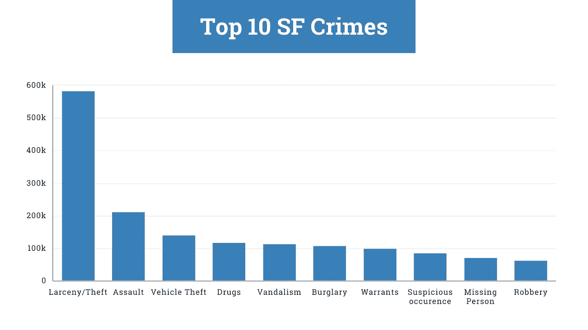

# 分析旧金山的犯罪

> 原文：<https://medium.datadriveninvestor.com/you-wont-believe-crime-rates-in-san-francisco-67cd3db04d97?source=collection_archive---------24----------------------->

## 从 2003 年以来的 SFPD 事件数据集获得洞察力

**Not a map of San Francisco**. Each white dot is the location of an SFPD incident. By author.

SFPD 最近收到了 1 . 2 亿美元的预算削减，这是由要求#解散警察的呼声推动的。

我之前用 OpenData 分析了 NYPD 事件和[指控](https://medium.com/analytics-vidhya/bad-cops-analyzing-33-358-allegations-against-nypd-officers-280ff0f1645f)。在这里，我使用 DataSF 来分析 2003 年以来的 SFPD 事件，以便更好地理解 SFPD 的所作所为。

# 探索 SFPD 事件

我结合了从 [2003 年至 2018 年](https://data.sfgov.org/Public-Safety/Police-Department-Incident-Reports-Historical-2003/tmnf-yvry)(截止于 2017 年 12 月 31 日)和 [2018 年至现在](https://data.sfgov.org/Public-Safety/Police-Department-Incident-Reports-2018-to-Present/wg3w-h783)(检索于 2020 年 8 月 15 日)的 SFPD 数据，以获得更完整的数据集。我使用了无代码工具 [Apteo](http://apteo.co) 来分析数据，还使用了像 Python 的 Matplotlib 库这样的工具来进行映射。

总的来说，合并后的数据包含 250 万份报告，包括每个事件的日期、时间、位置、警区和类别等信息。

 [## 分析 DeFi 协议中借款的高利率|数据驱动的投资者

### 我们最近看到，Aave 协议中 BAT 的借款利率从 100%提高了。这个…

www.datadriveninvestor.com](https://www.datadriveninvestor.com/2020/07/21/analyzing-high-interest-rates-on-borrows-in-defi-protocol/) 

## 一段时间内的事件

我们可以看到，事件数量从 2011 年的 132，000 起增加到过去几年的 152，000 起。注意，下面不包括 2020 年。

Graph by author. Background by [Matt Popovich](https://unsplash.com/@mattpopovich?utm_source=unsplash&utm_medium=referral&utm_content=creditCopyText) on [Unsplash](https://unsplash.com/s/photos/police?utm_source=unsplash&utm_medium=referral&utm_content=creditCopyText).

## 按地区划分的事件

最危险的地区是南部，总共有近 50 万起事故，其次是米申、北部、中部、湾景、田德隆、英格尔赛德、塔拉瓦尔、公园和里士满。

By author.

## 按类型划分的事件

除去“其他犯罪”，“非犯罪”，并做一些其他的数据清理，我们可以看到盗窃是最常见的犯罪。

By author.

如果我们把盗窃罪/偷窃与偷车、入室盗窃和抢劫结合起来，我们可以看到与其他犯罪相比,“偷窃”是多么普遍。

By author.

## 按结果列出的事件

大多数事件都没有结果。在实践中，这可能看起来像是发出警告、询问问题、收集其他信息，或者只是没有抓住某人。大约 30%的事件导致逮捕。

## 按星期几划分的事件

犯罪在星期五达到高峰，在星期天达到最低点。据报道，周五发生的事故比周日多 50，000 起。

我们不能按时间划分事件，因为数据太乱了。例如，超过 120，000 个事件发生在任意时间(12:00 和 00:01 ),而它们实际上并没有发生。

# 结论

虽然治安是最近的热点问题，但我们不能假装世界是和平的。从 2003 年到 2020 年，SFPD 应对了约 250 万起事件，包括 20 多万起袭击案件。

虽然警察的暴行是完全不可原谅的，但完全解除对警察的资助是过于简单化的解决方案。其他选择包括改革警察仲裁系统、增加降级培训预算和警察非军事化。

**访问专家视图—** [**订阅 DDI 英特尔**](https://datadriveninvestor.com/ddi-intel)