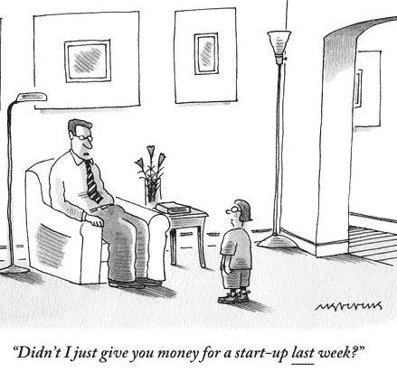

# 你的宝宝可能很丑

> 原文：<https://medium.datadriveninvestor.com/your-baby-is-probably-ugly-e9fc2db5823c?source=collection_archive---------9----------------------->

*相对于初创公司*

你知道婴儿出生的那一刻，他们浑身是血，看起来很不舒服。这些新生儿很脆弱，最初需要重症监护、支持和发育。然后逐渐进化成美丽的人类。 ***一个创业公司遵循同样的轨迹。***

很多时候，初创公司的创始人被他们更好的判断所蒙蔽，认为他们的想法是颠覆性和创新性的，但往往忽视了残酷的现实。然而，真正的问题是:*你的想法在哪些方面是创新的，它产生影响的速度有多快？就像*西蒙·西内克的名言，*“人们不买你做的东西；他们买你为什么这样做。你的所作所为只是证明了你的信念”。*

很少被视为成功之路的想法慢慢变成了日常灾难和盈利的捷径。**原因是:*创始人追逐概念而不评估他们的执行准备，因此，未能发挥他们的全部潜力。他们常常意识不到他们的产品缺乏需求，商业模式几乎不起作用，缺乏专业知识，团队薪酬不足，不愿全力以赴。他们渴望即时满足和扩张，而不是在每个阶段都衡量他们的模式是否仍然是成功的最佳布局。***

Photo by [Clark Tibbs](https://unsplash.com/@clarktibbs?utm_source=medium&utm_medium=referral) on [Unsplash](https://unsplash.com?utm_source=medium&utm_medium=referral)

一些创始人实际上是决策偏差的受害者。如果他们不是乐观估值和预测的受害者，他们可以拦截一些复杂因素。例如，WeWork，一家依靠惊慌失措的创始人运营的公司。它因其错误的商业模式、离谱的杠杆、高估和忽视数据而破产。领导者太过关注直觉增长，以至于他们没有衡量经济衰退和创业公司的衰落。随后，导致他们的 IPO 失败。

同样的模式也经常在其他公司出现。虽然有些人有很大的潜力，但他们很少成功，因为糟糕的管理决策。作为一名领导者，留意决策偏差并确认相关数据是至关重要的。以往的成功经验并不意味着这种模式会在动荡的经济中再次成功。也许重要的是学会识别漏洞并分别执行决策以取得成功。