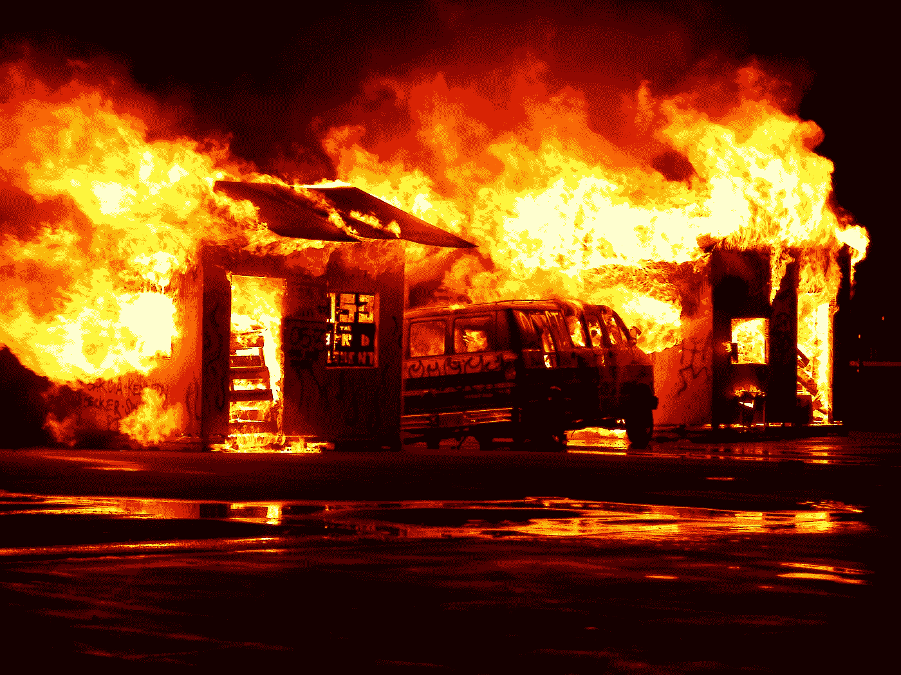
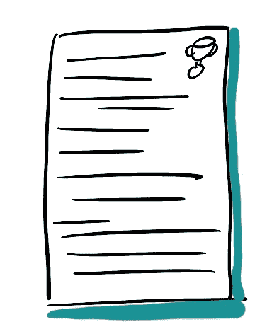
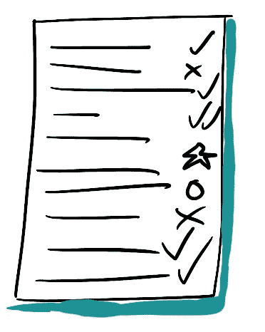
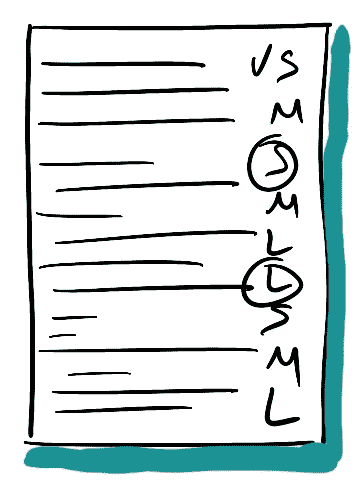

# 你的企业正在经历一场灾难。接下来你会做什么？

> 原文：<https://medium.datadriveninvestor.com/your-business-is-suffering-through-a-disaster-what-do-you-do-next-c5694e90c4c1?source=collection_archive---------16----------------------->

## 现在想出该做什么只是成功的一半。决定灾难过后该做什么是真正的挑战。

Photo by [Dawn Armfield](https://unsplash.com/@darmfield?utm_source=medium&utm_medium=referral) on [Unsplash](https://unsplash.com?utm_source=medium&utm_medium=referral)

ON FIRE YO! (Picture by author)

你的企业正在经历一场灾难。狗屎着火了哟。你当前的过程或程序没有一个能胜任处理正在发生的事情的任务。发生在你和你的企业身上的事情是前所未有的。你该怎么办？

我想你正在努力克服。你在幕后操纵，凭直觉行事，试图在糟糕的情况下尽力而为。你现在做什么几乎完全取决于你和你的生意，但这里有一些一般的想法。

**先想想自己** 这就对了，喘口气，慢一点。喝杯茶，吃块饼干。或许洗个澡，听听冷冷的音乐。如果你精疲力尽，无法集中注意力，你对任何人都没用。

Tea and nice biscuit. (Picture by author)

**想想你的员工其次**

毫无疑问，这是老生常谈且显而易见的，迈克，为什么还要说呢？因为如果我不这样做，你会停止阅读，因为你可能会认为我是无情的脚趾抹布。也就是说，当各国首脑暗示利润和经济比人命更有价值时，或许确实有必要说出来？

**考虑你的客户第三**

你现在能做些什么来帮助你的客户？他们不需要你像过去两周收到的 400 封邮件那样，发一封邮件说“我们都在一起，我们什么什么的”。他们需要的是一句“我可以帮你做 x。”或者“过去，我们做 Y，你做 x 可能会有用”。提供实实在在的帮助，而不是老生常谈和关于你如何帮助他们的信息。

 [## 跑步摆脱疯狂:锻炼如何提高你的生产力|数据驱动的投资者

### 没有比锻炼更好的方式来开始一天的工作了。我试着一周至少做四天，在…

www.datadriveninvestor.com](https://www.datadriveninvestor.com/2018/10/23/running-to-get-rid-of-the-crazy-how-working-out-increases-your-productivity/) 

# 现在，未来

一旦你注意到这三件事，也许你就能停止灭火，开始思考未来。在某个时候，这种一生一次的对你的业务(和其他人的活动)的干扰将会结束。然后呢？

事情不会恢复正常，在很长一段时间内不会，所以你需要为可能发生的事情做好准备。为了为未来做准备，你需要一个框架来帮助你决定当灾难已经过去，可以回去工作的时候，你应该做什么。

我最近花了一些时间和一个亲密的朋友和同事谈论这种框架。他的名字叫[亚伦](https://www.linkedin.com/in/hudaj/)，他才华横溢(也是，非常英俊，穿着得体，风趣并且*单身*)。他向我介绍了以下想法。投资优先级和分类元素并不是特别新。这些步骤的结果就是。对于许多企业来说，了解他们的积压工作准备得如何将变得至关重要。

# 未来的框架

首先列出所有你正在做而现在没有做的事情。然后，加上所有你计划要做的事情，这些事情现在都暂时搁置了。最后，列出所有你可以做的事情——新的项目、想法和计划。

BIG ASS LIST (Picture by author)

现在，在危机过去后(或者危机减弱到足以回到正题时)，你有一大堆事情要做。但是，你的清单上会有很多事情，并不是所有的事情都适合在灾难发生后去做；也许你没有钱(或者你的客户没有)，也许会有人员或其他资源短缺。也许它们不再是特别重要的事情了。所以，现在我们需要优先考虑和估计这些项目的规模和复杂性。

## 战略联盟

从投资优先级开始。对于您的每一个项目，它们与您的战略重点有多一致？这个项目对你的战略发展有帮助吗？这有助于提高客户满意度或改善公司文化吗？列出你的战略目标，衡量每个项目如何帮助你实现这些目标。

BIG ASS LIST with strategic alignment! (Picture by author)

一旦你做到了这一点，你的项目就应该根据它们与你的目标的紧密程度进行优先排序。任何对*毫无帮助的*都应该被藏起来，暂时忽略。

## 项目分类

接下来，你需要对每个项目进行分类或评估。你的小组是什么由你决定，但至少你可以从小型的*、*中型的*和大型的*开始。对于每个项目，你需要在一堆向量中分配一个分数，以帮助你决定哪个类别最适合。分数越高，类别越高。例如，也许一个项目风险很大，但是对你的客户有重大影响，需要很多资源，涉及很多变化。这种分类会将该项目归入大类别。下一个项目需要一个小团队，低风险，没有依赖性，将在几天内完成；这是一个*小*项目。**

****

**BIG ASS LIST with categories. (Picture by author)**

**这些是你如何对你的项目进行分类的基本例子；这完全取决于你所在的行业和你的公司。然而，大多数项目会涉及风险、资源和依赖性，所以你可以用这些来做一个基本的分类。**

## **准备状态估计**

**因此，现在您有了一个项目分类列表，根据它们与您的战略目标的紧密程度进行了优先级排序。你可以停在这里。你已经知道你需要做什么，需要付出多少努力，但是下一步让你知道你清单上的哪些项目已经成熟可以开始了，哪些还需要更多的工作。**

**最后一步是了解每个项目的准备情况。理想情况下，当雾消散时，你希望能够按下按钮，开始发送*某种东西*。如果你的前三个项目在你按下按钮之前需要大量的计划和准备，它们可能不是你在灾难后第一个选择的项目。**

****

**BIS ASS LIST with percentage ready! (Picture by author)**

**你需要决定就绪对你的公司意味着什么。也许是行业对就绪的定义、商业计划的制定、采购政策、适当的系统以及确定并准备好的合适人员。也许这是正确的 UX 模型，适量的用户研究，市场的胃口，随时待命的工程师和设计师。如果你是一个人的公司，这甚至可能只是你有时间的问题。**

**给定你的项目适合的类别，你想要理解就绪意味着什么。一个*小型*项目的准备不太可能与一个*大型*项目的准备相同。但是，如果你的大项目符合所有准备就绪的条件，而你的小项目不符合，那么大项目是你首先要开始的。**

**这样做似乎有悖直觉——“我有一个小项目，首先做肯定会更安全、风险更小。投资回报会更快！”但它不会，不会真的，尤其是如果，在你开始项目之前，你必须先做好准备。当你准备好较小的项目时，准备好的大项目已经完成了一半。**

# **做到这一点，第一**

**所以，现在你有了一个当世界没有陷入火海时要做的事情*的优先和分类列表，你知道当毁灭的面纱消失时，每一件事情离准备好还有多远。也许你没有任何准备好的项目。没关系，你有一些时间来使那些几乎准备好的项目达到标准。你可以开始与客户、承包商、合作者或合作伙伴谈论你需要从他们那里得到什么。用这些术语谈论它将是一股新鲜空气，因为听到*有人把他们的大便放在一起*并且谈论一个更积极的未来。***

**

*Happy days! (Picture by author)*

# *最后一句话*

*我已经给了你一个大概的概述。不可能在一篇文章中解释什么对你的公司是正确的，作为一种对你的项目进行优先排序和了解准备情况的方法。但是你应该了解你的业务，或者认识一个你可以谈论你的业务的人，足以遵循这个框架，如果你不了解，就[联系](mailto:mike.pearce@jacobs.com)。*