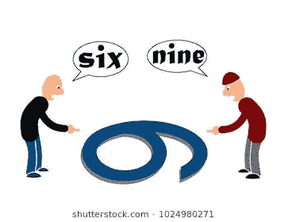
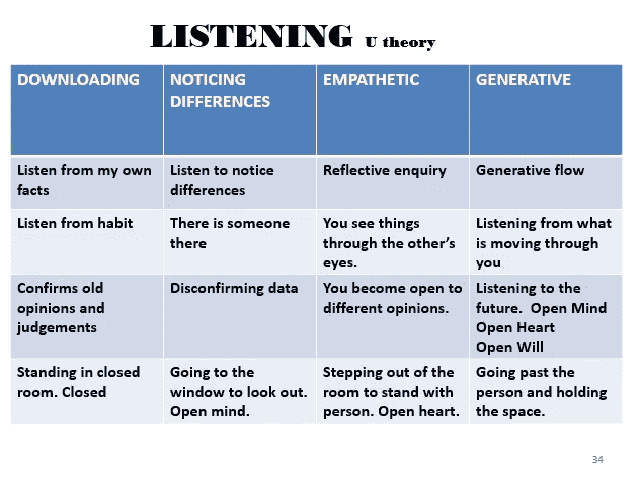
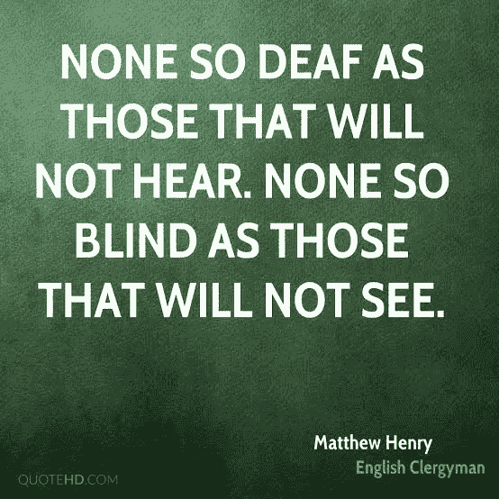
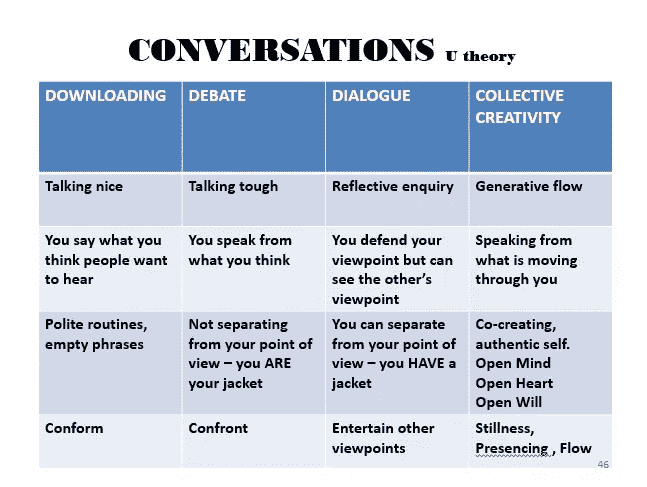

# 你的用词可以拯救一条生命

> 原文：<https://medium.datadriveninvestor.com/your-choice-of-words-can-save-a-life-fa6bc0866268?source=collection_archive---------10----------------------->

## 工作场所的同理心对士气和生产力至关重要

Photo by Metin Ozer on Unsplash.

人很重要，同事很重要，团队很重要，最重要的是，语言很重要。每个人如何交流有助于人们知道他们很重要。

所有这些都有助于工作场所的同理心，生活和商业教练[科琳·奎斯特](https://twitter.com/ColleenQvist/)说这对士气和生产力至关重要——有时甚至是救命的。除了是一名演讲者、推动者和企业家，她还是南非[教练和导师](https://twitter.com/COMENSA)的全国副总裁。对她来说，同理心始于视角。

Qvist 在一次围绕工作场所的移情和对话的非洲推特聊天中说:“移情就是这些人(下面)走到另一边，从那一边看情况。”

同理心是理解你的同事在做什么。没有这些，你们会在感情上被对方绊倒。

“这是一种分享他人感受的能力——一种深深的关爱，”奎斯特说。“为了表示感同身受，你不一定要和别人经历过同样的情况。同理心不是同情。同情说，“哦，可耻”，而同理心赋予力量。

“移情是情商的第四个支柱，代表着另一个人，”她说。“三大支柱是关于自我的。一个支柱是关于*你*——或同理心——最后一个支柱是*我们*——或社交技能。”

 [## 情商会让你放下包袱

### 不当行为是工作场所生产力和士气的杀手

medium.datadriveninvestor.com](/emotional-intelligence-rolls-back-baggage-20021e1960fb) 

这是使共情与众不同的一个特殊因素。

奎斯特说:“作为情商(EQ)的一部分，移情一直是未来工作的一项技能。“疫情刚刚把未来变成了现在。同理心和情商现在很关键。”

感同身受地倾听意味着[倾听理解](https://medium.com/datadriveninvestor/tips-for-entrepreneurs-not-spoken-for-9de87df8653?source=friends_link&sk=5b4036b641f370099a05a15515d94f45)并根据听到的内容做出回应，而不是重复一个固定的回答。

奎斯特说:“移情倾听需要意识到你在听哪个层次的声音。”“那就多练多练。”

# **连同差异**

同理心很重要，因为每个人对不利条件的反应和接受程度都不同。认识和理解这些差异有助于人们更好地作为一个团队一起工作。

奎斯特说:“据说在我们充满挑战的时代幸存下来的公司是那些与员工互动、使用同理心并与高情商的领导者建立现有文化的公司。””[的软技能再也不软](https://www.datadriveninvestor.com/2020/04/27/unleash-the-superpowers-of-soft-skills/)了。他们现在非常需要，而不是在未知的、遥远的未来。他们现在需要*。它们是可以学习的。报名参加情商研习班。*

*“我们需要学习如何比以前更好地联系，”她说。“我们需要意识到什么是真正重要的，否则我们未来将无法繁荣发展。”*

* [## 商务攀登者拥抱他们的夏尔巴人

### 教练给人们和团队力量，让他们达到顶峰

medium.datadriveninvestor.com](/business-climbers-hug-their-sherpas-ab2f431041e) 

经过在线辅导——尤其是现在——奎斯特学会了如何感知客户的情况。她认为领导者也可以获得这种特质来帮助他们的团队:

*   满足情感需求
*   减少人员流动和旷工
*   提高创造力、参与度和解决问题的能力

人们可能想卸下自己太多的信息，需要一个共鸣板。知道你在倾听可能正是他们需要的安全阀。

“我们曾经有明确定义的盒子——工作和家庭，”奎斯特说。“现在那些盒子已经开始结合了。我们是完整的人，而不是分离的实体。

“我们会在表面上与我们经常相处最长时间的人联系吗？”她说。“我们要和意义联系起来吗？这意味着某种程度上了解个人细节。这些细节不必太亲密。”

# **倾听的可取之处**

认真倾听和理解可能会避免悲剧。

奎斯特说:“当同事或朋友自杀时，我们感到非常惊讶。”。“这到底是怎么回事？我们从来不知道？迹象在那里，但在表面之下吗？

“工作中一定要做真实的自己，”她说。"是的，不要泄露你的整个故事，但也不要选择合上书本."

当人们把另一个人的问题变成自己的问题时，他们会太在意。更好的方法是成为一个理解的队友，形成一个公正的回应。

 [## 在团队合作中，我占优势

### 一群人一起工作来实现有意义的目标

medium.datadriveninvestor.com](/in-teamwork-the-is-have-it-c325c8a7c8fd) 

“你可能会太在乎，尤其是如果你的在乎是同情而不是移情，”奎斯特说。“问问自己是不是在接管别人的情况。你是否穿着他们的鞋子走路，却留着鞋子？移情者非常强烈地感受到他人的情绪，必须学会如何分离。

“如果你发现你的‘关心’让你失去了能力，让别人失去了力量，那就不是同理心，”她说。“那是‘哦，羞耻，或者同情’"

奎斯特看到了两种反应之间的巨大差异。

“同理心意味着理解，但不意味着同意，”她说。“我可以同情你小时候受到的虐待，但我不一定同意或允许你成年后成为施虐者。”

当听队友说话时，用你自己的话重新表述问题，以确保双方理解问题的细节。

“交流有四个层次，”奎斯特说。“我喜欢这种类比:脱下你的外套或观点，去和别人交流，交流他们的外套或观点。”

# **定义很重要**

从分开中得到的一个教训是，正确的说法是“物理距离”在社交方面，每个人都比以往任何时候都更需要对方。安全不是单独监禁——当然不是情感上的。拿起电话，说你在乎。

“联系比我们想象的要重要得多，”奎斯特说。“没有什么比失去一样东西更能让你最终珍惜它。我们不再看到它，不再做它，也不再感激我们能联系上。在很多层面上都是如此:家庭、同事、朋友、崇拜、你的发型。”

 [## 客观性和同理心造就了不太可能的伙伴关系

### 一个巨大的挑战是不带任何偏见地看待一切

medium.datadriveninvestor.com](/objectivity-and-empathy-forge-unlikely-partnership-4621a305e55a) 

在同理心和从团队中获得结果之间有一个微妙的平衡。缺乏同理心会使人在情感上受到冷落。太多的同理心集中在一个地方可能会被解释为偏袒。

奎斯特说:“同理心是联系和理解，而不是同情。“我理解你为什么没有完成这个项目，但这并不意味着这是对的。我们能纠正这一点，并把事情放在适当的位置，这样就不会再发生了吗？同理心并不意味着没有后果。

“同理心不是‘友好’和被动，也不是无所事事，”她说。“换位思考可以带来双赢。同情考虑到了输赢。不要忽视品牌和目标。爱、关心和同情可以帮助你实现这些目标。”

那些能区分同理心和同情心的人会成功。

“同情是不分国界的，”奎斯特说。“移情确实如此。同情意味着没有后果。同理心考虑后果。”

**关于作者**

吉姆·卡扎曼是[拉戈金融服务公司](http://largofinancialservices.com/)的经理，曾在空军和联邦政府的公共事务部门工作。你可以在[推特](https://twitter.com/JKatzaman)、[脸书](https://www.facebook.com/jim.katzaman)和 [LinkedIn](https://www.linkedin.com/in/jim-katzaman-33641b21/) 上和他联系。*