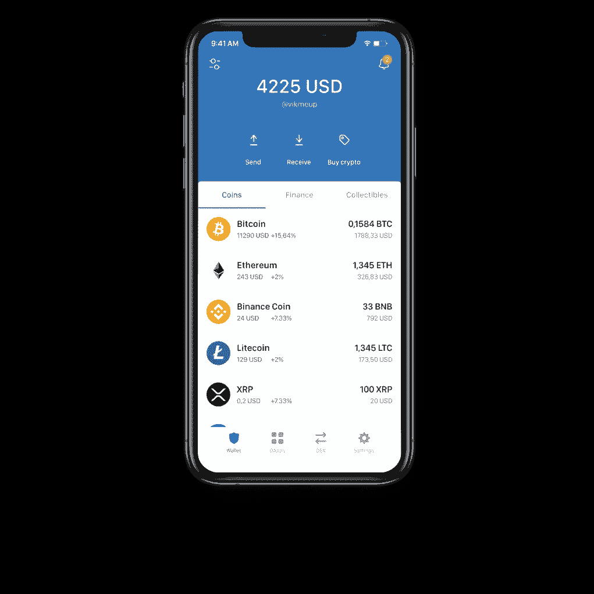
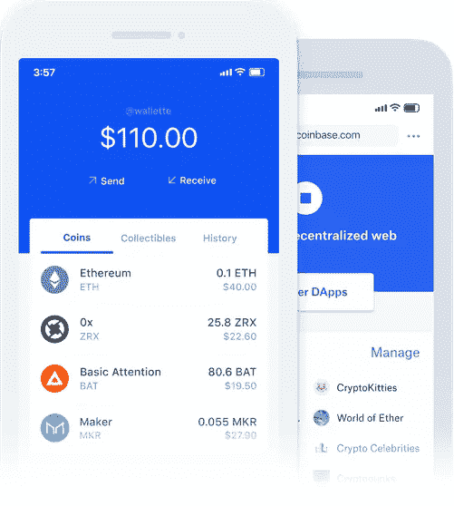
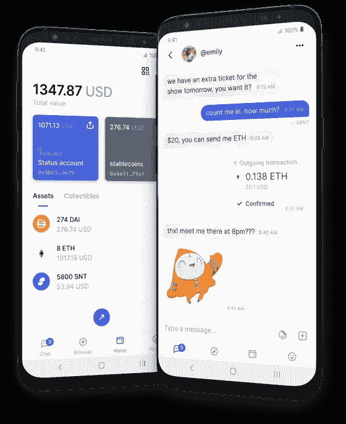
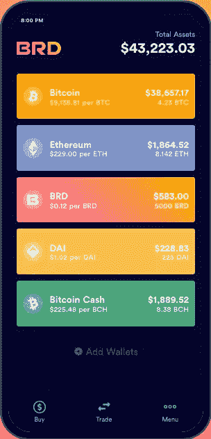
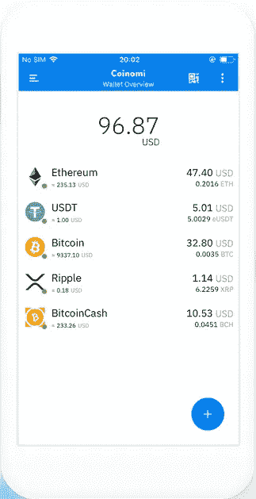
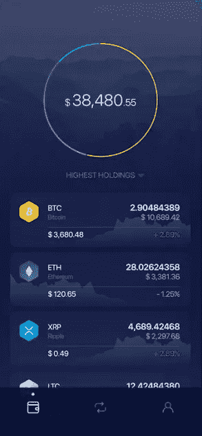
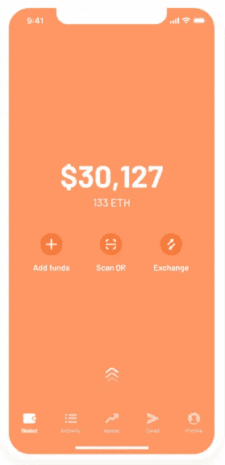
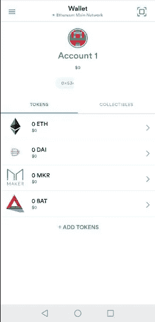

# 你对安卓加密货币钱包的选择。

> 原文：<https://medium.datadriveninvestor.com/your-choices-on-android-cryptocurrency-wallets-9eb9db9b3cc6?source=collection_archive---------9----------------------->

如果你对使用或存储加密货币感兴趣，你需要一个钱包。虽然冷库和硬件钱包更安全，但不如 app 钱包方便。在这个故事中，我们将研究一些适用于 android 手机的最佳加密货币钱包。

Photo by [Aleksi Räisä](https://unsplash.com/@denarium_bitcoin?utm_source=unsplash&utm_medium=referral&utm_content=creditCopyText) on [Unsplash](https://unsplash.com/?utm_source=unsplash&utm_medium=referral&utm_content=creditCopyText)

# 1.信任钱包

Image is taken from [https://trustwallet.com/](https://trustwallet.com/)

信任钱包是我的第一个钱包。它是著名的加密货币交易所币安的产品，它让你轻松安全地存储你的加密货币。从比特币到以太坊、Dogecoin、戴，它支持无数的代币。它还允许您浏览各种 Dapps，并将您的令牌转换为其他令牌。它还可以让你在应用程序中创建多个钱包。这个钱包也是由[https://ethereum.org](https://ethereum.org)建议的。

*   **公司**:币安
*   【https://trustwallet.com/】网站 : [网站](https://trustwallet.com/)
*   **安装** : 1.000.000+
*   **国家**:中国

# 2.比特币基地钱包

Image is taken from [https://wallet.coinbase.com/](https://wallet.coinbase.com/)

我的钱包选择，比特币基地钱包做一切。我承认我有偏见，因为这是我使用的钱包，但在我看来，它值得关注。比特币基地是美国最大的交易所之一。这个钱包可以和你在比特币基地的在线账户连接，你可以轻松地在比特币基地和你的比特币基地钱包之间转移任何硬币。您可以实时跟踪您的投资组合，也可以实时购买、出售、兑换、发送和/或接收加密货币。您可以轻松地使用您的令牌进行 DeFi，并将它们借给 Compound 或 dydx 协议。您还可以在应用程序中创建不同的钱包，并且可以兑换当地货币。

*   **公司**:比特币基地
*   **网站**:[https://wallet.coinbase.com/](https://wallet.coinbase.com/)
*   **安装** : 500.000+
*   国家:美国

 [## 加密过山车 ETH2.0 测试网的麻烦，动荡的市场，美联储谈论 CBDCs |数据…

### 是只有我这么想，还是外面的情况越来越乐观了？从酒吧凳体育创始人戴夫波特诺伊泵他最喜欢的…

www.datadriveninvestor.com](https://www.datadriveninvestor.com/2020/08/20/crypto-rollercoaster-trouble-on-the-eth2-0-testnet-volatile-markets-the-fed-talks-cbdcs/) 

# 3.状态钱包

Image is taken from [https://status.im/](https://status.im/)

这款应用包括安全即时消息、Dapp 浏览器和加密货币钱包，所有这些都在应用内。一个很棒的功能是，你可以在即时通讯应用程序中轻松发送和接收加密货币，就像你发送图像或视频一样。界面很棒，整个应用程序看起来非常健壮。缺点是用这个 app 的人不多，所以聊天功能目前用处不大。此外，你不能像在信任钱包和比特币基地钱包那样在应用程序中购买代币。

*   **公司**:状态研究&发展有限公司
*   **网站**:【https://status.im/】T4
*   **安装** : 50.000 以上
*   **国家**:瑞士

# 4.BRD 钱包

Image is taken from [https://brd.com/](https://brd.com/)

在我看来，这个钱包的界面是所有钱包中最好的。它支持大量的令牌。你也可以在应用程序中购买更多。除了发送、接收、购买、转换和出售加密货币的标准功能之外，这款应用还附带了一些额外功能。它奖励你存储加密货币。你可以在 https://brd.com/rewards 的他们的网页上找到更多的信息

*   **公司**:养家者股份公司
*   **网站**:[https://brd.com/](https://brd.com/)
*   **安装** : 1.000.000+
*   国家:瑞士

# 5.Coinomi 钱包

Image is taken from [https://www.coinomi.com/](https://www.coinomi.com/)

这个应用有很多粉丝。它支持 android 加密货币钱包的所有标准功能，并以其安全特性而闻名。他们宣传说“*成立于 2014 年的 Coinomi 是最古老的多链钱包，拥有数百万活跃用户。最重要的是，到目前为止，Coinomi 钱包从未被黑客攻击或以其他方式入侵过*”，这是一个非常大胆的说法。它支持各种各样的加密货币，它还有一个桌面版本，可以在 Windows、OSX 和 Linux 上使用。

*   公司:Coinomi
*   **网站**:[https://www.coinomi.com/en/](https://www.coinomi.com/en/)
*   **安装** : 1.000.000+
*   **国家**:塞浦路斯

# 6.出埃及钱包

Image is taken from [https://www.exodus.io/mobile](https://www.exodus.io/mobile)

又一款以设计见长的安卓加密货币钱包。它提供了一个桌面和一个移动版本，但也能够从硬件钱包中处理你的加密货币。您可以轻松跟踪您的加密货币投资组合，并从其内置的交易所添加到它们。它甚至可以让你用加密货币在各种体育赛事上下注，尽管我不是它的忠实粉丝，也没有测试过它。

*   **公司** : Exodus 运动公司。
*   **网站**:[https://www.exodus.io/](https://www.exodus.io/)
*   **安装** : 100.000+
*   **国家**:美国

# 7.银色钱包

Image is taken from [https://www.argent.xyz/](https://www.argent.xyz/)

我个人第三喜欢的加密货币钱包是 Argent。它非常安全，甚至可以让你设置转账限额、生物识别锁和密码，以确保你的钱是安全的。唯一的缺点是它只支持建立在以太坊区块链之上的令牌，因为它是建立在以太坊区块链之上的。您可以发送带有应用程序联系人列表的令牌。这使得 Argent 成为一个非常方便的钱包。

*   **公司**:银色总部
*   **网站**:【https://www.argent.xyz/】T4
*   **安装** : 10.000 以上
*   **国家**:英国

# 8.MetaMask 钱包

在[https://ethereum.org/](https://ethereum.org/de/wallets/)上推荐的另一款钱包。Metamask 是另一个不支持比特币的钱包。它包括 android 加密货币钱包的所有标准功能。我个人对此印象不深。它仍然是一个不错的替代钱包，你可以使用。

*   **公司** : ConsenSys
*   **网站**:[https://metamask.io/](https://metamask.io/)
*   **安装** : 100.000+
*   国家:美国

## 访问专家视图— [订阅 DDI 英特尔](https://datadriveninvestor.com/ddi-intel)