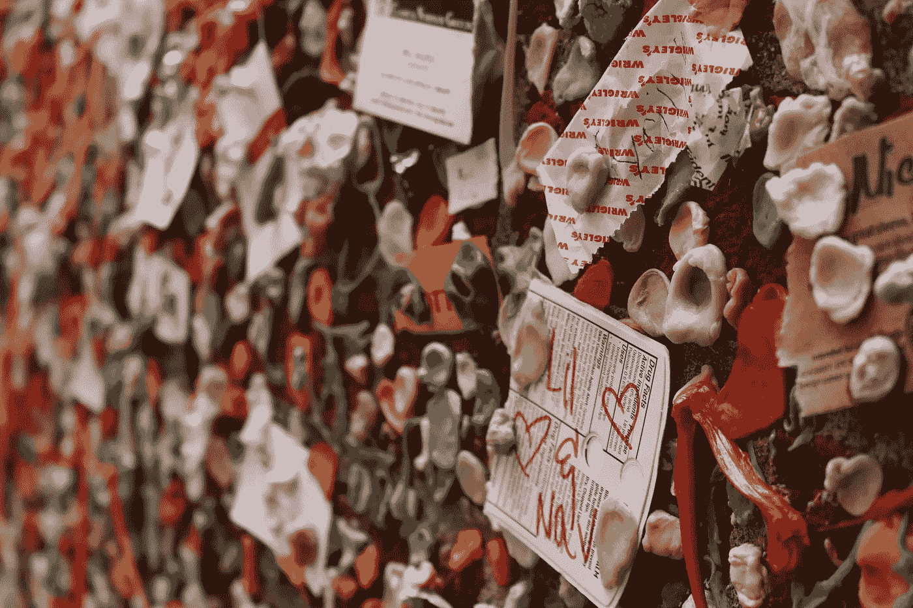

# 格兰特·卡尔多内怎么会损失 1680 万美元

> 原文：<https://medium.datadriveninvestor.com/your-demeanor-may-be-costing-you-45ef565dd4ee?source=collection_archive---------28----------------------->

## 他的举止可能会让他付出代价

Photo by [Melissa Askew](https://unsplash.com/@melissaaskew?utm_source=unsplash&utm_medium=referral&utm_content=creditCopyText) on [Unsplash](https://unsplash.com/s/photos/gross?utm_source=unsplash&utm_medium=referral&utm_content=creditCopyText)

我总是着迷于那些为了宣传而制造争议，希望产生负面宣传的人。任何媒体都是好媒体。但是真的，是吗？

也许任何一种恶名的经济回报都值得一些公众的负面反应。但是，也许不是。(也许我们应该问问亚历克·鲍德温、布鲁斯·斯普林斯汀或艾伦·德杰尼勒斯)。

我所知道的是我个人对那些在公众面前露出真面目的人的反应。而且，如果我的个人反应与我的支出相关联(通常如此)，我们可以在一定程度上肯定地推断，当有影响力的人(因为缺乏更好的词)陷入困境时，他们会损失一些钱。

以下是我最近对不太讨人喜欢的个性的体验，我认为这会如何影响他的底线，以及我们都可以从如何*而不是*与他人互动中学到的经验。

# 我们用钱包听

我是[刘易斯·霍维斯](https://medium.com/u/1dba7834fead?source=post_page-----45ef565dd4ee--------------------------------)’[伟大学校播客](https://lewishowes.com/podcast/)的忠实听众。我把每一集都放在流媒体上，在晨跑的时候听。我通常会立即购买客人推销的任何书籍或产品——我在 Audible 上下载了[马修·麦康纳](https://medium.com/u/6c2b3a65412f?source=post_page-----45ef565dd4ee--------------------------------)的新书，买了[雷切尔·霍利斯的](https://lewishowes.com/podcast/rachel-hollis-manifest-success-overcome-guilt-manage-negative-feedback/)新平装本，并将[朴雅卡·乔普拉](https://medium.com/u/a37feb9350f1?source=post_page-----45ef565dd4ee--------------------------------)的新电影加入了我的观影队列(顺便说一句，她是个了不起的人——我现在是她的忠实粉丝)。

你可以说我用钱包听。我也有消息要告诉你——许多其他人也有。我今天早上跑步时听的那一集是有争议的推销员格兰特·卡尔多内。我按了 play，以为我会重新获得 10 倍的收入。

相反，有人提醒我，金钱买不到机智。此外，我没有去卡尔多内大学(顺便说一下，据我所知，该大学不授予任何地区认可的学位)购买课程，而是写了一篇关于在播客采访中不要做什么的文章。

# 卡尔多内的失误

因为我住在洛杉机，而且我的大多数朋友都在电视行业工作，所以我听说了关于卡尔多内最近的真人秀失败的传闻。格兰特·卡尔多内是一个拥有多重身份的人，他曾出现在名为*卧底亿万富翁*的真人秀节目中。直到我听到卡尔多内在*名人学校*的播客上抱怨这个节目，我才明白过来。

卡尔多内抱怨说，电视网试图强迫他按照他们的方式做节目(想象一下来到*名人幸存者*的片场，并宣布你将进行自己的豁免挑战)，而且“制作没有很好地做到这一点。”现在，我的猜测是，虽然卡尔多内知道很多关于公开露面，他可能从来没有坐在一个狂热的背后，并削减任何一集的电视节目。

我不知道你们怎么想，但我不会出卖任何人。永远不会。我尤其不愿意放弃一整部包含了很多人的作品。我认为 [Jocko Willink 在《极端所有权》中总结了这一点](https://www.amazon.com/Extreme-Ownership-U-S-Navy-SEALs/dp/1250067057)，他说，“实施极端所有权需要检查你的自我，并以高度的谦卑来运作。”

此外，格兰特·卡尔多内告诉主持人路易斯·霍维斯，节目制作人要求他在餐馆给服务员留小费(他拒绝了)。在播客中，他说当他有更多的钱时，他会回去“照顾她”，但当时他没有多余的钱留下小费。(当然，这在概念上是有道理的，但是这给其他人树立了什么样的榜样呢？如果我们都等到有了多余的钱时再给服务员小费会怎么样？)

最后，但绝对不是最不重要的，卡尔多内整体公正。。。让我不喜欢他。我甚至在 40 分钟后关掉了播客(这是我从来不做的事)，因为我不想再受这个人的影响了。现在，让每个人都喜欢你很重要吗？不，我不这么认为。重要的是要足够有风度，不要激发人们想要关闭你，以免负面影响他们的情绪状态？我会这么说。

# 这将如何影响卡尔多内的底线

在这一部分，我做了一个很大的假设。我的假设是，有和我一样的人因为在伟大学校播客上听到卡尔多内的演讲而对他的人格产生了负面反应。然而，如果我的观点成为卡尔多内潜在客户中哪怕一小部分人的试金石，那就可能是个问题。

让我们只看卡尔多内影响的一个方面——卡尔多内大学。根据 dealy 的数据，就读卡尔多内“大学”的平均费用是 2000 美元。因为教学是虚拟的，我们可以猜测，包括学生收购成本、虚拟主机和内部教练团队的工资(视频制作成本假设到此时可以收回)，银行可接受的收入是学费的 40%(800 美元/学生)。

根据他们的网站，卡尔多内在 35 年里上了 45，233，539 节课，平均每年 1，292，386 节课，大约每月 107，000 节课。虽然这不是最可信的数字，但我会相信网站的话。

如果我们假设大约有 140，000 人听过*名校*的卡尔多内集(1.5 亿次下载/1069 集)，让我们猜测其中 30%的人“用钱包听”，那就是 42，000 名潜在的卡尔多内大学参与者。假设有一半的人认为把别人扔在公共汽车下，给你的女服务员小费是不礼貌的，总体来说是一个粗鲁的人。

**21，000 名卡尔多内大学一门课程的参与者 x 每位学生口袋里 800 美元的折叠美元=**

16，800，000 美元的收入损失本可以通过表现得像个好人(甚至不是真正的好人)来节省。

当然，这对于他 3 亿美元的净资产来说只是沧海一粟。但这也是假设这是一个孤立的事件。通常，这种事情不是。对于一个专门做销售的人来说。。。格兰特·卡尔多内肯定让我失去了一个顾客。

# 我们能从卡尔多内的错误中学到什么

我总是发现我从错误中学到的比从成功中学到的多。我认为我们都能从这次采访中学到很多。格兰特·卡尔多内是不是一个了不起的人甚至不是一个问题。问题是，*根据对刘易斯·霍维斯**[*的采访，人们会购买卡尔多内的任何产品吗？*如果我是个案例研究，很多人没有。](https://medium.com/u/1dba7834fead?source=post_page-----45ef565dd4ee--------------------------------)*

*让我们看看花几个小时在下载量最大的播客上的可能目标。首先，卡尔多内可能一直在寻找新的追随者。第二，他可能是想宣传他的新剧。第三，他可能是为了书籍和课程销售。第四，他可能真的对启发和教育听众感兴趣。如果这些是他的目标，在我看来，他都失败了。*

*不管是好是坏，人们都是例外的牛。测试探测器。不管我们是从认知上认识到这一点，还是仅仅有一种“直觉”，我们都知道自己是否信任某人。*

*本能地，我们把自己放在谈话中提到的其他人的位置上。*

*我们成了因为不够好而被回避的潜在商业伙伴，靠小费付房租的女服务员，以及拼命坚持真人秀节目前提的电视工作人员。*

*当一个人贬低其他任何人，暗示他们比其他任何人都好，或者不参与他们项目的成果时，我们在一英里之外就能闻到。虽然两极分化的行为可能会成为关注的焦点，但人们会用钱包听别人的话。最终，这将减少收入。但是，更糟糕的是，这可能会损害一个人的声誉、自尊和整体幸福。*

*所以我们有了它。伤害别人伤害别人。缺乏安全感的人贬低别人来让自己感觉更好。我们只能同情那些不够强大，无法善待*所有*人类同胞的人。最后，如果你的目标不是启发和教育人们，而是尽可能多地赚钱，你可能会因为暴露自己的本色而错过收入。*