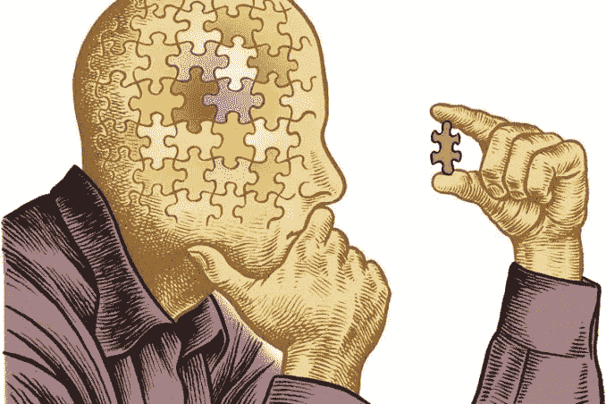
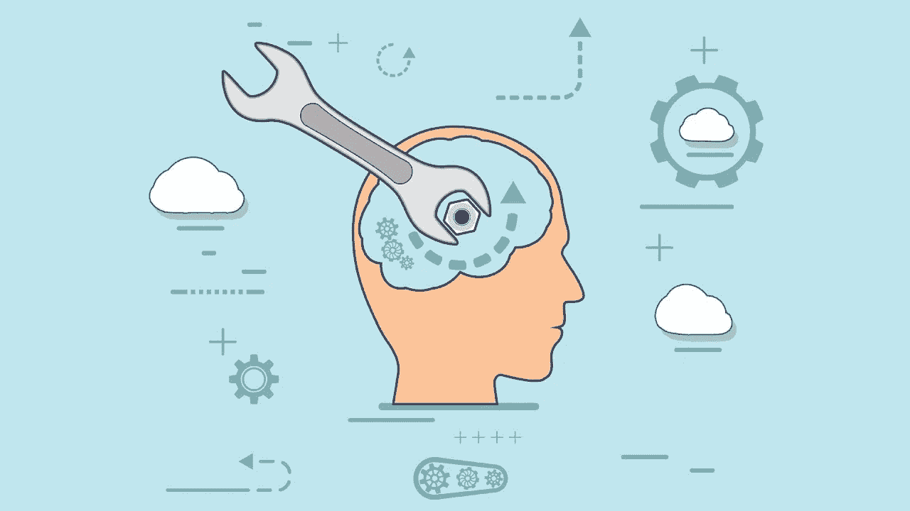

# 你的自我想要加速，但是觉知起到了刹车的作用

> 原文：<https://medium.datadriveninvestor.com/your-ego-wants-to-accelerate-but-awareness-serves-as-a-brake-db1b79e1be8c?source=collection_archive---------21----------------------->

## 意识是修复自我的工具

The Chronicle of Higher Education

# 我不得不结束自己去寻找自我！

年前的我**结束了我**用**换来的**自己**的**，我以为我**拥有**的**换来的**别人**的**，别人**期待**我换来的**他们**！我之所以这么做，是因为我陷入了一种深深压抑的虚无之中。

一个**游荡的幽灵**将是对我当时存在的恰当描述；我有名字和身体，但我失去了灵魂。我所感觉到的是焦虑、害怕、担心、后悔、憎恨，以及深深的怨恨

…我认为比自己更重要的人和事。

…我无法生活的事情，因为我害怕别人的看法。

…我没有做的事情，因为有人会不高兴。

…做一个讨人喜欢的人太久了。

…最终，关于我不是在过我梦想的生活。

我感觉像是被活埋了。我生活在生存模式中，感觉这种情况会永远持续下去。

因此，我在生存模式下生活了两年，我知道我必须对这种我称之为“生活”的痛苦做点什么。

我决定做 **EFT** 疗法(*情感自由术*)；这是一种**替代**的治疗方法，通过重复**咒文**同时敲击**指压**点，你的**潜意识**正在被**重置**。

我在整个治疗过程中都持怀疑态度，但是有一天，我的治疗师说:

*“你看，你已经* ***决定*** *让人家亏待你了。如果你* ***没有允许*** *他们这么做，他们* ***就不会*** *！你在生活中总是有选择的。”*

这很难接受。那么，我所经历的所有苦难，是我的错，我的责任，我的决定吗？！

我没想到会这样。指责和指责别人我的痛苦是如此的容易和舒服！该死的！

我甚至没有意识到我有一个选择来决定人们如何对待我，我可以为我的每一段关系划定界限。

在治疗期间，我有一种感觉**我的内心和周围都没有改变**;但是经过几个小时对发生在我身上的事情的观察和评估，我身上的某些东西**发生了变化**。

这简直就像是一次**觉醒**！

我的觉醒是意识到我不知道我生命中的任何事或任何人。问题是，我只是对每个人和每件事做出反应，但从未想过我的反应意味着什么，以及我与他们交流了什么。

 [## 贫困心理学|数据驱动的投资者

### 似乎有一种真诚的信念，如果你足够努力地工作，有远大的梦想并努力去做，你就会摆脱贫困…

www.datadriveninvestor.com](https://www.datadriveninvestor.com/2020/01/31/psychology-of-poverty/) 

# 我醒着，但我没有意识到！

一旦我意识到我必须**更加意识到**我自己、我的反应以及我周围的事物/人，我的**治愈之旅**就开始了！

当你生活在**自动驾驶**中，你对几乎所有事情的反应都是由**默认**做出的时候，**悲惨的生活是不可避免的**。

**自动驾驶生活意味着什么？**

它基本上意味着*‘反应’*以**标准反应无意识地对待一切事物**。我们的**创伤**教给我们的一种反应(因此，大多是偏见和消极的反应)。

我们的很多反应都是由我们的 ***【创伤自我】*** 作出的，它住在**心里**。是由情绪滋养的**。**

## **我们的感受主要是我们的反应。**

**如果我们感到焦虑，我们的反应是激动和紧张。如果我们感到快乐，我们会平静而慈爱地回应。**

**我们的自我何时占上风？**

**我们的自我只有一个目的:保护我们不受伤害(这就是我们作为猎人和采集者的方式)。当我们觉得一个人的行为可能危及我们时，我们的**防御机制会自动全速运行**。**

**这种防御机制最致命的部分是它是一种完全没有意识到的反应。它是即时的和冲动的，而且大多是有害的。**

****如何更有自知之明？****

1.  **想想你的想法**
2.  **观察你的感觉**
3.  **提问**

****

**Attitude**

**对我来说，意识是一种工具。我这么说是什么意思？**

**我们来想一想**修坏了的机器**:**

**为了修理它，你需要知道你必须使用哪种工具来拧紧或松开螺丝，或者哪种工具适合切割电缆等等…**

**人类也是一样:**

**如果我们感到**崩溃/失去秩序**，意识是告诉我们如何**修复自己的工具。****

****认知的工具**是这些疑问词:**

## **为什么？**

## **什么？**

## **怎么会？**

**假设你面临不公正。如果你生活在自动驾驶仪上，你会以你习惯的方式做出反应。义愤填膺，愤怒和自卫。**

**但是你可以选择不同的反应。这是应用认知工具的样子:**

*   **为什么我觉得受到了不公正的对待？**
*   **是什么让我如此激动？**
*   **如何改变我对 XYZ 行为的看法？**

**这些**问题**会让你**关注**实际的**数据**而不是**你的自我为你服务的情感鸡尾酒**。**

## **你的自我想要加速，但是意识起到了刹车的作用。**

**这些问题会让你意识到，认可，并希望强调这个人的行为。**

**这些问题将有助于你不要把每件事都看成是针对你个人的。**

**意识是一种减缓对触发情境的直觉、冲动、立即、大部分是后悔和错误反应的方式。**

## **最后一个想法:**

**没有意识到的反应等于后悔的后果！**

**有意识意味着学习何时以及如何拧紧或松开我们的螺丝。**

**这是学习修复我们自己！**

**感谢阅读:)**

## **访问专家视图— [订阅 DDI 英特尔](https://datadriveninvestor.com/ddi-intel)**