# 解决机器学习问题的端到端指南—结构化工作流

> 原文：<https://medium.datadriveninvestor.com/your-end-to-end-guide-to-solving-machine-learning-problems-a-structured-workflow-5045e0102e6?source=collection_archive---------5----------------------->

当处理任何机器学习类型的问题时，ML 工程师甚至整个数据科学团队都必须意识到他们的工作流结构和他们将采取的步骤顺序，以便他们能够在不同的应用程序和环境领域产生可扩展的 ML 解决方案。在本文中，您将理解遵循标准结构化 ML 工作流的重要性，您还将看到所涉及的步骤以及如何将它应用到实际项目中。凡事总有一个正确的方法；-)

Photo by [Olav Ahrens Røtne](https://unsplash.com/@olav_ahrens?utm_source=medium&utm_medium=referral) on [Unsplash](https://unsplash.com?utm_source=medium&utm_medium=referral)

# 标准 ML 工作流程，是什么，为什么

在行业中积累了多年经验的从业者和专家强烈建议在 ML 项目中自始至终遵循标准工作流程，因为它允许您作为 ML 工程师做出最佳决策，考虑它们如何影响未来的步骤，衡量解决方案的性能，并轻松返回到某个阶段以优化整个解决方案的性能。下面是一份清单，摘自 Aurelien Geron 编写的流行且资源丰富的 ML 教材，以及 Scikit-Learn 和 TensorFlow 的机器学习实践。

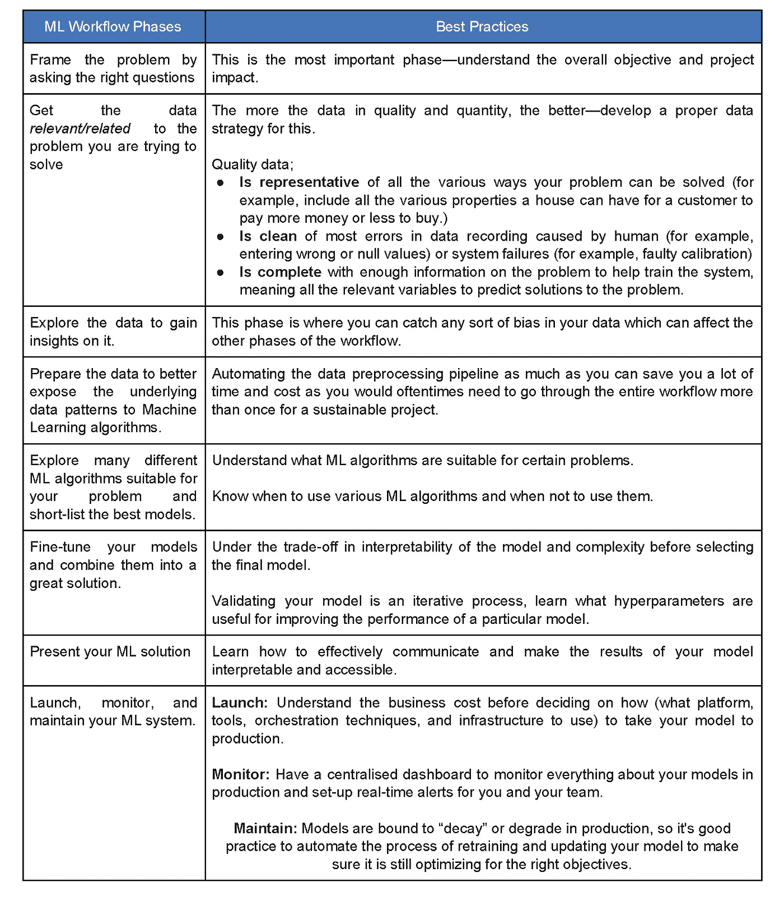

Source: [PHCschoolofAI](https://blog.phcschoolofai.org/getting-started-with-machine-learning-no-practical-machine-learning-part-3-ck9mf61vj002qihs1iwkzaedn?guid=none&deviceId=355b25c2-c211-4445-ac92-003f462e6070), based on Aurelien Geron’s book

# ML 工作流的阶段

从上面的图片中，我建议您保存一份以备将来参考，您可以看到标准 ML 工作流方法是如何总结为 8 个主要步骤的，这些步骤简单而清晰。现在让我们仔细看看一个虚构的业务问题，看看如何将这个工作流应用于它。

**问题描述**

一家建筑骨料公司的销售代表在实现销售目标方面遇到了困难，他认为这是因为客户抱怨产品质量不一致。通过与工厂主管的会面，他发现生产工厂在上个季度进行了升级，原材料通常在生产前经过测试。工厂主管看不出不一致的任何明显原因，但对销售代表来说，升级的时间与投诉开始的时间一致。会议还没有给销售代表带来任何解决方案。在做了更多的研究并与他的网络互动后，他发现这些机器有数据记录，所以他向分析部门的经理询问前进的方向。分析经理告诉他，数据的可用性可能有助于他们通过稳健的模型检测混凝土抗压强度的不一致性。销售代表表示，他有兴趣找出对混凝土抗压强度影响最大的因素，这样他就可以策划一种方式向管理层展示他的发现。

作为一名 ML 工程师，你的角色是建立一个端到端的 ML 项目来解决这个问题。

# 框定问题

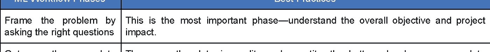

ML 工作流程的第一步允许我们正确地理解我们将要进入的项目。为什么我们甚至需要预测混凝土的抗压强度？我们的目标是什么？在这种情况下，目标是解决产品质量不一致的问题，以提高销售额。能够预测混凝土压应力并确定影响压应力的因素将有助于我们实现这一目标，所以这个问题可以使用 ML 来解决。在这一阶段需要问很多相关的问题，你可以在这里找到一些重要的问题。

# 获取相关数据

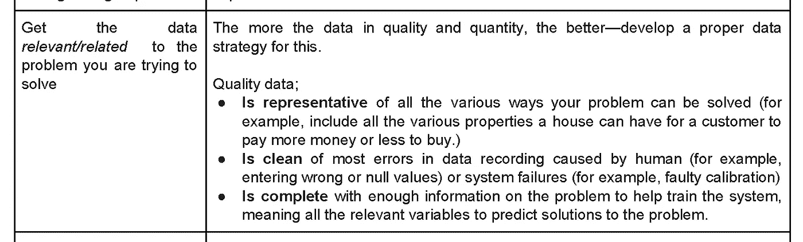

我们进入项目的下一阶段，数据收集。在这里，您需要确定您需要的数据类型和数量，找出数据源，检查数据的法律义务，获取数据，并确定其大小和类型。在项目主题领域专家的帮助下，这个阶段可以更好地进行。在这个阶段，您还可以努力确保数据公平性。注意，自动化这个阶段使得将来添加更多数据更加无缝。记得把你的测试集放在一边！在这里要解决的问题中，我们的数据来源可以在[这里](http://archive.ics.uci.edu/ml/datasets/Concrete+Compressive+Strength)找到，你可以通过在互联网上进行研究来获得对相关数据特征的更多了解。

# 探索性数据分析

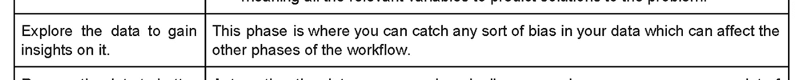

从探索数据中获得洞察力，尤其是在领域专家的帮助下，可以大大减轻您在建模时采取错误方法或使用错误属性的压力。研究数据的属性和特征，可视化并理解数据相关性，然后记录您从探索中学到的一切。这是我们正在处理的数据集的前 5 个实例，

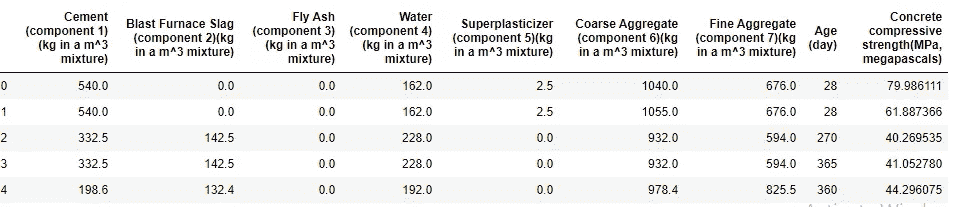

这是一个热图，显示了我们的数据相关性，在数据探索过程中，您还可以做更多的事情。

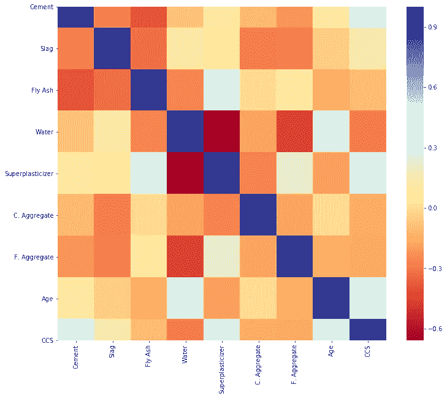

# 准备数据

准备和转换数据有助于构建 ML 模型，从而更好地理解底层模式。

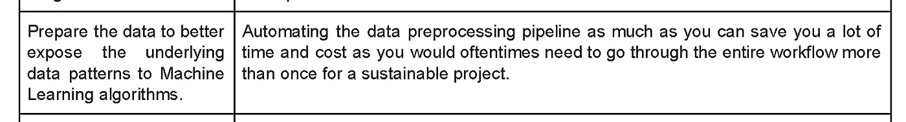

尽可能地自动化这个过程，这样你就可以很容易地准备测试集，当你得到新的数据集或实例时，你也可以将同样的预处理应用到你必须处理的任何其他项目中。对于我们的示例，我尝试了不同的缩放和转换方法，并认为没有转换的模型性能更好。[这里有一个到 Github repo 的链接，所以你可以实际看到这篇文章中的方法是如何应用的。](https://github.com/JoyUgoyah/PracticalMachineLearningCourse/blob/master/Modeling_the_compressive_strength_of_Concrete_to_improve_the_quality_consistency.ipynb)

# 迭代不同的算法

探索您认为可能适合您的数据集的不同算法。如果您阅读更多关于数据集的描述，您会发现属性具有非线性关系，这也可以在预处理阶段推断出来，因此在选择要使用的算法时，我倾向于更非线性的模型。尽可能自动化这个过程，让你的模型训练更快。评估模型性能后，您可以列出表现最佳的模型，以优化它们的性能。你必须注意观察对每个模型有意义的变量，以及它们造成的错误类型，这样你就知道在你决定建立一个集合模型的情况下最好的候选者。您可以随时回到前面的任何阶段，以便更好地预处理和理解属性关系。

# 微调您的模型

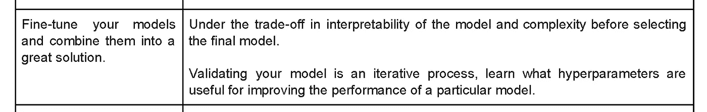

微调您的模型以获得更好的性能。调整超参数，创建集合模型等。在这个阶段，您需要记住模型复杂性和可解释性之间的权衡。在示例项目中，经过微调后，我选择了决策树回归模型，因为它不会过度拟合，而且更容易向销售代表展示特性的重要性。

# 展示您的解决方案

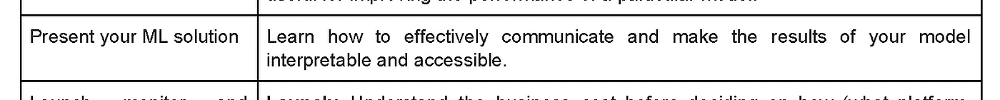

以一种非 ML 或数据科学专业人员可以解释和理解的方式呈现模型的重要性在每种情况下都很重要。比方说，我使用 PowerPoint 图表演示向销售代表展示比其他人更能影响混凝土强度的属性，然后我就可以让他与管理层沟通这一发现，以实现所需的更改。这里展示了问题概述中所述的预测混凝土抗压强度的特征的重要程度，您可以看到影响这一预测的 3 个主要特征。

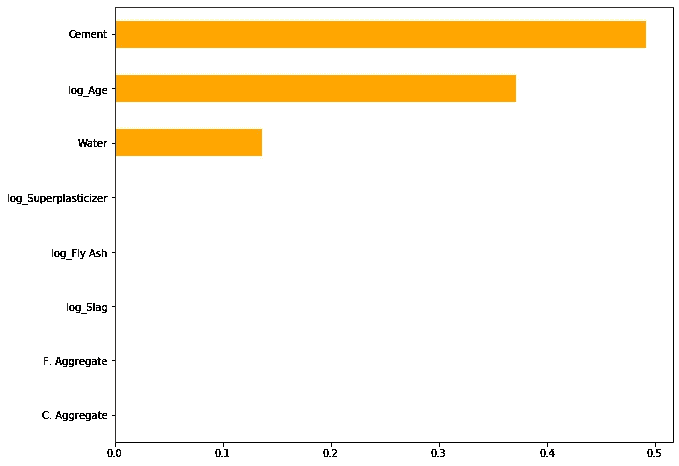

始终向他们展示您的解决方案的全貌，展示哪些可行，哪些不可行。

# 启动和监控

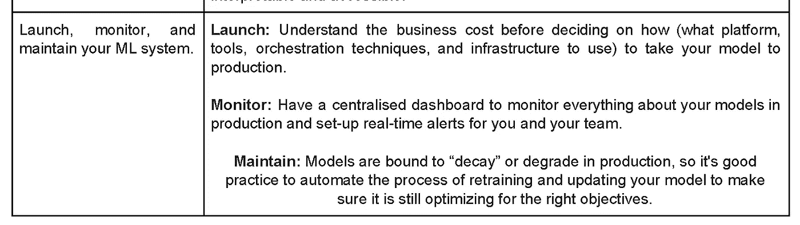

最后，您必须将您的 ML 解决方案投入生产，并且不能就此止步。ML 系统会随着更多的数据而腐烂，因此您还需要定期监控您的模型，如果需要，重新训练模型，以确保即使在数据发展时也能保持良好的性能。当决定如何将你的模型投入生产时，你需要考虑商业成本和用户类型。因为我们的例子是一个虚构的问题，它没有被生产出来，但是假设你必须把它生产出来，你会使用什么策略或平台？你可以在评论中分享你的想法，这样我们就可以看到它们是如何被应用的。

# 结论

您已经看到了将标准机器学习工作流应用于您正在处理的任何项目的重要性，以及它如何使您的工作流顺利进行并带来最佳解决方案。我想强调这一点，在开始用 ML 解决任何问题之前，你需要进行需求分析并询问相关的问题，这样你就不会投入所有的工作却最终意识到它不能解决任何问题。

**延伸阅读**:

使用 Scikit-Learn、Keras 和 Tensorflow 进行机器实践学习:概念、工具和构建智能系统的技术

[https://blog . phcschoolofai . org/getting-started-with-machine-learning-no-practical-machine-learning-part-3-CK 9 MF 61 VJ 002 qihs 1 wkzaedn](https://blog.phcschoolofai.org/getting-started-with-machine-learning-no-practical-machine-learning-part-3-ck9mf61vj002qihs1iwkzaedn)

[这里有一个 Github 链接，链接到我参与的示例项目](https://github.com/JoyUgoyah/PracticalMachineLearningCourse/blob/master/Modeling_the_compressive_strength_of_Concrete_to_improve_the_quality_consistency.ipynb)