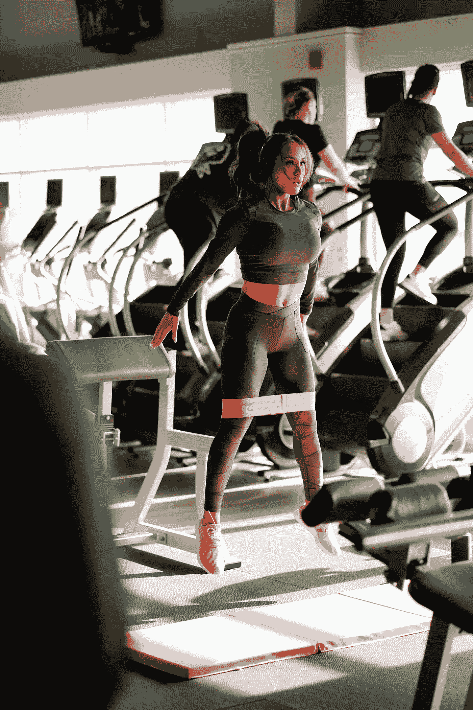

# 健身:你的健身蓝图

> 原文：<https://medium.datadriveninvestor.com/your-fitness-blueprint-497008e0bc50?source=collection_archive---------20----------------------->

[Photo By Bruce Mars](http://Photo by bruce mars on Unsplash')

## 你有没有想过你需要什么来保持健康？那么，你并不孤单。外面有如此多的信息，深入挖掘什么是必要的会非常累人，因为，对别人有用的，不一定对你有用。

> 我们必须尊重体内不同的系统。今天，我将引用本·格林菲尔德的书《无边无际》来支持我在这一章中的观点。

我花了一些时间来弄清楚什么适合我，什么不适合。那些认识我的人和那些不认识我的人可能对我的背景很熟悉，直到 2017 年，我一直非常专注于健身。

在我的巅峰比赛表现之后，我决定放弃健美运动，转向全面的锻炼。

 [## 健康品牌从定位中成长

### 品牌定位是 Phemelo Segoe 的激情之一。她是一名企业家、健康教练和米尔部落的创始人…

www.datadriveninvestor.com](https://www.datadriveninvestor.com/2019/01/11/healthy-brands-grow-from-positioning/) 

我开始尝试体操，柔软体操，并试图用不同的方式来测试我的耐力。我意识到拥有一个性感的“希腊神”般的身材是不够的；你还需要速度、敏捷性和灵活性。

> 我还想活得长，而不仅仅是又大又瘦。所以，我很高兴不仅是我，还有像本·帕库尔斯基或本·格林菲尔德这样的顶级运动员，整合了不同的训练系统和工具。

> 我要在 100 岁的时候跑楼梯！—菲特巴德

# 健身，裸体也好看

*心血管健康被定义为你可以利用的最大氧气量，这个量被称为最大摄氧量(也称为最大耗氧量、最大摄氧量、最大摄氧量或最大有氧能力)。这是你在激烈运动中的最大耗氧量，它与整体健康、健康和寿命高度相关。*

2014 年的一项研究发现，维持心血管健康的最小有效剂量是五次四分钟的高强度回合，心率为最大心率的 87%至 97%。

这种高强度的例行训练之后，每轮训练后有大约四分钟的休息或低强度运动，让你充分恢复。

Picture by [Jonathan Chng](https://unsplash.com/photos/rkp_-i5ABOE)

**这样做:**为了达到心血管健康的最低有效剂量，进行五次四分钟的高强度间歇训练，并有充分的休息时间，例如在自行车上进行五次四分钟的努力，每次努力之后是四分钟非常轻松的踩踏板。每两周做一次。在下一篇文章中会有更多的介绍。

# 最大肌肉耐力和有氧能力

*肌肉耐力和有氧能力顾名思义就是你最大的肌肉耐力。你的肌肉可以承受的最大工作量和你的最大有氧能力是你在保持高力量输出的同时可以“战斗”的最大时间。*

在一项研究中，参与者在四周内每周四次进行一次四分钟的塔巴塔训练。锻炼选择包括 burpees，爬山，跳跃和深蹲，但你也可以参加跑步机或户外跑步，划船，壶铃秋千，或室内或室外自行车。

做这个:对于肌肉耐力和有氧能力，没有什么能打败塔巴塔:四分钟全力以赴二十秒，休息十秒，重复。

Picture By [Guillaume Bolduc](http://Photo by Guillaume Bolduc on Unsplash)

与对照组每周四次 30 分钟的稳态跑步机锻炼相比，结果令人惊讶。塔巴塔小组(如果你算一下的话，他们每周只进行 16 分钟的锻炼)在有氧能力和肌肉耐力方面都取得了巨大的进步。

大多数研究每周使用两到四次塔巴塔会议。我会说找到你的中间立场，很可能每周两次塔巴塔会议就足够了，因为你也在做其他事情。