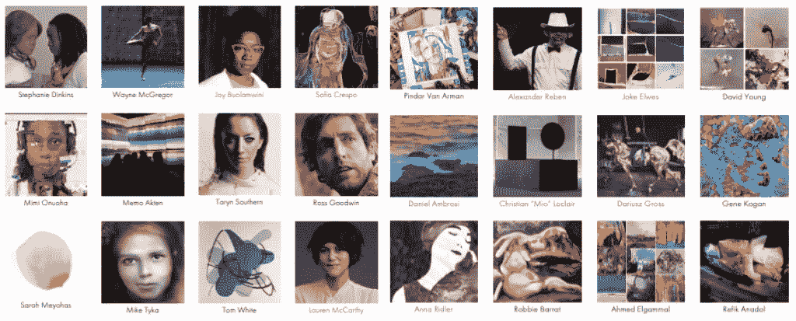
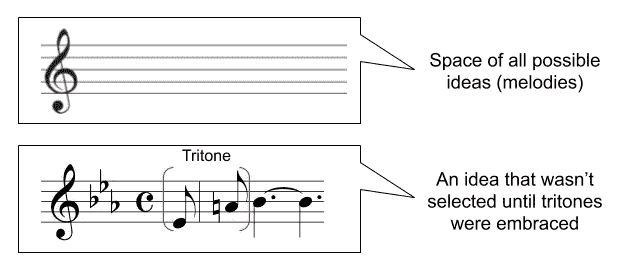

# 你对旧音乐的热爱解释了人为创造力的难题

> 原文：<https://medium.datadriveninvestor.com/your-love-of-old-music-explains-the-hard-problem-of-artificial-creativity-57c693753ab3?source=collection_archive---------3----------------------->

A gallery of AI artists and their art. (Source: [AIArtists.org](https://aiartists.org/))

## 我们持久的音乐偏好说明了人工智能面临的挑战。

它的回归和季节一样可预测。称之为培根的彗星:创意人工智能时代已经来临的想法。机器不仅在加速发现(这是一种说法)，它们现在也在进行自己的独立发现。来得正是时候，因为这个世界显然比虚弱的人类头脑所能理解的要复杂得多。

所有这些都是完全错误的。已经错了几百年了。在 17 世纪，弗朗西斯·培根声称我们解放的唯一希望是一种自主的科学方法，在这种方法中，知识从原始观察中归纳出来。他错了，但是他的想法保留了曾经拥有的所有常识性吸引力。1900 年，开尔文勋爵说:“现在物理学中没有什么新发现”，这是错误的。剩下的只是越来越精确的测量。”1996 年，当约翰·霍根在《科学的终结》的*中推广同样的“邪恶想法”时，它仍然是错误的。2008 年 Chris Anderson 庆祝理论的[终结和大数据的解放是错误的。培根的彗星又回来了，这一次是基于物理学的终结和自动化发现的一系列引人注目的进步。](https://www.wired.com/2008/06/pb-theory/)*

是的，这个想法仍然是错误的。

但是我不想[纠结为什么是错的](https://medium.com/inventing-intelligent-machines/machine-learning-alien-knowledge-and-other-ufos-1a44c66508d1)。相反，我想庆祝为什么创造力仍然是人类独有的追求。我想区分应用创意和基础创意，在我看来，这说明了今天的人工智能可能很快就会占据主导地位的特定领域。

 [## 深度学习:这是理论的终结还是深入解释的战斗口号？

### 深度学习会产生我们无法解释的观察结果。这是理论的终结还是对深层……

medium.com](https://medium.com/inventing-intelligent-machines/machine-learning-alien-knowledge-and-other-ufos-1a44c66508d1) 

我将从一个简单的观察开始:创造力包括新奇和约束。第一部分已经够明显了。当我们创造时，我们正在扩大解决问题的可能方案的范围。这是大多数人与创造力概念联系在一起的部分。第二部分更微妙，当然也更难。有一个巨大的评估标准框架，通过它来选择创造力。我的狗会弹钢琴。(事实如此，而且很可爱。)但是他的“敲打爪子”并没有在创造力的约束下进行，所以从任何意义上来说，他都没有发挥创造力。

创造力的新颖性和教条性之间的这种对比建立了应用创造力和基础创造力之间的区别。我们通常在既定问题空间的既定评估标准内创造解决方案:流行歌曲、广告、商业特许经营、电影续集、增量假设等等。这一大类应用创造性作品的标志是它们的衍生性质。他们没有开拓新的领域，而是解决了他们被设计用来解决的狭隘问题。

 [## 机器学习和人工智能如何改变电子商务的面貌？|数据驱动…

### 电子商务开发公司，现在，整合先进的客户体验到一个新的水平…

www.datadriveninvestor.com](https://www.datadriveninvestor.com/2020/11/19/how-machine-learning-and-artificial-intelligence-changing-the-face-of-ecommerce/) 

正如任何狭隘的应用一样，应用创造力也在今天的人工智能领域内。这很容易解释:人类创造者可以代表一个创造性假设的搜索空间，供人工智能探索，结合已知的问题评估约束。(这里有一个最近的例子，是关于[在疫情](https://www.nytimes.com/2020/11/24/science/artificial-intelligence-ai-psychology.html)中理解人类行为的问题。)这种“寻找假设”观点的含义是，可能的解决方案在寻找之前就存在了。另一个含义是，有一个人的头脑隐藏在背景中，提供了一个创造性的催化剂。通常，当系统设计师评估他们的人工智能产生的结果时，他们会注意到一个新的评估基础，这是他们开始之前没有想到的。这会让他们大吃一惊，他们可能会很快将这一发现归功于他们的系统。但是，尽管人工智能可能会减轻他们的一些汗水，但人类仍然会提供灵感和创造性的火花。

这种实用的方法不仅容易解释，而且很容易在人工智能生成的艺术中演示。诚然，作为情绪化的作品，这些应用人工智能的例子可能会令人不安。如果你认为创造性作品本质上不同于其他技术解决方案，你可能会认为我们已经突破了一些重大的鸿沟。但不，它仍然只是应用人工智能。

应用人类创造力如此普遍，以至于很大程度上被忽视了。它当然不会引发关于人类创造力不可避免的枯竭的令人心碎的对话，或者对人工智能将我们从创造力限制中解放出来的需求的感知。再说一次，我对[创造性人工智能](https://medium.com/inventing-intelligent-machines/ai-bloatware-why-the-popular-vision-of-ai-is-misleading-ca98c0680f4)的愿景押了全部赌注。但是为什么我们对这些狭隘的例子如此感兴趣呢？

 [## 作为人工智能远景的自动化科学

### 产生革命性科学知识的机器将会让其他所有的远景变得触手可及。

medium.com](https://medium.com/inventing-intelligent-machines/ai-bloatware-why-the-popular-vision-of-ai-is-misleading-ca98c0680f4) 

考虑到*的基本*创造力要难得多，会有所帮助。这些是你的爱因斯坦，你的奥斯特，你的毕加索。这些突破性的发现通常与 AGI 的承诺联系在一起。这些创作不仅带来了新奇，而且这种新奇迫使我们重新考虑创作的界限。基本的创造迫使评价标准发生转变(即使有些人不想让它们改变)。令人烦恼的是，新的创作标准*事先并不知晓*。这种差异解释了为什么人工创造力目前遥不可及。(不像有些人声称的那样总是和必然，但是现在。)

这些都太抽象了，所以让我们用音乐来解决这个问题。考虑所有可能的旋律，这些旋律都可以在音乐音阶上构建。

首先，让我们思考一下这个简单例子的范围:随着音符的组合和变化，旋律的数量迅速增加到数百万和数万亿种可能性。通常，创造力的问题被错误地归结为规模的问题，这反过来表明更多的数据和计算能力将不可避免地控制这个问题。然而，任何给定问题空间的规模都不是创造力的难题。如果你的目标是创造一种全新类型的音乐，你如何提前知道选择一种新旋律的新标准？如果你的目标是创造一些全新的东西，你将如何设计新的评估标准来区分这个人工智能杰作和我的狗的爪子敲打？

我最喜欢的这个音乐谜语的例子是音乐中的*diabolus*(拉丁语意为“音乐中的魔鬼”)。它指的是一个高度不和谐的音程，称为三和弦。你会马上认出它是*恩特尔·桑德曼*、*玛利亚*或*紫雾*。但是这些旋律在中世纪不会被选择。不是因为他们不在问题空间，而是因为必要的评估标准还没有被选择。音乐中的恶魔被坚定地避开了。

Contrasting the space of all possible melodies with evaluative criteria related to the tritone.

这个古典音乐和三全音的例子是一个很小的例子，来说明作为一个动态的和突现的过程，创造力的挑战是巨大的。

考虑到你对旧音乐的热爱。你有没有想过为什么我们仍然喜欢高中时听的音乐？我们的评价标准通常是在青春期和青年时期形成的。此后，随着新音乐的发展超出我们的口味，我们往往会觉得音乐一代又一代地变得越来越差。旧音乐体现了我们重视的标准。新音乐体现了新的标准，也无视一些旧的标准。

如果你愿意，你甚至可以建立一个系统来“证明”旧音乐比新音乐更好，只要选择那些优先于旧评价标准的特征。显然，今天的歌曲在旋律上不那么复杂，更多的是重复，它们体现了更少的和弦变化，它们的动态范围更窄，而且今天的艺术家不可救药地自我参与。).当然，音乐的质量和选择标准不能用这些描述性特征来解释。当然，这些分析没有一个承认任何新的和很大程度上不明确的选择标准可能实际上在我们的文化社区中是活跃的。但是对什么构成科学论证的误解和对创造力的误解一样普遍。(现在滚出我的草坪，你们这些孩子！)

我发现这种阻碍创造力的文化很有趣。我想知道有多少伟大的想法被孵化出来，却因为与主流文化不一致而被立即摒弃。孤立工作的艺术家将他们社区的创作限制内在化，体现了他们自己最严厉的批评。废纸篓里那堆皱巴巴的纸就是这一过程的见证。挑战与其说是在创造性的*变化*的过程中(例如在钢琴前支撑你的狗),不如说是在选择*的手段中。顺便说一句，同样的环境建设挑战限制了进化方法解决问题的范围。*

事实上，没有人理解这种心理和社会因素的复杂相互作用是如何驱动创造力的。很神秘，很奇妙。当条件成熟时，在创造性思维和变幻莫测的社会环境的结合点上，一些全新的重要的东西出现了。

它会再次发生。一些在正确的时间在正确的社区工作的天才将会解开创造力如何运作的谜题。我们会知道，因为他们能够解释它。

此后不久，人工智能将真正具有创造力。

*从* [到*的可交代创业*](https://www.explainablestartup.com/) *，探索解决问题的科学与哲学。*

## 访问专家视图— [订阅 DDI 英特尔](https://datadriveninvestor.com/ddi-intel)