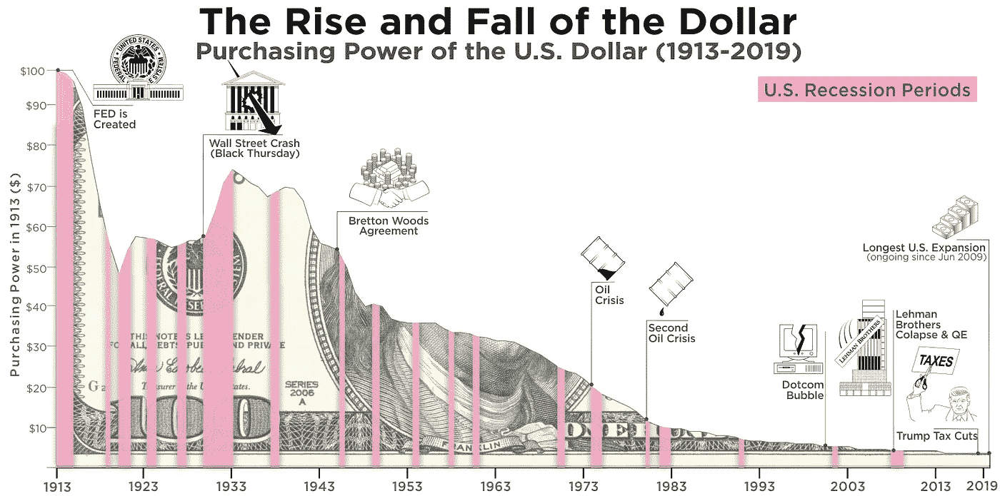
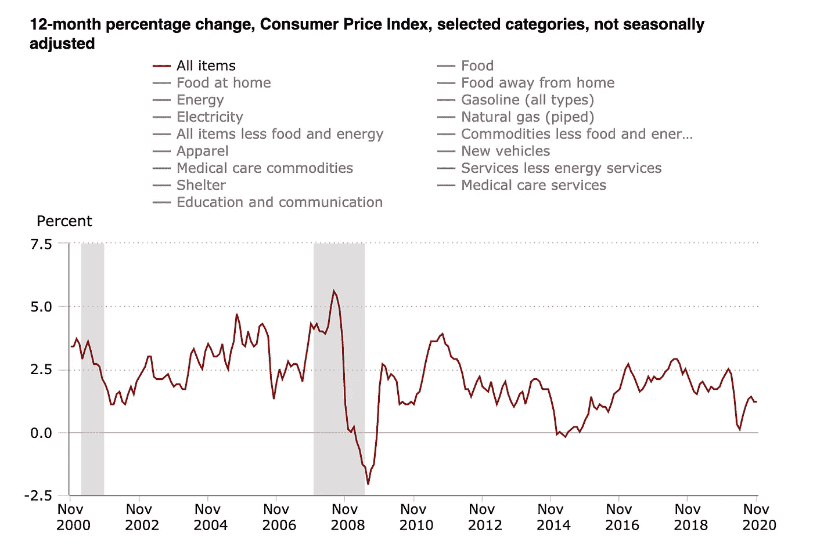
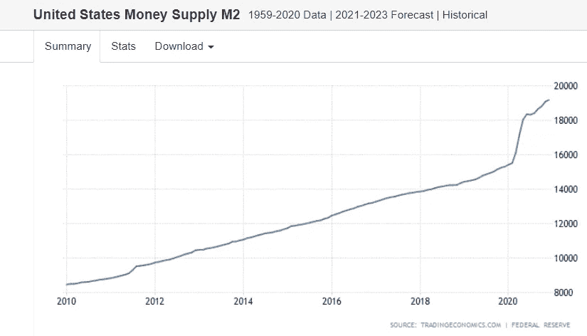
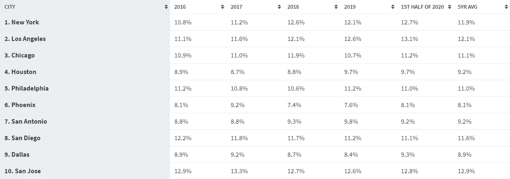

# 存钱会毁了你

> 原文：<https://medium.datadriveninvestor.com/your-money-is-on-fire-d6ea02da7c7c?source=collection_archive---------7----------------------->

## 你的钱着火了

Photo by [Gabriel Meinert](https://unsplash.com/@gabriel_meinert?utm_source=unsplash&utm_medium=referral&utm_content=creditCopyText) on [Unsplash](https://unsplash.com/s/photos/fire-money?utm_source=unsplash&utm_medium=referral&utm_content=creditCopyText)

当鲍里斯·约翰逊(Boris Johnson)宣布英国将进入第三次全国封锁时，我对妻子说的第一句话是，这至少会让我们留出一些钱。

我们不是唯一的。

英国的家庭储蓄率在 2020 年第二季度上升至 26.5%，在美国，个人储蓄率在 2020 年 5 月飙升至创纪录的 33%。

鉴于过去一年的大部分时间我们都被建议呆在家里，我们大多数人都有多余的现金也就不足为奇了。虽然把钱留在你的银行账户里可能很诱人，但这绝对是你能决定做的**最糟糕的事情。**

几乎有一半的美国人避免投资，所以这是一个可悲的现实，过去一年中被“存”起来的绝大部分钱现在都存在银行账户里，被通货膨胀吞噬了。

# 通货膨胀:美国梦的死亡？

通货膨胀被定义为货币购买力随着时间的推移而下降。以居民消费价格指数(CPI)衡量，体现为商品/服务价格的上涨。

随着时间的推移，通货膨胀会对你辛辛苦苦挣来的钱的购买力产生灾难性的影响，如图所示。

Source: www.howmuch.net

1913 年的 100 美元相当于今天 4 美元左右的购买力。想一想。

但是这对你的钱到底意味着什么呢？

想象一下，你的储蓄账户中有 10，000 美元，平均储蓄率为 0.09%。根据 CPI，在过去十年中，通货膨胀率平均每年约为 1.8%，这意味着你的 10，000 美元每年损失 1.71%，将你储蓄的利息计算在内。

再过十年，你最初的 10，000 美元的购买力将下降到 8，415 美元，贬值超过 15%。

我使用的 0.09%的利率只是一个平均值，有可能找到更高的利率。然而，你找到高于 1%的储蓄率的可能性微乎其微，所以如果你把钱存在银行里，你将一直追逐通货膨胀率。

这是一幅相当黯淡的画面，但现实要严峻得多。许多人认为实际的通货膨胀率实际上比我们想象的要高得多。

# 真实的通货膨胀率

Source: US Bureau of Labor Statistics

根据美国劳工统计局的这张图表，自 2010 年以来，通货膨胀率一直在 0%到 2.5%之间。然而，如果你考虑到同期美国货币供应量(M2)的增长率，就会产生一些问题。

The US money supply (M2), measured in USD Billion

美国美联储在过去十年里印刷了数万亿美元。你如何凭空创造出这么多钱而不使其贬值？当美国的货币供应增加了一倍多的时候，我们会相信每年的通货膨胀率只有 2%吗？这些数字根本不合理。

批评者指出了消费价格指数计算方法的各种缺陷，例如:

*   方法的变化导致计算变得过于复杂，经济学家认为 CPI 并不能准确反映生活费用的变化。
*   政府操纵 CPI 与工资增长和社会保障福利直接相关，因此抑制真实的计算可以让政府省钱。
*   税收、食品和能源等项目被排除在计算之外，因为它们不被视为商品/服务，尽管它们通常占家庭支出的很大一部分。

相反，许多人认为 T4 的查普伍德指数是更可靠的通货膨胀指标。据该网站称，这是为了消除消费者物价指数反映了美国人民生活成本的真实增长这一神话。正如你从下表中看到的，它描绘了一幅非常不同(也更可怕)的画面。

Source: www.chapwoodindex.com

正如你所看到的，查普伍德指数衡量的十大城市的平均通胀水平在 8.1%到 12.9%之间，与 CPI 给出的 1.8%的平均水平相差甚远。

# 储蓄会在财务上毁掉你

如果我每年去你家一次，要求烧掉你 5%-10%的钱，我敢肯定你会有话要说。

但这正是你的钱所发生的事情。

如果你选择以现金形式持有你的财富，你会无所事事地看着它的一部分消失——就好像它被烧毁了一样。美元金额可能不会改变，但你可以购买的金额会减少。

如果我们相信查普伍德指数，即使你投资并产生 8%的年回报率，你可能仍然落后于实际通货膨胀率。这意味着你每年仍会看到一部分钱被烧掉——只是更少的一部分。

你必须找到投资的地方，让你的钱比新货币的印刷速度增长得更快。

# 解决方案

我以前说过，现在我再说一遍——我们的教育系统不是用来教我们钱的。

这取决于你。

现在是时候给自己提供学校没有提供的金融教育了。

是时候学习金钱如何运作，如何投资，以及不同类型的资产了——[股票](https://www.investopedia.com/stocks-4427785)，[债券](https://www.investopedia.com/financial-edge/0312/the-basics-of-bonds.aspx)，[贵金属](https://www.investopedia.com/articles/basics/09/precious-metals-gold-silver-platinum.asp)，[数字货币](https://www.investopedia.com/terms/d/digital-currency.asp)，或者[房地产](https://www.investopedia.com/mortgage/real-estate-investing-guide/)。知道何时投资某些资产类型也将被证明是对抗通货膨胀的一个有价值的武器。

利用你的午休时间阅读华尔街日报，而不是浏览 Instagram。忽略那些告诉你比特币是骗局的头条新闻。花点时间形成你自己的观点——你可能会发现你会对你学到的东西感到惊讶。

当前的金融体系正在崩溃。不是*如果*的问题，而是*什么时候*的问题。你所能做的就是确保你为它的发生做好准备。

你的钱着火了。花时间教育自己是你唯一的希望。

29 岁的乔恩·彼得斯是一名自由作家和博客写手，他和妻子及两个孩子住在英国康沃尔。如果你喜欢这件作品，你一定会喜欢我的其他作品，你可以点击 [**这里**](https://jonpeterswrites.medium.com) **找到。快乐阅读。**